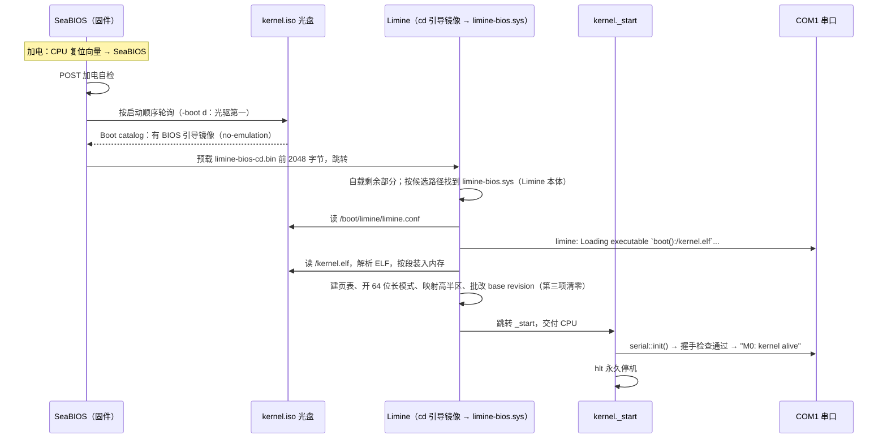
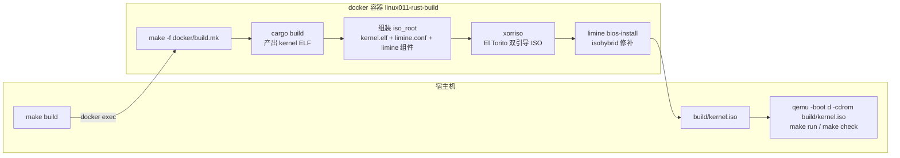

# M0：让最小内核活过来 —— Bite 2：能启动的内核

> 本 Bite 的目标只有一句话：**让 CPU 真的执行到我们的 `_start`**。
> 写一份 `limine.conf`，用 xorriso 把内核 + Limine 打成可引导 ISO，qemu 从光盘启动，串口日志里断言 `M0: kernel alive` 出现。
> Bite 1 编出的 ELF 到此才算真正"活了"，M0 里程碑完结。

---

## 问题

Bite 1 的战果是 `kernel/target/x86_64-unknown-none/debug/kernel`——一个形状正确的 64 位高半区 ELF。但它此刻只是硬盘上的一个**文件**，和一张图片、一个压缩包没有区别：躺在那里，没有任何人执行它。

从"文件"到"CPU 真的执行它"，中间隔着一整条链，每一环都是问题：

1. **CPU 加电后，第一条指令是谁的？** 不是我们的——CPU 复位后从一个写死的地址开始跑，那里住的是固件（BIOS）。固件凭什么、又怎么找到我们的内核？
2. **谁把内核从"盘上的文件"变成"内存里的指令"？** 文件在光盘上，执行在内存里，中间要有人读盘、解析 ELF、按链接地址摆放。这个"人"就是引导器。
3. **光盘启动和软盘/硬盘启动有什么不同？** 原版 Linux 0.11 从软盘第一扇区自举；我们选择了光盘（ISO）。BIOS 对这两种介质的引导方式完全不同，光盘走的是一套叫 El Torito 的规范。
4. **怎么向 qemu 证明"真的跑起来了"？** 不是看一眼窗口，而是一条可以写进 Makefile、每次构建自动跑的断言。

Bite 1 打通了编译链路（Rust 工具链 → 链接脚本 → ELF），本 Bite 打通运行链路（ISO → qemu → 串口输出）。两条链合在一起，就是每次改完代码后的最小开发循环。

---

## 背景概念铺垫

> 正文主线只需要读懂卡片里的压缩版。想深究的，章末「细节展开」有长版本；
> 从加电到 `_start` 的全程慢放另有一篇概念文档：[从加电到 _start：一次开机到底发生了什么](../../concepts/boot-from-power-on.md)——卡片看不懂就先去读那篇。

### 背景卡片 1：BIOS 加电自检与启动顺序

x86 PC 加电后，CPU 从固定地址（复位向量，靠近 4GB 顶端）开始执行，那里映射着主板固件——qemu 里这个角色由 **SeaBIOS** 扮演。固件先做 **POST**（Power-On Self-Test，加电自检：数内存、初始化芯片组），然后按一张**启动顺序表**轮询设备：软盘？硬盘？光驱？第一个"看起来能引导"的设备获胜[^1]。

"看起来能引导"对硬盘是"第 0 扇区末尾有 `55 AA` 签名"，对光盘则是背景卡片 2 的 El Torito 记录。轮询顺序就是本 Bite 头号坑的原理层：qemu 命令行上同时挂着硬盘（`hdc-0.11.img`）和光盘（`kernel.iso`）时，**默认硬盘优先**，BIOS 直接从硬盘启动，我们的光盘根本没被看一眼——修法是 `-boot d` 把光驱排到第一（`Makefile:10`）。

### 背景卡片 2：El Torito 光盘启动规范

**El Torito = 光盘启动规范**（名字很怪，因为它是 IBM 和 Phoenix 的两位工程师在一家叫 El Torito 的墨西哥餐厅里边吃边定的，顺手用了餐厅名）。它要解决的问题：光盘的扇区是 2048 字节、没有"第 0 扇区放引导代码"的硬盘式惯例，BIOS 怎么知道从哪读、读多少、读到内存哪？

El Torito 的答案是在 ISO 里放一张**登记表**：

- **Boot Record**（卷描述符区里的一条特殊记录）：告诉 BIOS"这张盘可引导，登记表（boot catalog）在第 N 扇区"；
- **Boot Catalog**（引导目录）：列出本盘支持哪些平台（x86 BIOS / UEFI）的引导，每项指向一个**引导镜像**（boot image）在盘上的位置和长度；
- **引导镜像**：真正被执行的代码。BIOS 按 catalog 里登记的长度把它读进内存，跳过去。

引导镜像有三种**模拟模式**：模拟软盘、模拟硬盘（BIOS 假装光盘是张小软盘/小硬盘，给老软件用），以及 **no-emulation**（不模拟，BIOS 原样把镜像前若干扇区读进内存就跳转，读进来的代码自己会用 BIOS 光盘服务继续加载剩余部分）。现代引导器全用 no-emulation——模拟模式有 1.44MB/硬盘几何之类的历史镣铐，no-emulation 干净直接。所以 xorriso 命令行里是 `-no-emul-boot`（`docker/build.mk:35`）。

空说无凭，直接 dump 我们这张 `build/kernel.iso` 的 El Torito 记录（容器里跑，`xorriso -report_el_torito plain` 是 xorriso 自带的"读出并打印登记表"功能）：

```
$ docker exec linux011-rust-build xorriso -indev /work/build/kernel.iso -report_el_torito plain
El Torito catalog  : 1476  1
El Torito cat path : /boot.catalog
El Torito images   :   N  Pltf  B   Emul  Ld_seg  Hdpt  Ldsiz         LBA
El Torito boot img :   1  BIOS  y   none  0x0000  0x00      4        1477
El Torito boot img :   2  UEFI  y   none  0x0000  0x00   5760          35
El Torito img path :   1  /boot/limine/limine-bios-cd.bin
El Torito img opts :   1  boot-info-table
El Torito img path :   2  /boot/limine/limine-uefi-cd.bin
```

逐行对账：catalog 在 1476 扇区；登记了**两个**引导镜像——第 1 项平台 BIOS、模式 `none`（即 no-emulation）、长度 `Ldsiz 4`（4 个 512 字节单位 = 2048 字节 = 一个 CD 扇区，正是 `-boot-load-size 4` 写进去的值）、指向 ISO 里的 `/boot/limine/limine-bios-cd.bin`；第 2 项平台 UEFI、指向 `limine-uefi-cd.bin`。一张盘同时伺候两种固件，这就是"BIOS+UEFI 双引导"在登记表上的样子。每一列的完整解读见「细节展开」。

### 背景卡片 3：ISO 9660 与 xorriso（一句话版）

**ISO 9660** 是光盘文件系统标准——`.iso` 文件的"iso"就是它：一张只读的目录树，光盘/U 盘/虚拟机光驱通用。**xorriso** 是制作这种镜像的命令行工具，我们用它的 mkisofs 兼容模式（`xorriso -as mkisofs`）：吃进去一个目录（我们的 `build/iso_root`），吐出来一个带 El Torito 引导信息的 `.iso`。

---

## 设计（图先行）

本 Bite 内核架构零变动，变的是**启动链路**和**构建流水线**。两张图。

第一张，加电到 `_start` 的时序——注意每一棒的交接物：



第二张，从 `make build` 到 qemu 的构建流水线——哪一半在宿主机、哪一半在容器：



三个设计决策值得记住：

- **为什么用光盘（ISO）而不是原版那样的软盘镜像**：ISO 是标准的、自带文件系统的容器——内核是个**文件**（`/kernel.elf`），引导器按路径读它；改完内核重打 ISO 即可，不用算扇区偏移、不用 dd 拼接（原版 `tools/build.sh` 干的就是手工拼扇区，见「与原版差异」）。同时 ISO 天然 BIOS/UEFI 双引导，还是发行版世界的通用通货。
- **配置与代码分离**：`limine.conf` 放仓库根、单独受版本管理，构建时拷进 ISO（`docker/build.mk:26`）。改引导参数（比如想进菜单就把 `timeout` 从 0 改成秒数）不用动构建脚本。
- **Limine 二进制取自镜像内 `/opt/limine`，不取自工作区 `reference/`**（`docker/build.mk:11`）：构建只依赖 docker 镜像，与工作区里 reference/ 目录的状态解耦；两者同为 v10.8.5-binary tag，内容一致。

---

## 代码领读

本 Bite 没有改任何 Rust 代码（所以没有新 Rust 语法卡片），新增/改动三个文件：

| 文件 | 职责 |
|---|---|
| `limine.conf`（新增，仓库根） | Limine 配置：引导谁、怎么引导 |
| `docker/build.mk`（新增） | 容器内 ISO 流水线：编译 → 组装 → xorriso → bios-install |
| `Makefile`（修改） | `-boot d` 修启动顺序；新增 `check` 无头验收目标 |

### `limine.conf`：16 行的引导契约

Limine v9 起换了配置格式：条目以 `/标题` 开头、选项为 `name: value`、注释必须独占一行（`limine.conf:1-2` 的文件头注释交代了语法出处——上游 v10.8.5 的 CONFIG.md）。逐行：

- `timeout: 0`（`limine.conf:6`）：不驻留启动菜单，直接引导第一个条目。想进菜单交互，改成秒数即可。
- `serial: yes`（`limine.conf:9`）：Limine 自身的日志也输出到 COM1（BIOS 下默认 115200，与我们内核同波特率）。效果是**引导阶段和内核阶段的日志汇入同一条串口**——验收时 serial.log 里第一行 `limine: Loading executable ...` 就是它打的。引导出错时能在同一份日志里看到 Limine 的报错，而不是面对黑屏猜。
- `/Linux 0.11 (Rust) M0`（`limine.conf:13`）：一个引导条目的标题。多个条目就是启动菜单里的多行。
- `protocol: limine`（`limine.conf:14`）：用 Limine 自己的引导协议加载（它还会 Linux、multiboot2 等协议）。Bite 1 背景卡片 1 讲的"请求/批改"握手就是这个协议的。
- `kernel_path: boot():/kernel.elf`（`limine.conf:15`）：内核在哪。`boot():` 指"启动盘本身"——我们的 ISO 是无分区光盘的整卷；路径 `/kernel.elf` 即 ISO 根目录下的内核文件（`docker/build.mk:25` 把它拷到那里）。

配置文件进 ISO 的位置是 `/boot/limine/limine.conf`（`docker/build.mk:26`）——不是随便选的：CONFIG.md 规定 BIOS 下 Limine 在启动盘上按 `/boot/limine/limine.conf` → `/boot/limine.conf` → `/limine/limine.conf` → `/limine.conf` 的顺序扫描，我们放的是第一候选位置。

### `docker/build.mk`：四步流水线

由根 Makefile 的 `build` 目标在容器内调用（`Makefile:41-42`）。核心规则是 `$(ISO)` 一个目标（`docker/build.mk:22-41`）：

1. **编译**（`docker/build.mk:19-20`）：`cargo build` 产出内核 ELF。这个目标是 `.PHONY`——cargo 自己判断是否需要重编，每次调用只是毫秒级空转，换来的是"ISO 永远基于最新代码"[^2]。
2. **组装 iso_root**（`docker/build.mk:23-29`）：`kernel.elf` 放 ISO **根目录**（与 `kernel_path` 对应）；`limine.conf`、`limine-bios.sys`、`limine-bios-cd.bin`、`limine-uefi-cd.bin` 放 `/boot/limine/`；`BOOTX64.EFI` 放 `/EFI/BOOT/`（UEFI 固件的固定查找路径）。这里值得记住三个组件的分工：`limine-bios-cd.bin`（24KB）是 BIOS 光盘的 El Torito 引导镜像；`limine-bios.sys`（252KB）是 Limine 本体，由引导镜像从文件系统里找出来加载；`BOOTX64.EFI`（300KB）是 UEFI 下的 Limine。
3. **xorriso 打 ISO**（`docker/build.mk:33-38`）：关键选项逐个说——
   - `-R -r -J`：开 Rock Ridge 和 Joliet 扩展（Linux/Windows 下文件名友好），ISO 9660 本体只认 8.3 大写文件名；
   - `-b boot/limine/limine-bios-cd.bin`：登记 BIOS 引导镜像（路径是 ISO **内部**路径）；
   - `-no-emul-boot`：no-emulation 模式（背景卡片 2）。本 Bite 的坑 2 就埋在这个选项名上；
   - `-boot-load-size 4`：BIOS 预载长度，4 个 512 字节单位 = 2048 字节 = 一个 CD 扇区。BIOS 只预载这一段，剩余部分由 limine-bios-cd.bin 自己加载（Limine 官方示例值，与其 USAGE.md 一致）；
   - `-boot-info-table`：让 xorriso 在引导镜像里回填一张表（镜像在盘上的位置等信息），供引导代码自检；
   - `--efi-boot boot/limine/limine-uefi-cd.bin` + `-efi-boot-part --efi-boot-image --protective-msdos-label`：登记 UEFI 引导镜像并生成配套的 EFI 系统分区与分区表——双引导的另一半。
4. **`limine bios-install build/kernel.iso`**（`docker/build.mk:41`）：isohybrid 修补——让这张 ISO 除了当光盘，还能被 dd 到 U 盘当"硬盘"引导。它把 xorriso 生成的 GPT 分区表转成 MBR、置活动分区、把 stage1/stage2 引导代码埋进第 0 扇区和其后空隙。完整机制（含"跳过它会怎样"的破坏实验）见「细节展开」；一句话结论：**官方流程要求、我们的 qemu 光盘路径实测不依赖它，但留着换来 isohybrid 能力，不删**。

### `Makefile`：`-boot d` 与 `check`

- `QEMU_FLAGS` 新增 `-boot d`（`Makefile:10`）：把光驱设为第一启动设备。为什么必需，见「常见坑」坑 1——这是本 Bite 最大的坑。
- 新增 `check` 目标（`Makefile:50-55`）：无头验收。`-display none` 不开窗口；`-serial file:build/serial.log` 把串口输出写文件而不是接终端——**写文件才能事后 grep 断言**，`stdio` 模式下输出混进终端没法程序化处理；`timeout 20` 兜底杀掉 qemu，退出码 124 视为正常（内核 hlt 停机后 qemu 不会自己退出，被杀是预期，见坑 3）；最后 `grep 'M0: kernel alive' build/serial.log` 断言那行字真的出现了[^3]。

---

## 验收

> 本 Bite 验收 = CPU 真的执行到 `_start`，证据是串口日志。逐条断言如下（全部实测通过，输出为原文摘录）。

**断言 1：`make build` 成功。** 尾部依次出现 xorriso 写完镜像、`limine bios-install` 成功：

```
ISO image produced: 3193 sectors
Writing to 'stdio:build/kernel.iso' completed successfully.
...
Stage 2 to be located at byte offset 0x200.
Limine BIOS stages installed successfully.
```

中间 bios-install 打的 `Detected ISOHYBRID with a GUID partition table (GPT). Converting to MBR...` / `Setting partition 1 as active...` 正是「细节展开」里 GPT→MBR 机制的现场自白。

**断言 2：`make check` 通过。** 完整输出：

```
$ make check
timeout 20 qemu-system-x86_64 -m 128M -boot d -display none -serial file:build/serial.log \
    -drive file=reference/hdc-0.11.img,format=raw,if=ide -cdrom build/kernel.iso; \
rc=$?; [ $rc -eq 0 ] || [ $rc -eq 124 ]
qemu-system-x86_64: terminating on signal 15 from pid 24330 (timeout)
grep 'M0: kernel alive' build/serial.log
M0: kernel alive
```

`terminating on signal 15 ... (timeout)` 是 timeout 杀掉 qemu 的正常现象（坑 3）；`grep` 打印出匹配行且退出码为 0，断言成立。

**断言 3：`build/serial.log` 恰为两行，顺序与来源都对：**

```
limine: Loading executable `boot():/kernel.elf`...
M0: kernel alive
```

第一行是 Limine 自己的串口日志（`serial: yes` 的效果，证明 Limine 按配置找到了内核文件）；第二行是内核打印（`kernel/src/main.rs:29`，证明 `_start` 被执行、且 base revision 握手检查已通过——不通过的话打印的会是报错行，`kernel/src/main.rs:25`）。

**回归断言（Bite 1）：** ELF 形状检查（`readelf`/`nm`）不随本 Bite 变化，标准不变，详见 [acceptance.md](acceptance.md) 的命令全集。

---

## 与原版差异

对照 `docs/deviations.md` 偏差登记簿，本 Bite 无新增偏差，是 **D1（boot 架构）** 与 **D9（串口日志通道）** 的具体落地：

- **引导介质与自举方式**：原版 0.11 从**软盘第一扇区**自举——BIOS 把那 512 字节（bootsect.s）读进内存跳转，bootsect 用 BIOS 的 INT 13h 磁盘服务（`reference/boot/bootsect.s:83` 等）把 setup 和 system 模块逐扇区读进来，全程 16 位实模式汇亲手写。我们走 El Torito 光盘 + Limine 外包：读盘、解析 ELF、开长模式全部交给引导器，落地即是 64 位。
- **镜像制作**：原版用 `tools/build.sh`（原版 build.c 的 shell 版）手工拼二进制扇区——`dd` 依次写入 bootsect（1 扇区）、setup（4 扇区）、system（若干扇区），最后在偏移 508 处写入 root 设备号（`reference/tools/build.sh`）。镜像是"生"的扇区序列，没有文件系统。我们的 ISO 是标准 ISO 9660 文件系统：内核是个有名字的文件，引导器按路径找它。
- **串口日志**：原版 0.11 没有任何串口输出通道；`make check` 这种无头自动验收在原版时代只能靠截屏。串口通道登记在 D9 名下，本 Bite 首次让它承担"验收地基"的角色。

coder 交付时登记的三条不确定项，本 Bite 写作期间的核对结论：

1. 【合理推断，未变】ISO 是 BIOS+UEFI 双引导 hybrid，但 **UEFI 路径只配置了、未实测**（宿主机未确认 OVMF）；BIOS 路径已实测通过。
2. 【已证实】`limine bios-install` 的 GPT→MBR 转换与置活动分区：不再是推断——工具自身输出（"Converting to MBR..." / "Setting partition 1 as active..."）、源码（`reference/limine/limine.c:883-930`、`1031-1036`）与成品 ISO 的 `fdisk -l`（dos 分区表、分区 1 带 `*`）三方互证，详见「细节展开」。
3. 内核放 ISO 根目录 `/kernel.elf` 而非官方示例的 `/boot/`：无功能影响，纯布局选择。

---

## 常见坑与展望

### 本 Bite 实踩的坑

**坑 1（头号坑）：qemu 默认从硬盘启动，不是光盘。**
qemu 命令行上同时挂着 `-drive ...=hdc-0.11.img`（硬盘）和 `-cdrom kernel.iso`（光盘）时，SeaBIOS 的默认启动顺序是硬盘在前。现象极具迷惑性：**串口日志一个字都没有**——不是内核崩了，是内核根本没被加载，BIOS 直接引导了硬盘上的 MINIX 数据盘。对着一个"安静如鸡"的终端，很容易怀疑是串口配置、链接脚本、握手全错。定位手段是 qemu monitor 的 `screendump` 截屏：屏幕上一行 `Booting from Hard Disk...` 真相大白。修法：`-boot d`（`Makefile:10`）。教训：**"没输出"首先怀疑"没执行"，用正交手段（这里是屏幕）确认执行路径**。

**坑 2：xorriso 的选项名是 `-no-emul-boot`，不是 `-no-emul-mode` / `-no-emul`。**
mkisofs 语系的选项名和直觉对不上，写错了 xorriso 才报错。以 `docker/build.mk:35` 为准。

**坑 3：qemu 退出码 124 是预期，不是失败。**
内核 `hlt` 停机后 qemu 不会自己退出——它还在老老实实模拟一台开着机的电脑。`make check` 用 `timeout 20` 杀掉它，timeout 的退出码固定是 124。所以 Makefile 里显式把 124 与 0 同等视为正常（`Makefile:54`）；真正失败的情况是 grep 找不到那行字。

### 展望（M1）

M0 到此完结：我们有了一个**每次改代码都能一键验证的开发循环**（`make build && make check`）。但输出通道还是"电报线"级别的串口，打印只能靠 `write_str` 手写字符串，没有格式化、没有数字。M1 上屏幕：Limine 交付的线性 framebuffer + 自绘 8x16 字体渲染 + 滚屏控制台，同时引入 `core::fmt` 实现 `print!`/`println!` 式的格式化打印——串口是电报，屏幕是霓虹灯（路线图见 `docs/phase-2.md` M1 行）。

---

## 细节展开

**base revision 支持范围核对（对 Bite 1 坑 4 的订正）。**
Bite 1 说"0–5 已被官方弃用，6 太新未必支持"。核对结果（2026-10-09）：Limine 协议规范在 v10.8.5 发布（2026-03-12）时已从主仓库拆到独立的 [limine-protocol 仓库](https://github.com/Limine-Bootloader/limine-protocol/blob/trunk/PROTOCOL.md)。现行规范共定义 **0–6 七个** base revision，并写明"0 through 5 are considered deprecated"——但这句弃用声明是 2026-03-22 随 base revision 6 首次写入规范时从"0 through 3"改过来的（[limine-protocol@62ed932d](https://github.com/Limine-Bootloader/limine-protocol/commit/62ed932db4)），**比 v10.8.5 的发布晚 10 天**。也就是说在 v10.8.5 的时代，规范口径是"0–3 弃用，4/5 现役"。而我们 pinned 的 v10.8.5 二进制实际实现到 base revision **5**（其 ChangeLog 载 v10.8.0 "Limine boot protocol: Implement base revision 5"，全篇无任何 base revision 6 字样）。结论：原【合理推断】"v10 二进制未必支持 6"升级为**事实：v10.8.5 最高支持 5**；请求 3 在现行规范和当时规范里都属于弃用区间，但"弃用"不等于"不支持"——协议规定引导器对不支持的高版本请求应保持 tag 第三项不变，由内核自检失败退出，我们的握手检查（`kernel/src/main.rs:24`）正是这个机制的兜底，且 `make check` 已实测 v10.8.5 接受 3。升到 4/5 对 M0 没有收益（那些修订涉及 IOMMU 等我们用不到的语义），维持 3。

**El Torito dump 完整解读。**
回看「背景卡片 2」的 dump 输出，逐列对账（规范全文：[Bootable CD-ROM Format Specification 1.0](https://pdos.csail.mit.edu/6.828/2018/readings/boot-cdrom.pdf)）：

- `El Torito catalog : 1476 1`：boot catalog 在 LBA 1476、占 1 扇区。BIOS 从卷描述符区的 Boot Record 里读到这个位置。
- `El Torito cat path : /boot.catalog`：catalog 同时以文件形式存在于 ISO 里（xorriso 自动生成，不是我们要放的文件）。
- 表头 `N Pltf B Emul Ld_seg Hdpt Ldsiz LBA`：序号、平台、可引导标记、模拟模式、加载段地址（`0x0000` = 用 BIOS 惯例的 `07C0`，即传统引导扇区的老地址）、硬盘磁头数（模拟模式用，no-emulation 下无意义）、预载长度（**512 字节**为单位）、镜像起始扇区。
- 第 1 项（BIOS）：`Ldsiz 4` = 2048 字节——一个 CD 扇区，正好是 `-boot-load-size 4`；`LBA 1477` 是 limine-bios-cd.bin 在盘上的位置。注意 BIOS **只**预载这 2048 字节：limine-bios-cd.bin 实际有 24KB，前 2KB 被 BIOS 读进来后，自己用 BIOS 的光盘服务把剩余部分读全，再从 ISO 9660 文件系统按候选路径找到 limine-bios.sys（252KB 的 Limine 本体）加载。三级火箭：BIOS → cd 引导镜像 → Limine 本体。
- 第 2 项（UEFI）：`Ldsiz 5760`（≈2.8MB，正好对应 fdisk 看到的第二个分区大小）指向 `limine-uefi-cd.bin`——那其实是一个 FAT 格式的 EFI 系统分区镜像，UEFI 固件挂载它、执行里面的 `BOOTX64.EFI`。同一张 ISO，BIOS 走第 1 项、UEFI 走第 2 项，互不干扰。
- 顺带一提，dump 末尾的 `Boot record : El Torito , MBR cyl-align-off` 和 `Media summary` 说明 xorriso 同时写了 MBR 区域——那是给 isohybrid 准备的，下一条展开。

**`limine bios-install` 到底干了什么（含破坏实验）。**
以 v10.8.5 的部署工具源码（`reference/limine/limine.c`）+ 工具自身输出 + 成品 hexdump 三方对账，它对我们的 ISO 做了四件事：

1. **识别 isohybrid + GPT 转 MBR**：检查 LBA 16 处有 ISO 9660 的 `CD001` 签名且磁盘带 GPT 后，判定为"带 GPT 的 isohybrid"，把主 GPT、保护性 MBR、备用 GPT 全部清零，改写为 MBR 分区表（limine.c:794-930）。为什么转：很多 BIOS/CSM 不喜欢从 GPT 盘引导（工具帮助文本原话："done for better hardware compatibility"）。实证：跳过 bios-install 直接 xorriso 出的 ISO，`fdisk -l` 显示 `Disklabel type: gpt`、第 0 扇区全零；跑过 bios-install 的 `build/kernel.iso` 显示 `Disklabel type: dos`、分区 1 带活动标记 `*`、磁盘 ID 是随机数（源码里 `rand()` 生成，limine.c:908-911）。
2. **置活动分区**：转换后若没有活动分区，把分区 1 置为活动（limine.c:1031-1036），输出里那句 `Setting partition 1 as active to work around the issue...` 就是这一步。
3. **埋引导代码**：把内嵌的硬盘引导镜像（`limine-bios-hdd.h`）前 512 字节写进第 0 扇区（MBR 引导代码区，hexdump 可见开头 `EB 3C 90` 跳转指令 + `LIMINE` 签名），其余部分（stage2）写到字节偏移 `0x200` 的 MBR 后空隙，并把 stage2 位置回填到 MBR 的 `0x1a4` 偏移处（limine.c:1049-1181；输出 `Stage 2 to be located at byte offset 0x200.`）。
4. **提醒**：打印 `Remember to copy the limine-bios.sys file...`——硬盘路径下 stage2 要从文件系统找 limine-bios.sys，我们已经放在 `/boot/limine/`（USAGE.md 认可的四个候选位置之一）。

**破坏实验：跳过 bios-install 会怎样？** 实测：用同样的 xorriso 命令出一张不打补丁的 ISO，`qemu -boot d -cdrom` 启动——**照常打印两行日志**。结论：纯光盘 El Torito 路径不依赖 bios-install（BIOS 直接从 boot catalog 找引导镜像，不看 MBR）；bios-install 服务的是"同一个 ISO 被 dd 到 U 盘/硬盘当磁盘引导"的场景（那时 BIOS 走的是第 0 扇区 MBR 路径）。我们保留它的理由：上游 USAGE.md 明确把这一步列为 hybrid ISO 流程的一部分（"do not forget to also run limine bios-install"），且 isohybrid 能力白送。注：`docker/build.mk:39-40` 的注释把它说成"BIOS 引导必须的一步"，严格说不准确——准确说法是"BIOS **硬盘**引导必须，光盘引导不依赖"。

**为什么 qemu 命令行上还挂着 `hdc-0.11.img`？**
那是原版的 MINIX 数据盘，要到 M10（ATA 驱动 + buffer cache）才真正读它、M11（MINIX 文件系统）才挂载它——现在挂着纯属提前就位：qemu 命令行是长期资产，磁盘挂法一次写对，后面里程碑不用动。副作用是它制造了坑 1 的迷惑性（默认启动顺序下 BIOS 会引导它）；`-boot d` 之后它只是个安静的旁观者。

**El Torito 三种模拟模式的完整版。**
规范定义三种：①软盘模拟——引导镜像被当成一张 1.2/1.44/2.88MB 软盘，BIOS 把光盘上的 INT 13h 请求重定向进去，为"一张光盘伪装成启动软盘"设计；②硬盘模拟——伪装成硬盘，要带分区表，受 CHS 几何限制；③no-emulation——不伪装任何设备，BIOS 按 catalog 登记的位置和长度把镜像原样读进内存（默认 07C0:0000）就跳转，读进来的代码自己用 INT 13h 的扩展光盘功能继续加载。前两种为兼容"只会从软盘/硬盘启动的老软件"（如 DOS 安装盘）存在；现代引导器（GRUB、isolinux、Limine）清一色 no-emulation。我们也一样——`-no-emul-boot` 声明的就是这件事。

---

[^1]: 完整的"加电 → 复位向量 → POST → 启动顺序 → 引导"慢放见概念文档 [boot-from-power-on.md](../../concepts/boot-from-power-on.md)。
[^2]: make 知识点：`.PHONY` 目标没有文件对应物，每次都被认为"过期"而执行；`$(ISO): kernel limine.conf` 的依赖写法保证 ISO 在内核重编或配置改动后重建（`docker/build.mk:15-22`）。
[^3]: shell 知识点：`rc=$?` 把上一条命令的退出码存下来再判断，是因为 `[ $$rc -eq 0 ] || [ $$rc -eq 124 ]` 这种组合判断会覆盖 `$?`；Makefile 里 `$$` 是转义后的 `$`（`Makefile:52-54`）。
