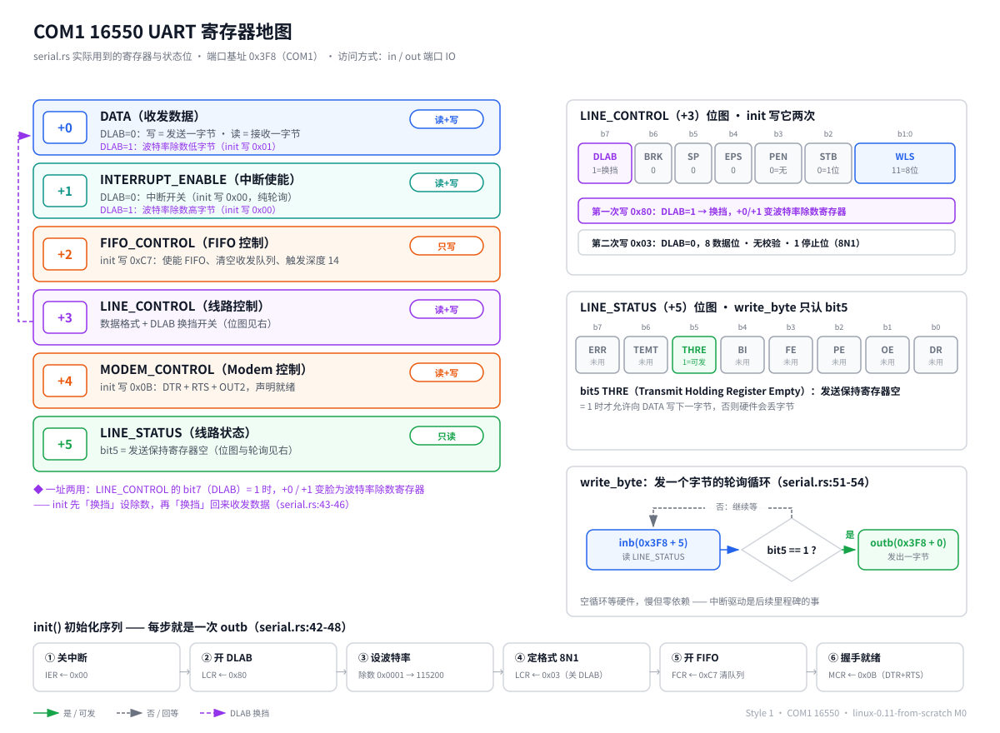

# M0：让最小内核活过来 —— Bite 1：能编译的内核骨架

> 本 Bite 的目标只有一句话：**编译出一个形状正确的 64 位高半区内核 ELF**。
> 它能被 Limine 引导器加载，入口 `_start` 里初始化串口、做一次协议握手检查、打印一行存活信息，然后停机。
> 跑起来（ISO + qemu + 串口断言）是 Bite 2 的事。

---

## 问题

我们手上什么都没有：没有操作系统，没有标准库，没有 `main`，没有 `printf`。刚加电的 CPU 是别人的（引导器的），屏幕驱动还不存在，连"打印一行字"这种最朴素的需求，都得自己对着硬件寄存器一个字节一个字节地写。

这个 Bite 要回答的问题：

1. **代码写成什么样**，才能脱离操作系统编译？（答案：`no_std` + 专用 target）
2. **二进制长成什么样**，引导器才肯加载？（答案：固定链接地址的 ELF64 EXEC，入口符号叫 `_start`，还要在约定位置放一个协议握手结构）
3. **怎么确认它活了**？（答案：最原始的输出设备——串口，直接写 I/O 端口）

M0 拆成两个 Bite 的原因：编译链路（Rust 工具链 → 链接脚本 → ELF）和运行链路（ISO → qemu → 串口输出）各有各的坑，混在一起出错没法定位。本 Bite 只打通前者，验收停在 `readelf`/`nm` 层面——**能编出正确的文件，但还没跑**。

---

## 背景概念铺垫

> 正文主线只需要读懂卡片里的压缩版。想深究的，章末「细节展开」有长版本。

### 背景卡片 1：引导器（bootloader）与 Limine 协议

CPU 加电后自己不会找内核，它只认识很原始的启动方式[^1]。这中间的一大段脏活——从磁盘/光盘读内核文件、解析 ELF、开分页、把 CPU 切到 64 位长模式、跳过去——我们外包给 **Limine**：一个现代引导器。

外包不是免费的，要按它的协议来：

- 内核在 ELF 的一个**约定段**（`.limine_requests`）里放"请求"，告诉 Limine 我们要什么协议版本、要哪些服务；
- Limine 加载内核时会**现场批改**这些请求——比如把协议版本号原地清零表示"这个版本我支持"；
- 然后 Limine 把 CPU 收拾干净（64 位长模式、高半区虚拟地址），跳到内核入口 `_start`。

本 Bite 只用到一个请求：**base revision（基础协议版本）**。我们请求版本 3——更低的版本已被 Limine 官方弃用，更高的版本太新。这个请求的结构是两个魔数 + 一个版本号，共 3 个 `u64`（`kernel/src/main.rs:16`）。

### 背景卡片 2：ELF 可执行文件

ELF 是 Linux 世界可执行文件的格式，可以理解成一个带说明书的包裹：

- 文件头写明：这是什么架构（X86-64）、什么类型、**从哪个地址开始执行**（entry point）；
- 正文按"段"（section）分区：代码在 `.text`，只读数据在 `.rodata`，已初始化数据在 `.data`，未初始化数据在 `.bss`；
- 段的摆放位置由**链接脚本**（我们的 `kernel/linker.ld`）说了算。

类型一栏有两个值对内核生死攸关：`EXEC` 表示地址固定、`DYN` 表示地址可搬（PIE，给有动态加载器的操作系统用的）。裸机内核没有动态加载器，**必须是 EXEC**。这是个真坑，见「常见坑」第 2 条。

### 背景卡片 3：链接地址与高半区内核

**链接地址**就是"这个程序假设自己被放在内存的哪个门牌号"。编译器和链接器按这个假设生成代码里的所有地址；运行时真把它放到别处，地址全错。

我们的内核链接在 `0xFFFFFFFF80000000`（`kernel/linker.ld:9`）——64 位虚拟地址空间最顶上那 2GB 的起点。把内核放在地址空间上半区，叫**高半区内核**（higher-half kernel）：下半区完整留给将来的用户程序，两边不打架。

用生活类比说：一栋楼，楼上固定是物业办公室（内核），楼下全部出租（用户程序）。租户可以随便换，物业永远在顶楼，门牌号不变。Limine 正好也约定把内核映射到这个地址，两边对上就行。

### 背景卡片 4：串口 UART 16550 与端口 IO

屏幕驱动还很远，但内核不能当哑巴。**串口**（COM1）是 PC 上最原始的输出设备：芯片型号约定叫 **16550 UART**，qemu 用 `-serial stdio` 就能把它的输出接到终端上——内核往外写字节，终端上出字。

x86 给这类设备留了一套**独立于内存的 I/O 端口地址空间**：内存有内存的门牌号，端口有端口的门牌号，两边编号互不相干。访问内存用普通读写指令，访问端口要用专门的 `in`/`out` 指令[^2]。COM1 的端口基址是 `0x3F8`（PC 惯例），基址加偏移就是各个寄存器：

| 偏移 | 寄存器 | 干什么 |
|---|---|---|
| +0 | DATA | 写=发一个字节，读=收一个字节 |
| +1 | INTERRUPT_ENABLE | 开关串口中断 |
| +3 | LINE_CONTROL | 数据格式；最高位 DLAB 是"换挡开关" |
| +5 | LINE_STATUS | 状态：第 5 位=发送保持寄存器空 |

寄存器全景、DLAB 换挡的位级细节、`write_byte` 的轮询循环，一张图收齐：



DLAB 值得单独说一句：偏移 +0/+1 是**一址两用**的。DLAB=0 时是收发数据；DLAB=1 时同一地址变成波特率除数寄存器。所以初始化要先"换挡"设波特率，再"换挡"回来收发数据（`kernel/src/serial.rs:43-46`）。

发一个字节的流程是**轮询**：反复读 LINE_STATUS，直到"发送保持寄存器空"那一位亮起来，再往 DATA 写字节（`kernel/src/serial.rs:51-54`）。慢，但零依赖，够本 Bite 用。

### Rust 语法卡片

本 Bite 代码用到的每个 Rust 语法点，一张卡片一个。只放压缩版。每张卡片末尾给出处：优先《Rust 程序设计语言》中文版（简称 TRPL，rust-lang-cn/book-cn 在线版），书上没单独讲的裸机语法链到官方英文文档并标注。

**卡片 R1：`#![no_std]` / `#![no_main]`**（`kernel/src/main.rs:3-4`）
`#!` 开头的属性作用于整个 crate。`no_std`：不链接标准库 std（std 依赖操作系统），只用最精简的 `core`——裸机唯一选择。`no_main`：没有 C 运行时来调用 `main`，入口我们自己定义（就是 `_start`），让编译器别找 `main`。
出处：TRPL 没讲（裸机专属），见 [Embedded Rust Book · A `no_std` Rust Environment](https://doc.rust-lang.org/embedded-book/intro/no-std.html)（英文）。

**卡片 R2：`mod` 与 `pub fn`**（`kernel/src/main.rs:6`，`kernel/src/serial.rs:41`）
`mod serial;` 声明"同目录下的 `serial.rs` 是我的子模块"。模块里的函数默认私有，`pub` 才对外可见。Rust 的模块树就是文件树，这是本工程文件组织方式（偏差 D7）的语法基础。
出处：[TRPL 第 7.2 章 · 定义模块来控制作用域与私有性](https://rustwiki.org/zh-CN/book/ch07-02-defining-modules-to-control-scope-and-privacy.html)。

**卡片 R3：`const` 与 `static`**（`kernel/src/serial.rs:8`，`kernel/src/main.rs:16`）
`const` 是编译期常量，用到的地方直接内联成数字，不占内存。`static` 是真占内存的全局变量，有固定地址——所以 `BASE_REVISION` 必须用 `static`：Limine 要在运行时找到它、批改它，内联掉的常量没法被批改。
出处：`const` 见 [TRPL 第 3.1 章 · 变量与可变性（常量一节）](https://rustwiki.org/zh-CN/book/ch03-01-variables-and-mutability.html)；`static` 见 [TRPL 第 19.1 章 · 不安全的 Rust（静态变量一节）](https://rustwiki.org/zh-CN/book/ch19-01-unsafe-rust.html)。

**卡片 R4：`#[used]`**（`kernel/src/main.rs:14`）
`BASE_REVISION` 只被引导器读，Rust 代码里没人碰它，编译器会当死代码删掉。`#[used]` 就是告诉编译器：别删，有人在 ABI 层面用它。
出处：TRPL 没讲，见 [Rust Reference · The `used` attribute](https://doc.rust-lang.org/reference/attributes/codegen.html#the-used-attribute)（英文）。

**卡片 R5：`#[unsafe(link_section = "...")]`**（`kernel/src/main.rs:15`）
把这个 `static` 放进指定的 ELF 段。Limine 约定在 `.limine_requests` 段里扫描请求，我们必须把这个数组精确投递到那个段——像寄信必须写对信箱编号。`#[unsafe(...)]` 的写法表示"这个属性用错了会制造未定义行为"，所以要用 unsafe 标记担责。
出处：TRPL 没讲，见 [Rust Reference · The `link_section` attribute](https://doc.rust-lang.org/reference/abi.html#the-link_section-attribute)（英文）。

**卡片 R6：`#[unsafe(no_mangle)]` 与 `extern "C"`**（`kernel/src/main.rs:19-20`）
Rust 默认给函数名"改花名"（mangle），ELF 里的符号会变成乱码状的名字。`no_mangle` 保持符号原名 `_start`，链接脚本的 `ENTRY(_start)`（`kernel/linker.ld:5`）和 Limine 才能按名字找到它。`extern "C"` 表示用 C 的调用约定[^3]，与外部世界的约定对齐。
出处：`extern` / `no_mangle` 都在 [TRPL 第 19.1 章 · 不安全的 Rust（调用其他语言函数一节）](https://rustwiki.org/zh-CN/book/ch19-01-unsafe-rust.html)。

**卡片 R7：`-> !`（never type）**（`kernel/src/main.rs:20`）
返回类型 `!` 读作 never：这个函数**永远不返回**。`_start` 要么死循环要么停机，没有"调用者"可以返回去——它是执行流的起点。调用一个返回 `!` 的函数之后，编译器知道后面的代码不可达。
出处：[TRPL 第 19.4 章 · 高级类型（never type 一节）](https://rustwiki.org/zh-CN/book/ch19-04-advanced-types.html)。

**卡片 R8：`#[panic_handler]`**（`kernel/src/main.rs:43-45`）
std 环境 panic 时会打印信息、回溯栈；no_std 里这些都没有，panic 了怎么办必须我们自己交代。`#[panic_handler]` 标记的函数就是答案——全局只能有一个。我们的答案：直接停机。
出处：TRPL 没讲，见 [Rustonomicon · Panic Handler](https://doc.rust-lang.org/nomicon/panic-handler.html)（英文）。

**卡片 R9：`unsafe` 块**（`kernel/src/serial.rs:26-28`）
Rust 默认全程安全检查；有些操作（内联汇编、读写裸指针、碰硬件）编译器无法证明安全，必须放进 `unsafe` 块，等于程序员签字画押"这段我人工负责"。注意 `unsafe` 不是"关掉检查"，只是"允许这几个额外操作"。`// SAFETY:` 注释是社区惯例，交代签字理由。
出处：[TRPL 第 19.1 章 · 不安全的 Rust](https://rustwiki.org/zh-CN/book/ch19-01-unsafe-rust.html)。

**卡片 R10：`asm!` 内联汇编**（`kernel/src/serial.rs:27`）
`asm!("指令", 操作数...)` 把汇编指令嵌进 Rust。`in("dx") port` 表示"把 `port` 的值放进 dx 寄存器再执行指令"；`out("al") value` 表示"指令执行后从 al 读出结果"。`options(nomem, nostack, preserves_flags)` 是对编译器的承诺：不碰内存、不碰栈、不改标志位——承诺越准确，编译器越敢优化。
出处：TRPL 没讲，见 [Rust Reference · Inline assembly](https://doc.rust-lang.org/reference/inline-assembly.html)（英文）。

---

## 设计（图先行）

本 Bite 的架构只有一条链：


三个模块、三条边：

1. **Limine 引导器**（外部，现成组件）→ **kernel._start**：交付 CPU，附带两份礼物——64 位长模式、高半区虚拟地址。CPU 从此归内核。
2. **kernel**（内部两块：`_start` 入口 + `serial` 驱动）→ **COM1 串口**：按 16550 寄存器约定写 I/O 端口，发字节。
3. **COM1 串口** → **qemu 终端**：qemu 把串口字节流转成终端上的文本。

M0 是工程的第一张架构图，全部是新增：


两个设计决策值得记住：

- **第一个驱动为什么是串口而不是屏幕**：屏幕要 framebuffer、字体、绘图，一串依赖；串口只要两条汇编指令。在没有内存管理、没有中断的当下，串口是唯一够得着的输出通道，也是之后所有里程碑的"呼吸机"（日志输出）。
- **握手检查放在 `_start` 第一件事之后**：如果 Limine 不支持我们要的协议版本，内存布局、入口状态全都不可信，之后做的一切都白搭。所以先 `serial::init()`（确认有地方喊话），立刻检查握手结果（`kernel/src/main.rs:24`），不行就喊话停机——**先确认地基，再盖房子**。

---

## 代码领读

本 Bite 共 4 个文件（外加一个 `.gitignore`），按"从外到内"的顺序读：

| 文件 | 职责 |
|---|---|
| `kernel/Cargo.toml` | crate 定义：零依赖，panic 直接中止 |
| `.cargo/config.toml` | cargo 配置：编译 target、链接脚本、从源码编 core |
| `kernel/linker.ld` | 链接脚本：高半区基址、段布局、保住 Limine 请求段 |
| `kernel/src/main.rs` | 内核入口：握手检查、打印、停机、panic handler |
| `kernel/src/serial.rs` | COM1 16550 最小驱动 |

### `kernel/Cargo.toml`：零依赖

```toml
[profile.dev]
panic = "abort"
```

（`kernel/Cargo.toml:6-11`）整个 crate 没有任何外部依赖——裸机上也没有依赖可用。`panic = "abort"` 是因为通常 panic 会逐层"拆栈"清理现场（unwind），那套机制需要运行时支持；裸机没有，panic 只能当场中止。

### `.cargo/config.toml`：编译 target 与链接参数

注意位置：**这个文件在仓库根目录，不在 `kernel/` 下**。cargo 从"当前工作目录"向上找配置，而我们的构建命令在仓库根目录执行、用 `--manifest-path` 指到 kernel——配置放 `kernel/` 下会被**静默忽略**（本 Bite 头号坑，详见「常见坑」）。

三行配置各司一职（`.cargo/config.toml:4-14`）：

- `target = "x86_64-unknown-none"`：编译目标。`unknown-none` 的意思是"厂商未知、操作系统没有"——纯裸机。
- `rustflags = ["-C", "relocation-model=static", "-C", "link-arg=-Tlinker.ld"]`：两个链接参数。前者强迫生成固定地址的 EXEC（该 target 默认产 PIE，见「常见坑」第 2 条）；后者把链接脚本 `linker.ld` 交给链接器 rust-lld。
- `build-std = ["core", "compiler_builtins"]`：这个 target 没有预编译好的 `core` 库，要从源码现编。这是 nightly 专属功能，也是我们要 nightly 工具链的原因之一[^4]。

### `kernel/linker.ld`：地址就是法律

链接脚本决定 ELF 里每个字节"住在哪个门牌号"。要点：

- `kernel/linker.ld:9`：`. = 0xFFFFFFFF80000000;`——所有段从这个高半区地址开始排，与 Limine 的映射约定对齐（见背景卡片 3）。
- `kernel/linker.ld:5`：`ENTRY(_start)`——ELF 头里的入口地址指向 `_start` 符号。
- `kernel/linker.ld:26-28`：`.limine_requests` 段用 `KEEP(...)` 包住。rustc 默认开 `--gc-sections`，会把"没被代码引用"的段回收掉；这个段只给引导器看，不 `KEEP` 就会被收走，Limine 找不到请求。
- `kernel/linker.ld:43-46`：`/DISCARD/` 段把 `.eh_frame`（unwind 用的元数据，我们 panic=abort 用不上）等垃圾扔掉。
- 段与段之间按页对齐（`kernel/linker.ld:16` 等），让不同权限的段（代码可执行、数据可写）能被分页硬件分开保护——现在还没分页，先把姿势摆对。

### `kernel/src/main.rs`：入口

整个文件 46 行，干四件事：

1. **声明协议请求**（`kernel/src/main.rs:14-16`）：`BASE_REVISION` 数组 = 两个魔数 + 版本号 3，靠 `#[used]` 保命、靠 `#[unsafe(link_section)]` 投递到约定段（语法见卡片 R4/R5）。
2. **入口 `_start`**（`kernel/src/main.rs:19-31`）：先 `serial::init()`，再检查握手——`BASE_REVISION[2] != 0` 说明 Limine 没把它清零、不支持版本 3，打印报错并停机；通过则打印 `M0: kernel alive`，停机。
3. **停机 `halt()`**（`kernel/src/main.rs:34-41`）：死循环执行 `hlt` 指令让 CPU 休眠。现在没有中断能唤醒它，等于永久停机。
4. **panic handler**（`kernel/src/main.rs:43-45`）：panic 了也走 `halt()`——内核里 panic 的唯一体面结局。

### `kernel/src/serial.rs`：16550 最小驱动

60 行，三个公开函数：

- **`init()`**（`kernel/src/serial.rs:41-49`）：16550 标准初始化序列，七步：关中断 → 开 DLAB → 写波特率除数（除数 1 = 115200）→ 关 DLAB、定数据格式 8N1 → 开 FIFO 并清空队列 → 拉握手线声明就绪。每步就是一次 `outb`。
- **`write_byte()`**（`kernel/src/serial.rs:51-54`）：轮询 LINE_STATUS 第 5 位，空了就往 DATA 写一个字节。
- **`write_str()`**（`kernel/src/serial.rs:56-59`）：逐字节循环。

最底下是 `outb`/`inb` 两个包装（`kernel/src/serial.rs:24-38`）：用 `asm!` 包一层 `out dx, al` / `in al, dx` 指令，全部内核代码对硬件的访问就收敛在这两个函数里。

---

## 验收

> 本 Bite 验收 = 编出形状正确的 ELF。跑起来的验收【待 Bite2 补全：ISO 制作 + qemu 启动 + 串口输出断言】。

构建在 docker 容器里跑（工具链约定见根 `Makefile`，容器镜像 `linux011-rust-toolchain`）。`cargo build` 输出：

```
Finished `dev` profile [unoptimized + debuginfo] target(s)
```

零警告通过——唯一一条 warning 是 toolchain 内部 `core` 库的 future-incompat 提示，不是我们的代码。

`readelf -h kernel/target/x86_64-unknown-none/debug/kernel`：

```
Class:                             ELF64
Type:                              EXEC (Executable file)
Machine:                           Advanced Micro Devices X86-64
Entry point address:               0xffffffff80000050
```

`nm` 查符号：

```
ffffffff80000050 T _start
```

逐条对账：

| 检查项 | 期望值 | 为什么 |
|---|---|---|
| Class | ELF64 | 64 位内核 |
| Type | **EXEC** | 固定地址，非 PIE（背景卡片 2；坑 2 的判据） |
| Machine | X86-64 | target 没配错 |
| Entry | `0xffffffff80000050` | 落在高半区基址（`0xFFFFFFFF80000000`）上方，说明链接脚本生效 |
| `_start` 符号地址 | 与 Entry 一致 | 入口确实指向我们的 `_start`，符号没被改花名（卡片 R6） |

---

## 与原版差异

对照 `docs/deviations.md` 偏差登记簿，本 Bite 涉及三条既有偏差，**无新增偏差**：

- **D1（boot 架构）**：原版从 BIOS + 软盘开始，bootsect/setup/head 三段汇编自己干完 16 位实模式 → 32 位保护模式的全部脏活。我们走 Limine：加电到 `_start` 之间全部外包，落地即是 64 位长模式 + 高半区。这是用户拍板的永久豁免（抛弃历史包袱；16 位实模式 Rust 也不支持）。
- **D8（实现语言）**：C → Rust。本 Bite 的具体体现：`no_std` 生态、`asm!` 宏替代原版内联汇编、panic handler 机制。
- **D7（文件组织）**：按 Rust 模块树组织（`main.rs` + `mod serial`），不照抄原版 `boot/`、`kernel/chr_drv/` 目录结构。

另外，原版 0.11 没有串口日志通道，这是我们的增量能力，登记在 **D9**（显示机制差异，"另增串口日志通道"）名下；本 Bite 先用了这个通道的串口半边，屏幕半边（framebuffer）后续里程碑才出现。

【待 Bite2 补全：Limine 配置文件与 ISO 布局若产生新偏差，在此登记】

---

## 常见坑与展望

### 本 Bite 实踩的坑

**坑 1：`.cargo/config.toml` 放错位置，被静默忽略。**
cargo 从**当前工作目录**（不是 manifest 所在目录）向上找配置。构建命令在仓库根跑，配置放在 `kernel/.cargo/` 下就找不着——不报任何错，默默按默认 target 编出一个主机用的 linux-gnu 二进制，链接时 `_start` 撞符号才暴露。修法：配置文件挪到仓库根 `.cargo/config.toml`，并把这条查找规则写进文件头注释（`.cargo/config.toml:2-3`）。教训：**工具静默降级比报错可怕**，验收时用 `readelf` 看 Machine/Type 能立刻识破。

**坑 2：x86_64-unknown-none 默认产 PIE。**
不加 `relocation-model=static`，产物 Type 是 `DYN` 不是 `EXEC`——裸机没有动态加载器，这种文件没法跑。判据就是 `readelf -h` 的 Type 一栏，验收表里钉死了这项。

**坑 3：容器内 root 跑构建，产物归 root。**
docker 容器里默认 root，`target/` 目录属主变成 root，宿主机上删都删不掉。约定：容器命令一律带 `-u $(id -u):$(id -g)`（根 Makefile 的 `DOCKER_RUN` 已内置），`.gitignore` 里也忽略了这个可能归 root 的目录。

**坑 4：Limine base revision 选几？**
选 3：0–5 已被官方弃用，6 太新（【合理推断】当前 pinned 的 Limine v10 二进制未必支持）。并且不能"请求了就当支持"——`_start` 里必须做握手检查（`kernel/src/main.rs:24`），不支持就明确报错停机，而不是带着错误的内存布局假设硬跑。

### 展望（Bite 2）

【待 Bite2 补全】下一 Bite：写 `limine.conf`，用 xorriso 把内核 + Limine 打成 ISO，qemu `-serial stdio` 启动，终端上断言 `M0: kernel alive` 这行字出现。本 Bite 编出的 ELF 到那时才算真正"活了"。

---

## 细节展开

**为什么 EXEC 与 DYN 之分对内核是生死问题。**
DYN（PIE）文件的所有地址都是相对的，指望运行时有个"动态加载器"把它搬到某处、再重定位修正。这个加载器本身也是程序——是操作系统提供的服务。内核是操作系统的本体，它启动时没有任何人在它下面提供服务，所以地址必须在编译期钉死：EXEC。这就是为什么验收表里 Type 一栏值 `EXEC` 才算过。

**链接地址为什么偏偏是"顶上 2GB"（`0xFFFFFFFF80000000`）。**
先纠正读法：它不是"在 2GB 的地方"，而是"离天花板还剩 2GB"——2⁶⁴ − 2³¹ = `0xFFFFFFFF80000000`，从这里到地址空间顶恰好 2GB。"顶楼"是高半区设计决定的（下半区留给用户程序）；"2GB"则是 x86-64 指令集逼出来的：RIP 相对寻址用 32 位有符号偏移，射程只有 ±2GB。把整个内核塞进顶上 2GB，内核内所有地址都能用 32 位偏移表示（编译器的 kernel code model），代码又小又快；超过 2GB 就得退回又大又慢的寻址方式。这也是行业惯例：真正的 Linux 内核就链在 `0xFFFFFFFF81000000`，同一片顶楼 2GB，Limine 按同一约定映射。

**规范地址（canonical address）为什么是两段，中间的"真空带"是什么。**
x86-64 只用低 48 位地址（4 级分页），规则是"高 16 位必须复制第 47 位"：第 47 位为 0 → 低半区（128TB），为 1 → 高半区（128TB），中间一大段是非法地址，CPU 访问直接 #GP。真空带不是浪费，是预留的扩建空间：若改成"高位必须全 0"，将来扩到 57 位时旧天花板变半山腰，所有高半区内核链接地址作废；而符号扩展方案下，位宽扩大时高低两半区贴着新地板新天花板，门牌号不变（与补码符号扩展同理——所以内核地址也叫 -2GB 区域，呼应 RIP 相对寻址）。ARM64（TTBR0/TTBR1 两半区）与 RISC-V（Sv48 等）都有同款真空，它是"部分位宽 + 符号扩展"这一通用设计的必然产物，不是 x86 特色。工程上的红利：真空带不用建页表项，高层页表项标"不存在"一层就挡掉几 EB。

**DYN 文件里的地址与高半区的关系。**
DYN 文件存的是从 0 起的相对偏移，所以文件里看不到高半区地址——但这不是为了躲真空，而是"起点未定"的副产品。"规范地址"是 CPU 在地址生效那一刻的检查，不是 ELF 格式的检查：DYN 程序运行时基址 + 偏移算出的地址照样必须规范。基址理论上可以选任意规范地址（包括高半区）；用户程序不落高半区是 OS 内存布局约定（高半区是内核禁区），不是格式宿命。著名例外：Linux 内核为支持 KASLR 编译成可重定位形态，自带一段位置无关的解压/重定位 stub——"脚下没人修地址？那我自带加载器"，每次开机在高半区内随机挪基址。所以"内核必须 EXEC"的精确版是：跳到主体代码时地址必须已修好；要么编译期钉死（我们的做法），要么自带自举 stub 现场修（Linux 的做法）。M0 选 EXEC 是正确的取舍：没有攻击面，KASLR 纯属复杂度负担。

**`panic = "abort"` 省掉的到底是什么（unwind 运行时）。**
Rust 没有 JVM/Go 那种重型运行时（无 GC、无虚拟机），但默认假设脚下有一套轻型的 panic-unwind 机制，三件套：①`.eh_frame` 元数据——编译器给每个函数生成"栈帧布局、哪些局部变量要 Drop"的表；②unwinder（libunwind/libgcc）——读表逐层往回爬栈、逐层调析构；③爬到顶没人接住时调 `abort()`。这三样是链接 std 时工具链悄悄塞进来的。裸机 no_std 没有它们：unwinder 不存在、`.eh_frame` 没人会读（链接脚本 `/DISCARD/` 扔掉，`kernel/linker.ld:43-46`）、`abort()` 也没人提供。所以 `panic = "abort"` = 告诉编译器别生成拆栈的东西，panic 原地中止，"中止干什么"由我们自己的 `#[panic_handler]` 交代（`kernel/src/main.rs:43-45`）。C++ 异常用的就是同一套 `.eh_frame` + unwinder，Rust 的 unwind 是复用它。

**target 名字（`x86_64-unknown-none`）有什么规矩。**
行业标准格式叫 target triple：`<架构>-<厂商>-<系统>[-<环境/ABI>]`。对照：`x86_64-unknown-linux-gnu`（Linux+glibc）、`x86_64-pc-windows-msvc`（Windows+MSVC）、`aarch64-apple-darwin`（macOS）。叫"三元组"但常有四段（环境段是后扩的）；厂商字段基本是摆设，`unknown`/`pc` 无实质影响，只有 `apple` 这类真触发特殊行为。`none` 落在"系统"位上=没有操作系统：没有系统调用、没有 libc、没有动态加载器，编译器因此拒绝链接 std、只允许 core。这行配置的信息量在于告诉 rustc"代码将来活在什么世界里"，编译器按这个世界决定能用什么。

**链接脚本（linker.ld）是干什么的。**
链接器的"排房表"：决定 ELF 里每个段住在内存的哪个门牌号、哪些段留哪些扔。没有它，链接器用内置默认布局——那是给"操作系统上的普通程序"准备的，内核不适用。我们的四条核心指令：`. = 0xFFFFFFFF80000000`（高半区基址，对齐 Limine 约定）、`ENTRY(_start)`（入口栏）、`KEEP(.limine_requests)`（防 gc-sections 回收引导器专用段）、`/DISCARD/ .eh_frame`（panic=abort 用不上的 unwind 元数据）。类比：编译器把函数/变量做成贴好类别标签的箱子（`.text`/`.rodata`/`.data`），链接脚本是仓库平面图，链接器按图施工。

**`build-std` 为什么要 nightly。**
官方发布 Rust 时只为常见 target 预编译 std/core。`x86_64-unknown-none` 这种裸机 target 的 core 需要根据你的编译参数（比如我们的 `relocation-model=static`）现编，"从源码编标准库"这个功能至今只在 nightly 开放，且需要装 `rust-src` 组件。这也是工具链镜像 `linux011-rust-toolchain` 里固定 nightly 的原因。

**"预编译的 core 库"是什么。**
core 是 Rust 的最小标准库：`Option`、`Result`、迭代器、`panic!` 基本机制等，不含任何 OS 依赖（std = core + 文件/网络/线程等 OS 服务）；每一行 Rust 都隐式依赖 core，裸机内核也不例外。rustup 装 target 时下载的是官方机器编好的 core/std 二进制，开箱即用。但裸机 target 要么官方不给预编译产物、要么产物编译参数与我们不匹配（如 `relocation-model=static`），只能拿 `rust-src` 里的源码按自己的参数现编——这就是 `build-std`。类比：预编译 core 是标准尺码成衣，常见 target 直接穿；裸机 target 是特殊体型，只能拿布料现裁。

**波特率 115200 是怎么算出来的。**
16550 的基准时钟是 1.8432 MHz，芯片内部先固定除以 16，再除以我们写的"除数寄存器"。除数写 1：1843200 ÷ 16 ÷ 1 = 115200。这就是为什么 `kernel/src/serial.rs:44-45` 写除数低字节 0x01、高字节 0x00。

**`hlt` 停机与"真关机"的区别。**
`hlt` 让 CPU 休眠到有中断为止，不是断电。我们现在没开中断，所以效果等同永久停机；将来开了中断（时钟、键盘），CPU 会被定期唤醒，`hlt` 循环就变成标准的 CPU 空闲等待姿势——内核没事干时都这么省电。

**页表是谁建立的？Limine 还是内核自己？**
"谁建页表"是分工选择，不是定律，本工程和原版 0.11 各选了一头。原版 0.11 脚下真的什么都没有，head.s 手写汇编建页表、开分页——先建后活。我们走 Limine（偏差 D1）：长模式强制要求分页开启，所以 Limine 在跳到 `_start` 之前就必须建好一套页表，并按约定把内核映射到高半区虚拟地址——这就是"两份礼物"的实体。本 Bite 阶段内核一行页表代码都没有。但 Limine 的页表只是过渡期用品：布局是引导器定的，不可能正好是内核想要的长期布局。正规路径是内核先用这套页表活下来，到内存管理里程碑自建一套新页表、切 CR3 接管，Limine 那套作废。所以"内核最终要自己建页表"依然成立，只是时机从"活过来之前"挪到"活过来之后"。MMU 硬件只负责翻译，页表内容永远要有人写——区别只在谁写、什么时候写。

**串口为什么叫 COM1 / 0x3F8。**
PC 历史约定：BIOS 数据区 `0x400` 处存着最多 4 个串口的 I/O 基址，第一个（COM1）惯例是 `0x3F8`。qemu 默认就按这个布局模拟，所以写死 `0x3F8` 在目标环境下是安全的（`kernel/src/serial.rs:7-8`）。

**MMIO 是什么？读写那块"内存"就等于读写设备了吗？**
MMIO（Memory-Mapped I/O）：设备寄存器映射进物理地址空间，用普通访存指令即可访问。关键认知：CPU 发出的物理地址出核后由芯片组按范围路由——大部分范围路由到 DRAM，但开了一些"窗口"直通设备（显卡、网卡、NVMe、xHCI、APIC……几乎全部现代设备）。所以那块地址上根本没有内存条，写它就是改设备的控制寄存器。方向对，但设备寄存器只是借用内存地址的外形，行为和真内存不同，有四个坑：①读可能有副作用（如串口 DATA，读走即弹出）；②写不等于存，读回的可能不是你写的值；③不能被 CPU 缓存——内核建页表时 MMIO 区域必须标不可缓存；④编译器不能优化掉这些访问——Rust 里要用 `read_volatile`/`write_volatile`。我们 Bite 1 的串口是端口 IO，将来屏幕输出的 framebuffer 就是 MMIO，同一系统两种风格并存。

**MMIO 是因为端口不够用才发明的吗？**
不是，而且历史顺序是反的：MMIO 更古老（PDP-11、68000 只有 MMIO，"一切皆是内存地址"），独立端口空间反而是 Intel 8080/8086 的特色发明——当年卖点是设备不占用金贵的内存地址。ARM/RISC-V 没有历史包袱，出生就只有 MMIO。真正驱动 x86 世界回归 MMIO 的不是 64KB 端口空间不够分配，而是带宽与容量：显存几 MB 起步、网卡/NVMe 的队列缓冲区动辄几 MB，`in`/`out` 一次一个字节的吞吐量根本扛不住；MMIO 走内存总线高速通路、窗口可开几 GB，硬件设计也更简单（设备在总线上认领一段物理地址即可）。串口留在端口 IO 是因为它带宽需求为零（115200 波特），且 40 年软件惯性依赖 `0x3F8`——老掉牙，但永远可靠，这正是它适合当内核"呼吸机"的原因。

---

[^1]: 传统 x86 启动从 BIOS 读引导扇区开始，中间要穿越 16 位实模式、32 位保护模式才能到 64 位——原版 Linux 0.11 的 bootsect/setup/head 三段汇编干的就是这个，我们用 Limine 外包掉了（偏差 D1）。
[^2]: 也有设备把寄存器映射进内存地址空间（MMIO），那时用普通内存读写即可；串口走的是老派端口 IO。
[^3]: 调用约定 = 参数放哪些寄存器、谁清理栈这类"交接规矩"。C 约定是全行业通货。
[^4]: 工具链细节见根 `Makefile` 与 `docker/Dockerfile`；本教程不重复。
