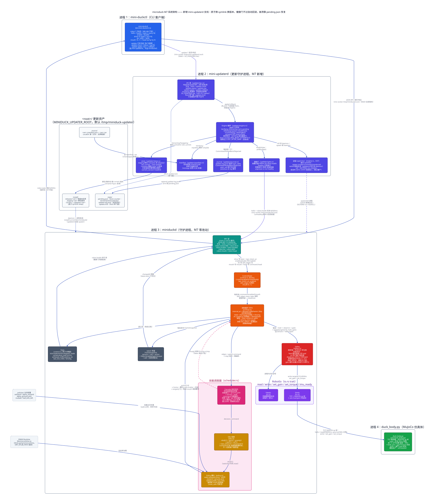
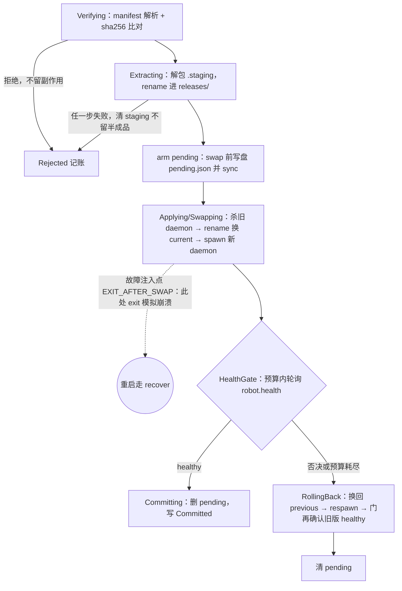
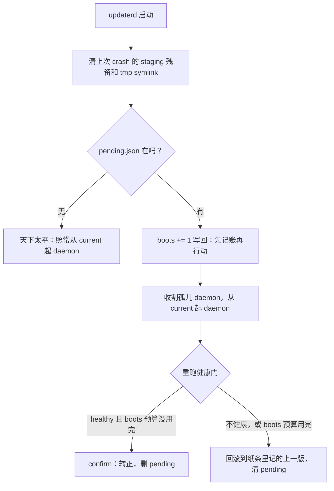

# 第 8 章 · M7：迷你 updaterd——修复怎么到达机器人：原子切换、健康门与崩溃恢复

> 本章对应里程碑 M7（已验收）。交付物：`src/updater/`（新建十个模块：mod/paths/manifest/store/journal/gate/lock/peer/engine/ipc.rs）、`src/bin/mini-updaterd.rs`（新建 daemon 入口）、`src/bin/mini-duckctl.rs`（+update 子命令组）、`Cargo.toml`（+sha2/+libc/+mini-updaterd bin）、`src/lib.rs`（+`pub mod updater`）、`scripts/accept-m7.sh`。miniduckd 一行未改，行为零变化。

## 1. 问题

M0–M6 把「机器人怎么跑」这条链路走完了：观测进、策略算、调度选网、Safety 守门、电机出。本章是这条主链旁边的一条支线，回答另一个问题：**修复怎么到达机器人**。权重训出了新版、代码改了 bug，总不能每次都抱着电脑蹲到机器人旁边插线拷贝。

原版的答案是 updaterd（设计文档 `reference/docs/design/updater-design.md`），它的核心承诺一句话：**never-brick——任何一步失败都回滚，机器人永远回得到上一个好版本**。整章的设计压力都来自这一句：更新这种事平时没用，出事时就是唯一的救命绳，所以它必须假设自己会死在任何时候（断电、kill -9、OOM），并且死在任何一步都能自己收拾残局。

为什么排在控制链路全部完工之后才做：

- **上游 M0**：updaterd 自己的 socket 服务和健康门都是 M0 那套 JSON-RPC/NDJSON 帧的复用——`src/updater/ipc.rs` 是服务端，`src/updater/gate.rs` 是客户端，协议一行新的都没发明。
- **上游 M5**：健康门（health gate[^1]）要消费健康判定，而健康判定（stall 500ms / 频率地板 45Hz / 策略缺失报病）是 M5 才有的。更关键的是回滚的底气来自 D19：策略加载失败不退出、活着报病——没有这条，「坏版本会长什么样」和「回滚后旧版真的复活了吗」都无从判别。本章的投毒测试就是直接利用 D19 的既有行为（见代码领读）。
- **支线定位**：它不依赖 M6[^2]，也不改 robot.* 面。miniduckd 一行不动是刻意的——更新系统的第一块试金石，就是「能不能在不改被更新对象的情况下把它换掉」。

下游 M8 要对照原版 updater 逐项裁决本章砍掉的机制（minisign 验签、网络源、hooks 等，见「与原版差异」）。

## 2. 背景概念

### rename(2) 原子换 symlink

本章最核心的操作是「换版本」。版本落在磁盘上的形态是：`install/current` 是一个 symlink，指向 `install/releases/2.0.0/` 这样的版本目录，daemon 二进制永远经 `current/bin/miniduckd` 去读。换版本 = 换这个路牌的指向。

直觉做法是「先删掉旧 symlink，再建一个新 symlink」。问题：这两步之间有一段窗口 `current` **不存在**，恰好此刻来读的人撞个正着。正确做法是「先建一个指向新版本的临时 symlink，再用 `rename(2)` 一把盖到 `current` 上」——rename 在同一目录内是原子的，任何时刻读者要么看到旧指向、要么看到新指向，没有中间态。

光讲道理不算数，`examples/atomic_symlink_swap.py` 起两个线程：一个读者不停经 `current` 读指向，一个写者换 2000 次指向，两种做法各跑一遍。本机实测（python3 直接跑）：

```text
先删再建        : 读者读 6850 次，撞见 current 不存在 3383 次
临时链接+rename : 读者读 10716 次，撞见 current 不存在 0 次
```

先删再建有近一半读取撞上空窗；rename 零次（次数随机器调度浮动，结论不变）。

还有一个更隐蔽的坑：rename 只保证**原子**，不保证**持久**。目录项（「`current` 这个名字指向谁」）本身也是数据，先落在内核页缓存里；断电时没写盘，重启后 `current` 可能又指回旧版——所以 rename 之后要 fsync **父目录**，而不是 fsync 某个文件。这对组合（原子 rename + fsync 目录）值得单独读透，见 [docs/concepts/atomic-symlink-swap.md](../../concepts/atomic-symlink-swap.md)；原版把两件事分开写在同一段注释里（`reference/updater/src/store.rs:160-203`，"Durability, not just atomicity"）。

### boot counter：记账的顺序是负载的

boot counter（开机计数[^3]）在磁盘上就是一张纸条 `state/pending.json`：「我在试用 X 版，上一版是 Y，已经第 N 次启动了」。有了它，updaterd 不管死在什么时候，重启后读一眼纸条就知道该怎么收拾。

关键不在纸条的内容，在**写纸条的时机**：必须在 swap 之前 arm（写盘）。为什么？先把 apply（装上新版本并启用）拆成四步，每步一句话：

1. **arm**（上弦）：写盘 pending.json 这张纸条。它是给崩溃恢复机制上弦用的——纸条在，重启后的恢复逻辑就知道「有笔试用期没结账」，会重新裁决；纸条不在，它就认为天下太平。
2. **swap**（换指向）：上一节的 rename 原子换 symlink，`install/current` 从指向 1.0.0 改指 2.0.0。它只改磁盘上的路牌，正在跑的旧进程不受影响。
3. **spawn**（起新进程）：从 `current/bin/miniduckd` 拉起新版 daemon——swap 之后路牌已指向新版，这一步起出来的才是新代码。
4. **confirm**（转正）：健康门盯着新 daemon 看一段时间，过了就删掉纸条（试用转正）；不过就回滚到纸条里记的上一版。

再明确一个前提：这里模拟的 kill -9 杀的是 **updaterd 自己**，不是 miniduckd——本章的设计前提就是 updaterd 可能死在任意一步（断电、OOM、kill -9）。daemon 是 setsid 脱离会话拉起的，updaterd 死了它还在跑（场景 E0 验的正是这条），所以 updaterd 死后「`current` 指向谁」「纸条在不在」「哪个版本还在跑」是三件独立的事。

`examples/boot_counter_order.py` 做沙盘推演：对「arm 在 swap 前」「arm 在 swap 后」两种顺序，分别在每一步之后模拟 kill -9[^4]，然后扮演重启后的崩溃恢复逻辑——它**只认磁盘上的纸条**：纸条在就重跑健康门裁决，不在就照常从 `current` 起 daemon。输出里三个字段：current=symlink 指向谁、live=此刻实际在跑谁、pending=纸条在不在。本机实测：

```text
--- kill -9 落在 arm_pending 之后（新版 2.0.0 是坏的）---
  arm 在 swap 前: current=1.0.0 live=1.0.0 pending=有 → 回滚 1.0.0
  arm 在 swap 后: current=2.0.0 live=2.0.0 pending=有 → 回滚 1.0.0
--- kill -9 落在 swap_current 之后（新版 2.0.0 是坏的）---
  arm 在 swap 前: current=2.0.0 live=1.0.0 pending=有 → 回滚 1.0.0
  arm 在 swap 后: current=2.0.0 live=1.0.0 pending=无 → 重启从 current 起 2.0.0，无人记账
--- kill -9 落在 spawn_new 之后（新版 2.0.0 是坏的）---
  arm 在 swap 前: current=2.0.0 live=2.0.0 pending=有 → 回滚 1.0.0
  arm 在 swap 后: current=2.0.0 live=2.0.0 pending=无 → 重启从 current 起 2.0.0，无人记账
```

看右边一列（arm 在 swap 后）的后两行：swap 已经发生、`current` 指向坏的新版，但纸条还没写——重启后崩溃恢复读不到 pending，以为天下太平，照常从 `current` 把坏版本起起来，**永远没人把它撤回去**。arm 晚了，崩溃落在 swap 之后 arm 之前 = 新代码在跑却没人记账。

要精确理解这段论证的对象：它不是「四步全都不可调换」。swap→spawn、健康门→confirm 是数据依赖钉死的[^5]，没人会搞错；唯一看起来能随便挪的是 arm——它和谁都不互相依赖，放后面单测和正常运行全看不出来，差别只在「死在 swap 之后、arm 之前那条缝里」才暴露。本节要立住的纪律：**纸条的在场时间必须完整罩住「现实被改变」的区间（swap→confirm）——先留证、再改变、最后销证**。原版文件头注释把这条列为三条根本规则之一（`reference/updater/src/engine.rs:1-18`："The boot counter is armed before the swap … The reverse order would leave an unrecorded bad release live."）。

### 【背景卡片】SO_PEERCRED：内核告诉你对面是谁

- **一句话**：Unix socket 的服务端可以问内核「这个连接对面进程的 uid/gid/pid 是什么」，内核直接给答案，不需要客户端自报家门。
- **为什么需要**：鉴权不能信客户端自己报的身份——「我是管理员」这句话谁都会发。`peer_cred()` 拿到的 uid 是内核从进程凭证里抄的，伪造不了。
- **本项目**：这是原版 updaterd/configd 的鉴权模式[^6]。我们缩成一条规则：uid==0 或 ==socket 文件 owner 放行，其余拒绝；连 `peer_cred()` 调用本身失败也拒绝——**unproven 不是 allowed**（`src/updater/peer.rs:8-10`、`src/updater/ipc.rs:161-177`；原版同款语义在 `reference/updater/src/ipc.rs:78-97`，且原版把这条规则集中在一个门口，新加方法不会漏过它，`reference/updater/src/ipc.rs:531-535`）。socket 文件 0660 是第一道门（谁连得上），SO_PEERCRED 是第二道（连上了让不让改）——两道门都在，因为 0660 管不住 root 之外的同组用户里「能连但不该改」的细粒度情形【合理推断：容器单用户下两道门几乎等效，第二道门主要是对齐原版语义，见 D40】。

**自测**：如果只留 0660 文件权限、删掉 peer 门控，本章验收的哪个场景行为会变？哪个场景完全不变？

## 3. 设计



先读图。整张图分三个世界：右边是 miniduckd 进程（M0–M6 的控制链路，本章一行不改），左边是本章新增的 mini-updaterd 进程，中间是两者共享的文件系统。updaterd 内部的层次从上往下：IPC 层把守 update.* 方法面（先鉴权、再拿单飞锁），engine 是唯一的编排者（apply/rollback/崩溃恢复 + 进程 supervisor），store/manifest/gate/journal 是四个各管一件事的机制层。磁盘上四个区域分工固定：`source/` 是 release 的进货口（`<ver>.manifest.json` + `<ver>.tar`），`install/releases/` 是每版本一个目录的版本库，`install/current` 是唯一被消费的路牌（symlink），`state/` 是 updaterd 的账本（pending.json / update-log.jsonl / update.lock）。

谁读谁写一句话：磁盘上只有 updaterd 一个写者；miniduckd 不写磁盘，它唯一沾边的地方是 updaterd 经 `install/current/bin/miniduckd` 把它拉起来——它对自己正在被更新一无所知。两个进程之间只有两条边：supervisor 的 spawn/kill，和健康门对 `robot.health` 的 500ms 轮询。「miniduckd 一行不动」既是边界，也是本章的试金石。

### 模块划分：编排与机制分开

十个模块为什么这样切：**每层只做一件事，且只有 engine 知道「更新」这个概念**。paths.rs 是磁盘布局的唯一权威——所有路径只从这一个文件出，换布局改一处。store / manifest / journal 是三个纯机制层：一个管解包落位与原子换指向，一个管校验，一个管记账，它们不知道什么是 apply、什么是回滚。gate 是 M0 RPC 帧的客户端复用，不是新协议。engine 是唯一的编排者：apply 的阶段顺序、崩溃恢复的裁决、进程 supervisor 全收在这一个文件里——顺序错了会出事的逻辑，必须摊在一处能一眼读完。ipc 是门面：鉴权和单飞锁两道闸都收在门口，机制层永远见不到客户端。lock / peer 各自小到一个函数，故意不藏进大模块。薄壳 `mini-updaterd.rs` 只做一件事：先 `recover()` 收拾残局，再开门接客。

### 关键流程一：一次 apply

`Engine::apply` 七个阶段，两个失败出口（校验拒绝、门否决回滚），外加一个验收用的故障注入点（swap 已落盘、pending 已 arm、新 daemon 已在跑——kill -9 能落在的最坏窗口）：



注意 arm 的位置：纸条先于 swap 落盘，在场时间罩住整个「现实被改变」的区间——这是背景概念里沙盘推演立住的纪律，图里不可挪动的就是这一格。

### 关键流程二：崩溃恢复 recover()

每次启动先跑 `recover()`，先于 bind socket——恢复跑在接客之前，等待循环等到的才是「恢复完毕」而不是「进程起来了」：



第二支是关键裁决：boots 预算用完（MAX_BOOT_ATTEMPTS = 2），即使这次 healthy 也回滚——预算决定的是「给你几次机会」，不是「你这次表现好不好」；这条兜住「每次启动都死在门里」的循环。

### 决策导览

本章五张决策卡片，各在回答一个问题（详细论证留在代码领读原位）：

- **sha256 先行、minisign 验签推迟 M8**——release 的可信性做到哪一层（见「一次 apply 的旅程」）。
- **updaterd 兼任 supervisor vs 依赖 systemd**——「换版本后重启 daemon」「updaterd 死了 daemon 怎么办」交给谁（见「updaterd 兼任进程 supervisor」）。
- **symlink 切换 vs 覆盖式更新**——换版本的物理动作怎么做（见「原子换指向」）。
- **单飞锁选 flock 而非 O_EXCL 锁文件**——「同一时刻只许一个更新在飞」怎么落地（见「IPC 面」）。
- **投毒用 wrapper + D19 既有行为**——验收用的「坏版本」从哪来（见「投毒」）。

读完本节，不看代码应能复述：版本以目录 + symlink 落盘，apply 先验再解、先 arm 再换、门不过就回滚；updaterd 死在任何一步，重启后 recover() 凭 pending.json 一张纸条把局面收回到 confirm/rollback 之一。

## 4. 代码领读

### 模块分工与目录布局

模块为什么这样切见上一节「设计」；这里是逐文件的一句话职责与行号：

- `paths.rs`：目录布局的唯一权威（`src/updater/paths.rs:1-13` 的模块注释就是整张图）：`<root>/source/` 放 release 源（`<ver>.manifest.json` + `<ver>.tar`），`<root>/install/releases/<ver>/` 放解包产物，`<root>/install/current` 是消费方经它读的 symlink，`<root>/state/` 放 pending.json / update-log.jsonl / update.lock。默认根 `/tmp/miniduck-update/`，env 覆盖给验收隔离用。
- `manifest.rs`：解析 + 形状校验 + sha256 比对。
- `store.rs`：staging（暂存目录[^7]）解包、rename 落位、current 原子换指向。
- `journal.rs`：update-log.jsonl 追加流水，兼作「上一个版本」的索引。
- `gate.rs`：健康门，轮询 miniduckd 的 robot.health。
- `engine.rs`：编排（apply/rollback/崩溃恢复）+ 进程 supervisor（spawn/kill miniduckd）。
- `ipc.rs`：update.* 方法面 + 鉴权 + 单飞锁。
- `lock.rs` / `peer.rs`：flock 单飞锁 / SO_PEERCRED-lite，各自小到一个函数。
- `mod.rs`：模块清单 + 四个 RPC 错误码（`src/updater/mod.rs:23-26`）。

`src/bin/mini-updaterd.rs` 是薄壳：建目录 → `recover()` **先于** bind socket（`src/bin/mini-updaterd.rs:43-45`，注释原话「先把局面收拾到 confirm/rollback 之一，再开门接客」）→ bind `/tmp/mini-updaterd.sock` 0660 → serve。这个顺序是场景 E 的命门：恢复跑在接客之前，验收脚本的启动等待循环才会等到「恢复完毕」而不是「进程起来了」。

CLI 侧，`mini-duckctl update <check|status|log|apply|rollback>` 连的是 updaterd 的 socket 而不是 miniduckd 的——`mini-duckctl.rs:24-28` 解析完第一个参数就分流，在建立连接之前岔开。

### 一次 apply 的旅程

`Engine::apply`（`src/updater/engine.rs:247-310`）七个阶段，Phase 枚举（`src/updater/engine.rs:33-42`）是原版 proto 命名的子集：

1. **Verifying**：manifest 解析（`src/updater/manifest.rs:23-40`——任何字段不符都拒绝，注释立场「unproven is not healthy 的同款」）→ sha256 比对 artifact（`src/updater/manifest.rs:44-55`）。拒绝不留任何副作用。
2. **Extracting**：验过才解包到 `.staging-<ver>`，完成后 rename 进 `releases/`（`src/updater/store.rs:38-71`）。staging 是 releases 的**邻居**而不是子目录——rename 要求同一文件系统，邻居关系保证这一点（`src/updater/paths.rs:45-49`）。任何一步失败清掉 staging 不留半成品。
3. **arm pending**：swap 之前写盘 pending.json（`src/updater/engine.rs:267-272`，`save_pending` 写完即 `sync_all`，`engine.rs:421-425`）。上一章节的演示就是这一步为什么不能挪。
4. **Applying/Swapping**：杀旧 daemon → `set_current` 原子换指向（`src/updater/store.rs:20-31`）→ 从 `current/bin/miniduckd` spawn 新 daemon（`engine.rs:274-282`）。
5. **故障注入点**（`engine.rs:284-289`）：env `MINIDUCK_UPDATER_EXIT_AFTER_SWAP=1` 时在这里 `exit(1)`——swap 已落盘、pending 已 arm、新 daemon 已在跑，这是 kill -9 能落在的**最坏窗口**。场景 E 全靠它。
6. **HealthGate**：轮询预算内等 healthy（见下一节）。
7. **Committing / RollingBack**：门过则 confirm（删 pending + 写 Committed 行，`engine.rs:350-360`）；门否决则 `rollback_to`（换回 previous、respawn、**门再确认旧版 healthy**，`engine.rs:364-406`）然后清 pending（`engine.rs:302-304`，漏清的后果见「常见坑」2）。

**【决策卡片】sha256 先行、minisign 验签推迟 M8**

- **决策点**：release 的可信性做到哪一层。原版是 minisign 签名验签（manifest 和 artifact 都验，updater-design.md §5.4），签名回答「这包是不是我们发的」；sha256 只回答「这包和 manifest 登记的是不是同一份字节」。
- **备选**：1. 本章就接入 minisign 验签；2. 只做 sha256 完整性，验签登记 D38 推迟 M8。
- **选择**：备选 2。sha256 已经把「传输/存储损坏」和「tar 被篡改一个字节」这一整类故障挡在门外（场景 C），而 minisign 的教学价值主要在密钥管理[^8]，与本章主线「原子切换 + 崩溃恢复」正交。sha2 是纯 Rust 小 crate（`Cargo.toml:26-27`），不拖重依赖。
- **放弃的成本**（没选备选 1 丢掉了什么）：防不了「manifest 和 tar 一起被换掉」的主动攻击——source/ 目录对本机有写权限的人可以同时改两个文件，sha256 照样对上。也就是说当前防的是**坏**，不是**敌**。验签带来的信任链（私钥离线持有、公钥烧进镜像）整条缺席，M8 接入时要补的不只是 verify 调用，还有密钥分发这个故事。
- **失效边界**：D39 收敛（接网络源、release 从不受信的网络上拉）时 sha256-only 立刻不可接受——下载通道一开，「敌」就从假设变成现实，这张卡随 D38 一起裁决。

### 健康门：轮询，不信推送

门（`src/updater/gate.rs`）的语义极简：预算内每 500ms 连一次 miniduckd 的 socket 问 `robot.health`（先 hello 再问，协议入场不特殊，`gate.rs:48-57`），拿到 healthy 立即放行，预算耗尽 = 失败。轮询间隔 500ms 直接对齐原版常量（`gate.rs:17-18`；`reference/updater/src/engine.rs:69`）。原版注释说透了为什么是轮询："The gate polls, so it will see the transition"——健康是个会变的量，问一次不算数；以及 timeout 即失败，"unproven is not healthy"（`reference/updater/src/engine.rs:2286-2305`）。预算默认 30s（`src/updater/engine.rs:23`，拍脑袋，原版来自配置无单一常量），验收用 env 压到 4s。

「unproven is not healthy」这条贯穿全模块：连不上 = 不健康，超时 = 不健康，manifest 说不清 = 不装，peer_cred 拿不到 = 不放行。更新系统里**没有中性结果**，答不上来一律按坏消息处理。

### 崩溃恢复：启动先收拾残局

`recover()`（`src/updater/engine.rs:199-243`）每次启动先跑，四步：

1. 清上次 crash 的 staging 残留和 tmp symlink（`src/updater/store.rs:75-85`；原版对应物在 `reference/updater/src/engine.rs:1762` 附近）。
2. 发现 pending 就 `boots += 1` 写回（`engine.rs:206-212`）——**先记账再行动**：再死一次计数也涨，`MAX_BOOT_ATTEMPTS = 2`（`engine.rs:19`，对齐原版 `reference/updater/src/engine.rs:38`）才兜得住「每次启动都死在门里」的循环。
3. 收割上次 updaterd 死后留下的孤儿 daemon，然后从 `current` 起 daemon（见下一节）。
4. 有 pending 就重跑健康门，按真值表裁决（`recovery_verdict`，`engine.rs:55-61`）：healthy 且预算没用完 → confirm；否则回滚。注意第二行：boots 预算用完，即使 healthy 也回滚（原版同：`BootCounter::exhausted`，`reference/updater/src/engine.rs:1839`）——预算决定的是「给你几次机会」，不是「你这次表现好不好」。

### updaterd 兼任进程 supervisor

没有 systemd（D37），updaterd 直接当 miniduckd 的爹：

- **spawn**（`engine.rs:107-128`）：从 `install/current/bin/miniduckd` 启动，继承 env（MINIDUCK_POLICY / ORT_DYLIB_PATH 走这条路），`setsid()` 脱离会话（`engine.rs:116-123`）——updaterd 退出（含 kill -9）不杀 daemon，场景 E0 断的就是这条。
- **kill**（`engine.rs:131-151`）：先 SIGTERM，宽限 2s，不走再 SIGKILL。
- **孤儿收割**（`engine.rs:158-195`）：启动时按 `/proc/*/comm` 匹配 `miniduckd*` 杀掉上次留下的 daemon——不杀的话两个控制循环抢同一个 `/tmp/miniduckd.sock`、跑同一台机器人，没有定义。注意跳过僵尸（`engine.rs:177-181`，为什么见「常见坑」5）。

**【决策卡片】updaterd 兼任 supervisor vs 依赖 systemd**

- **决策点**：「换版本后重启 daemon」「updaterd 死了 daemon 怎么办」这些事交给谁。
- **备选**：1. 直接依赖 systemd（原版做法：`systemctl restart`，unit 文件指 `current/`，golden 兜底）；2. docker restart policy；3. 另写一个 supervisor 脚本；4. updaterd 自己 spawn/kill。
- **选择**：备选 4。验收容器没有 systemd（`sleep infinity` 当 PID 1），而本章要教的是 supervisor 的**机制**——setsid 脱离会话、SIGTERM 宽限后 SIGKILL、按 /proc 收割孤儿——这些机制用 systemd 反而全被藏起来。自己当爹之后，kill -9 updaterd 不杀 daemon 这条性质（场景 E0）变成一行 setsid 的直接推论，可教可测。
- **放弃的成本**：① systemd 的 Restart=always——我们的 updaterd 自己挂了没人拉它（验收脚本是外力）；② unit 依赖编排与日志托管（journald），我们的 daemon stdout 直接散在终端；③ golden 镜像兜底这条最重的保险没了[^9]。备选 2 的 restart policy 同理只解决「拉起」，不解决「拉起到哪个版本」。
- **失效边界**：真上板部署时这张卡大概率翻案——教学复刻里自己当爹是为了把机制露出来，产品上把重启语义交回 systemd（并补 golden 兜底）是对的。D37 在 M8 裁决。

### 原子换指向：为什么不是「停服→覆盖二进制→启服」

`set_current`（`src/updater/store.rs:20-31`）四步：清上次残留的 `.current.tmp`（上次 crash 留下的不能挡住这次 swap，原版同 `reference/updater/src/store.rs:181`）→ 建**相对**临时链接（`releases/<ver>`）[^10] → rename 覆盖 → fsync 父目录。当前版本不另开状态文件，`readlink` 即真相（`store.rs:14-17`）。

**【决策卡片】symlink 切换 vs 覆盖式更新**

- **决策点**：换版本的物理动作怎么做。
- **备选**：1. 停服 → 直接覆盖二进制文件 → 启服；2. 每版本一个目录 + current symlink 原子换指向。
- **选择**：备选 2。覆盖式在「写到一半断电」时没有退路：磁盘上的二进制既不是旧版也不是新版，机器人变砖——而 never-brick 是本章的唯一承诺。版本目录 + symlink 让旧版**完整地留在原地**，回滚 = 把路牌指回去，零拷贝零风险。
- **放弃的成本**（覆盖式的好处我们没要到）：① 磁盘占用——每多留一个版本就多占一份完整 release[^11]；② 少一层间接——symlink 意味着「二进制在哪」是个需要 readlink 的间接问题，`spawn_daemon` 得先确认 `current/bin/miniduckd` 存在（`engine.rs:108-111`）；③ 实现更少——覆盖式不需要 staging、不需要原子 rename、不需要 fsync 目录，本章 store.rs 的八成代码都是为 symlink 方案付的税。
- **失效边界**：release 体积大到 eMMC 装不下两份时，磁盘占用的成本会变成硬约束[^12]；mini 复刻里 daemon 二进制就几 MB，远不到边界。

### IPC 面：鉴权、单飞锁、只读不锁

update.* 方法面五个（`src/updater/ipc.rs:66-149`）：`update.check`（列 source/ 里 manifest 能解析的版本——坏 manifest 列出来是误导，`ipc.rs:78-84`）、`update.status`（phase/current/previous/pending）、`update.log`（尾部 N 行）、`update.apply`、`update.rollback`。

两个 mutating 方法过两道闸，顺序刻意：**先 peer 门控再拿锁**（`ipc.rs:127-137`）——没权限的人不该能制造 Busy。只读路径**不锁 engine**（`ipc.rs:101` 注释）：apply 全程持锁，status 必须仍能读——否则「更新进行到哪了」这个问题在更新进行时恰恰问不了。

「上一个版本」不存状态文件，从 log 推导：最后一行 `to == current` 的 Committed 的 `from`（`src/updater/journal.rs:87-93`）。出厂镜像直接建 symlink 无 log 行，previous = None——log 就是唯一的账。

**【决策卡片】单飞锁选 flock 而非 O_EXCL 锁文件**

- **决策点**：「同一时刻只许一个更新在飞」怎么落地（单飞 = single-flight，原版 preflight 第一条，updater-design.md §7.2）。
- **备选**：1. `open(O_CREAT|O_EXCL)` 锁文件——创建成功即持锁，存在即 Busy；2. `flock(LOCK_EX|LOCK_NB)`——给文件加内核级劝告锁。
- **选择**：备选 2（`src/updater/lock.rs:24-41`）。场景 E 故意 kill -9 updaterd，O_EXCL 文件会**残留**——进程死了文件还在，重启后所有 apply 永远卡 Busy，直到有人手动 rm。flock 的锁挂在打开的 fd 上，进程一死内核自动释放，天然免疫 stale lock。fs2 crate 是同一语义的封装，但 libc 已在依赖树里，不为此多一个依赖（`lock.rs:1-6` 注释）。
- **放弃的成本**（O_EXCL 的好处没要到）：① 跨机器可见性——锁文件躺在磁盘上，管理员 ls 一下就知道「有更新在跑/上次死在这」，flock 锁从外面看不可见（只能试拿）；② NFS 语义简单——O_EXCL 在 NFS 上有 create 语义兜底，flock 在某些 NFS 配置下形同虚设（机器人是本地 eMMC，这条用不上）；③ 无 unsafe——O_EXCL 纯 safe Rust，flock 要走 libc FFI。
- **失效边界**：如果 updaterd 变成多进程互斥之外的分布式互斥（多台机器人协调更新窗口），劝告锁完全不够，那是另一个问题；单机上这张卡没有失效条件。

### 投毒：不改 miniduckd 一行的坏版本

场景 B/E2 需要一个「装得上、跑不起来、能被门识别为坏」的版本。做法（`scripts/accept-m7.sh:69-77`）：tar 里的 `bin/miniduckd` 是个 wrapper 脚本——`export MINIDUCK_POLICY=/nonexistent.onnx` 再 `exec` 真二进制（改名 `miniduckd-real`）。策略加载失败报病是 M5 收敛的 D19 既有行为，daemon 活着、healthy=false、reason 是 "policy unavailable: …"，健康门原样识别。**miniduckd 一行没改。**

**【决策卡片】投毒用 wrapper + D19 既有行为 vs 给 miniduckd 加测试钩子**

- **决策点**：验收用的「坏版本」从哪来。
- **备选**：1. 给 miniduckd 加一个测试钩子 env（比如 `MINIDUCK_FAKE_UNHEALTHY=1` 就让 health 报病）；2. wrapper 脚本污染 env，利用 D19 的真实故障路径。
- **选择**：备选 2。钩子 env 测的是「钩子能让 health 变假」——一条只为测试存在的代码路径，验收过了也不证明真故障能被门拦住。wrapper 走的是**真实故障路径**：策略文件不存在 → 加载失败 → D19 报病 → robot.health 不健康 → 门否决，链条上每一环都是生产代码。顺带零改动守住「miniduckd 不知道自己在被更新」这条边界。
- **放弃的成本**（钩子方案的好处）：① 故障种类——钩子能注入「health 时好时坏」「延迟 N 秒才报病」这类时序故障，wrapper 只能注入「启动即病」这一种；② 不依赖 shell——wrapper 假设目标环境有 /bin/sh 和 env 继承语义[^13]；③ 诊断更直白——钩子报病的原因是「钩子」，wrapper 报病的原因得看懂 D19 才知道是演的。
- **失效边界**：需要测「跑着跑着才坏」（比如运行 10 秒后 OOM）时 wrapper 方案不够用，得加真能演时序的故障注入；本章场景只需要「门能识别启动即坏」，边界没到。

## 5. 验收

```bash
# 容器内（miniduck-rust，工作目录 /work）
docker compose exec rust cargo build    # 0 警告
docker compose exec rust cargo test
```

实测：`test result: ok. 60 passed; 0 failed`——M6 的 49 条 + 新增 11 条[^14]。

```bash
docker compose exec rust bash scripts/accept-m7.sh
```

实测 39 PASS / 0 FAIL（2026-09-29 复跑；完整输出见 acceptance.md）。五个场景关键行：

```text
===== 场景 A：开心路径 =====
available=['1.0.0', '2.0.0', '2.0.1', '3.0.0-bad'] current=1.0.0
committed 1.0.0 -> 2.0.0
PASS: A3 current->2.0.0 / A3 pending 已清
PASS: A4 status idle/current=2.0.0/previous=1.0.0
log 末行: committed 1.0.0->2.0.0 peer_uid=1000
PASS: A5 rollback RPC / current->1.0.0 / 重回 2.0.0
===== 场景 B：投毒回滚 =====
门否决: health gate rejected 3.0.0-bad: unhealthy: ["policy unavailable: reading /nonexi…
PASS: B2 current 回到 2.0.0 / B2b pending 已清 / B3 daemon 恢复 healthy
PASS: B4 log RolledBack(2.0.0→3.0.0-bad)
===== 场景 C：篡改拒绝 =====
拒绝: Rejected: sha256 mismatch for 3.0.0-bad.tar: manifest says 187f6307b7e…
PASS: C2 current 没动 / C3 releases/ 无残留 / C4 staging 已清 / C5 log Rejected
===== 场景 D：并发单飞 =====
第二个 apply 被拒: Busy: another update is in progress
PASS: D2 第一个 apply 正常完成
===== 场景 E：崩溃恢复 =====
PASS: E0 kill -9 updaterd 后 daemon 仍在跑
pending: {'version': '2.0.1', 'previous': '2.0.0', 'boots': 0}
PASS: E1 重启后 pending 已 confirm / current 保持 2.0.1
恢复记账: recovered after crash: healthy
PASS: E2 投毒 daemon 报病（D19）/ current 回滚到 2.0.1
恢复回滚: recovered trial still unhealthy: unhealthy: ["policy unavailable: read…
===== M7 汇总：PASS=39 FAIL=0 =====
```

**断言解释**（逐项：这个断言为什么证明了这个性质）

- **A2 check**：`available` 列出四个版本且 `current=1.0.0`——check 读的是 source/ 目录（不是 releases/），current 读的是 readlink，两个来源同框证明「发现」与「现状」是两套独立数据。3.0.0-bad 也在 available 里：check 只验 manifest 形状，不预知健康——能不能装是门的事。
- **A3 apply**：RPC 回 committed 之外还断三件事——readlink 指向 2.0.0（swap 真落了）、pending 已清（confirm 真跑了）、log 末行带 `peer_uid=1000`（放行也记账，SO_PEERCRED-lite 真的在问内核）。
- **A5 rollback↔apply 往返**：rollback 回 1.0.0 再 apply 回 2.0.0 成功——证明 install 幂等（2.0.0 已在 releases/，跳过解包直接 swap），这条是踩坑后补的（见「常见坑」3）。
- **B 门否决**：`reason` 里的 "policy unavailable: reading /nonexistent.onnx" 是 D19 报病的原文——证明拦下它的是真实健康判定路径，不是 updaterd 自己编的罪名。B2b 断 pending 已清是**回归断言**（坑本身见「常见坑」2）。B4 要求 log 里有 `rolled_back 2.0.0→3.0.0-bad` 行——回滚也是一次记账，不是悄悄换回去。
- **C 篡改**：错误码 -32003（ERR_REJECTED）+ "sha256 mismatch"；C2/C3/C4 三连证明拒绝**无副作用**——current 没动、releases/ 没创建、staging 清空。场景 C 的 setup 有个细节：B 已经把 3.0.0-bad 装进 releases/（装是成功的，是门否决了它），所以 C 先手动卸掉它（`scripts/accept-m7.sh:204-206`），否则 C3 断的就不是「篡改的 apply 不创建版本目录」。
- **D 并发**：错误码 -32001（ERR_BUSY）。`sleep 1` 让第一个 apply 先进持锁段再发第二个——Busy 断言的是锁的互斥，不是时序运气。
- **E0**：kill -9 updaterd 后 daemon 仍 healthy——setsid 脱离会话的直接证据。
- **E1**：注入版 updaterd 在 swap 后 exit(1)，apply 的 RPC 拿不到响应（客户端 EOF 是预期）；磁盘上 pending `{version:2.0.1, previous:2.0.0, boots:0}` 逐字段断言——arm 的内容就是恢复的全部依据。重启后 pending 消失、current 保持 2.0.1、log 写 "recovered after crash: healthy"——恢复走的是 confirm 分支。
- **E2**：同注入 apply 投毒版，重启后门重跑否决、current 回滚 2.0.1、log RolledBack——恢复走的是 rollback 分支。E1/E2 合起来把崩溃恢复的真值表两支都走了一遍。

miniduckd 零改动，robot.* 面不变；M6 的 49 条单测在 60 总数里原样全绿（控制链路行为回归由它们覆盖）。

## 6. 破坏实验

更新系统的测试通过不代表你相信它——它的价值全在「死在最坏时刻还能收拾」。亲手把它改坏，看系统怎么坏，再改回来。两个实验改完记得 `cargo build` 并**改回原值重新 build**。

### 实验 1：把 arm 挪到 swap 之后——崩溃恢复失明

`src/updater/engine.rs` 把 arm pending 那段（`:267-272`）整块移到 `set_current`（`:277`）之后，跑 `docker compose exec rust bash scripts/accept-m7.sh`。预期：场景 E1 在「pending 已 arm」断言处 FAIL——updaterd exit(1) 时磁盘上根本没有 pending.json；E2 更糟：重启后恢复读不到 pending 直接返回，投毒版 3.0.0-bad 留在 current 上永远没人撤（后续 current 断言连环 FAIL）。这就是背景概念里那张表演示的生产版：arm 的顺序是负载的。

### 实验 2：把 flock 换成 O_EXCL 锁文件——kill -9 卡死所有后续更新

`src/updater/lock.rs` 的 `try_acquire` 改用 `OpenOptions::new().create_new(true)`（O_EXCL 语义）：创建成功即持锁。注意 `UpdateLock` 的 Drop 不会删文件[^15]。跑 accept-m7.sh：场景 D 照常过[^16]，真正的杀手是场景 E1：updaterd exit(1) 时锁文件残留，重启后 E2 的 apply 永远拿 Busy。这就是 flock 那张决策卡的实证版：锁的生命周期必须挂在进程上，不能挂在文件上。

## 7. 与原版差异

| 项 | 现在 | 收敛 |
|---|---|---|
| D6 | 「无 systemd 部署、无 minisign 验签」本章落地后拆成两半，分别由 D37/D38 承接 | 本章移交，M8 随 D37/D38 裁决 |
| D37 | 无 systemd：updaterd 直接 spawn/kill miniduckd 子进程替代 `systemctl restart`（setsid 脱离会话、/proc comm 收割孤儿）；无 golden/boot-check 外层兜底 | **本章新开**，M8（上板部署时大概率对齐回 systemd+golden） |
| D38 | 无 minisign 验签，release 完整性只有 sha256（先验再解包） | **本章新开**，M8——D39 收敛（开网络源）时必须先收敛它 |
| D39 | 只有 LocalDir 单一 source（`<root>/source/`），无 GitHub/HF 网络发现/channel 策略/自动检查定时器；artifact 是未压缩 .tar（调系统 `tar -xf`）而非原版 .tar.zst | **本章新开**，M8 |
| D40 | SO_PEERCRED 缩为 uid==0 \|\| socket owner 单点门控，无 allow_uids/allow_gids 配置（容器单用户，配置面无教学价值） | **本章新开**，M8 裁决或永久豁免 |
| D41 | 无 hooks/orphan 检查/transcript/Degraded 裁决（健康判定是布尔）/subscribe 推送/self-update；Phase 枚举只取 proto 子集（Idle/Verifying/Extracting/Swapping/Applying/HealthGate/Committing/RollingBack） | **本章新开**，M8 |

对齐原版的内核机制（不算偏差）：原子 symlink swap（`reference/updater/src/store.rs:160-203` 同款 rename+fsync）、boot counter 先 arm 后 swap（`reference/updater/src/engine.rs:1-18` 三条根本规则之一）、MAX_BOOT_ATTEMPTS=2（`engine.rs:38`）、健康门 500ms 轮询 + timeout 即失败（`engine.rs:69`/`:2286-2305`）、mutating 单点门控（`ipc.rs:531-535`）。

## 8. 常见坑与展望

1. **kill -9 后旧 socket 文件会骗人**（本章验收脚本真实踩过）。`start_updaterd` 的等待循环是「socket 文件出现即放行」，但 kill -9 不会删 socket 文件——旧文件残留让等待循环在新 updaterd 还没 bind 时就放行，客户端连上去 ECONNREFUSED。修法：启动前 `rm -f`（`scripts/accept-m7.sh:101-103`）。Unix socket 的文件存在 ≠ 有人在听。
2. **回滚路径漏清 pending.json**（本章真实踩过）。confirm 清了、rollback 没清——已结束的 trial 被下次启动重复裁决（重启后把已经回滚过的版本再「恢复」一遍）。两条回滚路径都补了 `clear_pending`（`src/updater/engine.rs:239` 恢复裁决分支、`:302-304` 门否决分支），场景 B2b 是钉住它的回归断言。教训：「谁创建谁销毁」在有多条退出路径时不够，要在每条路径终点都问一句「纸条撕了吗」。
3. **install 幂等：拒绝重装已安装版本会咬到回滚**（本章真实踩过）。原实现见 `releases/<ver>` 已存在就报错——听起来合理，但「回滚到 1.0.0 之后再 apply 回 2.0.0」时 2.0.0 已在 releases/ 里，直接被拒。改为已安装则跳过解包（`src/updater/store.rs:41-46`）：artifact 已过 sha256 校验，releases/ 里的目录视为同一内容的物化。场景 A5 的往返断的就是这条。
4. **E1 里 apply 拿不到响应是预期行为**。注入的 updaterd 在 swap 后 exit(1)，响应还没发出去连接就断了——客户端看到 EOF 不是 bug，是故障注入的定义（`scripts/accept-m7.sh:251` 注释）。自己写探针时别把 EOF 当失败重试。
5. **容器 PID 1 不收割僵尸**。kill -9 updaterd 留下的 daemon 死后变僵尸，`/proc` 里 comm 还在——孤儿收割不跳过 Z 状态就会对僵尸重复发信号刷日志（`src/updater/engine.rs:177-181`）。投毒版的进程名是 `miniduckd-real`（wrapper exec 出来的），匹配用 `starts_with("miniduckd")` 才罩得住两个名字（`engine.rs:172`）。
6. **「装上了」和「能跑」是两回事，别合并断言**。场景 B 里 3.0.0-bad 的解包、rename、swap、spawn 全部成功——它死在健康门。所以场景 C 要断言「篡改的 apply 不创建版本目录」时必须先手动卸掉 B 装好的那份（`scripts/accept-m7.sh:204-206`）。验证管道的每个阶段都要能单独断言，混在一起的验收分不清是哪一环拦的。

**展望**：本章留下的 D37–D41 五项待收敛全部指向 M8——supervisor 是否交回 systemd、验签与网络源、鉴权配置面、hooks/Degraded 等机制，都会在 M8 对照原版逐项裁决；各项现状与取舍已列在「与原版差异」表，此处不重复。

[^1]: 换完版本后盯着 `robot.health` 看一段时间的关卡，过了才算更新成功，不过就回滚。
[^2]: 健康门只看 `robot.health`，不看 skill。
[^3]: 试用版每被启动一次就记一笔，超过预算就判定它是砖。
[^4]: 脚本里就是一个 break：之后的步骤永不发生。
[^5]: 不先换指向，spawn 起出来的还是旧版；不先验收就销账等于没验收。
[^6]: D8 在 M5 侦察过：robotd 不用它，只靠 socket 文件 0660。
[^7]: 解包先落在这里，装完才 rename 进正式位置，失败了整个删掉不留半成品。
[^8]: key custody 是原版设计文档里专门一节。
[^9]: D37 登记：无 golden/boot-check 外层兜底——原版在 updaterd 整个坏掉时还有救援系统可读 golden 链接，我们坏了就是坏了。
[^10]: root 整体搬走链接仍有效。
[^11]: 原版用 keep_previous 裁剪 + golden 豁免来管这件事（updater-design.md §8.2），我们的 mini 版没做裁剪。
[^12]: 原版设计文档 §7.2 把磁盘空间列为 preflight 检查项，正是为这个。
[^13]: 容器里有，板上也有，但这是一层没写进代码的假设。
[^14]: store 3：原子换指向/残留 tmp 不挡 swap/staging 清理；manifest 3：良构解析/畸形拒绝/sha256 不符；journal 1：previous 从最后一条匹配 Committed 推导；lock 1：第二持锁者拿 Busy 且放锁后可再拿；peer 1：root/owner 放行旁观者拒绝；engine 2：恢复裁决真值表 + pending 读写往返。
[^15]: 这正是 O_EXCL 方案的固有缺陷——进程没机会清理。
[^16]: 第一个 apply 正常删不删文件取决于你写没写清理——写在 Drop 里的话 D 能过。
