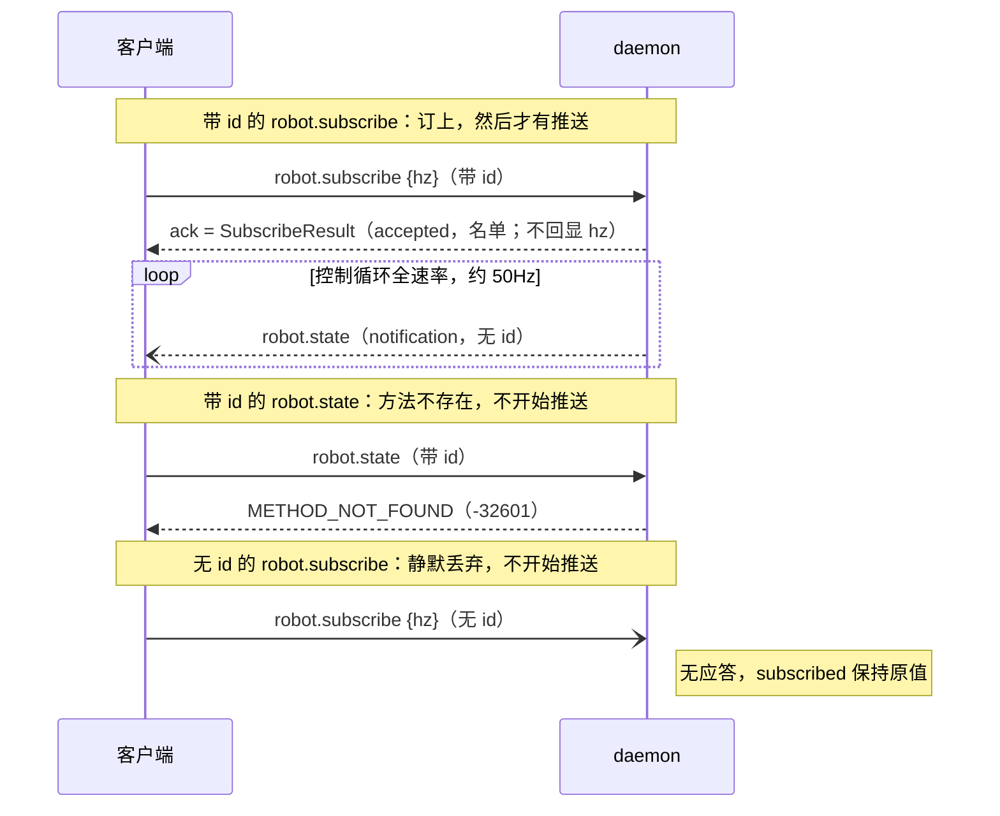

# 第 9 章 · M8 Bite 1：robot.drive → robot.move——通知式连续意图与 vy 侧向

> 本章对应里程碑 M8（收敛验收）的第一个 Bite（已验收），也是 M8 教程的第一章——按 Bite 增量写，后续 Bite 在同一目录追加。交付物：`src/lib.rs`（`Request.id` 可缺省 = notification、`MoveParams` + 8 条单测）、`src/main.rs`（删 `robot.drive`，新增 `robot.move` 通知/请求双路径，分发 match 改返回 `Option<ServerMessage>`）、`src/bin/mini-duckctl.rs`（`drive` → `move vx vy vyaw` 子命令）、`src/updater/ipc.rs` + `src/updater/gate.rs`（id 类型适配，语义不变）、`src/control.rs`（两处注释改名）、`scripts/accept-m8.sh`（新建）、`scripts/accept-m4/m5/m6.sh`（CLI 调用改名）。控制循环、调度器、Safety、仿真体一行未动。

## 1. 问题

M8 是收敛验收里程碑：M0–M7 逐里程碑推进时登记了一路偏差（D1–D41，外加 feature-inventory.md 总账里归并的 D42–D63），M8 逐项裁决。路线已定为 C 线：先对齐不依赖硬件的接口差异，再移植 BAM 执行器模型。本章是 C 线的第一刀，处理 D43 的前半——自研 `robot.drive` 对齐为原版 `robot.move`。

M6 结束时我们的驾驶入口是 `robot.drive {vx, vyaw}`，请求式：每帧带 id 发、daemon 逐帧应答。它和原版 `robot.move {vx, vy, vyaw}`（通知式）的差异不是改名那么简单，三条后果各自独立成立：

1. **照原版文档写的客户端连不上我们的机器人。** 原版协议把 `robot.move` 定义为连续意图主入口（`reference/duck-ipc-proto/src/lib.rs:596-597`），手柄 padd 以通知式 20–50Hz 发它。对我们的 daemon 发 `robot.move`，得到的是 `METHOD_NOT_FOUND`——协议面各说各话，"能跑原版客户端"这个复刻的及格线就不成立。
2. **侧向行走在协议层根本不存在。** 观测 command 块的 twist 从 M2 起就是三维 `[vx, vy, vyaw]`，velstand 训练时吃的就是三自由度速度指令（回指 Q16/Q40）；但旧 `robot.drive` 只收 `{vx, vyaw}`，写共享状态时 vy 被钉死在 `0.0`。能力一直在权重里，是协议把它锁死了——vy 这一维补的不是新功能，是解开一个已有的功能。
3. **连续意图的形态不对，而且我们的协议表达不了"对"的形态。** 原版连续意图以 notification 发送：无 id、不应答、20–50Hz 持续重发。我们的 `Request.id` 是必选的 `u64`——一个不带 id 的帧在解析阶段就会失败，`notification` 这种帧形态在我们的协议里**不存在**。手柄按原版方式以 50Hz 发通知式意图，我们的 daemon 连收都收不下。

值得先说的一句：**下游全都 ready**。twist[3] 的槽位、obs command 块、deadman[^1] 的意图年龄，从 M2/M4 起就是按三维速度设计的——所以本章是纯协议层改动：进程边界不变、模块零增删，改动全部集中在 miniduckd 的 IPC 表面和 CLI 子命令（见设计节的图）。

## 2. 背景概念

### 【背景卡片】JSON-RPC 的两种消息：request 与 notification

- **一句话**：带 `id` 字段的帧是 request（服务端必须应答，应答回显同一个 id）；不带 `id` 的是 notification（服务端照常执行，一个字节都不回）。一个字段的有无，决定这条连接上有没有回程流量。
- **为什么 50Hz 连续意图需要无应答形态**："发了就要回"对一问一答成立，对连续意图不成立——摇杆位置、目标速度是持续重发的流，每帧 20ms 后就被下一帧覆盖，对它逐帧应答是纯开销，应答内容（"收到了"）没有任何信息量；更糟的是应答会引诱调用方等它，发送节奏从"有新值就发"退化成停走协议，延迟反而变大。原版把消息家族和意图类型直接挂钩：连续意图（move/head）发 notification，离散命令（stop/enable）发 request，因为后者必须知道有没有被接受（`reference/duck-ipc-proto/src/lib.rs:586-594`）。
- **最小示例**：`examples/jsonrpc_notification.py` 单文件自包含（server 线程 + client，Unix socket + NDJSON，和 miniduckd 同构），host 直接跑 `python3 examples/jsonrpc_notification.py`。实测关键两段：

```text
2. notification：无 id，服务端静默执行
  发出: {"jsonrpc":"2.0","method":"set","params":{"value":0.7}}
  收到: （0.5s 内什么都没收到）

3. 再发一个 request 查状态——证明通知 0.7 真的落了
  发出: {"jsonrpc":"2.0","id":2,"method":"get"}
  收到: {"jsonrpc": "2.0", "id": 2, "result": 0.7}
```

"没回复"不等于"没执行"——这就是 notification 的语义，也是本 Bite 全部设计的地基。这个概念在 M8 后续 Bite（robot.head/robot.mouth 通知化、robot.subscribe）会反复用到，深读（规范两条配套细则、原版服务端实现、回本项目哪几行）见 [docs/concepts/jsonrpc-notification.md](../../concepts/jsonrpc-notification.md)。

### vy 与躯干坐标系

twist 三个分量的约定：躯干系右手坐标，**x 前、y 左、z 上**；vx/vy 是线速度 m/s，vyaw 是偏航角速度 rad/s，正为左转。vy 就是向左平移（侧向行走，前进方向不变、身体向左移）。

这条约定本身不起眼，写不写下来却是事故多发地：原版协议注释把这段话标为"承重的"（load-bearing）——原型阶段就是因为约定没写下来，每个消费方各自实测定号，最后积累出 `--laser-track-yaw-sign`、`--laser-fk-pitch-sign`、`--imu-z-rotation-deg` 等一串符号开关互相 disagree（`reference/duck-ipc-proto/src/lib.rs:2095-2106`）。所以我们的 `MoveParams` 把单位与坐标系写进 doc 注释，一个字都不省（`src/lib.rs:105-111`）。三维命令随时间积出轨迹的直观动画（M2 所做）在 `docs/concepts/assets/command-motion/index.html`。

## 3. 设计


先读第二张图（变动示意）：无新增、无删除模块，未动模块全部灰化。改动只有三处——`mini-duckctl` 子命令（`drive vx vyaw` → `move vx vy vyaw`）、miniduckd 的 RPC 层（`robot.drive` → `robot.move`，并新增 notification 帧形态）、以及 RPC→ControlState 那条边上的内容（写 `twist[3]` 含 vy）。第一张图（完整架构）和 M7 那张逐节点对照，会发现除了这些标签一切照旧——这正是本章的设计论点：**接口对齐不该惊动控制链路**。

设计按四层展开，代码领读也按这个顺序走：

1. **协议层先让"无 id"这个帧形态存在**（`src/lib.rs`）。`Request.id` 从必选 `u64` 改成 `Option<u64>`：`None` 就是 notification。连带地 `ServerMessage::Response.id` 同步可空——帧解析失败时没有 id 可回显，按规范回 `"id":null`。新参数类型 `MoveParams` 收在这一层：线形状（缺省补 0、未知字段拒绝）由 serde 属性声明，有限性检查 `finite_twist()` 兜底。
2. **方法层双路径共用一个应用函数**（`src/main.rs`）。`robot.move` 分支：解析合法就调 `apply_move_intent` 写 twist + 刷新意图时刻，然后 `req.id.map(...)` 决定回不回包——有 id 回 accepted + 三速度回显，无 id 返回 `None`（本帧无回复）。非法参数同理：有 id 回 INVALID_PARAMS，无 id 静默丢弃。framing（带不带 id）不该改变语义，所以两条路径共享同一个 apply——原版同名结构叫 `apply_intent`。
3. **应用层只记值和时间戳，无限幅**。`apply_move_intent` 不做任何范围检查——限幅是控制循环和策略的事，RPC 层的职责是"记住最新意图 + 它什么时候到的"（deadman 的依据）。原版 `set_twist` 同样只打时间戳（`reference/robotd/src/intents.rs:300-305`）。
4. **CLI 仍是请求式，验收用裸 socket 发通知**。`mini-duckctl move` 逐条带 id 调用、拿 accepted 回显打印——教学工具的简单选择；真正发 notification 的是外部客户端（验收脚本里的 python3，未来是手柄），所以验收脚本必须用裸 socket 发帧，CLI 帮不上忙。

### 决策导览

本章三张决策卡片，各在回答一个问题（完整论证在代码领读原位）：

- **连续意图用 notification 不用 request**——50Hz 意图流该不该逐帧应答（见「方法层：robot.move 双路径」）。
- **非法通知静默丢弃 vs 回错误**——通知没法回错误，那要不要为它破例（见「方法层：robot.move 双路径」）。
- **删掉 robot.drive 不留兼容别名**——老调用面怎么处理（见「CLI 与旧方法的死法」）。

读完本节，不看代码应能复述：`robot.move` 是同一份意图的两种发法——无 id 静默生效、有 id 回 accepted；协议层把"无 id"变成合法帧，应用层只写 twist[3] 和时间戳；vy 侧向随新参数形状一起进来；daemon 之外的唯一改动是 CLI 改名。

## 4. 代码领读

### 协议层：让"无 id"成为合法帧

`Request.id` 改成 `Option<u64>`（`src/lib.rs:33-44`），配 `skip_serializing_if = "Option::is_none"`——无 id 的帧序列化回去也不带 `"id"` 字段，线路格式与规范逐字节一致。`ServerMessage::Response.id` 同步可空（`src/lib.rs:56-72`）：请求本身解析失败时没有 id 可回显，按规范回 `"id":null`——顺手修掉了旧实现的假 id（旧代码解析失败回 `"id":0`，0 是个可能真实存在的 id，null 才是规范答案）。

新参数类型 `MoveParams`（`src/lib.rs:105-121`）照原版形状写（`reference/duck-ipc-proto/src/lib.rs:2108-2117`）：

- `#[serde(default, deny_unknown_fields)]`：缺省字段按 0（发 `{vx, vyaw}` 就是 vy=0 的合法指令；发空 `{}` 就是停车），未知字段拒绝（`vz: 9` 这种拼写错误在请求式路径拿 INVALID_PARAMS，通知式路径静默丢弃）。
- doc 注释承重：单位与坐标系约定一字不落写进类型注释（理由见背景概念 vy 卡片）。
- `finite_twist()`（`src/lib.rs:123-131`）：三个分量全有限才给出 `[vx, vy, vyaw]`。注意它的注释自述"线路上到不了这里"——`serde_json::Value` 装不下 inf/NaN，非有限值在解析阶段就死了，这层是深度防御（为什么仍然要留，见「常见坑」2）。

8 条新单测全在 `src/lib.rs:133-201`：参数形状四条（全字段/缺省/未知字段/错误类型）、非有限一条、JSON 溢出在解析阶段被拒一条、notification 帧形态一条、`"id":null` 响应一条。

### 方法层：robot.move 双路径

`main.rs` 抽出两个小函数（`src/main.rs:186-204`）：`parse_move` 把 `Value` 参数解析成 `[f64; 3]`（Err 的文案直接就是 INVALID_PARAMS 响应的 message），`apply_move_intent` 加锁写 `command.twist` + 刷新 `last_intent_at`。抽出来的理由只有一个：**通知路径与请求路径共用**——framing 不该改变语义，这是原版 `apply_intent` 的同款结构（`reference/robotd/src/main.rs:3747-3750` 的注释把理由写明了：规范允许两种写法，"refusing one because of a framing choice would be a surprise"）。

`robot.move` 分支（`src/main.rs:262-284`）的全部逻辑：

- 解析合法 → `apply_move_intent` 应用 → `req.id.map(|id| ...)`：有 id 回 `{accepted: true, vx, vy, vyaw}`，无 id 得 `None`。
- 解析失败 → 有 id 回 INVALID_PARAMS（-32602），无 id 得 `None`——静默丢弃。

支撑这个分支的是分发 match 的整体改造：从直接产出 `ServerMessage` 改成产出 `Option<ServerMessage>`（`src/main.rs:239`），`None` = 本帧无回复，循环末尾 `if let Some(resp)` 才 send（`src/main.rs:392-397`）。`req.id.map(...)` 就是"有没有 id"到"回不回包"的逐字翻译。

**【决策卡片】连续意图用 notification 不用 request**

- **决策点**：50Hz 持续重发的速度意图，daemon 该不该逐帧应答。
- **备选**：1. 每帧带 id、逐帧应答（请求式，M4–M7 的 robot.drive 形态）；2. notification 无应答，带 id 时也应答作为兼容（原版形态）。
- **选择**：备选 2，对齐原版。原版的论证（`reference/robotd/src/main.rs:3708-3710` 注释）：50Hz 下每帧一个应答是纯开销，而且对一个 20ms 后就被覆盖的速度"没什么可说的"。连续意图的可靠性不靠应答确认，靠重发本身——下一帧 20ms 后就到，丢一帧无感；真正需要确认的是离散命令（enable/do），它们保持请求式。
- **放弃的成本**（备选 1 的好处我们没要到）：**调用方立即知道这一帧收没收到**——丢帧可检测、daemon 死没死立判。改成通知后，"意图没生效"只能在行为上事后发现（等 deadman 500ms 清零，或订阅 obs 看 twist 变没变）——验收脚本断言 a 恰恰只能这么写：发完通知去订阅流里等 twist 出现，而不是读一个应答。
- **失效边界**：意图一旦变成低频、关键、不可重发的命令（比如急停 `robot.stop`），"发没发到"就必须可确认，通知形态立即不成立——原版自己的分界就在协议文档里：continuous → notification，discrete → request（`reference/duck-ipc-proto/src/lib.rs:586-594`）。`robot.stop` 当前是缺口 D54，将来收敛时应按请求式对齐。

**【决策卡片】非法通知静默丢弃 vs 回错误**

- **决策点**：参数非法的 notification（比如 `{vx: 0.1, vz: 9}`），daemon 要不要破例回一条错误。
- **备选**：1. 回错误帧（id 填 null，破规范的例）；2. 静默丢弃（规范 + 原版行为）。
- **选择**：备选 2。规范原话是 notification"不得应答，包括出错时"；原版的实现是 `if let Ok(call) = call` 包一层——解析或校验不过就 `continue`，什么都不发生（`reference/robotd/src/main.rs:3708-3716`）。语义上也自洽：50Hz 流里报错没有意义，发送方 20ms 后就发下一帧了，错误帧无处安放。
- **放弃的成本**（备选 1 的好处我们没要到）：**调用方能发现自己拼错了参数**。通知式路径下，发 `{vz: 9}` 的客户端看到的现象是"机器人不理我"，且没有任何线索——这是真实可踩的坑。我们的补偿是把诊断能力留在请求式路径：同样的参数带 id 发一帧，INVALID_PARAMS 的 message 原文（"robot.move wants {vx, vy, vyaw} (m/s, m/s, rad/s): unknown field `vz`…"）直接告诉你错在哪。验收断言 e1/e2 正是这一对：e1 证明请求式拿得到错误原文，e2 证明通知式静默且 twist 不被改动。
- **失效边界**：如果哪天有低频、一次性的操作被误以通知形式发出，静默丢弃就是纯坑——但那是发送方违反"需要确认的操作必须走 request"的契约，不是本决策能兜的；本决策只覆盖"连续意图流里的坏帧"这个场景。

### 应用层：只记值和时间戳，无限幅

`apply_move_intent`（`src/main.rs:200-204`）两行：写 `command.twist`、刷新 `last_intent_at = Some(Instant::now())`。没有任何限幅、没有对 Enabled 阶段的判断[^2]——RPC 层的职责是"记住最新意图 + 它什么时候到的"，怎么消费是控制循环的事：deadman 用意图年龄清零过期 twist（Safety 既有行为，本章不动），各阶段对 command 的门控在控制循环里（busy、Rising 窗口的 twist 强制全零等，M6 语义不变）。原版 `set_twist` 同样只打时间戳（`reference/robotd/src/intents.rs:300-305`）——两家的 RPC 层都不替控制循环做决定。

### CLI 与旧方法的死法

`mini-duckctl` 的子命令 `drive <vx> <vyaw>` 改成 `move <vx> <vy> <vyaw> [--secs N]`（`src/bin/mini-duckctl.rs:85-146`）。三点不变：仍走请求式（带 id 调用，打印 accepted 回显）；`--secs` 期间每 100ms 重发一次意图（deadman 500ms 下单次意图只能驱动半秒，CLI 扮演手柄——手柄就是持续发意图的，`src/bin/mini-duckctl.rs:86-90` 注释）；到时发零命令停车。

**【决策卡片】删掉 robot.drive 不留兼容别名**

- **决策点**：旧方法名怎么处理。
- **备选**：1. 保留 `robot.drive` 作为 `robot.move` 的别名（vy 补 0，老调用不破）；2. 直接删，老调用拿 METHOD_NOT_FOUND。
- **选择**：备选 2。M8 的目标是"照原版文档写的客户端能跑"，别名对这个目标零贡献——原版客户端发的本来就是 `robot.move`；它服务的只是我们**自己**仓库里的老脚本，而老脚本全在仓库内：三个验收脚本里的 `drive 0.15 0 …` → `move 0.15 0 0 …`（vy=0 保持原行为，`scripts/accept-m4/m5/m6.sh` 的 diff 就这几行）。
- **放弃的成本**（备选 1 的好处我们没要到）：**老脚本/老客户端不破**——留别名的话 accept-m4/5/6 一行都不用改，任何人的肌肉记忆也不破。要不到它的理由是：这份"不破"的代价是协议面长期背着两个名字干同一件事，与 M8 逐项对齐的目标直接冲突——别名会把 D43 变成永远收不了尾的半收敛，而本章的全部意义就是把它收掉。
- **失效边界**：如果本项目有仓库外的用户或已部署客户端，删方法就是 breaking change，需要 deprecation 周期（先双名并行、公告、再删）；教学复刻的客户端全部在仓库内，边界没到。验收断言 h 钉住现状：`robot.drive` 得到的是 METHOD_NOT_FOUND，不是静默别名。

### updater 的 id 类型适配

`Request.id` 类型变了，两个消费方跟着改，语义一行未动：`src/updater/ipc.rs` 三处签名 `u64` → `Option<u64>`（`pack`/`DeniedResponse::with_id`/`try_lock`），解析失败路径从 `ServerMessage::err(0, …)` 改成 `err(None, …)`——和 miniduckd 一样顺手修掉假 id；`src/updater/gate.rs` 健康门发请求时 `id` 包一层 `Some`。accept-m7 回归（39 PASS）证明语义不变。

### 验收脚本：为什么必须裸 socket

`scripts/accept-m8.sh` 用 FakeIo 起 daemon，全部断言在一条连接上按时间线走完，发帧用 python3 裸 socket（`scripts/accept-m8.sh:36-46`）——mini-duckctl 只会发带 id 的请求帧，**构造不出 notification**；通知语义又必须看帧间关系（"发了之后没有任何响应行"），分段重连说不清，所以全程一条连接。八项断言（a–h）与语义的对应关系见验收节。

## 5. 验收

```bash
# 容器内（miniduck-rust，工作目录 /work）
docker compose exec rust cargo test
```

实测：`test result: ok. 68 passed; 0 failed`——M7 基线 60 条 + 本章新增 8 条（全部在 `src/lib.rs`，清单见代码领读「协议层」）。

```bash
docker compose exec rust bash scripts/accept-m8.sh
```

实测八项断言全过（2026-10-05 复跑；完整输出与命令见 [acceptance.md](acceptance.md)）：

```text
a. 通知生效 twist=[0.10000000149011612, 0.20000000298023224, -0.30000001192092896]  OK
b. 通知全程无响应行  OK
c. 请求式 accepted 回显 [0.05, -0.05, 0.1]  OK
d. 缺省 vy 按 0 接受  OK
e1. 未知字段 INVALID_PARAMS  OK
e2. 非法通知静默丢弃，15 帧 twist 保持 [0.3, 0.1, -0.2]  OK
f. 1e999 → PARSE_ERROR id=null: number out of range  OK
g. 停发 0.7s 后 obs twist=[0,0,0]（deadman 生效）  OK
h. robot.drive → METHOD_NOT_FOUND  OK
```

**断言解释**（逐项：这个断言为什么证明了这个性质）

- **a + b 是一对**：a 证明"没回复 ≠ 没执行"——发完无 id 通知后从订阅流的 obs 里读到 twist 落地（obs 里 twist 是 f32 落盘，`src/obs.rs:105`，所以 0.1 读回来是 `0.10000000149011612`，容差 1e-6，偏移 `OFF_TWIST=48`，`src/obs.rs:22`）；b 证明通知全程零回程流量——这条连接上除了 `robot.state` 推送不许出现任何响应行。
- **c 证明双路径共享**：带 id 发同样合法，且应答回显三个速度——`apply_move_intent` 之后才有 accepted，应用与应答在同一分支里，不存在"回了 accepted 但没应用"的缝。
- **d 证明 `serde(default)`**：缺省 vy 按 0 接受——原版 MoveParams 的缺省语义，老发法 `{vx, vyaw}` 天然兼容。
- **e1/e2 是非法参数的两面**：e1（带 id）拿到 -32602 与错误原文；e2（无 id 同参数）先发一帧合法通知刷新意图，再发非法通知，随后 300ms（< deadman 500ms）内 15 帧推送 twist 恒为合法帧的值——非法帧既没有应答、也没有污染状态。
- **f 证明线路格式本身挡掉一类非法输入**：`1e999` 超出 f64，serde_json 在解析整个 Request 时就报 "number out of range"——daemon 回的是 PARSE_ERROR（-32700）且按规范 `"id":null`，根本轮不到 `finite_twist()` 出场（详见「常见坑」1、2）。
- **g 是 deadman 回归**：停发 0.7s 后 obs twist 归零——`last_intent_at` 的刷新路径换了名字，保鲜期语义没变。
- **h 是旧方法的死亡证明**：`robot.drive` 得到 -32601 METHOD_NOT_FOUND。

回归：`accept-m7.sh` 实测 PASS=39 FAIL=0（updater id 适配语义不变）；`accept-m4/m5/m6.sh`（MuJoCo 仿真，仅改了脚本里的 CLI 调用）实测 10 秒行走位移 0.764m / 0.848m / 0.816m，均过 0.5m 门槛，exit 0——vy=0 的新发法与旧发法行为一致。

## 6. 与原版对照与差异

**本 Bite 已对齐**（`robot.move` 全对齐，每条附原版证据）：

| 对齐项 | 原版证据 | 我们 |
|---|---|---|
| 连续意图作 notification 发送（move/head 属 continuous，stop/enable 属 discrete） | `reference/duck-ipc-proto/src/lib.rs:586-597`（"50Hz 下每帧一个应答是纯开销；重传的 80ms 前摇杆位置比没有更糟"） | `Request.id: Option<u64>` + robot.move 分支 |
| 通知无 id 不回复、非法通知静默丢弃 | `reference/robotd/src/main.rs:3708-3716` | `req.id.map(...)`（`src/main.rs:266-284`） |
| 带 id 的 robot.move 也应答（apply_intent 双路共享） | `reference/robotd/src/main.rs:3747-3754`、`:4305-4311` | `apply_move_intent` 双路共用 |
| MoveParams 形状 `default + deny_unknown_fields` | `reference/duck-ipc-proto/src/lib.rs:2108-2117` | `src/lib.rs:112-121` |
| 单位/坐标系注释承重（约定不写下来，消费方各自定号互相 disagree） | `reference/duck-ipc-proto/src/lib.rs:2095-2106` | `src/lib.rs:105-111` doc 注释 |
| set_twist 无限幅只打时间戳 | `reference/robotd/src/intents.rs:300-305` | `src/main.rs:200-204` |

**残余差异**（D43 更新为部分收敛，已登记 `docs/deviations.md`）：

- **D43 残余**：`robot.head` / `robot.mouth` 的通知语义未开——它们目前仍是纯请求式方法（M6 交付形态），原版两者同属 continuous、应以通知发送。预定 M8 后续 Bite 收敛。
- **通知语义只对 robot.move 开放**：原版对**任何**方法的 notification 都走 `apply_intent` 统一入口——非意图方法返回 false 就 `continue`，静默无事发生；我们只给 `robot.move` 开了通知语义，其他方法无 id 发来时会回一条 `"id":null` 的响应。预定后续 Bite 随 `enable {on, toggle}` / `robot.subscribe` 一起收敛。
- **mini-duckctl 的 `move` 仍是请求式逐条调用**：教学工具的简单选择（要打印 accepted 回显）；原版机器人上的连续意图由手柄 padd 以通知式 20–50Hz 发送。daemon 侧两种形态都收，这条偏差不影响协议对齐。

原版 `robot.enable {on, toggle}` 的形状差异（D44）与本 Bite 无关，预定下一 Bite，此处不展开。

## 7. 常见坑与展望

1. **`json.dumps(1e999)` 印出来的是裸 `Infinity`，不是 JSON**（本章验收真实踩过）。断言 f 第一版用 python 的 `json.dumps` 生成帧——`1e999` 在 python 里是 `float('inf')`，`json.dumps` 默认把它印成裸 `Infinity` 三个字符，那是**非法 JSON 词法**。daemon 回的是词法错误，断言却"过了"——假阳性，测的根本不是数值溢出。修法：脚本里手写帧字面量 `"vx":1e999`（`scripts/accept-m8.sh:153-161`），这才是合法 JSON 词法、合法 JSON 但超出 f64 的值，才真正测到 serde_json 的 "number out of range"。教训：测解析层行为时，生成测试帧的库自己可能就是干扰源。
2. **`is_finite` 检查在线上不可达，但删不得**。`serde_json::Value` 装不下 inf/NaN——`1e999` 在解析阶段就死了，所以 `finite_twist()` 的拒绝路径在线上永远不会触发。这是"线路格式本身挡掉了一类非法输入"的好例子，但兜底仍要留：协议层类型（`MoveParams`）不只服务线路一条路径，任何进程内构造都可能喂进非有限值。单测 `move_params_non_finite_rejected` 直接构造 NaN/±inf 验证这道门（`src/lib.rs:167-175`），绕开线路测兜底——**不可达的防御也要有测试，测试可以不走路径**。
3. **CLI 发不了无 id 通知，验收脚本得用 python3 裸 socket**。notification 语义的断言（"发了之后没有任何响应行"）只能由一个能发出无 id 帧的客户端来写；mini-duckctl 的所有调用都带 id。这是工具能力的边界，不是 bug——但写验收时容易习惯性 `mini-duckctl move …` 然后发现断言 b 根本无从写起。accept-m5 的 python 助手同款做法，本项目验收脚本里裸 socket 发帧已是惯例。

**展望**：M8 剩余路线两条。C1 接口对齐的后续 Bite：`robot.enable {on, toggle}`（D44，手柄 Start 语义）、`robot.subscribe` 入口（D45，含 hz 降频与 ack）、updater 的 `robot.safeToRestart` 预检（D47）；head/mouth 通知语义（D43 残余）随它们一起收尾。C2 移植 BAM 执行器模型进 `sim/duck_body.py`（D21），让 sit / roulade 在仿真里物理通过（D34/D35 的降级验收届时复原为物理断言）——先做 kp=0.55 一行实验验证归因，再动手移植。

[^1]: deadman：客户端失联保险——最近一次驾驶意图超过 500ms 没刷新，Safety 自动把 twist 清零（M5 交付）。机器人没人"握杆"就停车。
[^2]: robot.drive 时代同样不判——旧代码也是直接写 twist；门控一直在控制循环侧。

---

# 第 10 章 · M8 Bite 2：robot.enable {on, toggle}、通知统一入口与 disable 语义对齐

> 本章是 M8 的第二个 Bite（已验收），同一目录增量追加，Bite 1 的部分原样保留。交付物：`src/lib.rs`（`EnableParams` + `parse_enable` + 6 条单测）、`src/main.rs`（notification 统一入口提前拦截无 id 帧、`robot.enable` 带 id 分支按原版重写、`robot.disable` 分支删除、`parse_mouth`/`parse_head` 与 `apply_mouth_intent`/`apply_head_intent` 抽取共用）、`src/control.rs`（状态机改造：`Phase::Stopped` 取代 `RampDown`，`edge_transition()`/`ramp_done_phase()` 纯函数 + 6 条单测，模块头 ASCII 状态图重写）、`src/scheduler.rs`（`Scheduler::reset()` 清全部 LSTM 槽 + 单测）、`src/bin/mini-duckctl.rs`（`enable [on|off]`，`disable` 子命令删除）、`scripts/accept-m5.sh`（A1c 重写）、`scripts/accept-m8.sh`（追加断言 i–p + n2 + o2）。进程边界与模块零增删。

## 1. 问题

本 Bite 一次收敛三条，前两条是登记在册的，第三条是复核时新发现的：

1. **D44：开关形状不对。** 我们的使能面是 `robot.enable` / `robot.disable` 两个无参方法；原版只有一个 `robot.enable {on, toggle}`（`reference/duck-ipc-proto/src/lib.rs:2685-2704`）。缺的不是一个参数而是一种语义：`toggle` 是手柄 Start 键——按一下翻到"另一个状态"，客户端不需要知道当前是哪边。多出来的 `robot.disable` 则是协议面上一个原版不存在的方法，"照原版文档写的客户端能跑"的及格线它帮不上忙，反而把开关拆成了两个入口。
2. **D43 残余：通知语义只开了一半。** Bite 1 只给 `robot.move` 开了通知语义；其他方法的无 id 帧会收到一条 `"id":null` 的响应——这既违反 JSON-RPC 规范（notification 不应答没有例外），也和原版不符：原版对**任何**方法的 notification 都走统一入口，意图方法静默应用、其余静默丢弃（`reference/robotd/src/main.rs:3554-3562`）。head/mouth 同属连续意图（`reference/duck-ipc-proto/src/lib.rs:520-548`），它们的通知语义被这个半拉子入口挡着。
3. **D64（新登记）：disable 的行为不对，而且错得有点根本。** 复核 enable 语义时发现：我们的 disable 走 `RampDown` 阶段——2 秒斜坡[^3]回 home，然后**卸 torque**。原版的 disable 三件事都不这么做：不卸 torque、无斜坡、不当拍移动机器人以外的任何动作——策略停开，**当拍直接把 home 写进目标寄存器，舵机按自己的速度走过去，然后保持上电抱持 home**（`reference/robotd/src/main.rs:2786-2798`，注释原文 "Commanded directly, no ramp: the servos do the travel at their own speed"）。卸 torque 是 `robot.relax` 的活：enable 管策略、init/relax 管电源，两对开关各管各的（`reference/duck-ipc-proto/src/lib.rs:542-551`）。用户裁决：这条差异不挂账，本 Bite 立即对齐。

三条指向同一个设计动作：开关的语义归位——**daemon 持有开关信念、framing 不改变语义、enable 只管策略**。

## 2. 背景概念

notification 与 request 的区分（带不带 id 决定回不回程流量）在 Bite 1 已讲过，深读见 [docs/concepts/jsonrpc-notification.md](../../concepts/jsonrpc-notification.md)，本章不重复。新增两张小卡片：

### 【背景卡片】Stopped 阶段：停着，但醒着

Stopped 是本 Bite 新加的控制循环阶段，大白话讲就是"**机器人站在标准站姿上，电机通着电，但策略不跑**"。它和已有的 Held 阶段是两种"抱持"：

- **Held**：进程刚启动的样子。舵机**没上电**，循环抱着"启动那一刻读到的姿态"不放——机器人是什么姿势被捡起来的，就软软地保持什么姿势。它是上电前的等待室，也是未来 `robot.relax`（松手断电）的落点。
- **Stopped**：disable 之后的样子。舵机**保持上电**，目标钉死在 home（标准站姿），机器人直挺挺站着，只是"脑子"（策略）不在转。因为已经站在 home 上且通着电，再 enable 时**不需要斜坡、直接回 Driving**——原版一行写死这个性质：driving = enabled 且 bring-up 状态为 Ready（`reference/robotd/src/main.rs:2124`）。

一句话区分：Held 是"没通电的抱持"，Stopped 是"上了电的抱持"。

### 【背景卡片】两对开关，别拧在一起

机器人上有两组语义完全不同的"开/关"，原版的协议设计把它们分得很干净：

- **策略开关**：`robot.enable`——策略这个"脑子"转不转。关（disable）的意思是"别自己动了，回 home 站好"，**不是断电**。
- **电源开关**：`robot.init` / `robot.relax`——电机通不通电。relax 才是"松手"：卸 torque，舵机不再出力，人可以上手掰。

原版协议注释把分工写明了："stand up" 和 "let go" 是各自的决策，值得各自的名字（`reference/duck-ipc-proto/src/lib.rs:542-551`）。我们此前的 RampDown 把两对开关拧在了一起——disable 顺手把电也卸了——这正是 D64 登记的那条偏差。注意 `robot.relax` 我们**还没实现**（缺口，不在本 Bite 范围），这个现状会影响决策卡片③的成本账。

## 3. 设计


两张图已更新到 Bite 2 之后的当前状态。先读第二张：依然无新增、无删除模块，未动模块全部灰化——但这次的改动有两个钻进了**模块内部**：`main.rs` 的 RPC 分发结构（notification 统一入口提前拦截无 id 帧；对外方法面 `robot.enable` 参数形状变、`robot.disable` 消失）和 `control.rs` 的状态机（五阶段里 `RampDown` 退役、`Stopped` 上岗）。arch 图里控制循环节点画的阶段机因此必须改：旧图上的 `→ RampDown` 换成了 `→ Stopped（上电抱持 home）→ enable 直接回 Driving`。

设计按五层展开，代码领读也按这个顺序走：

1. **协议层收 `EnableParams`**（`src/lib.rs`）。`{on: bool, toggle: 缺省 false}`，`deny_unknown_fields`；`on` **没有** serde default——`toggle` 不免除 `on`，手柄 Start 就是两个字段一起发的（原版同，`reference/duck-ipc-proto/src/lib.rs:2685-2704`）。
2. **notification 统一入口提前拦截**（`src/main.rs` serve 循环）。帧解析出来、确认无 id，就进统一入口：三个连续意图（move/head/mouth）解析合法就静默应用，非法静默丢弃；其他任何方法的无 id 帧静默丢弃。带 id 的帧才进分发 match——**每个分支都必须给出应答**这件事重新变得可枚举。head/mouth 由此获得通知语义。
3. **robot.enable 带 id 分支按原版重写**（`src/main.rs`）。toggle 为真时 daemon 侧翻转（`on` 被忽略）；永不拒绝；应答 `{accepted: true, reason}`，reason 文案逐字对齐原版。`robot.disable` 分支删除——原版没有这个方法（用户裁决：CLI 的 `disable` 子命令也一并删除，不留别名），老调用拿 METHOD_NOT_FOUND。
4. **状态机：Stopped 取代 RampDown**（`src/control.rs`）。转移规则抽成两个纯函数：`edge_transition()`（enabled 边沿只在 Held/Stopped/Driving 三个相位上立即动作）和 `ramp_done_phase()`（斜坡完成按 enabled 现值落 Driving 或 Stopped）。Driving 中 disable：当拍 policy reset + 切 Stopped，Stopped 臂当拍把 home 写出去，torque 保持 on。Stopped 中再 enable：直接回 Driving，无斜坡。
5. **disable 结束 recurrent episode**（`src/scheduler.rs` + `src/control.rs` 边沿处理）。`Scheduler::reset()` 清全部已加载槽的 LSTM 状态，低通锚点与 `last_action` 一并丢弃——Stopped→Driving 无斜坡，带着旧锚点回来就是一次踉跄。原版同一边沿调 `controller.reset()`（`reference/robotd/src/main.rs:2791-2793`）。

### 决策导览

本章三张决策卡片（完整论证在代码领读原位）：

- **toggle 由 daemon 侧翻转**——开关信念归谁持有（见「robot.enable 分支」）。
- **notification 统一静默入口，framing 不改变语义**——无 id 帧要不要按方法一一刀割（见「notification 统一入口」）。
- **disable 不卸 torque、直接回 home**——RampDown 斜坡 + 卸 torque 留不留（见「状态机改造」）。

读完本节，不看代码应能复述：`robot.enable {on, toggle}` 是唯一开关入口，toggle 由 daemon 翻转、永不拒绝；任何方法的无 id 帧都不应答，意图静默应用、其余静默丢弃；disable 不卸 torque 不斜坡，当拍写 home、上电抱持，再 enable 直接回 Driving；`robot.disable` 方法与 CLI 子命令一起消失。

## 4. 代码领读

### 协议层：EnableParams

`EnableParams`（`src/lib.rs:140-146`）照原版形状写（`reference/duck-ipc-proto/src/lib.rs:2685-2704`）：`#[serde(deny_unknown_fields)]`，`on: bool` 必填，`toggle` 带 `#[serde(default)]` 缺省 false。doc 注释承重：toggle 是手柄 Start 语义、daemon 侧翻转、客户端信念会漂移——理由不写下来，下个读者看到"toggle 时 on 被忽略"会以为是 bug。`parse_enable`（`src/lib.rs:150-153`）仿 `parse_move` 风格，Err 文案即 INVALID_PARAMS 响应的 message；bool 没有有限值问题，比 move 少一道兜底门。

6 条新单测在 `src/lib.rs:226-259`：on=true / toggle 缺省 false / on+toggle 同帧合法 / 单发 toggle 被拒（on 无 default）/ 未知字段被拒 / 缺 on 与 Null 被拒。

### notification 统一入口

serve 循环里，帧解析成功后、分发 match 之前，先查 id（`src/main.rs:282-302`）：

```rust
if req.id.is_none() {
    match req.method.as_str() {
        "robot.move" => { if let Ok(twist) = parse_move(&req.params) { ... } }
        "robot.mouth" => { ... }
        "robot.head" => { ... }
        _ => {} // 非意图方法的 notification：静默丢弃
    }
    continue;
}
```

三个细节：

- **整帧 JSON 解析失败仍回 PARSE_ERROR**（`src/main.rs:264-273`）——那一刻还不知道它是不是 notification，按规范回 `"id":null` 的错误帧。统一入口只拦"解析成功的无 id 帧"。
- **framing 不改变语义**：head/mouth 的 parse 与 apply 抽成了和 move 同款的两对小函数（`parse_mouth` `src/main.rs:213-219`、`apply_mouth_intent` `:222-224`、`parse_head` `:227-238`、`apply_head_intent` `:241-243`），通知路径与带 id 请求路径（`src/main.rs:421-436`）共用——带不带 id 只决定回不回包，应用的是同一个函数。
- 带 id 分支里 move/head/mouth 的注释都补了"无 id 通知走上面统一入口"的指路牌，防止下个读者以为漏了通知路径。

原版同款结构在 `reference/robotd/src/main.rs:3554-3562`：无 id 帧 `apply_intent(...)` 后 `continue`，`apply_intent` 对非意图方法返回 false，什么都不发生。我们把它翻译成了一张字面分发表——三种意图列出来，其余 `_ => {}`，行为等价且更一目了然（我们的方法面小，列得起）。

**【决策卡片】notification 统一静默入口，framing 不改变语义**

- **决策点**：无 id 帧的处理，是按方法逐个开通知语义，还是一刀切"无 id 即不应答"。
- **备选**：1. 只给 `robot.move` 开通知语义，其他方法的无 id 帧回一条 `"id":null` 响应（Bite 1 的落点）；2. 任何方法的无 id 帧都不应答——意图方法静默应用、非意图静默丢弃（原版形态）。
- **选择**：备选 2，对齐原版。规范原话是 notification 不应答，没有例外；原版实现是无 id 帧统一走 `apply_intent` 入口（`reference/robotd/src/main.rs:3554-3562`）。更实质的推动力是 head/mouth：它们同属连续意图（`reference/duck-ipc-proto/src/lib.rs:520-548`），手柄以 20–50Hz 发头姿，备选 1 下这个形态永远开不了。
- **放弃的成本**（备选 1 的好处我们没要到）：**调用方能立刻察觉"这个方法不吃通知"**——一条 `"id":null` 响应是即时的负反馈，调试时比"机器人不理我"好定位；而且备选 1 已经在 Bite 1 落地，选它本 Bite 这节代码一行都不用改。要不到它的理由：这条负反馈本身是违规帧，且机器人上没有任何客户端靠它做决策——它只是一条没人等的噪音；为这点调试便利长期背着规范偏差和 D43 残余，不划算。诊断能力没有丢：同样的参数带 id 发一帧，该拿的错误原文一条不少（Bite 1 决策卡片「非法通知静默丢弃 vs 回错误」的补偿机制，对 head/mouth 同样成立）。
- **失效边界**：统一入口假设"连续意图就这三种"——未来新增连续意图方法（比如原版的 `robot.pose`），要在这里加一行；漏加的症状是静默丢弃，和"方法不存在"无法区分。这是字面分发表换一目了然付的税。

### robot.enable 分支：toggle daemon 侧翻转，永不拒绝

带 id 的 `robot.enable` 分支（`src/main.rs:319-340`）全部逻辑：

- `parse_enable` 失败 → INVALID_PARAMS（这是唯一会"拒"的情形——参数形状错，不是状态错）。
- 解析成功 → 加锁写 `ctl.enabled`：`p.toggle` 为真就翻转现值（`on` 被忽略），否则写 `p.on`。
- 应答 `{accepted: true, reason}`，reason 按写完后的现值二选一，文案逐字对齐原版：`"enabled — driving"` / `"disabled — returning to the home pose"`（`reference/robotd/src/main.rs:4500-4510`）。

**永不拒绝**是刻意的：躺在地上的机器人按 Start，正是人在叫它站起来——原版注释原话（`reference/robotd/src/main.rs:4491-4493`）。注意这个分支**只写开关位**：边沿检测、斜坡、policy reset 全在控制循环里做（见「状态机改造」），RPC 层不替控制循环做决定——和 Bite 1 应用层"只记值和时间戳"是同一条分工。enable 也不管电源：原版注释写明这里没有 init，从 Limp 起来的 bring-up 自然会上电（`reference/robotd/src/main.rs:4496-4499`）。

**【决策卡片】toggle 由 daemon 侧翻转**

- **决策点**：手柄 Start 的"翻到另一个状态"，谁来翻。
- **备选**：1. 客户端持有开关信念（客户端记"我认为现在是开"，Start 时计算反值发 `on`）；2. daemon 侧翻转——`toggle: true` 时 daemon 读自己的现值取反（原版）。
- **选择**：备选 2，对齐原版（`reference/robotd/src/main.rs:4490` 注释把理由写死了）：客户端的信念会漂移——对端重启、`robot.relax`、关机序列，任何一条都会让"我以为"和"实际是"脱节；信念一旧，Start 就变成隔次失灵的按钮。开关归属 robot，按一下永远是"另一个状态"。
- **放弃的成本**（备选 1 的好处我们没要到）：**客户端自治**——客户端不看任何状态就能决定发什么，协议面也少了 `toggle` 一个字段（只有 `on`，daemon 实现更薄）。要不到它的理由：这份自治是假象——客户端信念的正确性依赖它对 daemon 全生命周期的跟踪，而它恰恰跟踪不了（重启和 relax 都发生在它视野外）；省下的一个协议字段，换来的是"按钮隔次失灵"这种最难向用户解释的故障形态。
- **用户裁决**：`robot.disable` 方法删除的同时，**CLI 的 `disable` 子命令一并删除，不留别名**——关就是 `mini-duckctl enable off`（`src/bin/mini-duckctl.rs:42-55` 注释）。验收断言 p2 钉住：`robot.disable` 得到 METHOD_NOT_FOUND。
- **失效边界**：toggle 语义成立的前提是"开关只有两态"。如果未来 enable 面长出第三态（比如半使能/演示模式），"翻到另一个状态"不再有定义，toggle 要重新设计——原版协议里 enable 就是布尔，边界一致。

### 状态机改造：Stopped 取代 RampDown

模块头文档的 ASCII 状态图整段重写（`src/control.rs:1-29`），新图长这样：

```text
Held ──enable {on:true}──▶ RampUp(100拍) ──▶ Driving ◀──▶ Limp（跌倒⇄恢复）
（启动抱持，torque off）          │              │
                                  ▼              ▼ enable {on:false}
                                Stopped ◀────────┘ 当拍直接命令回 home（无斜坡），
                             （上电抱持 home）       policy reset，torque 保持 on
                                  │
                                  └──enable {on:true}──▶ 直接回 Driving（无斜坡）
```

`Phase` 枚举（`src/control.rs:265-281`）五个变体：`Held` / `RampUp` / `Driving` / `Limp` / `Stopped`，`Stopped` 的 doc 注释写明它的全部性质——上电抱持 home、嘴跟随 home、head/body 命令无效、再 enable 直接回 Driving。转移规则抽成两个纯函数：

- `edge_transition()`（`src/control.rs:307-319`）：enabled 边沿 → 相位动作。只有三条规则立即动作——`Held + enable（有策略）` → `PowerOnAndRamp`；`Stopped + enable` → `ResumeDriving`；`Driving + disable` → `StopToHome`。其余（非边沿、RampUp/Limp 中的边沿）返回 `None`。每条规则的依据逐条引原版证据写在 `EdgeAction` 的 doc 注释里（`src/control.rs:283-303`）：bring-up 只从 torque-off 态触发（`reference/robotd/src/main.rs:2560-2566`）、Stopped 再 enable 无斜坡无死窗（`:2124`）、Driving 中 disable 当拍直接命令回 home 不卸 torque（`:2786-2798`）。
- `ramp_done_phase()`（`src/control.rs:322-328`）：斜坡完成的落点看 enabled **现值**——enable 着进 Driving，否则进 Stopped。这一条让"RampUp/Limp 途中的 enable 边沿"自然汇入：边沿在途中不立即动作，但斜坡终点就是 home，完成时按现值落点，边沿因此不会丢。

主循环里 `StopToHome` 的处理（`src/control.rs:447-457`）：`scheduler.reset()`（清 LSTM 槽）+ 低通锚点与 `last_action` 清零 + 切 `Phase::Stopped`；`Stopped` 臂每拍把 `DEFAULT_POSITION` 原样写出，gain 维持 running 档 200（`src/control.rs:530-537`）。整个文件没有任何 `set_torque(false)` 路径——卸 torque 是 relax 的活，Held 是它未来的落点（`src/control.rs:19-21`）。

顺带修掉一个自家 bug：旧机的 `RampDown` 途中再 enable，边沿不被任何规则接住，斜坡走完落进 `Held`（torque 已卸），机器人从此抱着启动姿态不动——**卡死，只能重启**。新机下边沿只动 Held/Stopped/Driving，途中边沿由斜坡完成规则按现值汇入，这个卡死路径在结构上不存在了。

6 条新单测全打在这两个纯函数上（`src/control.rs:723-776`）：Driving 中 disable → StopToHome；Stopped 中 enable → ResumeDriving；Held 中 enable 有策略才 PowerOnAndRamp（D19：没策略留在 Held）；RampUp/Limp 中的边沿返回 None（延后而非丢弃）；非边沿与其他相位组合什么都不做；斜坡完成按 enabled 现值落点。

**【决策卡片】disable 不卸 torque、直接回 home**

- **决策点**：disable 时机器人怎么回到 home，以及回完之后电机什么状态。
- **备选**：1. 保留 `RampDown`——2 秒斜坡插值回 home，然后 `set_torque(false)` 卸力（M5–M7 的形态）；2. 当拍直接把 home 写进目标寄存器，舵机按自己的速度走过去，保持上电抱持（原版 Stopped 形态）。
- **选择**：备选 2，对齐原版（`reference/robotd/src/main.rs:2786-2798`）。依据是两对开关的分工：enable 管策略、init/relax 管电源（`reference/duck-ipc-proto/src/lib.rs:542-551`）——disable 顺手卸 torque 是把电源开关偷渡进了策略开关。无斜坡的理由原版注释也写了：舵机自己走得很好，而且下次 Start 把机器人交给策略时它已经站在 home（`reference/duck-ipc-proto/src/lib.rs:2698-2701`）。
- **放弃的成本**（备选 1 的好处我们没要到）：两条。(a) **卸 torque 的即时收益**——省电、舵机不持续发热、人可以随时上手把机器人掰成任意姿势（"松手"的安全感）；选备选 2 后机器人 disable 了也一直硬挺挺站着，而 `robot.relax` 我们还没实现——**卸 torque 在 relax 落地前失去了出口**，用户当前没有任何方法让机器人松手，这是本次对齐真实付出去的代价，已随 D64 登记在案。(b) **回 home 过程的柔和可控**——斜坡是目标沿直线逐拍爬过去，速度由我们掌控；直接命令则是舵机按自己的速度走，动作更"楞"，从深坐姿之类的大偏差姿态回 home 时不如斜坡温柔。要不到它们的理由：(a) 的好处本来就是 relax 的语义，寄生在 disable 上正是要收敛的偏差本身；(b) 在 FakeIo/sim 上差异不可观测，真机上原版的实践就是直接命令。
- **用户裁决**：这条 disable 语义差异是复核中新发现的（此前未登记），裁决为**本 Bite 立即对齐，不挂账**——登记为 D64，随本 Bite 收敛。
- **失效边界**：如果真机上出现"舵机直接回 home 会磕碰"的姿态（比如趴地时手臂折叠），直接命令可能不如斜坡安全——原版的答案是 bring-up 路径（从 Limp 起来仍走斜坡，`reference/robotd/src/main.rs:4496-4499`），而不是给 disable 加回斜坡；我们的 RampUp 同理保留。

### Scheduler::reset：disable 结束 recurrent episode

`Scheduler::reset()`（`src/scheduler.rs:398-413`）清空**所有已加载槽**的 LSTM 状态——walk、sitstand、ground_pick、每个技能槽，不只是当前活跃网：disable 结束的是整个 recurrent episode（原版同一边沿的 `controller.reset()`，`reference/robotd/src/main.rs:2791-2793`）。Cascade 的窗口计时与坐姿锁存**不动**——doc 注释写明它们不是 episode 记忆，且非 Driving 阶段不推进（`src/scheduler.rs:400-401`）【合理推断：原版 `controller.reset()` 是否连带清坐姿锁存，我们没有逐行确证，这条是按"锁存不属于 episode 记忆"的语义判断落的，已在 D64 残余存疑里登记】。

单测 `reset_clears_every_loaded_slot`（`src/scheduler.rs:488-523`）用 `reset_calls` 计数器断言每个槽都多了一次 reset——注意断言用的是**增量**而不是绝对值，原因见「常见坑」2。

### CLI 与验收脚本

`mini-duckctl` 的子命令 `enable` / `disable` 合并为 `enable [on|off]`（缺省 on，`src/bin/mini-duckctl.rs:42-55`）：CLI 每次只发**表决结果**（`robot.enable {on}`），不发 toggle——开关信念归 daemon 持有，toggle 是手柄 Start 的事，CLI 没有"翻一下"的需求。

`scripts/accept-m5.sh` 的 A1c 整段重写（`scripts/accept-m5.sh:99-116`）：旧版断言"disable 后 2 秒斜坡 + torque=false"，新版断言原版语义——`enable off` 后 positions **精确等于** home（|positions−home|max，阈值 1e-6）、enabled=false、**torque=true**（注释写明：那是 relax 的活）。`scripts/accept-m8.sh` 追加断言 i–p + n2 + o2（逐项见验收节）。

## 5. 验收

```bash
# 容器内（miniduck-rust，工作目录 /work）
docker compose exec rust cargo test
```

实测：`test result: ok. 81 passed; 0 failed`——Bite 1 的 68 条 + 本 Bite 新增 13 条（`src/lib.rs` 6 条 enable 参数形状、`src/control.rs` 6 条状态机转移规则、`src/scheduler.rs` 1 条 reset 覆盖全槽）。

```bash
docker compose exec rust bash scripts/accept-m8.sh
```

实测断言 a–p + n2 + o2 全过（2026-10-06 主 agent 复跑；完整输出与命令见 [acceptance.md](acceptance.md)）。Bite 2 新增部分的关键实测行：

```text
i. enable on → 'enabled — driving'，推送 enabled=true  OK
j. 无 id robot.head 静默生效 obs[51:55]=[0.1, -0.1, 0.2, 0.05]，全程无响应行  OK
k. 无 id robot.mouth 静默生效 positions[9]=0.524rad（目标 0.524）  OK
l. 无 id robot.health 静默，25 帧内只有 robot.state 推送  OK
m. 带 id head/mouth 请求式回显不变（mouth 回显 0.5）  OK
n. toggle 翻转 开→关 → 'disabled — returning to the home pose'，推送 enabled=false  OK
n2. disable 后 positions 逐位等于 home，26 帧 torque 全为 true  OK
o. on+toggle 同帧 toggle 优先 关→开 → 'enabled — driving'  OK
o2. 1s 内 skill=walk——从 Stopped 直接回 Driving，无 2 秒斜坡  OK
p1. enable 未知字段 INVALID_PARAMS  OK
p2. robot.disable → METHOD_NOT_FOUND  OK
```

**断言解释**（逐项：这个断言为什么证明了这个性质）

- **i 证明 enable 的请求语义**：accepted + reason 文案逐字对齐 + 推送 `enabled=true`——RPC 层只写开关位，推送里的 enabled 是控制循环快照透传（`src/control.rs:587-596`）。
- **j / k 证明 head/mouth 获得通知语义**：j 发无 id `robot.head` 后从推送的 obs 里读到 head 块（偏移 `OFF_HEAD=51`）变成目标值，全程零响应行；k 发无 id `robot.mouth {position:1.0}` 后 positions[9]（`MOUTH_INDEX=9`）走到 0.524rad（0..1 → −5°..+30° 的上限）——"没回复 ≠ 没执行"在两个新方法上复现。
- **l 证明非意图方法的通知被静默丢弃**：无 id `robot.health` 发出后 0.5s 内 25 帧全部是 `robot.state` 推送，没有任何响应行——统一入口的 `_ => {}` 臂。
- **m 证明请求式路径不变**：带 id 的 head/mouth 照旧回显——framing 不改变语义，两条路径共享同一对 parse/apply。
- **n / n2 是一对，钉住 D64 的对齐**：n 发 `{on:false, toggle:true}`（当前为开）→ 翻转为关，reason 逐字 `"disabled — returning to the home pose"`；n2 随后断言 positions 逐位等于 home（阈值 1e-9——FakeIo 是精确回写，见「常见坑」3）且 26 帧 torque **全为 true**——不卸 torque、上电抱持，一次断言同时证伪旧 RampDown 的两个特征（斜坡期 positions 不可能逐位等于 home；旧机此时 torque 已 false）。
- **o / o2 是一对，钉住 toggle 优先与 Stopped 直回**：o 发 `{on:true, toggle:true}`（当前为关）→ toggle 优先忽略 on，翻回开；o2 给 1 秒预算等到推送 `skill=walk`——旧斜坡要 2 秒，1 秒内进 Driving 只可能是 Stopped 直回（`edge_transition` 的 ResumeDriving 臂）。
- **p1 / p2 是协议面的两道门**：p1 未知字段 INVALID_PARAMS（`deny_unknown_fields`）；p2 是旧方法的死亡证明——`robot.disable` 得到 METHOD_NOT_FOUND，不是静默别名。

**可观测量选择的一处讲究**：等"进入 Driving"不能用 `gain==200` 判——RampUp 和 Stopped 同样用 running 档增益 200（`src/control.rs:518-537`），判了会假阳性；脚本改用推送的 `skill` 字段（只有 `driving_tick` 跑起来推送里才有 `"walk"`，`scripts/accept-m8.sh:219-223` 注释）。

**回归**（全部 2026-10-06 复跑）：

- `accept-m5.sh` 全过：A1c 实测 `|positions-home|max=0.00e+00`，enabled=false，torque=true——Stopped 上电抱持 home 的端到端证据。
- `accept-m4.sh` PASS（10 秒行走位移 0.764m，过 0.5m 门槛）、`accept-m6.sh` 全过——控制链路行为不变。
- `accept-m7.sh` 本机 D1/E1 两处时序断言 flake（预先存在，新机器更快、Busy 窗口抓空），与本 Bite 无关——见「常见坑」4。

## 6. 与原版对照与差异

**本 Bite 已对齐**（每条附原版证据）：

| 对齐项 | 原版证据 | 我们 |
|---|---|---|
| `robot.enable {on, toggle}` 参数形状（deny_unknown_fields、toggle 缺省 false、on 无 default） | `reference/duck-ipc-proto/src/lib.rs:2685-2704` | `src/lib.rs:133-153` |
| toggle 由 daemon 侧翻转（on 被忽略）；客户端不持有开关信念 | `reference/robotd/src/main.rs:4490` | `src/main.rs:325-331` |
| enable 永不拒绝；reason 文案逐字对齐 | `reference/robotd/src/main.rs:4491-4493`、`:4500-4510` | `src/main.rs:332-337` |
| 任何方法的无 id 帧都不应答：意图静默应用、非意图静默丢弃 | `reference/robotd/src/main.rs:3554-3562` | `src/main.rs:282-302` |
| 带 id 的意图方法也应答（framing 不改变语义） | `reference/robotd/src/main.rs:4151-4157` | parse/apply 双路共用（`src/main.rs:344-358`、`:421-436`） |
| disable：policy reset + 当拍直接命令回 home，无斜坡、不卸 torque | `reference/robotd/src/main.rs:2786-2798` | `src/control.rs:447-457`、`:530-537` |
| disable 结束 recurrent episode（controller.reset） | `reference/robotd/src/main.rs:2791-2793` | `Scheduler::reset()`（`src/scheduler.rs:398-413`） |
| enable 不管电源（bring-up 只从 torque-off 态触发）；两对开关分工 | `reference/robotd/src/main.rs:4496-4499`、`:2560-2566`；`reference/duck-ipc-proto/src/lib.rs:542-551` | 无 `set_torque(false)` 路径（`src/control.rs:19-21`）；`edge_transition`（`src/control.rs:307-319`） |
| Stopped 再 enable 直接回 Driving，无斜坡（driving = enabled && Ready） | `reference/robotd/src/main.rs:2124` | `EdgeAction::ResumeDriving`（`src/control.rs:315`） |

**偏差簿变动**（已更新 `docs/deviations.md` 与 `docs/feature-inventory.md`）：

- **D44 收敛**：`robot.enable {on, toggle}` 全对齐；`robot.disable` 方法与 CLI 子命令一并删除（用户裁决，不留别名）。
- **D64 新登记并即收敛**：disable 语义（旧 RampDown = 2s 斜坡 + 卸 torque vs 原版直接命令回 home + 上电抱持）。复核中发现、用户裁决本 Bite 立即对齐不挂账。**残余存疑**：`Scheduler::reset()` 是否应连带清 Cascade 的坐姿锁存——我们按"锁存不是 episode 记忆"判断不动它，但无原版逐行确证【合理推断】，已随 D64 登记。
- **D43 残余①②收敛**：head/mouth 通知语义已开、非意图方法的通知统一静默。D43 仅剩**残余③**：`mini-duckctl move` 仍是请求式逐条调用——教学工具定位保留（要打印 accepted 回显；daemon 侧两种形态都收，原版由手柄 padd 以通知式 20–50Hz 发送）。

**残余差异**（新明确的一条，随 D43/D64 联动记录）：

- **请求式意图方法的应答载荷是 `{accepted}` 的超集/变形**：原版带 id 的 move/head/mouth 统一回 `IntentResult::accepted()`（`reference/robotd/src/main.rs:4151-4157`）；我们的 move 回 `{accepted, vx, vy, vyaw}`（超集，多回显），head/mouth 回显参数值（`{head: [...]}` / `{mouth: p}`，无 `accepted` 字段）。回显对教学更友好，且超集不破"照原版文档写的客户端"（它们只读 `accepted`）——head/mouth 缺 `accepted` 字段这条待后续 Bite 裁决是否补齐。
- **robot.relax 未实现**（缺口）：disable 对齐原版语义后，卸 torque 在 relax 落地前没有出口——这是决策卡片③明账付出去的代价，随 D64 登记。

## 7. 常见坑与展望

1. **`gain==200` 判不出 Driving**（本 Bite 验收真实绕过的坑）。RampUp 和 Stopped 阶段同样用 running 档增益 200 写总线（`src/control.rs:518-537`）——用 gain 判断"策略在跑"会在斜坡和抱持期间双双假阳性。可区分的是推送的 `skill` 字段：只有 `driving_tick` 成功推理才填 `"walk"` 等技能名，其余阶段恒 null（`scripts/accept-m8.sh:219-223`）。教训：**状态判断要找只在目标状态下才成立的观测量**，顺手抓的现成字段往往是更大的集合。
2. **`Policy::load` 自带一次 reset，断言要用增量**。`Scheduler::load` 加载每个槽时会调一次 `reset()` 初始化 LSTM（`src/scheduler.rs:511` 注释指向 policy.rs），所以 `reset_calls` 的断言写成"调用前后各取一次、比较差值"（`src/scheduler.rs:512-523`）——断言绝对值会把 load 的那一次算进去，换一个加载顺序就碎。教训：断言计数器时先想清楚计数器的全部写入者。
3. **FakeIo.write 是精确回写，不是一阶滞后**。`src/io.rs:100-102` 自述"故意不做一阶惯性模型"：write 之后 read 原样返回（`src/io.rs:340-344`）。所以收敛类断言可以用严阈值——n2 的 positions 对 home 阈值 1e-9、A1c 实测 0.00e+00 都靠这个性质；反之，如果哪天给 FakeIo 加上惯性模型，这批严阈值断言会集体变 flake【存疑：`scripts/accept-m8.sh:244` 的注释写着"FakeIo 一阶滞后"，与 io.rs 自述矛盾——以 io.rs 为准，该注释疑似历史遗留，待清理】。
4. **时序断言对机器速度敏感**（accept-m7 的 D1/E1 教训）。那两条断言靠"在 Busy 窗口内抓到某帧"判定，换台更快的机器窗口就抓空——预先存在的 flake，在本 Bite 复跑时暴露。教训：窗口探测类断言要么带重试、要么改断言更本质的状态（比如本 Bite 的 skill 字段），别把验收硬度建立在"机器够慢"上。

**展望**：M8 剩余路线不变。C1 接口对齐的后续 Bite：`robot.subscribe` 入口（D45，含 hz 降频与 ack）、updater 的 `robot.safeToRestart` 预检（D47）；`robot.relax`（卸 torque 的出口，D64 残余）与 head/mouth 应答补 `accepted` 字段待裁决排期。C2 移植 BAM 执行器模型进 `sim/duck_body.py`（D21），让 sit / roulade 在仿真里物理通过——先做 kp=0.55 一行实验验证归因，再动手移植。

[^3]: 斜坡（ramp）：目标位置不一步到位，而是沿直线从当前姿态一点点爬向目标的渐变过程——我们的 RampUp 是 2 秒 × 50 拍从实测姿态爬到 home（`src/control.rs:47-48`）。

---

# 第 11 章 · M8 Bite 3：订阅入口对齐 robot.subscribe + SubscribeResult

> 本章是 M8 C 线接口对齐的第三个 Bite（已验收）。Bite 1 做了 `robot.move` 与 vy，Bite 2 做了 `robot.enable {on, toggle}` 与 notification 统一入口。本 Bite 收 D45 的入口与 ack 名单。交付物：`src/lib.rs`（`SubscribeParams`、`SubscribeResult`、`parse_subscribe`、`assemble_subscribe_ack`，5 个测试函数）、`src/scheduler.rs`（`SITSTAND_FILE` / `GROUND_PICK_FILE`、`LoadedSlots`、`loaded_slots`）、`src/main.rs`（`load_failure` 与 `policy_error` 分开、`make_subscribe_ack`、`robot.subscribe` 分支）、`src/bin/mini-duckctl.rs`（`state` / `subscribe` 内部改发 `robot.subscribe {}`）、`scripts/accept-m8.sh`（入场握手改为订阅 ack，追加断言 q–t）。进程与模块零增删。下一个 Bite 是 updater 的 `robot.safeToRestart` / `robot.modelApi`（D47）。

## 1. 问题

到 Bite 2 为止，客户端要状态流，靠的是带 id 去调 `robot.state`，应答是 `{subscribed: true}`。原版的入口是另一个方法：`robot.subscribe`，参数是 `SubscribeParams`（订阅参数），里面可以带 `hz`（次/秒）[^4]；应答是 `SubscribeResult`（订阅应答），报这份进程加载了哪些 policy。推送帧的 method 仍叫 `robot.state`，方向是 daemon 到客户端，并且这帧永不带 id（`reference/duck-ipc-proto/src/lib.rs:781-791`）。

D45 要交的就是这个入口和这份 ack 名单。逐订阅者降频、broadcast、Lagged 计数仍是 D25，本 Bite 禁止提前做。`stand` 槽仍是 D33，本 Bite 不收。

## 2. 背景概念

notification 与 request 的区分已经在第 9 章的卡片里讲过，深读是 [docs/concepts/jsonrpc-notification.md](../../concepts/jsonrpc-notification.md)。本章用到的只有一条：无 id 的帧不应答。ack 每个字段是什么意思，放在下一节。

## 3. 设计


先看第二张。相对 Bite 2：没有新增模块，没有删除模块，边的方向也没改。琥珀色只有两块——`p_daemon.rpc` 和 `p_cli.ctl`。变了内容的是它们之间的两条边：

- CLI → RPC：订阅帧的方法名改成 `robot.subscribe`，应答从 `{subscribed: true}` 改成策略名单 ack。
- RPC → CLI：仍是 `robot.state` 推送，速率仍是控制循环的全速率（`TICK_PERIOD` = 20ms，`src/control.rs:45`）。客户端写来的 hz 不改变这条边。

第一张是 Bite 3 之后的全图。进程和模块与 Bite 2 相同。RPC 框里多了一句：ack 在启动时组好。那是 `serve` 拿到的一份已经算完的 `SubscribeResult`，不另开模块。

一次订阅、一次走错方法、一次无 id 订阅，三条时间线是：



`SubscribeResult` 的字段（形状对照 `reference/duck-ipc-proto/src/lib.rs:2759-2787`，我们的定义在 `src/lib.rs:171-189`）：

- `accepted` 恒为 true。订阅不拒绝。policy 没加载上，也让这条连接订上推送（`src/lib.rs:172-173`、`:215`）。
- `walk` 是文件名，不是路径。加载失败也报这次尝试的文件名，客户端才能看见是哪个文件没起来（`src/lib.rs:174-176`）。
- `stand` 恒省略。本工程没有 stand 槽，这是 D33，本 Bite 不收（`src/lib.rs:166`、`:217`）。
- `unavailable` 只在 walk 加载失败时出现，文案是 `policy would not load: {PolicyError}`。`robot.health` 仍用 `policy unavailable: …`。两句不混（`src/main.rs:77-89`、`src/lib.rs:179-180`）。原版在「配置里没有 walk」时还会写 `no policy configured; holding the startup pose`（`reference/robotd/src/main.rs:4620-4626`）。我们没有「把策略关掉」的配置项，所以不编这句。
- `sitstand` / `ground_pick`：对应槽加载成功才出现，值是文件名 `alpha_sitstand.onnx` / `alpha_ground_pick.onnx`。
- `skills`：配置技能的**名字**（`roulade`、`kick_left`），不是文件名。不含 `ground_pick` / `sit_toggle`——那两个只出现在 `robot.skills`。空则省略（`src/lib.rs:167-168`、`:187`）。
- ack 里没有 hz。解析可以收下 hz，应答不把它说回去（`src/lib.rs:376-377`）。

hz 的线上规则：缺省、`0`、正整数都合法；未知字段、负数、字符串是 `INVALID_PARAMS`（参数非法，-32602）。解析成功之后这个数字被丢掉，推送仍是控制循环全速率。同一条连接再订阅，只再回一份同样的 ack：每条连接一个 watch（观察通道）[^5]。解析失败不改 `subscribed`，已经订上的推送继续，还没订上的也不会因此开始。

### 决策导览

两张卡片的全文在代码领读里，紧挨着对应的分支：

- **hz 收下但不降频**——客户端写了 hz，daemon 怎么对待（见「serve：谁能订上」）。
- **请求式 robot.state 改成 METHOD_NOT_FOUND，不留别名**——旧的「调 robot.state 即订阅」留不留（见同一节）。

读完本节，不看代码应能复述：订阅只走带 id 的 `robot.subscribe`；ack 是一份启动时冻住的策略名单，`accepted` 恒真，不回显 hz；推送 method 仍是 `robot.state`，速率仍是约 50Hz；带 id 的 `robot.state` 得到 -32601；无 id 的 `robot.subscribe` 没有应答，也不把这条连接标成已订阅。

## 4. 代码领读

### 协议层：参数收下，ack 不含 hz

`SubscribeParams`（`src/lib.rs:155-161`）只有一个字段 `hz: Option<u32>`，`#[serde(default, deny_unknown_fields)]`。缺省是 `None`。`0` 和 `10` 都是 `Some(n)`，解析层不把 `0` 折成「每拍」——原版「hz 缺省或 0 表示每拍」写在结构体注释里（`src/lib.rs:155-156`），我们的推送路径根本不读这个值。

`parse_subscribe`（`src/lib.rs:195-203`）先看 params 是不是 JSON null。`Request` 缺省 params 就是 null（`src/lib.rs:42-43`）。null 先换成 `{}` 再反序列化，于是手写的 `{"method":"robot.subscribe"}`（没有 params 字段）和显式 `{}` 都得到 `hz: None`。未知字段、负数、字符串的错误文案是 `robot.subscribe wants {hz?: u32}: …`，这句原样成为 `INVALID_PARAMS` 的 message。

`assemble_subscribe_ack`（`src/lib.rs:207-223`）把名单收成一份只往外写的结构：`accepted` 写死 true，`stand` 写死 `None`，`unavailable` 仅在有加载错误时拼上 `policy would not load:` 前缀。`SubscribeResult` 上没有 hz 字段，序列化自然不会回显。

5 个测试函数都在 `src/lib.rs:332-401`：

- `subscribe_params_empty_and_absent_mean_every_tick`（`:332-341`）：`{}` 与缺省 params（null）都是 `hz: None`。
- `subscribe_params_hz_zero_and_ten_accepted`（`:344-348`）：`0` 与 `10` 都是 `Some(n)`。
- `subscribe_params_bad_shapes_rejected`（`:351-360`）：未知字段、`-1`、字符串被拒。
- `subscribe_result_omits_stand_unavailable_and_empty_skills`（`:363-384`）：成功时省略 `stand` / `unavailable` / 空 `skills`，也没有 `hz`。
- `subscribe_result_names_the_walk_file_that_failed`（`:387-401`）：失败仍报 `walk` 文件名，`unavailable` 含 `policy would not load`。

Bite 2 结束时 `cargo test` 是 81 条。这 5 个函数是本 Bite 在 `lib.rs` 里新增的全部测试函数，合计 86。

### 名单从已加载的槽来

`SITSTAND_FILE` 与 `GROUND_PICK_FILE`（`src/scheduler.rs:339-340`）是 `alpha_sitstand.onnx` 和 `alpha_ground_pick.onnx`。`Scheduler::load` 用这两个常量去加载可选槽（`:365-366`），`loaded_slots` 用同一对常量往外报文件名（`:417-418`）。ack 和加载路径共用字面量，避免两处各写一遍然后漂移。

`LoadedSlots`（已加载槽名单，`src/scheduler.rs:345-349`）的 `skills` 是配置技能的 `robot.do` 名字，按 `SKILLS` 表的顺序。表里 `roulade` 的文件是 `roulade.onnx`，`kick_left` 的文件是 `ball_kick_left.onnx`（`src/scheduler.rs:60-70`）。`loaded_slots` 推进去的是 `SKILLS[i].name`，所以 ack 里是 `roulade` / `kick_left`，不是文件名（`:409-420`）。槽是 `None` 的不进名单。`load_scheduler` 的辅助断言把这三个字段钉住（`:807-812`）。

walk 不在 `LoadedSlots` 里。walk 加载失败时没有 `Scheduler`，文件名仍要从调用方已知的路径取（`:406-408`）。

### 启动时把 ack 冻住

`Scheduler::load` 失败时，同一条 `PolicyError` 的 Display 存两份：`policy_error` 带前缀 `policy unavailable:`，交给 health；`load_failure` 是不带这前缀的原文，只交给订阅 ack（`src/main.rs:77-90`）。health 读的是前者（`:172-177`）。

`make_subscribe_ack`（`src/main.rs:261-278`）用 `Path::file_name` 取 walk 的文件名，加载失败也拿得到。其余三个字段来自 `loaded_slots`；没有调度器时这三个是空。`assemble_subscribe_ack` 在 `control::spawn` 之前调一次（`:101-104`，spawn 在 `:127`）。每条连接 `clone` 这份结果（`:150`）。订阅路径不再打开磁盘。

进程活着的时候这份名单不变，和原版把 ack 定义成「进程生命周期内不变」是同一件事（`reference/duck-ipc-proto/src/lib.rs:2749-2750`）。我们现在没有策略热换（D30）。热换落地之后，启动时冻住的这份 ack 要重新看：换过的网不会自动写进已经发出去的应答。

### serve：谁能订上

每条连接自己有一个 `subscribed`（`src/main.rs:291`）和一个 `watch::Receiver`（接入时 `frame_rx.clone()`，`:146`）。推送臂是 `frame_rx.changed(), if subscribed`（`:500`）。`subscribed` 为 false 时这条臂不参与 select，连接上没有 `robot.state`。

无 id 的帧仍走 Bite 2 的统一入口（`:312-341`）。`robot.subscribe` 不在 move/head/mouth 那三支里，落到 `_ => {}` 然后 `continue`。注释写明：原版只在带 id 的请求路径上设订阅，无 id 的订阅帧不开始推送（`:335-337`）。这条路径不写 `subscribed`。

带 id 的 `robot.subscribe`（`:354-367`）：`parse_subscribe` 成功就把 `subscribed` 设为 true，把启动时那份 ack 序列化回去。`Ok(_)` 不绑定解析出来的 `SubscribeParams`，hz 在这里丢掉。再订一次只是再走一遍这个分支：同一个 `subscribed`，同一份 ack，没有第二个 watch。解析失败走 `Err`，回 `INVALID_PARAMS`，不给 `subscribed` 赋值（`:366`）。

带 id 的 `robot.state` 没有自己的分支。它落到 `other`（`:486-490`），回 `METHOD_NOT_FOUND`（方法不存在，-32601，`src/lib.rs:29`），message 是 `method not found: robot.state`。这个臂不写 `subscribed`。推送帧由 `ServerMessage::notify` 组出来（`src/lib.rs:96-102`），变体里没有 id 字段；method 写死 `"robot.state"`（`src/main.rs:506-507`）。

**【决策卡片】hz 收下但不降频**

- **决策点**：客户端在订阅里写了 hz，daemon 怎么对待这个数字。
- **备选**：A. 本 Bite 就按每个订阅者，把推送降到它要的次数。B. 凡是带 hz 的请求直接判参数非法，等到做降频再收这个字段。C. 检查合法之后丢掉，推送仍按控制循环的全速率走（所选）。
- **选择**：C。降频不是多写一个判断。原版给每个订阅者一条自己的广播接收端，再按时间间隔丢帧：设间隔在 `reference/robotd/src/main.rs:3724-3732`，按间隔丢帧在 `:3656-3665`。我们每条连接一个 watch，慢的时候只留最新一帧。降频、广播、以及「丢了多少帧」的计数都是 D25，本 Bite 不许提前做。同时原版客户端会带着 hz 来订。`robotctl monitor` 的默认值是 10（`reference/robotctl/src/main.rs:307-311`），发出去在 `reference/robotctl/src/monitor.rs:328-329`。同仓库的 theremin 路径发 `hz: Some(15)`（`reference/robotctl/src/main.rs:628-631`）。订阅入口本身是 D45 要交的。因为还没做降频就拒绝带 hz 的请求，这些客户端就订不上。
- **放弃的成本**：
  - 没选 A：只要 10Hz 的客户端，本可以少收大约 4/5 的帧，序列化也少做那么多。这个省没有给到。
  - 没选 B：拒绝 hz 的好处是，`accepted: true` 不会被读成「你要的速率已经生效」。我们没有要这个诚实。客户端发 `hz: 10`，仍拿到 `accepted: true`，速率仍是约 50Hz。验收断言 r 把这件事测死了：0.5 秒内 26 帧，门槛是不少于 18。所以它是登记在案的偏差，是公开的行为。
- **失效边界**：一旦有订阅者真跟不上约 50Hz（同时订的人变多，或 D50 把帧里的字段补全、每一帧变重），watch 的 latest-wins 会静默丢掉中间帧，而且没有 Lagged 计数告诉客户端丢了多少。那时该做的是 D25，而不是继续让 hz 字段待在协议里、却不起作用。

**【决策卡片】请求式 robot.state 改成 METHOD_NOT_FOUND，不留别名**

- **决策点**：旧的「调用 `robot.state` 就开始订阅」要不要留。
- **备选**：A. 留别名。调用 `robot.state` 仍开始订阅，应答仍是 `{subscribed: true}`。B. 留别名，但应答改成 `SubscribeResult`。C. 带 id 的 `robot.state` 直接回方法不存在（-32601）。只有 `robot.subscribe` 能订上（所选）。
- **选择**：C。原版把 `robot.state` 定义成服务端发给客户端的 notification，这帧永不带 id（`reference/duck-ipc-proto/src/lib.rs:781-791`）。再留着「客户端来调 `robot.state`」这条路，双方对「这个方法是请求还是通知」的看法就不一致。Bite 1 删掉 `robot.drive`、不留别名，是同一条理由。
- **放弃的成本**：
  - 没选 A：旧脚本、旧教程里把 `robot.state` 当订阅来调的写法，不用改就能跑。我们没有要这个。accept-m8 的握手和 CLI 都改了。accept-m5 和 accept-m6 走的是 CLI 子命令名，表面上没碎。直接按协议发 `robot.state` 的客户端会拿到 -32601。
  - 没选 B：方法名写错也能订上。我们没有要这个容错。
- **失效边界**：外面已经写死「请求式 `robot.state`」的客户端，包括本教程旧章节里的裸协议例子，会以为订阅坏了。CLI 的 `state` 和 `subscribe` 子命令名没变，变的是它内部发出的方法。这只覆盖走 CLI 的人。

### CLI：子命令名不动，内部改方法

`state` 和 `subscribe` 是同一个分支（`src/bin/mini-duckctl.rs:60-73`）。它调用 `robot.subscribe`，params 是 `{}`。没有 hz 旗标；注释写明服务端不按订阅者降频（`:56-59`）。`subscribe` 这个旧名仍逐帧打印（`every = 1`），`state` 默认每 50 帧打一行。

`hello` 的应答打到 stderr（`:266`）。`call` 把订阅 ack 打到 stdout（`:283`）。所以这条命令的第一行 stdout 仍是 ack，后面才是 `robot.state` 推送。accept-m5 和 accept-m6 用 `tail -n +2` 丢掉第一行（`scripts/accept-m5.sh:37`、`scripts/accept-m6.sh:45`）。子命令名没变，这个「丢掉第一行」的契约还在。

## 5. 验收

先编译二进制，再跑测试和验收脚本。`cargo test` 不会更新 `target/debug/miniduckd`，而脚本启动的是这个文件（`scripts/accept-m8.sh:54`）。见「常见坑」1。

```bash
# 容器内（miniduck-rust，工作目录 /work）
docker compose exec rust cargo build --bins
docker compose exec rust cargo test
docker compose exec rust bash scripts/accept-m8.sh
```

`cargo test`（2026-10-09 主 agent 复跑）：86 passed，0 failed。构成是 Bite 2 的 81 条，加上上一节列出的 5 个 `SubscribeParams` / `SubscribeResult` 测试函数。

`accept-m8.sh`（同一次复跑）关键行：

```text
握手 + robot.subscribe ack walk=velstand.onnx skills=['roulade', 'kick_left']  OK
a–p 全部通过（与 Bite 2 相同的 move/enable 断言，这里不必逐条复述）
q. robot.state 带 id → -32601，随后仍有 11 帧推送  OK
r. 再订阅 hz=10，walk=velstand.onnx，0.5s 内 26 帧（≥18，全速率）  OK
s. subscribe 未知字段 -32602，随后仍有 10 帧推送  OK
t. 无 id robot.subscribe 静默，15 帧内只有 robot.state 推送  OK
M8 断言 a–t 全部通过
```

旧断言 a–p 仍绿。本 Bite 新增的是入场握手和 q–t。

- **握手**证明订阅入口和 ack 名单。脚本发 `robot.subscribe`、params `{}`（`scripts/accept-m8.sh:111-120`），断言 `accepted`、`walk=velstand.onnx`、`sitstand=alpha_sitstand.onnx`、`ground_pick=alpha_ground_pick.onnx`、`skills=['roulade','kick_left']`，并且结果里没有 `stand` / `unavailable`。打印行只带了 walk 和 skills，四个字段的断言都在打印之前。
- **q** 证明带 id 的 `robot.state` 是 -32601，而且这次调用不拆掉已经建立的订阅：随后 0.2 秒内仍有推送，实测 11 帧（`:356-363`）。代码上这个分支也不把 `subscribed` 从 false 改成 true；q 跑的时候订阅已经在，所以它直接看到的是「推送还在」。
- **r** 证明 hz 被收下、不降频、不回显。再发 `{hz: 10}`，`accepted` 仍真，`walk` 仍是 `velstand.onnx`，结果里没有 `hz`。随后 0.5 秒收帧，门槛 ≥18。脚本注释写明：10Hz 在 0.5 秒大约只有 5 帧（`:35-36`）。实测 26 帧，是全速率。
- **s** 证明未知字段是 -32602，并且解析失败不退订：随后仍有推送，实测 10 帧（`:376-384`）。
- **t** 证明无 id 的 `robot.subscribe` 不产生响应行：0.3 秒内收到的帧 method 都是 `robot.state`，实测 15 帧（`:386-390`）。「不开始推送」写在统一入口里——那条路径不给 `subscribed` 赋值（`src/main.rs:335-337`）。t 发出时这条连接已经订过，所以画面上仍是原有的推送，多出来的证据是「没有应答行」。

## 6. 与原版差异

**本 Bite 已对齐**

| 对齐项 | 原版证据 | 我们 |
|---|---|---|
| 订阅入口是 `robot.subscribe`，参数形状 `{hz?: u32}`，未知字段拒绝 | `reference/duck-ipc-proto/src/lib.rs:781-782`、`:2742-2745` | `src/lib.rs:155-161`、`:195-203` |
| ack 是 `SubscribeResult`：`accepted` / `walk` / `stand` / `unavailable` / `sitstand` / `ground_pick` / `skills` | `reference/duck-ipc-proto/src/lib.rs:2759-2787` | `src/lib.rs:171-189`、`assemble_subscribe_ack` `:207-223` |
| `accepted` 恒 true，订阅不因策略没加载而拒绝 | `reference/robotd/src/main.rs:4609-4614` | `src/lib.rs:215` |
| walk 报文件名；加载失败也报尝试过的文件 | `reference/duck-ipc-proto/src/lib.rs:2761-2765`；失败文案 `reference/robotd/src/main.rs:4620-4626` | `src/main.rs:266-268`、`src/lib.rs:218` |
| sitstand / ground_pick 是文件名；skills 是配置技能名 | `reference/duck-ipc-proto/src/lib.rs:2776-2786` | `src/scheduler.rs:339-340`、`:409-420` |
| `robot.state` 是服务端通知，永不带 id | `reference/duck-ipc-proto/src/lib.rs:783-791` | `ServerMessage::notify`（`src/lib.rs:96-102`）+ 推送 method（`src/main.rs:506-507`） |
| 无 id 的 `robot.subscribe` 不开始推送 | 原版只在带 id 的路径上 `states = Some(...)`（`reference/robotd/src/main.rs:3724-3731`）；无 id 帧在更早处 `continue`（`:3711-3715`） | 统一入口 `_ => {}`（`src/main.rs:335-340`） |

**偏差（`docs/deviations.md` 由主 agent 另行更新，这里只记本章结论）**

- **D45 部分收敛**。入口和 `SubscribeResult` 名单已对齐。残余是 hz 不降频，仍归 D25，不另开 D 号。原版再订阅会换掉该订阅者的降频间隔（`reference/robotd/src/main.rs:3730-3732`）。我们再订阅只再回一份 ack，速率没有可换的间隔。
- **`stand` 省略 = D33**。本 Bite 不收。
- **没有 `no policy configured` 这句文案**。原版在 walk 为空、又没有加载错误时写它（`reference/robotd/src/main.rs:4622-4623`）。我们没有「配置里关掉策略」这条路。
- **名单在进程启动时冻住**。原版注释把这些字段定义成进程活着就不变（`reference/duck-ipc-proto/src/lib.rs:2749-2750`）。策略热换是 D30，现在没有，冻住和这句话一致。热换落地时，这条要重看。

**两张名单回答两件不同的事，不记偏差。** `robot.skills` 回答「`robot.do` 现在认哪些名字」，所以内置名 `ground_pick`、`sit_toggle` 和配置技能名排在一张表里（`Scheduler::available_names`，`src/scheduler.rs:385-404`）。subscribe 的 `skills` 回答「配置表里哪些一次性技能加载成功了」，只报那些名字；`ground_pick` 和 sitstand 各自占 ack 里的文件名字段。原版也是两问：`skills_report` 把内置名单独交出来，因为它们不是配置表条目，只读表的客户端会以为这两个名字不存在（`reference/robotd/src/main.rs:3860-3868`）；`SubscribeResult.skills` 则是可配置的一次性技能，按优先级，用 `robot.do` 认的名字（`reference/duck-ipc-proto/src/lib.rs:2782-2786`）。

## 7. 常见坑与展望

1. **`cargo test` 不更新 `target/debug/miniduckd`。** 验收脚本启动的是这个二进制（`scripts/accept-m8.sh:54`）。只跑测试、不先 `cargo build --bins`，脚本会拿着上一版 daemon 跑，握手和 q 会按旧协议失败。顺序是：`cargo build --bins`，然后 `bash scripts/accept-m8.sh`。
2. **本机 `policies/` 起初只有 `velstand.onnx` 时，ack 只有 `accepted` 和 `walk`。** 缺 `alpha_sitstand.onnx`、`alpha_ground_pick.onnx`、`roulade.onnx`、`ball_kick_left.onnx`，握手断言失败，脚本打印实际 result，不放宽条件。权重用 `bash scripts/fetch-m6.sh`（脚本经代理向 huggingface 拉这四个文件，`scripts/fetch-m6.sh:10-22`）。coder 验收前代理超时，改从 hf-mirror 补过文件；镜像地址不在这个脚本里。
3. **`Request` 缺省 params 是 JSON null。** `parse_subscribe` 把 null 当成 `{}`（`src/lib.rs:196-200`）。少这一步，不带 params 字段的 `robot.subscribe` 会因为 null 不是对象而被拒。单测 `subscribe_params_empty_and_absent_mean_every_tick` 覆盖的就是这条。

**展望**：下一个 Bite 是 `robot.safeToRestart` 与 `robot.modelApi`（D47）。再之后是 C2：先做 kp=0.55 一行实验，验证 BAM 归因，再移植，让 sit / roulade 在仿真里物理通过。D25 的逐订阅者降频仍挂账。

[^4]: hz：订阅参数里客户端声明的推送频率，单位是次/秒。
[^5]: watch 的 latest-wins：这条连接的观察通道只保留最新一帧。推送跟不上控制循环时，中间帧被盖掉，不排队，也没有「丢了多少」的计数。
