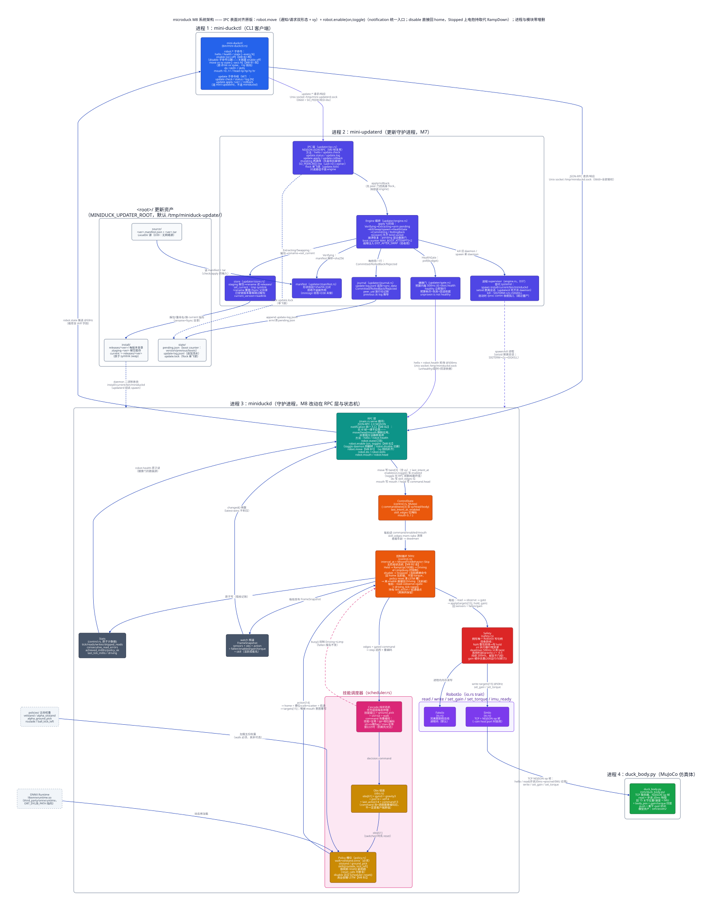
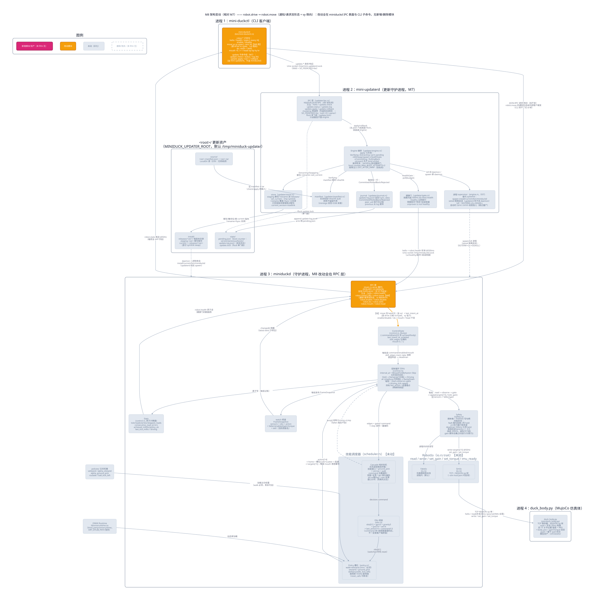

# 第 9 章 · M8 Bite 1：robot.drive → robot.move——通知式连续意图与 vy 侧向

> 本章对应里程碑 M8（收敛验收）的第一个 Bite（已验收），也是 M8 教程的第一章——按 Bite 增量写，后续 Bite 在同一目录追加。交付物：`src/lib.rs`（`Request.id` 可缺省 = notification、`MoveParams` + 8 条单测）、`src/main.rs`（删 `robot.drive`，新增 `robot.move` 通知/请求双路径，分发 match 改返回 `Option<ServerMessage>`）、`src/bin/mini-duckctl.rs`（`drive` → `move vx vy vyaw` 子命令）、`src/updater/ipc.rs` + `src/updater/gate.rs`（id 类型适配，语义不变）、`src/control.rs`（两处注释改名）、`scripts/accept-m8.sh`（新建）、`scripts/accept-m4/m5/m6.sh`（CLI 调用改名）。控制循环、调度器、Safety、仿真体一行未动。

## 1. 问题

M8 是收敛验收里程碑：M0–M7 逐里程碑推进时登记了一路偏差（D1–D41，外加 feature-inventory.md 总账里归并的 D42–D63），M8 逐项裁决。路线已定为 C 线：先对齐不依赖硬件的接口差异，再移植 BAM 执行器模型。本章是 C 线的第一刀，处理 D43 的前半——自研 `robot.drive` 对齐为原版 `robot.move`。

M6 结束时我们的驾驶入口是 `robot.drive {vx, vyaw}`，请求式：每帧带 id 发、daemon 逐帧应答。它和原版 `robot.move {vx, vy, vyaw}`（通知式）的差异不是改名那么简单，三条后果各自独立成立：

1. **照原版文档写的客户端连不上我们的机器人。** 原版协议把 `robot.move` 定义为连续意图主入口（`reference/duck-ipc-proto/src/lib.rs:596-597`），手柄 padd 以通知式 20–50Hz 发它。对我们的 daemon 发 `robot.move`，得到的是 `METHOD_NOT_FOUND`——协议面各说各话，"能跑原版客户端"这个复刻的及格线就不成立。
2. **侧向行走在协议层根本不存在。** 观测 command 块的 twist 从 M2 起就是三维 `[vx, vy, vyaw]`，velstand 训练时吃的就是三自由度速度指令（回指 Q16/Q40）；但旧 `robot.drive` 只收 `{vx, vyaw}`，写共享状态时 vy 被钉死在 `0.0`。能力一直在权重里，是协议把它锁死了——vy 这一维补的不是新功能，是解开一个已有的功能。
3. **连续意图的形态不对，而且我们的协议表达不了"对"的形态。** 原版连续意图以 notification 发送：无 id、不应答、20–50Hz 持续重发。我们的 `Request.id` 是必选的 `u64`——一个不带 id 的帧在解析阶段就会失败，`notification` 这种帧形态在我们的协议里**不存在**。手柄按原版方式以 50Hz 发通知式意图，我们的 daemon 连收都收不下。

值得先说的一句：**下游全都 ready**。twist[3] 的槽位、obs command 块、deadman[^1] 的意图年龄，从 M2/M4 起就是按三维速度设计的——所以本章是纯协议层改动：进程边界不变、模块零增删，改动全部集中在 miniduckd 的 IPC 表面和 CLI 子命令（见设计节的图）。

## 2. 背景概念

### 【背景卡片】JSON-RPC 的两种消息：request 与 notification

- **一句话**：带 `id` 字段的帧是 request（服务端必须应答，应答回显同一个 id）；不带 `id` 的是 notification（服务端照常执行，一个字节都不回）。一个字段的有无，决定这条连接上有没有回程流量。
- **为什么 50Hz 连续意图需要无应答形态**："发了就要回"对一问一答成立，对连续意图不成立——摇杆位置、目标速度是持续重发的流，每帧 20ms 后就被下一帧覆盖，对它逐帧应答是纯开销，应答内容（"收到了"）没有任何信息量；更糟的是应答会引诱调用方等它，发送节奏从"有新值就发"退化成停走协议，延迟反而变大。原版把消息家族和意图类型直接挂钩：连续意图（move/head）发 notification，离散命令（stop/enable）发 request，因为后者必须知道有没有被接受（`reference/duck-ipc-proto/src/lib.rs:586-594`）。
- **最小示例**：`examples/jsonrpc_notification.py` 单文件自包含（server 线程 + client，Unix socket + NDJSON，和 miniduckd 同构），host 直接跑 `python3 examples/jsonrpc_notification.py`。实测关键两段：

```text
2. notification：无 id，服务端静默执行
  发出: {"jsonrpc":"2.0","method":"set","params":{"value":0.7}}
  收到: （0.5s 内什么都没收到）

3. 再发一个 request 查状态——证明通知 0.7 真的落了
  发出: {"jsonrpc":"2.0","id":2,"method":"get"}
  收到: {"jsonrpc": "2.0", "id": 2, "result": 0.7}
```

"没回复"不等于"没执行"——这就是 notification 的语义，也是本 Bite 全部设计的地基。这个概念在 M8 后续 Bite（robot.head/robot.mouth 通知化、robot.subscribe）会反复用到，深读（规范两条配套细则、原版服务端实现、回本项目哪几行）见 [docs/concepts/jsonrpc-notification.md](../../concepts/jsonrpc-notification.md)。

### vy 与躯干坐标系

twist 三个分量的约定：躯干系右手坐标，**x 前、y 左、z 上**；vx/vy 是线速度 m/s，vyaw 是偏航角速度 rad/s，正为左转。vy 就是向左平移（侧向行走，前进方向不变、身体向左移）。

这条约定本身不起眼，写不写下来却是事故多发地：原版协议注释把这段话标为"承重的"（load-bearing）——原型阶段就是因为约定没写下来，每个消费方各自实测定号，最后积累出 `--laser-track-yaw-sign`、`--laser-fk-pitch-sign`、`--imu-z-rotation-deg` 等一串符号开关互相 disagree（`reference/duck-ipc-proto/src/lib.rs:2095-2106`）。所以我们的 `MoveParams` 把单位与坐标系写进 doc 注释，一个字都不省（`src/lib.rs:105-111`）。三维命令随时间积出轨迹的直观动画（M2 所做）在 `docs/concepts/assets/command-motion/index.html`。

## 3. 设计





先读第二张图（变动示意）：无新增、无删除模块，未动模块全部灰化。改动只有三处——`mini-duckctl` 子命令（`drive vx vyaw` → `move vx vy vyaw`）、miniduckd 的 RPC 层（`robot.drive` → `robot.move`，并新增 notification 帧形态）、以及 RPC→ControlState 那条边上的内容（写 `twist[3]` 含 vy）。第一张图（完整架构）和 M7 那张逐节点对照，会发现除了这些标签一切照旧——这正是本章的设计论点：**接口对齐不该惊动控制链路**。

设计按四层展开，代码领读也按这个顺序走：

1. **协议层先让"无 id"这个帧形态存在**（`src/lib.rs`）。`Request.id` 从必选 `u64` 改成 `Option<u64>`：`None` 就是 notification。连带地 `ServerMessage::Response.id` 同步可空——帧解析失败时没有 id 可回显，按规范回 `"id":null`。新参数类型 `MoveParams` 收在这一层：线形状（缺省补 0、未知字段拒绝）由 serde 属性声明，有限性检查 `finite_twist()` 兜底。
2. **方法层双路径共用一个应用函数**（`src/main.rs`）。`robot.move` 分支：解析合法就调 `apply_move_intent` 写 twist + 刷新意图时刻，然后 `req.id.map(...)` 决定回不回包——有 id 回 accepted + 三速度回显，无 id 返回 `None`（本帧无回复）。非法参数同理：有 id 回 INVALID_PARAMS，无 id 静默丢弃。framing（带不带 id）不该改变语义，所以两条路径共享同一个 apply——原版同名结构叫 `apply_intent`。
3. **应用层只记值和时间戳，无限幅**。`apply_move_intent` 不做任何范围检查——限幅是控制循环和策略的事，RPC 层的职责是"记住最新意图 + 它什么时候到的"（deadman 的依据）。原版 `set_twist` 同样只打时间戳（`reference/robotd/src/intents.rs:300-305`）。
4. **CLI 仍是请求式，验收用裸 socket 发通知**。`mini-duckctl move` 逐条带 id 调用、拿 accepted 回显打印——教学工具的简单选择；真正发 notification 的是外部客户端（验收脚本里的 python3，未来是手柄），所以验收脚本必须用裸 socket 发帧，CLI 帮不上忙。

### 决策导览

本章三张决策卡片，各在回答一个问题（完整论证在代码领读原位）：

- **连续意图用 notification 不用 request**——50Hz 意图流该不该逐帧应答（见「方法层：robot.move 双路径」）。
- **非法通知静默丢弃 vs 回错误**——通知没法回错误，那要不要为它破例（见「方法层：robot.move 双路径」）。
- **删掉 robot.drive 不留兼容别名**——老调用面怎么处理（见「CLI 与旧方法的死法」）。

读完本节，不看代码应能复述：`robot.move` 是同一份意图的两种发法——无 id 静默生效、有 id 回 accepted；协议层把"无 id"变成合法帧，应用层只写 twist[3] 和时间戳；vy 侧向随新参数形状一起进来；daemon 之外的唯一改动是 CLI 改名。

## 4. 代码领读

### 协议层：让"无 id"成为合法帧

`Request.id` 改成 `Option<u64>`（`src/lib.rs:33-44`），配 `skip_serializing_if = "Option::is_none"`——无 id 的帧序列化回去也不带 `"id"` 字段，线路格式与规范逐字节一致。`ServerMessage::Response.id` 同步可空（`src/lib.rs:56-72`）：请求本身解析失败时没有 id 可回显，按规范回 `"id":null`——顺手修掉了旧实现的假 id（旧代码解析失败回 `"id":0`，0 是个可能真实存在的 id，null 才是规范答案）。

新参数类型 `MoveParams`（`src/lib.rs:105-121`）照原版形状写（`reference/duck-ipc-proto/src/lib.rs:2108-2117`）：

- `#[serde(default, deny_unknown_fields)]`：缺省字段按 0（发 `{vx, vyaw}` 就是 vy=0 的合法指令；发空 `{}` 就是停车），未知字段拒绝（`vz: 9` 这种拼写错误在请求式路径拿 INVALID_PARAMS，通知式路径静默丢弃）。
- doc 注释承重：单位与坐标系约定一字不落写进类型注释（理由见背景概念 vy 卡片）。
- `finite_twist()`（`src/lib.rs:123-131`）：三个分量全有限才给出 `[vx, vy, vyaw]`。注意它的注释自述"线路上到不了这里"——`serde_json::Value` 装不下 inf/NaN，非有限值在解析阶段就死了，这层是深度防御（为什么仍然要留，见「常见坑」2）。

8 条新单测全在 `src/lib.rs:133-201`：参数形状四条（全字段/缺省/未知字段/错误类型）、非有限一条、JSON 溢出在解析阶段被拒一条、notification 帧形态一条、`"id":null` 响应一条。

### 方法层：robot.move 双路径

`main.rs` 抽出两个小函数（`src/main.rs:186-204`）：`parse_move` 把 `Value` 参数解析成 `[f64; 3]`（Err 的文案直接就是 INVALID_PARAMS 响应的 message），`apply_move_intent` 加锁写 `command.twist` + 刷新 `last_intent_at`。抽出来的理由只有一个：**通知路径与请求路径共用**——framing 不该改变语义，这是原版 `apply_intent` 的同款结构（`reference/robotd/src/main.rs:3747-3750` 的注释把理由写明了：规范允许两种写法，"refusing one because of a framing choice would be a surprise"）。

`robot.move` 分支（`src/main.rs:262-284`）的全部逻辑：

- 解析合法 → `apply_move_intent` 应用 → `req.id.map(|id| ...)`：有 id 回 `{accepted: true, vx, vy, vyaw}`，无 id 得 `None`。
- 解析失败 → 有 id 回 INVALID_PARAMS（-32602），无 id 得 `None`——静默丢弃。

支撑这个分支的是分发 match 的整体改造：从直接产出 `ServerMessage` 改成产出 `Option<ServerMessage>`（`src/main.rs:239`），`None` = 本帧无回复，循环末尾 `if let Some(resp)` 才 send（`src/main.rs:392-397`）。`req.id.map(...)` 就是"有没有 id"到"回不回包"的逐字翻译。

**【决策卡片】连续意图用 notification 不用 request**

- **决策点**：50Hz 持续重发的速度意图，daemon 该不该逐帧应答。
- **备选**：1. 每帧带 id、逐帧应答（请求式，M4–M7 的 robot.drive 形态）；2. notification 无应答，带 id 时也应答作为兼容（原版形态）。
- **选择**：备选 2，对齐原版。原版的论证（`reference/robotd/src/main.rs:3708-3710` 注释）：50Hz 下每帧一个应答是纯开销，而且对一个 20ms 后就被覆盖的速度"没什么可说的"。连续意图的可靠性不靠应答确认，靠重发本身——下一帧 20ms 后就到，丢一帧无感；真正需要确认的是离散命令（enable/do），它们保持请求式。
- **放弃的成本**（备选 1 的好处我们没要到）：**调用方立即知道这一帧收没收到**——丢帧可检测、daemon 死没死立判。改成通知后，"意图没生效"只能在行为上事后发现（等 deadman 500ms 清零，或订阅 obs 看 twist 变没变）——验收脚本断言 a 恰恰只能这么写：发完通知去订阅流里等 twist 出现，而不是读一个应答。
- **失效边界**：意图一旦变成低频、关键、不可重发的命令（比如急停 `robot.stop`），"发没发到"就必须可确认，通知形态立即不成立——原版自己的分界就在协议文档里：continuous → notification，discrete → request（`reference/duck-ipc-proto/src/lib.rs:586-594`）。`robot.stop` 当前是缺口 D54，将来收敛时应按请求式对齐。

**【决策卡片】非法通知静默丢弃 vs 回错误**

- **决策点**：参数非法的 notification（比如 `{vx: 0.1, vz: 9}`），daemon 要不要破例回一条错误。
- **备选**：1. 回错误帧（id 填 null，破规范的例）；2. 静默丢弃（规范 + 原版行为）。
- **选择**：备选 2。规范原话是 notification"不得应答，包括出错时"；原版的实现是 `if let Ok(call) = call` 包一层——解析或校验不过就 `continue`，什么都不发生（`reference/robotd/src/main.rs:3708-3716`）。语义上也自洽：50Hz 流里报错没有意义，发送方 20ms 后就发下一帧了，错误帧无处安放。
- **放弃的成本**（备选 1 的好处我们没要到）：**调用方能发现自己拼错了参数**。通知式路径下，发 `{vz: 9}` 的客户端看到的现象是"机器人不理我"，且没有任何线索——这是真实可踩的坑。我们的补偿是把诊断能力留在请求式路径：同样的参数带 id 发一帧，INVALID_PARAMS 的 message 原文（"robot.move wants {vx, vy, vyaw} (m/s, m/s, rad/s): unknown field `vz`…"）直接告诉你错在哪。验收断言 e1/e2 正是这一对：e1 证明请求式拿得到错误原文，e2 证明通知式静默且 twist 不被改动。
- **失效边界**：如果哪天有低频、一次性的操作被误以通知形式发出，静默丢弃就是纯坑——但那是发送方违反"需要确认的操作必须走 request"的契约，不是本决策能兜的；本决策只覆盖"连续意图流里的坏帧"这个场景。

### 应用层：只记值和时间戳，无限幅

`apply_move_intent`（`src/main.rs:200-204`）两行：写 `command.twist`、刷新 `last_intent_at = Some(Instant::now())`。没有任何限幅、没有对 Enabled 阶段的判断[^2]——RPC 层的职责是"记住最新意图 + 它什么时候到的"，怎么消费是控制循环的事：deadman 用意图年龄清零过期 twist（Safety 既有行为，本章不动），各阶段对 command 的门控在控制循环里（busy、Rising 窗口的 twist 强制全零等，M6 语义不变）。原版 `set_twist` 同样只打时间戳（`reference/robotd/src/intents.rs:300-305`）——两家的 RPC 层都不替控制循环做决定。

### CLI 与旧方法的死法

`mini-duckctl` 的子命令 `drive <vx> <vyaw>` 改成 `move <vx> <vy> <vyaw> [--secs N]`（`src/bin/mini-duckctl.rs:85-146`）。三点不变：仍走请求式（带 id 调用，打印 accepted 回显）；`--secs` 期间每 100ms 重发一次意图（deadman 500ms 下单次意图只能驱动半秒，CLI 扮演手柄——手柄就是持续发意图的，`src/bin/mini-duckctl.rs:86-90` 注释）；到时发零命令停车。

**【决策卡片】删掉 robot.drive 不留兼容别名**

- **决策点**：旧方法名怎么处理。
- **备选**：1. 保留 `robot.drive` 作为 `robot.move` 的别名（vy 补 0，老调用不破）；2. 直接删，老调用拿 METHOD_NOT_FOUND。
- **选择**：备选 2。M8 的目标是"照原版文档写的客户端能跑"，别名对这个目标零贡献——原版客户端发的本来就是 `robot.move`；它服务的只是我们**自己**仓库里的老脚本，而老脚本全在仓库内：三个验收脚本里的 `drive 0.15 0 …` → `move 0.15 0 0 …`（vy=0 保持原行为，`scripts/accept-m4/m5/m6.sh` 的 diff 就这几行）。
- **放弃的成本**（备选 1 的好处我们没要到）：**老脚本/老客户端不破**——留别名的话 accept-m4/5/6 一行都不用改，任何人的肌肉记忆也不破。要不到它的理由是：这份"不破"的代价是协议面长期背着两个名字干同一件事，与 M8 逐项对齐的目标直接冲突——别名会把 D43 变成永远收不了尾的半收敛，而本章的全部意义就是把它收掉。
- **失效边界**：如果本项目有仓库外的用户或已部署客户端，删方法就是 breaking change，需要 deprecation 周期（先双名并行、公告、再删）；教学复刻的客户端全部在仓库内，边界没到。验收断言 h 钉住现状：`robot.drive` 得到的是 METHOD_NOT_FOUND，不是静默别名。

### updater 的 id 类型适配

`Request.id` 类型变了，两个消费方跟着改，语义一行未动：`src/updater/ipc.rs` 三处签名 `u64` → `Option<u64>`（`pack`/`DeniedResponse::with_id`/`try_lock`），解析失败路径从 `ServerMessage::err(0, …)` 改成 `err(None, …)`——和 miniduckd 一样顺手修掉假 id；`src/updater/gate.rs` 健康门发请求时 `id` 包一层 `Some`。accept-m7 回归（39 PASS）证明语义不变。

### 验收脚本：为什么必须裸 socket

`scripts/accept-m8.sh` 用 FakeIo 起 daemon，全部断言在一条连接上按时间线走完，发帧用 python3 裸 socket（`scripts/accept-m8.sh:36-46`）——mini-duckctl 只会发带 id 的请求帧，**构造不出 notification**；通知语义又必须看帧间关系（"发了之后没有任何响应行"），分段重连说不清，所以全程一条连接。八项断言（a–h）与语义的对应关系见验收节。

## 5. 验收

```bash
# 容器内（miniduck-rust，工作目录 /work）
docker compose exec rust cargo test
```

实测：`test result: ok. 68 passed; 0 failed`——M7 基线 60 条 + 本章新增 8 条（全部在 `src/lib.rs`，清单见代码领读「协议层」）。

```bash
docker compose exec rust bash scripts/accept-m8.sh
```

实测八项断言全过（2026-10-05 复跑；完整输出与命令见 [acceptance.md](acceptance.md)）：

```text
a. 通知生效 twist=[0.10000000149011612, 0.20000000298023224, -0.30000001192092896]  OK
b. 通知全程无响应行  OK
c. 请求式 accepted 回显 [0.05, -0.05, 0.1]  OK
d. 缺省 vy 按 0 接受  OK
e1. 未知字段 INVALID_PARAMS  OK
e2. 非法通知静默丢弃，15 帧 twist 保持 [0.3, 0.1, -0.2]  OK
f. 1e999 → PARSE_ERROR id=null: number out of range  OK
g. 停发 0.7s 后 obs twist=[0,0,0]（deadman 生效）  OK
h. robot.drive → METHOD_NOT_FOUND  OK
```

**断言解释**（逐项：这个断言为什么证明了这个性质）

- **a + b 是一对**：a 证明"没回复 ≠ 没执行"——发完无 id 通知后从订阅流的 obs 里读到 twist 落地（obs 里 twist 是 f32 落盘，`src/obs.rs:105`，所以 0.1 读回来是 `0.10000000149011612`，容差 1e-6，偏移 `OFF_TWIST=48`，`src/obs.rs:22`）；b 证明通知全程零回程流量——这条连接上除了 `robot.state` 推送不许出现任何响应行。
- **c 证明双路径共享**：带 id 发同样合法，且应答回显三个速度——`apply_move_intent` 之后才有 accepted，应用与应答在同一分支里，不存在"回了 accepted 但没应用"的缝。
- **d 证明 `serde(default)`**：缺省 vy 按 0 接受——原版 MoveParams 的缺省语义，老发法 `{vx, vyaw}` 天然兼容。
- **e1/e2 是非法参数的两面**：e1（带 id）拿到 -32602 与错误原文；e2（无 id 同参数）先发一帧合法通知刷新意图，再发非法通知，随后 300ms（< deadman 500ms）内 15 帧推送 twist 恒为合法帧的值——非法帧既没有应答、也没有污染状态。
- **f 证明线路格式本身挡掉一类非法输入**：`1e999` 超出 f64，serde_json 在解析整个 Request 时就报 "number out of range"——daemon 回的是 PARSE_ERROR（-32700）且按规范 `"id":null`，根本轮不到 `finite_twist()` 出场（详见「常见坑」1、2）。
- **g 是 deadman 回归**：停发 0.7s 后 obs twist 归零——`last_intent_at` 的刷新路径换了名字，保鲜期语义没变。
- **h 是旧方法的死亡证明**：`robot.drive` 得到 -32601 METHOD_NOT_FOUND。

回归：`accept-m7.sh` 实测 PASS=39 FAIL=0（updater id 适配语义不变）；`accept-m4/m5/m6.sh`（MuJoCo 仿真，仅改了脚本里的 CLI 调用）实测 10 秒行走位移 0.764m / 0.848m / 0.816m，均过 0.5m 门槛，exit 0——vy=0 的新发法与旧发法行为一致。

## 6. 与原版对照与差异

**本 Bite 已对齐**（`robot.move` 全对齐，每条附原版证据）：

| 对齐项 | 原版证据 | 我们 |
|---|---|---|
| 连续意图作 notification 发送（move/head 属 continuous，stop/enable 属 discrete） | `reference/duck-ipc-proto/src/lib.rs:586-597`（"50Hz 下每帧一个应答是纯开销；重传的 80ms 前摇杆位置比没有更糟"） | `Request.id: Option<u64>` + robot.move 分支 |
| 通知无 id 不回复、非法通知静默丢弃 | `reference/robotd/src/main.rs:3708-3716` | `req.id.map(...)`（`src/main.rs:266-284`） |
| 带 id 的 robot.move 也应答（apply_intent 双路共享） | `reference/robotd/src/main.rs:3747-3754`、`:4305-4311` | `apply_move_intent` 双路共用 |
| MoveParams 形状 `default + deny_unknown_fields` | `reference/duck-ipc-proto/src/lib.rs:2108-2117` | `src/lib.rs:112-121` |
| 单位/坐标系注释承重（约定不写下来，消费方各自定号互相 disagree） | `reference/duck-ipc-proto/src/lib.rs:2095-2106` | `src/lib.rs:105-111` doc 注释 |
| set_twist 无限幅只打时间戳 | `reference/robotd/src/intents.rs:300-305` | `src/main.rs:200-204` |

**残余差异**（D43 更新为部分收敛，已登记 `docs/deviations.md`）：

- **D43 残余**：`robot.head` / `robot.mouth` 的通知语义未开——它们目前仍是纯请求式方法（M6 交付形态），原版两者同属 continuous、应以通知发送。预定 M8 后续 Bite 收敛。
- **通知语义只对 robot.move 开放**：原版对**任何**方法的 notification 都走 `apply_intent` 统一入口——非意图方法返回 false 就 `continue`，静默无事发生；我们只给 `robot.move` 开了通知语义，其他方法无 id 发来时会回一条 `"id":null` 的响应。预定后续 Bite 随 `enable {on, toggle}` / `robot.subscribe` 一起收敛。
- **mini-duckctl 的 `move` 仍是请求式逐条调用**：教学工具的简单选择（要打印 accepted 回显）；原版机器人上的连续意图由手柄 padd 以通知式 20–50Hz 发送。daemon 侧两种形态都收，这条偏差不影响协议对齐。

原版 `robot.enable {on, toggle}` 的形状差异（D44）与本 Bite 无关，预定下一 Bite，此处不展开。

## 7. 常见坑与展望

1. **`json.dumps(1e999)` 印出来的是裸 `Infinity`，不是 JSON**（本章验收真实踩过）。断言 f 第一版用 python 的 `json.dumps` 生成帧——`1e999` 在 python 里是 `float('inf')`，`json.dumps` 默认把它印成裸 `Infinity` 三个字符，那是**非法 JSON 词法**。daemon 回的是词法错误，断言却"过了"——假阳性，测的根本不是数值溢出。修法：脚本里手写帧字面量 `"vx":1e999`（`scripts/accept-m8.sh:153-161`），这才是合法 JSON 词法、合法 JSON 但超出 f64 的值，才真正测到 serde_json 的 "number out of range"。教训：测解析层行为时，生成测试帧的库自己可能就是干扰源。
2. **`is_finite` 检查在线上不可达，但删不得**。`serde_json::Value` 装不下 inf/NaN——`1e999` 在解析阶段就死了，所以 `finite_twist()` 的拒绝路径在线上永远不会触发。这是"线路格式本身挡掉了一类非法输入"的好例子，但兜底仍要留：协议层类型（`MoveParams`）不只服务线路一条路径，任何进程内构造都可能喂进非有限值。单测 `move_params_non_finite_rejected` 直接构造 NaN/±inf 验证这道门（`src/lib.rs:167-175`），绕开线路测兜底——**不可达的防御也要有测试，测试可以不走路径**。
3. **CLI 发不了无 id 通知，验收脚本得用 python3 裸 socket**。notification 语义的断言（"发了之后没有任何响应行"）只能由一个能发出无 id 帧的客户端来写；mini-duckctl 的所有调用都带 id。这是工具能力的边界，不是 bug——但写验收时容易习惯性 `mini-duckctl move …` 然后发现断言 b 根本无从写起。accept-m5 的 python 助手同款做法，本项目验收脚本里裸 socket 发帧已是惯例。

**展望**：M8 剩余路线两条。C1 接口对齐的后续 Bite：`robot.enable {on, toggle}`（D44，手柄 Start 语义）、`robot.subscribe` 入口（D45，含 hz 降频与 ack）、updater 的 `robot.safeToRestart` 预检（D47）；head/mouth 通知语义（D43 残余）随它们一起收尾。C2 移植 BAM 执行器模型进 `sim/duck_body.py`（D21），让 sit / roulade 在仿真里物理通过（D34/D35 的降级验收届时复原为物理断言）——先做 kp=0.55 一行实验验证归因，再动手移植。

[^1]: deadman：客户端失联保险——最近一次驾驶意图超过 500ms 没刷新，Safety 自动把 twist 清零（M5 交付）。机器人没人"握杆"就停车。
[^2]: robot.drive 时代同样不判——旧代码也是直接写 twist；门控一直在控制循环侧。
