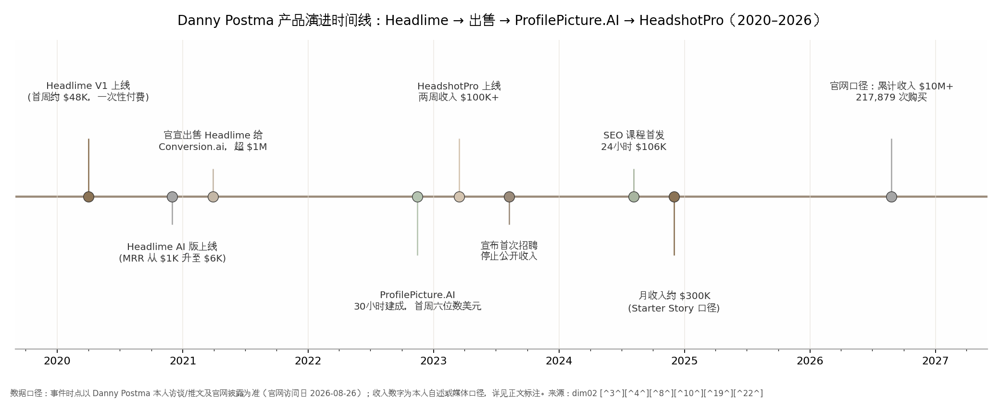
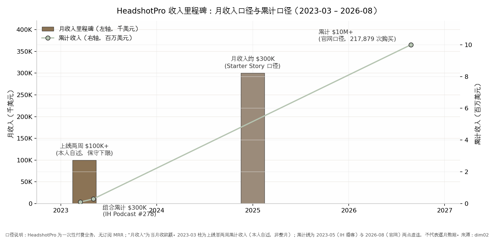

## 3. SEO驱动型（闷声发财）——Danny Postma / HeadshotPro

### 3.1 模式定义与核心逻辑

#### 3.1.1 一句话定义：不建受众建排名，让搜索意图直接变现

SEO驱动型模式的核心动作只有一个：找到已经有稳定搜索量、但竞争极弱的关键词，围绕它做一个极窄的产品，把 Google 排名做到第一名，让带着明确付费意图的搜索流量直接转化为收入。Danny Postma 在 The Bootstrapped Founder 播客中把这套逻辑说得毫无修饰："I only build products where there's SEO… I only pick product ideas that have a lot of search and low keyword difficulty. Why? I hate marketing… You never have to do marketing because you're going to rank number one on Google."（我只做有 SEO 需求的产品……我只挑搜索量大、关键词难度低的点子。为什么？因为我讨厌营销……你永远不需要做营销，因为你会排上 Google 第一名。）[^74^]

这个定义里有三个可操作的筛选条件，全部来自他本人的披露：其一，关键词必须已有搜索量——产品不是创造需求，而是拦截需求；其二，关键词难度（Keyword Difficulty，Ahrefs 等工具对排名难度的 0–100 评分）要低于 10–20，此时"一两个外链就能上前排"[^74^]；其三，需求最好是交易型的——搜索者要的是"马上得到结果"，而不是"读一篇文章"。HeadshotPro 就是这套筛选器的标准产物：AI 职业头像，搜索者带着信用卡来，付 $29–$59，两小时后拿到照片，交易闭环结束。

#### 3.1.2 底层逻辑：搜索流量是"有保证的获客渠道"，与受众资产的本质区别

Danny 把 SEO 称为"有保证的营销渠道"（guaranteed marketing channel），这个词是本模式与第 2 章 Pieter Levels 模式的分水岭。他的原话是："I've seen so many indie hackers starting out who think building in public is going to bring them the customers. It could but it's gonna be such a smaller chance… So better just focus on guaranteed marketing channel like [SEO]."（我见过太多刚起步的独立开发者以为公开建造能带来客户。也许能，但概率小得多……不如专注于像 SEO 这样有保证的渠道。）[^74^]

两种模式的资产性质完全不同。Levels 积累的是**受众资产**：约 93 万 X 粉丝（2026-08），依附于人格、观点和持续曝光，优点是所有权在自己手里、可跨产品复用，代价是必须常年高密度输出个人观点——这是外向者的游戏。Danny 积累的是**流量资产**：一组关键词的排名位置，依附于域名权威与内容结构，不需要任何人认识" Danny Postma"这个人。他本人对此有清醒的自我认知——他的 X 粉丝从 200 涨到 87K（2023-08），但他承认"most of my followers came through Pieter because he kept retweeting me"（我的大部分粉丝来自 Pieter 的转发）[^74^]，即他的受众是借来的，而排名才是自有的。对内向者而言，这条路线的吸引力在于：获客系统可以在不发一条推文的情况下运转。

流量资产的可计算性是第二个本质差异。Danny 的方法论允许在写第一行代码之前算出收入上限："you can basically calculate what your monthly revenue could be if you're listed on number one"（如果你排到第一名，基本可以预先算出月收入）[^74^]——搜索量 × 点击率 × 转化率 × 客单价，四个变量都有工具可查。受众驱动的收入则几乎无法事先建模。

但必须指出这枚硬币的反面：流量资产的所有权不属于你。排名是 Google 授予的，Google 可以随时收回——算法更新、AI Overviews 截流、竞争对手堆外链，都是房东行为而非市场行为。3.9 节将用量化的数据说明，这位"房东"在 2024–2026 年间做了什么。受众资产需要养人，流量资产需要交租，这是两种模式各自的天花板来源。

### 3.2 代表案例深度拆解

#### 3.2.1 背景：从 $19 电子书到百万美元退出

Danny Postma，荷兰格罗宁根人，约 1994 年生。2015 年，21 岁的他还是一名自由职业转化率优化（CRO）顾问，因为给客户找落地页参考困难，在不会编程的情况下用 WordPress 搭了一个落地页设计画廊 Landingfolio——"I didn't know how to program at the time, so I built it using WordPress."[^75^] 这个网站至今仍在运行、日访数千，但始终难以变现，这段经历给他留下了两个终身信念：流量本身不值钱，能变现的流量才值钱；以及，不会写代码不是不做产品的理由。此后他背包旅行亚洲、自学编程，受巴厘岛联合办公空间的独立开发文化影响定居当地，约 2019 年成立产品组合壳公司 Postcrafts。[^76^][^77^]

第一个真正意义上的产品是 Headlime。前身是他与朋友合写的一本《200 个标题公式》电子书，定价 $19；2020 年 4 月疫情封锁期间，他在巴厘岛把它做成了"填空式标题生成器"，首周收入约 $48,000（Product Hunt 访谈口径；其 Starter Story 自述页另有"$60,000 in one week"的说法，两个数字均出自本人，口径或时点不同，并列标注）。[^78^][^79^] 2020 年 6 月，他直接写信给 OpenAI CTO Greg Brockman 要到 GPT-3 首批访问权限——"I decided to reach out directly to Greg Brockman, the CTO of OpenAI, to request access. Fortunately, I was able to get access as part of the first batch of users."[^75^]——随后 all-in AI，2020 年 12 月上线 AI 文案版 Headlime，一个月内 MRR 从 $1K 涨到 $6K，2021 年 2 月达 $20K。[^78^][^76^] 2021 年 3 月 17 日 TechCrunch 报道后环比增长约 100%，3 月 30 日他发推官宣将 Headlime 出售给 Conversion.ai（即后来的 Jasper），本人确认价格"over one million dollars"；Pieter Levels 当时按 $20K MRR × 12 个月 × 4 倍估算约 $1M，两个口径互相吻合。[^76^][^80^] 从 AI 版上线到七位数退出，只用了约 3–4 个月，尽调仅 1 周。

#### 3.2.2 时间线：ProfilePicture.AI 的 30 小时与 HeadshotPro 的 30 天

卖掉 Headlime 后 Danny 休息了近一年（结婚、买房、自称"越来越无聊"），直到 2022 年 8 月 Stable Diffusion 开源。他先做 AI 图库 StockAI，因生成质量和 Getty Images 法务风险放弃；2022 年 11 月与 Pieter Levels 上演了一次著名的"撞车竞赛"——对方周五晚发布同类产品，他周六早上线 ProfilePicture.AI。**这里必须修正一个在中文圈广泛流传的张冠李戴："30 小时建成"指的是 ProfilePicture.AI，不是 HeadshotPro**；前者确实 30 小时冲刺完成、上线一周做到六位数美元销售额，而 HeadshotPro 的建设周期约为 30 天（Starter Story 口径）。[^74^][^81^][^18^] 2022 年 12 月 Lensa 爆红，ProfilePicture.AI 的收入先被提振、随后持续下滑——这个"先升后崩"的曲线让他确认虚荣型需求（vanity demand）不可靠，转向刚需型的职业头像。

HeadshotPro 于 2023 年 3 月 16 日发推官宣、同天开启付费，上线两周收入突破 $100K（本人自述，累计收入口径而非 MRR）。[^82^][^79^][^83^] 2023 年 5 月 5 日，Indie Hackers 播客第 278 期以"组合产品收入过 $300K"为题播出他的访谈；2023 年 8 月他宣布首次招聘（机器学习工程师）并同时停止公开收入数字。[^84^][^74^] 关于其月收入峰值，多个二手来源称"上线一年内"（即 2024 年 3 月前后）达到 $300K/月，Starter Story 的拆解口径则为 2024 年 12 月约 $300K/月（≈$3.6M 年化）；由于 Danny 自 2023 年 8 月起不再披露收入，两个时点均无本人逐月数据支撑，本报告统一写作"**2024 年内达到约 $300K/月**"，并强调这是第三方单一源头的广泛转引，且 HeadshotPro 是一次性付费业务，媒体惯用的"MRR"实为当月收款额的类比口径。[^18^][^85^][^86^]

*图 3-1：Danny Postma 产品演进时间线（2015–2026）。从 Landingfolio 到 Headlime、ProfilePicture.AI 再到 HeadshotPro，每个产品都建在上一个的技术底座与流量资产之上。资料来源：本人访谈与播客转录、They Got Acquired、Starter Story[^75^][^76^][^18^]。*

从时间线可以读出一个模式化的节奏：**每个产品都是在上一个产品的技术底座和流量资产上长出来的**。Headlime 练出了 GPT 工程能力和"卖给 Conversion.ai"的退出经验；ProfilePicture.AI 练出了图像生成管线并验证了 C 端付费意愿；HeadshotPro 则是把这两者对准一个搜索量更大、付费意图更硬的关键词。三个产品之间没有一次是从零开始——这也是他能把建设周期从数月压缩到 30 天乃至 30 小时的真正原因：不是写得快，而是可复用的模块越来越多。

#### 3.2.3 收入数据：累计 $10M+ 的口径拆解

**表 3-1：HeadshotPro 收入数据与口径拆解（2023–2026）**

| 指标 | 数值 | 时间点 | 口径与来源 |
|---|---|---|---|
| 上线首两周收入 | $100K+ | 2023-03 | 本人自述，累计收款 [^79^] |
| 月收入峰值 | 约 $300K/月（≈$3.6M 年化） [^18^] | 2024 年内 | Starter Story 2024-12 口径，单一源头广泛转引；一次性付费业务的"月收入"，非订阅 MRR |
| 累计收入 | $10M+ [^87^] | 2026-08 | 官网披露，2023 年上线起累计 |
| 累计购买次数 | 217,879 次 [^88^] | 2023–2026 | 官网披露 |
| 累计交付 | 1,700 万+ 张头像 / 20 万+ 次拍摄 [^87^] | 2026-08 | 官网披露 |
| 定价 | $29 / $39 / $59 一次性；团队人均最低约 $15 [^88^] | 2025–2026 | 官网 |
| 退款率 | 3.3% [^88^] | 2023–2026 | 官网披露 |
| 联盟营销收入 | $50K+/月，占总收入 15%+ [^89^] | 2024–2025 | Rewardful 客户案例 |
| 月流量 / 每访客收入 | 222K 访问 / $1.35 [^18^] | 2024 末 | Starter Story，单一来源 |
| Trustpilot 评分 | 4.7 / 5，约 3,500 条评价 [^90^] | 2026 年中 | 第三方平台 |

这张表里最值得推敲的是交叉验证关系：联盟渠道 $50K+/月、占比 15%+，反推总收入约 $333K/月，与 Starter Story 的 $300K/月口径在误差范围内互相印证——这是全部收入数据中最硬的一组，因为它来自两条独立的信息链。[^89^][^18^] 其次是口径分层：$100K 与 $10M 都是"累计收款"，$300K 是"当月收款"，三者不可直接比较增长率；尤其"累计 $10M+"是官网营销口径，未经审计，但 217,879 次购买 × 约 $39 的中位客单价 ≈ $8.5M，与 $10M+ 的宣称在量级上自洽（团队单均价更高，可补足差额）。退款率 3.3% 则是被低估的质量信号：在一个"照片不像你就全额退款"的行业里，这个数字意味着自动质检流水线确实把废品拦截在了交付之前（详见 3.4 节）。

*图 3-2：HeadshotPro 收入里程碑（2023–2026）。柱为月收入（一次性收款口径），线为累计收入。数据来源：本人自述、Starter Story（2024-12 口径）、官网（2026-08）[^79^][^18^][^87^]。*

把上图的两个口径叠在一起看，可以读出一次性付费业务的独特形态：柱（月收入）与线（累计收入）之间没有订阅制那种"MRR 复利爬坡"，而是"高毛利脉冲 + 长尾累积"——上线两周的 $100K 是 Product Hunt 式发布与搜索需求积压释放的脉冲，2024 年内达到的约 $300K/月是 SEO 排名与联盟网络就位后的稳态，而 $10M+ 的累计线则是三年间 217,879 次一次性购买的加总。[^79^][^18^][^87^] 对读者最有用的推论是：这条曲线没有"MRR 复利"的保护，一旦搜索流量或品类需求逆转，月收入可以没有预警地回落——ProfilePicture.AI 被 Lensa 冲击后的轨迹就是预演。[^74^]

#### 3.2.4 现状 2026：从一人公司到微型企业

截至 2026 年 8 月，HeadshotPro 官网正常运营，产品形态已从"个人一次性头像工具"升级为企业级服务：SOC 2 Type II 合规、SAML 单点登录、数据保护协议（DPA）、AES-256 加密、输入照片 30 天自动删除、承诺不用客户照片训练模型，团队版采用 credits 制、5 人以上阶梯折扣，客户包括财富 500 强团队（官网点名 HubSpot 销售团队）。[^88^][^87^] 团队规模上，2023 年 9 月之前是 Danny 加妻子（每天兼职 2–3 小时客服）的纯家庭作坊，2024 年起以承包商和兼职起步建小团队，2026 年第三方盘点列为"约 3 人"规模（具体人数为单一来源）。[^74^][^75^][^91^] 2026 年 5 月，Danny 入选 Stripe Sessions 2026 的"35 位一人创业家"展示名单——平台级背书说明，即使团队扩到 3 人，这个案例仍被归入"一人公司"范式。[^92^]

### 3.3 日常作息与开发节奏

#### 3.3.1 巴厘岛生活与"每天多出 4 小时"的外包哲学

Danny 的作息设计围绕一个非显性资产展开：时区。巴厘岛的上午到下午 3 点，北美客户正在睡觉——"I get to work until 3pm without anyone messaging me… Social media is super quiet."（我可以工作到下午 3 点，没有任何人给我发消息……社交媒体超级安静。）[^74^] 与北美市场 12 小时的时差本身就是护城河：深度工作时段无人打扰，客服消息则可以心安理得地"晾 16 小时"——他的妻子每天早上处理 2–3 小时客服，其余时间无人值守。[^74^]

生活事务的外包是第二个杠杆。他把做饭、清洁、园艺全部外包（在印尼这只需每月几百美元），原话是："I wake up, I order my food, gets delivered to my house, house gets cleaned… I get to save four hours a day… so I can focus more on my company."（我起床、订餐送到家、房子有人打扫……我每天省下约 4 小时……这样就能更专注于公司。）[^74^] 按每月 22 个工作日折算，这相当于每月凭空多出约 88 个小时——接近一个全职员工半个月的工时。HeadshotPro 约 30 天建成的速度，正是建立在这种"个人时间密度"之上；但早期并不轻松——上线第一周服务器半夜反复宕机，他"凌晨 3 点被潜意识叫醒检查服务器"，全自动化的状态是事后建成的，不是第一天就有的。[^74^]

#### 3.3.2 自动化就位后每周约 10 小时："I just love to make robots"

2026 年的媒体转述称，自动化系统就位后 Danny 每周在 HeadshotPro 上只花约 10 小时——"He estimates spending about 10 hours per week on HeadshotPro now that the automated systems are in place."（需注意这是媒体转述其本人估算，未见一手推文。）[^83^] 他对自动化的态度近乎执念："I just love to make robots like I want to completely automate anything."（我就是喜欢造机器人，我想把一切都彻底自动化。）[^74^] 他只建"我离开一周也不会出事"的产品："I don't build tools and software that really rely on me always been there… I want to make tools where I could be gone for a week."[^74^]

这里有一个常被忽略的心理动因：Danny 自称疑似有注意力缺陷倾向——"I'm pretty sure I've add. So it's six months into HeadshotPro now and I'm like mentally unable to build any more features… I haven't built anything for three weeks."（我很确定我有 ADD。HeadshotPro 做到第六个月，我已经在精神上无法再加功能了……我三周没写代码了。）[^74^] 对产品维护期快速失去兴趣，既是他把公司做成机器人的原因，也是他后来决定招人、做产品组合的原因。这意味着"每周 10 小时"不是效率炫耀，而是一种与自身注意力结构相匹配的组织设计——对同样特质的人可复制，对享受长期打磨单一产品的人则未必适用。

### 3.4 技术栈与工具链

#### 3.4.1 Next.js 系栈 + AI 质检流水线

HeadshotPro 的工程栈是 2023–2026 年 AI 独立开发的主流配置：Python 后端与图像管线、Stable Diffusion/DreamBooth 微调起步（后期迁移至 SDXL/Flux 一代模型）、Next.js 前端、Stripe 收款、PostgreSQL 数据库，GPU 推理走 Replicate 类按秒计费的 API。[^79^][^66^] 真正构成差异的不是栈本身，而是模型管线。他在 Unite.ai 访谈中披露："Most competitors just use Stable Diffusion… We're different, we deploy dozens of additional open-source and custom developed models to improve output quality by 10x."（多数竞争对手只用 Stable Diffusion……我们不同，我们叠加数十个额外的开源和自研模型，把输出质量提升 10 倍。）[^75^] 其中两个关键组件：用多模态模型 LLaVA 自动过滤不合格的用户上传照片和"不适合职场"的生成结果；用 Codeformer 修复面部 AI 伪影。[^75^] 这套质检流水线是自研模型迭代一整年的成果，也是 3.8 节"一人服务 20 万客户"的技术前提。

#### 3.4.2 GPU 推理成本结构与一次性付费的现金流设计

Danny 从未披露 GPU 成本占比，第三方估算单次生成为"次美元"量级（sub-dollar），在 $29–$59 售价下毛利率估算 85–95%，上线初期总基础设施低于 $100/月——以上均为第三方估算口径，可作量级参考但不应视为披露数据；旁证是 2026 年 Replicate 上 A100 约 $0.0014/秒、FLUX 约 $0.025/张的公开价格。[^86^][^93^] 与订阅制 SaaS 相比，这个成本结构配合一次性付费产生了一个现金流上的不对称优势：客户先全额付款，GPU 成本随后按秒发生，不存在应收账款、不存在续费流失、不存在为留存而持续加功能的义务。即使按最保守的估算，一次 $29 的订单中推理成本不足 $1，退款成本占收入约 2–3%（二手转述），现金流从第一天起就是正的。这也解释了为什么该模式不融资也能滚动：它根本不需要营运资金。

### 3.5 获客与增长

#### 3.5.1 SEO 原教旨主义与程序化落地页结构

首先需要修正一个流传的标签：Danny 并非"anti-build-in-public"。他本人就是公开建造运动的深度实践者——2020–2023 年公开收入数据、粉丝从 200 涨到 87K，IMDb 简介称其为 Build In Public 运动的"prolific member"（高产成员）。[^74^][^94^] 准确的标签是**SEO 原教旨主义者**：他公开主张对没有受众的新人，公开建造带来客户的概率很小，SEO 才是可计算、可复制的首选渠道；2023 年 8 月起他自己也停止公开收入，只留下一句"I don't share revenue anymore. Sorry."[^74^] 换言之，他把公开建造当冷启动放大器用过，用完即弃。

执行层面是双轨制。第一条轨是程序化 SEO（programmatic SEO，即用模板批量生成结构化落地页）：围绕主词"professional headshots"（月搜索量 21K、关键词难度 23），上线 3 个月内做进 Google 前 10；同时批量生成 200+ 个城市/地区落地页（"professional headshots in San Francisco / Boston"……）吃长尾流量；Domain Rating（Ahrefs 的域名权威评分）从 35 升至 44，外链 21,000+。[^95^][^96^] 第二条轨是精确匹配域名策略：他花 $3,000 购入 headshotpro.com，逻辑是"HeadshotPro basically tells Google that you should rank number one for headshot… because it's in your domain name."（HeadshotPro 这个名字基本就是在告诉 Google 你应该在 headshot 这个词排第一，因为关键词就在域名里。）[^74^] 他自己也踩过坑：后续做"headshots near me"类型的薄内容程序化页面失败，被他当作反面教材写进了自己的 SEO 课程——这预示了 3.9 节将要展开的行业级打击。[^97^]

#### 3.5.2 联盟营销网络："I hate marketing"，但建了一台分销机器

Danny 说"I hate marketing"，但他建了占收入 15%+ 的联盟营销（affiliate marketing）网络：通过 Rewardful 平台给测评博主 20% 佣金，该渠道每月带来 $50K+ 收入。[^89^] 他的原话揭示了这不是自相矛盾而是同一件事的两面："I think without the affiliate program, fewer people would write about us… we're now working on becoming the #1 affiliate program in the industry."（我觉得没有联盟计划的话，写我们的人会少得多……我们现在正努力成为行业里第一的联盟计划。）[^89^] 他讨厌的是"做营销"这个动作（写内容、搞活动、维护关系），而不是营销的结果——联盟计划把动作外包给了有写作动力的博主，自己只维护分佣规则。同一逻辑延伸到外链建设：Product Hunt 发布的主要目的不是曝光而是外链——"Even coming in last is a win"（哪怕排最后一名也是赢），因为一次发布通常能收获 10–50 个转载外链。[^85^]

最精妙的是"竞品红利"机制。2023 年 Remini 在 iOS 爆红那一周，HeadshotPro 销量涨了三倍，因为他占据着"AI headshots"关键词第一名："I love it when I get a highly popular competitor because then they do marketing for me… everyone's googling for AI headshots and I'm ranking number one."（我特别喜欢出现爆红的竞争对手，因为他们替我做营销……所有人都在搜 AI headshots，而我排第一。）[^74^] 排名位置把对手的营销预算变成了自己的流量——这是流量资产相对受众资产独有的杠杆。

### 3.6 变现路径与商业模式

#### 3.6.1 一次性付费 vs 订阅：决策逻辑与 3.3% 退款率的品控含义

从 SaaS（Headlime）转向 B2C 一次性付费，Danny 给出过三条理由，全部来自本人披露：其一，他擅长转化优化，"You only have to get them once to buy"（你只需要让他们买一次）；其二，没有续费就没有持续加功能和维护客户关系的义务——"You don't have to add features because they don't pay monthly"，售后负担小，可以纯靠 SEO 和广告放量；其三，也是最具前瞻性的一条："a lot of people say you have to build a sustainable business… I'm more of like, get as much revenue upfront because your company, especially with AI, could be obsolete next year."（很多人说要建可持续的生意……但我更倾向于尽量前置收钱，因为你的公司——尤其是 AI 公司——明年可能就过时了。）[^74^]

定价锚定被替代物而非成本：个人档 $29/$39/$59，对标的是实体影楼——其官网调研 751 位摄影师得出的美国职业照中位价为 $232，常见报价 $200–$500。"Currently, you have to pay $300 if you want to get a photo shoot. If you can get that done for $39 and it almost looks the same…"[^74^][^88^][^98^] 退款政策是 100% 无条件保证（现行版无期限；旧版曾为 14 天且要求未下载才可退，政策演变见第三方测评），官网披露 2023–2026 年 217,879 次购买的退款率仅 3.3%。[^88^][^98^] 这个数字要反着读：在一个生成质量天然不稳定的 AI 品类里，敢承诺全额退款且实际退款率只有 3.3%，说明 LLaVA 质检流水线把绝大多数"一眼假"的废品拦截在了交付之前——退款率在这里不是财务指标，而是品控系统有效性的外部审计。

#### 3.6.2 SEO 课程：$106K/24 小时的知识变现第二曲线

2024 年 8 月，Danny 把自己的方法论产品化为 SEO 课程，采用预售阶梯定价：$49 起售、每 100 单涨 $10、稳定于 $69，24 小时内售出 2,149 份、收入 $106,000，落地页 10,531 访客、转化率 16%。[^99^] 这个事件的含义有三层。第一，他本人用真金白银验证了"SEO 选题法"在 2024 年仍是市场愿意付费的知识。第二，16% 的转化率来自他十余年 CRO 顾问的老本行——知识变现看似第二曲线，实际仍是同一套能力（流量×转化）在新 SKU 上的复用。第三，这也是一个信号：当从业者开始把方法卖给同行，往往意味着方法本身的套利空间正在收窄——这与 3.9 节的行业数据在时间线上吻合。

### 3.7 决策思路与关键转折点

#### 3.7.1 卖 Headlime 的三选一与"3x 不卖、等 8-10x"的算术

2021 年卖掉 Headlime 时，Danny 面对的是标准的三选一："I could get VC funding into hyper scaling… I could have bootstrapped it and build a team or I could have sold it because I had two people interested in buying it. And I was like, I don't want a team. I'm scared."（我可以拿 VC 的钱超速扩张……也可以自己招人带团队，或者卖掉——当时有两家买家。但我想，我不想要团队，我害怕。）[^74^] 他当时还与 Sequoia 接触过；2023 年他补充了更底层的动机："I just knew like it wouldn't be my life to work 80 hours managing people."（我就是知道，每周工作 80 小时去管人不是我想要的人生。）[^100^]

到 2023 年面对 HeadshotPro 时，同一套算术得出了相反结论，因为参数变了："HeadshotPro doesn't have any strategic acquirers, which means you're gonna get like a 3x multiple for it instead of like an 8 to 10x. It's not worth it, man. You can automate it away for three years. Get your money out."（HeadshotPro 没有战略买家，意味着你只能拿到 3 倍左右的倍数，而不是 8–10 倍。不划算，兄弟。把它自动化跑三年，把钱取出来。）[^74^] 这组对比是本案例最有迁移价值的决策框架：**卖不卖不取决于情绪，取决于收购倍数与自持有现金流的比较**。Headlime 有战略买家（Conversion.ai 急需 GPT-3 产品线），能卖出 4 倍以上；HeadshotPro 没有战略买家，3 倍财务倍数对应约 10 个月利润，而自动化持有的机会成本几乎为零。结论：资产定价对你不利时，把公司变成提款机比卖给别人更优。

#### 3.7.2 危机面：正面竞争、免费替代与价格战

这个模式的失败风险同样具体。其一，同期 A/B 实验揭示的需求陷阱：2022 年底他与朋友分头上线 Deep Agency（AI 虚拟模特）和 HeadshotPro，前者媒体爆红、甚至招来死亡威胁，但转化率仅 0.3%；HeadshotPro 的转化率是其 10 倍——"Deep Agency had a conversion rate of 0.3%. And HeadshotPro had a conversion rate of 10 times that." 他的总结是"press and clicks doesn't pay the bills"（媒体报道和点击量付不了账单）。[^74^] 其二， ProfilePicture.AI 被 Lensa 打回原形的经历证明， vanity 型需求可以被一个大厂 App 在数周内清零。[^74^] 其三，竞争格局持续恶化：2025–2026 年赛道已有 Aragon、BetterPic、Secta、InstaHeadshots 等 20+ 玩家，价格带被压到 $19–$79；Pieter Levels 的 Photo AI 以品牌与微调质量守住头部；更结构性的是免费替代的崛起——Google Gemini 的 Nano Banana 免费档已能生成"足够好"的单张头像，Canva 提供每日 1 张免费额度。[^101^][^102^][^103^] 第三方测评的概括是："Free gives you a headshot. Paid gives you a headshot system."（免费的给你一张头像，付费的给你一套头像系统。）[^101^] HeadshotPro 的应对是把价值锚点从"单张质量"迁移到免费替代品做不了的事：批量一致性、团队工作流、SOC 2 合规——这是被免费浪潮逼出来的企业化转型，而非主动升级。

### 3.8 效率密码

#### 3.8.1 全自动退款客服与"拉黑竞品"的时间管理

Danny 的一人运营术可以压缩成一句话：把公司做成机器人。上传→训练→生成→LLaVA 质检→交付→Stripe 收款→自动退款，全链路无人值守；最极端的演示是他与妻子回荷兰度假两周时直接开启自动退款——不满意就退，不需要任何人在场判断。[^74^][^104^] 这套管线让一个人（后为约 3 人小团队）支撑了 20 万+ 客户与 1,700 万张图片的交付。[^87^]

第二个效率杠杆是注意力卫生。面对 1:1 复制其落地页并公开挑衅（rage bait）的抄袭者，他的反制是 DMCA 投诉加社交媒体全量拉黑："This is why I'm blocking everyone. Everyone that's competing with me, I blocked them on Twitter. I just don't want to see what they're doing… Keeps you sane."（所以我把所有人都拉黑了。所有和我竞争的人，我都在 Twitter 上拉黑了。我就是不想看到他们在做什么……这让你保持心智健康。）[^74^] 第三个杠杆是他称为"engineering as marketing"（用工程手段做营销）的资产复用：收购同行 HairstyleAI 后，把 HeadshotPro 引擎直接套到对方域名上，"I just copied HeadshotPro, put it on his domain name. I think conversion rate is up six times now. So I earn it back in nine months."（转化率提升 6 倍，9 个月收回收购成本）；另购入有 12 年历史的老域名 profilepicturemaker.com 挂横幅为主站导流。[^74^] 三个杠杆的共同点是：都不增加工作时间，只增加系统的自动化密度和资产复用率。

### 3.9 当下可行性评估（2026 年）

#### 3.9.1 最大逆风：SEO 流量池萎缩的量化证据

2024–2026 年，Google 搜索生态发生了对该模式构成结构性冲击的两个变化：AI Overviews（AI 概览，Google 在结果页顶部直接生成答案）截流，以及 Helpful Content Update 对程序化内容的清洗。量化证据如表 3-2：

**表 3-2：2024–2026 年 Google 搜索生态变化对 SEO 流量的量化冲击**

| 证据 | 数字 | 时点/来源 |
|---|---|---|
| 首个随机对照实验（1,065 名美国用户）：AI Overviews 出现时站外自然点击 | -39.8%，零点击行为 +34.5% [^105^] | 2026-04，SSRN 论文（PPC Land 报道） |
| Ahrefs 30 万关键词观测：首位结果 CTR | -34.5%（2025-04）→ 恶化至 -58%（2026-02 随访） [^106^] | Ahrefs 官方研究 |
| Seer Interactive：出现 AIO 的信息型查询，自然 CTR / 付费 CTR | -61% / -68% [^107^] | 2025-11 |
| Pew 研究中心：AIO 场景下点击传统结果的用户比例 | 仅 8%（无 AIO 时为 15%） [^107^] | 2025-07 |
| 零点击搜索占比 | 56%（2024）→ 69%（2025-05，Similarweb 口径） [^108^] | 第三方估算，口径不一 |
| HubSpot 自然流量 | 2024–2025 年 -70~80%（月访问约 1,350 万 → 约 600 万） [^109^] | 媒体综合 |
| Helpful Content Update（2023-09）后大量站点 SEO 可见度 | 年内 -50%+ [^110^] | Amsive / Lily Ray 团队方法 |

但这张表必须分两层读，否则会得出过度悲观的结论。第一层，冲击是真实且因果级的：随机对照实验排除了"相关性幻觉"，且降幅在随访中继续扩大（-34.5% → -58%），说明这不是一次性调整而是持续趋势；HubSpot、Chegg（非订阅流量 -49%，2025 年 2 月起诉 Google）等大站的崩塌案例证明连头部玩家都无法豁免。[^105^][^106^][^111^] 第二层，冲击的分布高度不均：交易型/电商查询的 AIO 覆盖率仅约 1–4%，品牌词触发 AIO 反而使 CTR +18.7%，被 AIO 引用的品牌还能多获得约 35% 的自然点击。[^107^][^112^] HeadshotPro 的主词"professional headshots"属于高购买意图的交易型关键词，正好落在受冲击最小的区间；真正被重创的是它自己的第二增长曲线——信息型长尾（"how to take a professional headshot at home"类博客内容与薄程序化页面），也就是 Danny 自己承认失败的那部分。由此可得本章最重要的结构性判断：**AI Overviews 打击的不是 SEO 本身，而是"信息型 SEO"；交易型关键词+品牌词的组合反而是流量池萎缩中的幸存者**。预计 2026–2028 年，纯靠信息型内容站与薄程序化 SEO 的独立开发路线可行性将持续下调，而"交易型窄关键词+一次性付费"的组合仍留有窗口，但窗口宽度取决于 Google 把 AIO 扩展到交易型查询的速度——这是本报告后续章节复用的基准数据。

#### 3.9.2 给新手的第一步：选 AI 概览无法直接回答的交易型关键词

若要在 2026 年复刻这条路线，Danny 方法论中仍然有效的部分是选题流程，失效的部分是放量手段。仍然有效：用 Ahrefs 筛"月搜索量可观 + 关键词难度 <10–20"的词，按"排名第一 × 转化率"预先算出月收入上限，先算后做。[^74^] 需要新增的筛选维度是"AI 可替代性测试"：把目标关键词逐个丢进 Google，看 AI Overviews 是否已经直接给出答案——能直接被回答的是信息型词，流量将持续被截流；需要用户完成一次交易、上传一次照片、生成一份文件才能得到结果的，才是 AI 概览难以替代的交易型词。已经失效或高危的：批量生成薄内容落地页（2023-09 HCU 后全站级降权风险，Danny 自己的"headshots near me"即失败案例）、依赖信息型博客建权威。[^86^][^97^] 此外必须承认窗口期事实：通用 AI 头像的窗口（2022-08 至 2023-03）已经关闭，2026 年的机会在垂直行业、本地化与合规型企业服务，而非再做一个通用工具——这一判断综合了赛道内卷数据与 Danny 本人的课程产品化行为。[^101^][^99^]

### 3.10 模式适配画像

#### 3.10.1 适合谁：内向者的可计算路线及其天花板

SEO 驱动型最适合的画像：性格内向、不喜社交与公开表达、数据导向、能接受"先算后做"的延迟满足。Danny 本人是标本——公开承认害怕带团队、讨厌营销、拉黑所有竞品以保心智，却通过排名系统建起了累计 $10M+ 的生意。[^74^][^87^] 见效周期为数周到数月（HeadshotPro 主词 3 个月进前 10、两周收入 $100K+），显著快于受众建设（Levels 的 93 万粉丝是十年积累），但慢于平台寄生型的"上架即有流量"。收入天花板以本案例的峰值口径衡量约为 $3.6M/年（$300K/月，2024 年内，第三方口径）；需注意这是幂律分布的尾部样本，同一时期赛道头部玩家的月收入区间约为 $5 万–$20 万。[^18^][^113^]

该画像的失败面同样清晰：第一，单一渠道依赖——流量资产的地主是 Google，3.9.1 节的 -39.8% 因果证据说明地租正在上涨；第二，需求时效性——Danny 自己"AI 公司明年可能就过时"的判断已经部分兑现，免费模型把单张头像的质量地板抬到了付费线附近；第三，模式对"关键词嗅觉"的要求被低估——StockAI 放弃、Deep Agency 0.3% 转化率、ProfilePicture.AI 收入归零式下滑，都是同一个人在不远的时点上犯过的选题错误，区别只在于他用组合化和快速 pivot 把单次错误的成本压到了 30 天以内。[^74^] 对不具备这种组合化能力的模仿者，同样的错误就是终局。
