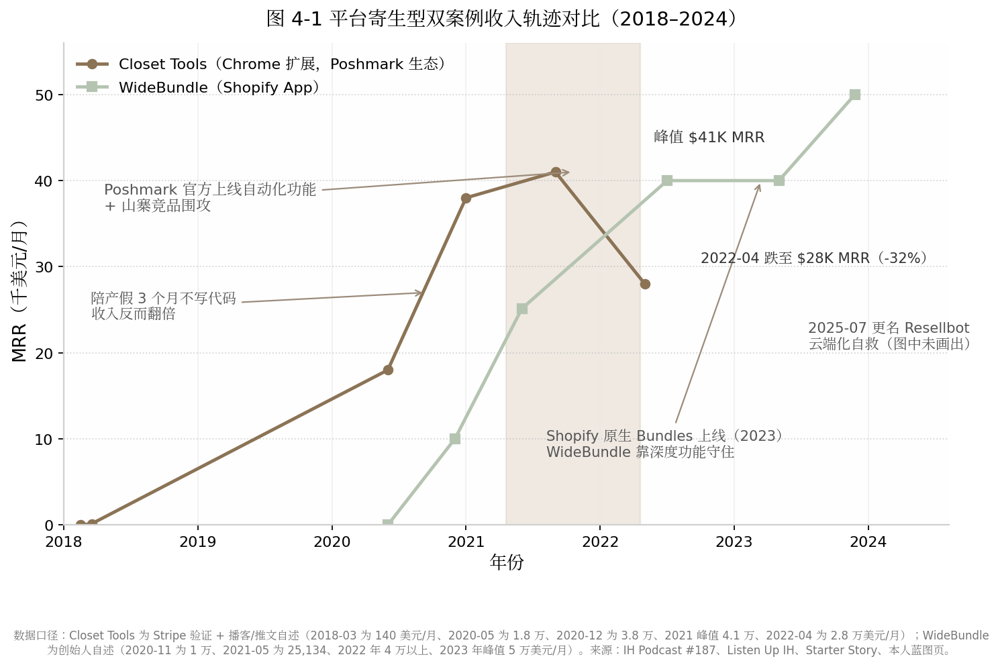

## 4. 平台寄生型（搭便车）——WideBundle（Shopify App）与 Closet Tools→Resellbot（Chrome 扩展）

### 4.1 模式定义与核心逻辑

#### 4.1.1 一句话定义：把产品建在别人的流量池里，用租金换流量

平台寄生型模式的定义可以压缩成一句话：**把产品建在别人的流量池里，用租金（抽成＋政策风险）换取现成的需求流量。** 这里的"平台"有两层：一层是分发渠道（Shopify App Store、Chrome Web Store 等应用商店），一层是宿主业务本身（Shopify 商家、Poshmark 卖家这些有付费意愿的用户群）。寄生型开发者自己不蓄水，直接在平台的流量池里打鱼。

本章选取两个收入轨迹最完整的公开案例：法国开发者 Mat De Sousa 的 WideBundle（Shopify 捆绑销售应用，峰值 $50K MRR，本人披露[^19^]）与美国开发者 Jordan O'Connor 的 Closet Tools（Poshmark 卖家自动化 Chrome 扩展，峰值 $41K MRR[^114^]；其中 2020 年 12 月的 $38K/月为 Stripe 验证 + 播客自述[^115^]）。两个案例一升一衰，恰好构成这个模式的完整两面。

#### 4.1.2 底层逻辑：获客成本趋近于零，但流量是租来的

平台商店天然聚集着"带着钱包来的"需求流量。Shopify 平台上 80% 以上的商家使用至少一个第三方应用，平均每家店铺安装 6 个，全平台安装量超过 2,500 万次[^116^]；在 App Store 内，搜索贡献了约 60% 的安装量[^117^]。对寄生型开发者而言，获客预算可以趋近于零——WideBundle 从未投过一分钱付费广告，Closet Tools 的获客成本同样是零[^118^][^115^]。

这是它与第 2 章 Levels 模式的本质区别。Levels 的 93 万粉丝（2026-08 口径）是十年公开建造攒下的**自有资产**，平台封不掉、算法拿不走；而寄生型开发者的流量是**租来的**——Shopify 可以改排名算法、可以把你的核心功能做成免费原生功能、可以一纸 ToS（服务条款）更新把你锁死，Poshmark 可以在社区准则里明文禁止你的产品类别。租金便宜（Shopify 前 $1M 终身毛收入抽成 0%[^119^]），但租约随时可能被单方面收回。本章是全书中"平台风险"实锤最硬的一章：它是全部八个模式中唯一贡献了"收入被平台行为直接打掉"的完整曲线的模式。

### 4.2 代表案例深度拆解

#### 4.2.1 案例A——Mat De Sousa / WideBundle：把"客服做成第一功能"的商店排名套利

Mat De Sousa 1995 年前后生于法国，中学时给网游 Dofus 写机器人程序赚到最早的自动化经验；2017 年在达索航空（Dassault Aviation）实习两个月，"感觉他们随时能换掉我，我的工作是'没用的'"，自此确立创业目标（本人自述）[^118^]。2017 年起自学 Shopify 开发，连做三个 App 全部失败；2020 年毕业前，他说服工程师学校用"创办公司"替代六个月实习，WideBundle 由此诞生[^120^][^121^]。

他的冷启动是教科书级的需求验证：MVP（最小可行产品）只用 14 天，只做一个商家最关心的捆绑销售组件；上架前先把一张效果图发到 Facebook 的 Shopify 卖家群，引来 100 多条评论、锁定 3 个明确表示需要的商家——"前 20 个用户就是提出需求的人"，纯靠口碑长到 100+ 用户后才上架 App Store，再请老用户集中留评，快速冲上关键词首页，随后被 Shopify 推荐到商店首页（本人自述）[^118^]。收入轨迹：第 21 天首个付费客户，第 3 个月 $1K MRR，第 6 个月约 $10K MRR，上线 12 个月（2021-05）达 $25,134 MRR、2,000+ 用户、1,650+ 付费——这个数字由创始人在 Indie Hackers AMA 与 Medium 长文两个渠道自报，并有 Mixpanel 数据佐证[^122^][^123^]。2022 年 Starter Story 报道时超 $40K/月、5 名全职员工[^120^]；约三年时达峰值 $50K MRR、团队 7 人（本人披露）[^19^]；2025 年第三方复盘给出 $55K MRR 的口径，未获创始人确认，仅供参考（第三方估算）[^124^]。

截至 2026 年，WideBundle 仍在运营且为品类头部：App Store 评分 4.8/5（约 300 条评论、91% 五星），定价三档 $14.99/$19.99/$24.99 每月；发行主体 The Wide Company 已扩展出第二款 App WideReview，并办起巴黎年度 Shopify 开发者大会 The Wide Event（200+ 与会者）。2024 年，其应用为用户商家创造了超过 6,000 万欧元销售额（本人披露）[^125^][^19^][^121^]。

#### 4.2.2 案例B——Jordan O'Connor / Closet Tools：需求来自自家餐桌

Jordan O'Connor 是美国电气工程师，做机器人和激光相关的 C 语言开发，夫妻合计背着约 20 万美元学生贷款，"两人的债务吞掉了一半以上的收入"（本人自述）[^115^]。在赚到第一分钱之前，他用约三年（2015–2018）每天清晨 5 点到 7 点自学 web 开发、SEO 和文案，还刷爆信用卡花 $2,500 买了一门 SEO 课[^115^][^126^]。产品创意的来源毫无戏剧性：妻子在 Poshmark（美国二手服饰交易平台）卖二手衣，每天要花数小时手动"分享"商品以维持曝光，他写了约 30 行 JavaScript 做成浏览器书签脚本送给她和闺蜜。"我妻子一年内攒了 2 万粉丝、成了 Poshmark Ambassador，然后我开始收到陌生人的邮件，问这个'分享按钮'的更多信息"[^126^]。

2018 年 2 月，他在 Reddit 的 r/Poshmark 版块发帖送免费脚本，一两天内收到 200 个邮箱注册；3 月，他自学 Stripe 集成、一个月内做出正式产品，上线即有 10 个付费客户，当月收入 $140[^115^][^126^]。之后两年缓慢增长——他还因"自我推广"被 r/Poshmark 版主踢出社群，被迫转向 SEO 和口碑[^115^]。2020 年 5 月达 $18K MRR；2020 年 12 月录制 Indie Hackers 播客 #187 时达 **$38K/月（约 $45 万/年）、1,500 名客户、零员工**，在 Indie Hackers 产品库按"Stripe 验证收入 + 单人 + 无员工"排序位列第一[^115^]。峰值出现在 2021 年前后的 $41K MRR[^114^]。

#### 4.2.3 案例B的衰落与自救：平台亲自下场的完整弧线

衰落来得直接且可量化。2021–2022 年，Poshmark 官方亲自上线了面向卖家的自动化功能，同时大量山寨竞品涌入，Closet Tools 的 MRR 从 $41K 跌至 2022 年 4 月的 $28K，跌幅约 32%。Jordan 本人在推文中写道："Poshmark 过去一年为用户建了一些自动化功能，影响了我的底线。现在竞争也多了！"[^114^]更致命的是商业模式上的天花板：Poshmark 社区准则明文禁止自动化（账号可被终止），他判断"平台不会真打，因为自动化帮平台多赚钱"——赌对了生存，却输掉了退出通道。"好几个收购方来谈过，一听平台风险就撤了……所以它几乎是不可出售的"（本人自述）[^115^]。

自救动作是"去寄生化"。2025 年 7 月 30 日，Closet Tools 正式更名 Resellbot，从浏览器扩展迁移为云端平台：7×24 云端执行、支持多店铺、移动端查看，官方公告直言"这不只是更名，而是工具工作方式的根本转变——从浏览器扩展到云端平台"，旧形态下"Chrome 更新有时会弄坏功能；你必须开着电脑和浏览器"[^127^]。截至 2026 年产品仍在运营（$30/月或 $300/年），但面临 CAPTCHA 验证循环、Poshmark"share jail"（反自动化封号/限流）和 PalmFlow 等"卖家操作系统"型竞品的升维竞争[^128^]。这条"起—盛—衰—自救"的完整弧线，使 Closet Tools 成为本模式独有的教材：WideBundle 展示的是平台寄生能跑多快，Closet Tools 展示的是租约被收回时会发生什么。

**表 4-1　双案例收入时间线对比**

| 时间 | WideBundle（Shopify App） | Closet Tools（Chrome 扩展） |
|---|---|---|
| 上线 | 2020-05，14 天 MVP [^118^] | 2018-03，一个月建成 [^115^] |
| 首月收入 | 第 21 天首个付费客户 [^123^] | $140（10 个付费客户）[^126^] |
| 6 个月 | ~$10K MRR [^19^] | 缓慢增长期（两年） |
| 12 个月 | $25,134 MRR、1,650+ 付费（本人披露）[^122^][^123^] | — |
| 2020-05 | — | $18K MRR（播客自述）[^115^] |
| 2020-12 | — | $38K/月、1,500 客户、零员工（Stripe 验证）[^115^] |
| 2021 峰值 | — | $41K MRR [^114^] |
| 2022 | $40K+/月、5 名全职 [^120^] | 2022-04 跌至 $28K MRR（-32%）[^114^] |
| 峰值 | $50K MRR（约 2023，本人披露）[^19^] | $41K MRR |
| 2025–2026 | 运营中，4.8 分，三档定价 [^125^] | 2025-07 更名 Resellbot 云端化 [^127^] |

两条曲线的形态差异本身就是论点（见图 4-1）。WideBundle 是一条单调上升、峰值更高的曲线，因为它寄生的 Shopify 有一个"规则化"的应用商店生态——排名、评论、抽成、徽章全部明码标价，可经营、可优化；Closet Tools 的曲线在 2021–2022 年出现了全报告唯一一处"被平台行为直接打断"的拐点，因为它寄生的 Poshmark 根本没有开放平台、没有 API，自动化甚至被社区准则明文禁止——它寄生的不是平台的分发机制，而是平台的"用户痛点"，宿主随时可以把这个痛点自己解决掉。值得注意的异常点是 2020 年夏天：Jordan 休陪产假三个月几乎不写代码，收入反而翻倍（$18K→$38K 区间），说明订阅制自动化产品的存量收入与当期投入完全脱钩——这既是该模式最美的部分，也是它脆弱性的来源：增长不依赖你，衰退也不由你控制。

*图 4-1：WideBundle 与 Closet Tools 收入轨迹对比。数据口径：WideBundle 各节点为本人披露（2020–2023）[^118^][^123^][^19^]；Closet Tools 为播客自述与 Stripe 验证（2018–2022）[^115^][^126^][^114^]。*

### 4.3 日常作息与开发节奏

#### 4.3.1 运维日常化：评论、排名、政策跟踪是每天的功课

平台型产品的日常与独立站产品截然不同：大量时间花在评论运营、排名维护和政策跟踪上，而非新功能开发。WideBundle 侧，Mat De Sousa 公开的作息细节很少，但其管理节奏清晰：早期 14 天出 MVP 的单人极限速度，之后通过雇佣 5–7 名全职员工完成委托化，本人重心转向增长、内容与社区（X 上约 3 万粉丝，持续 build in public）。他本人的复盘具有普适价值："如果重来，我会等 WideBundle 完全委托出去之后再做第二个 App。我没有完全委托，管两个 App 很难。"[^19^][^118^]评论运营则日常化到什么程度？Shopify 评论页上有一条 2024 年 9 月的 1 星差评，一位大商家声称应用故障导致其单日损失 3 万英镑，Mat 本人逐条公开回复——头部应用的评论区就是公关前线[^125^]。

Closet Tools 侧提供了更极端的样本。Jordan 全职后的工作块固定在早 6 点到中午 12 点，实际工作 3–4 小时，中午之后全部留给三个孩子的家庭；每天客服邮件约半小时。2020 年 6–8 月他休陪产假加搬家，整个夏天没写代码，"业务自己翻倍了"[^115^]。这是平台寄生型自动化产品的理想日常：增长引擎（SEO 文章、商店排名、口碑）在后台运转，创始人每天的核心动作是盯客服和政策动向，而不是写代码。

### 4.4 技术栈与工具链

#### 4.4.1 基础设施便宜，合规成本才是大头

WideBundle 的公开工具链是 Shopify API/App 平台 + Mixpanel（全漏斗数据追踪，用于把试用转付费从 9% 优化到 40%）+ 自研的商家店铺远程诊断工具（"客服支持是第一功能"的基础设施）；具体服务器栈与基础设施成本未公开[^118^][^123^]。Closet Tools 早期是纯客户端 Chrome 扩展（"按顺序点击页面元素"）+ Firebase 后端 + Stripe 支付 + Buttondown 邮件列表；代码曾被竞品直接偷窃，之后做了混淆处理；2025 年迁移为云端自动化平台，基础设施成本同样未公开[^115^][^127^]。两个案例的共同点是：人力即全部主要成本——Closet Tools 零员工，WideBundle 峰值 7 人团队，基础设施在成本结构中几乎可以忽略。

真正昂贵的是合规成本。Chrome 侧，Manifest V3（扩展平台第三代技术规范）以 service worker 取代后台常驻页面、限制网络拦截规则数、禁止远程加载代码，2026 年入场只能 MV3 原生开发——对存量开发者是一次强制重写，对新入场者反而抬高了克隆和作恶门槛，构成意外的护城河[^129^][^130^]。Shopify 侧，2025 年 4 月起新公开应用必须只用 GraphQL Admin API，REST 接口已列为遗产；绕过 Shopify Billing 用 Stripe 私下收款违反条款，有被下架风险[^131^][^132^]。换言之，平台型产品的技术债有相当一部分是"平台强加的折旧"——这笔账在自建流量模式里不存在。

### 4.5 获客与增长策略

#### 4.5.1 ASO 与评论运营：把平台算法当渠道经营

应用商店优化（ASO, App Store Optimization）是寄生型开发者的核心手艺。Shopify App Store 的排名机制（2026 年可操作口径）大致为：关键词匹配优先，其次看安装速率、近 90 天评论新鲜度、留存/卸载率；"Built for Shopify"徽章（约 1,500 个 App 持有，占比 7%）平均能在 14 天内带来 49% 的安装量提升[^117^][^133^][^134^]。WideBundle 把这套机制吃到了极致。其增长飞轮为：Facebook 社群验证需求 → 前 100 个老用户集中留评 → 冲上关键词首页（核心关键词最高排到第 4 位）→ 被 Shopify 推荐到商店首页 → 法国 KOL 合作放大 → 口碑[^118^][^123^]。其中最关键的一招是把客服做成排名杠杆："支持是我们的第一功能……Shopify 想要提供极致支持的开发者，你支持做得好，他们就乐意把你推到更多人面前。所以我们甚至引导用户在评论里谈论我们的支持。"[^118^]

获客之外，激活优化贡献了主要收入增长。借助 Mixpanel 全漏斗追踪，WideBundle 把免费试用转付费的转化率从 9% 优化到 40%——同样的商店流量，收入翻了三倍多（本人自述）[^118^][^123^]。这是平台寄生型的一个隐性优势：流量入口是平台控制的、你优化不了，但漏斗后端完全归你，转化优化的边际收益极高。

#### 4.5.2 冷启动对比：商店内流量 vs 社区私信

两个案例的冷启动路径截然不同。WideBundle 走的是商店内流量路线：先在站外社群（Facebook 卖家群）验证需求，再回商店内用评论冲榜，此后的增量几乎全部由商店搜索和推荐位供给。Closet Tools 则根本不是典型的"Chrome Web Store 排名获客"案例——Poshmark 没有开放平台，它的分发起点是 Reddit 冷启动（r/Poshmark 发免费脚本帖，一两天收 200 个邮箱），被版主踢出后全靠 SEO 加口碑[^115^][^126^]。SEO 对这个品类是天然渠道，因为用自动化在 Poshmark 社群里是禁忌话题："人们不谈论它，但会隐身模式搜索它。"他的博客只有 13 篇文章，却精准霸榜"Poshmark automation"等关键词[^115^][^114^]。两条路径的共性是零广告预算；差异在于，WideBundle 的流量开关握在 Shopify 手里，Closet Tools 的流量开关一半握在 Google 手里——后者多了一层分发上的分散，但业务根基（Poshmark 不禁止你存在）反而更脆弱。

### 4.6 变现路径与商业模式

#### 4.6.1 平台抽成经济学：Shopify 全球最慷慨，Chrome 干脆不管钱

**表 4-2　主要平台商店抽成与支付政策对比（2026 年口径）**

| 平台 | 抽成政策 | 支付体系 | 注册/上架成本 | 备注 |
|---|---|---|---|---|
| Shopify App Store | 前 $1M 终身毛收入 0%，超出部分 15% [^119^] | 强制 Shopify Billing，另收 2.9% 处理费 [^119^][^132^] | Partner 一次性 $19 [^119^] | 2025-01-01 起由"年度重置"改为"终身累计"；私接 Stripe 违规 [^119^][^132^] |
| Chrome Web Store | 0%（2021-02-01 起彻底关停内置支付，此前 Google 抽 5%）[^135^][^136^] | 无，须自建（Stripe / ExtensionPay）[^136^] | 开发者账号一次性 $5 [^130^] | 无抽成的代价是支付、许可、续费全部自建 |
| Apple App Store / Google Play | 15%–30%（参照系）[^119^] | 内置 IAP | — | 作为对比基准列入 |

抽成经济学直接塑造了两种产品的财务形态。Shopify 的 0%/15% 阶梯意味着年收入低于百万美元的开发者实际保留约 97 美分/美元，是全球主流应用商店中最慷慨的分成——这正是"寄生"一词在 Shopify 语境下并不含贬义的原因：平台让利换生态繁荣，WideBundle 这类头部第三方反过来帮平台留住商家（2024 年为其用户创造 €60M+ GMV）[^119^][^19^]。Chrome 生态则走向另一个极端：平台既不给支付也不抽成，开发者获得完整定价权和零抽成，但收款、退款、许可验证、税务全部自建——Closet Tools 当年花一个月自学 Stripe webhook 集成，就是这笔"隐性租金"的一部分[^115^]。对开发者选型的含义是：Shopify 适合想要"流量＋收钱一站式"的人，Chrome 扩展适合想把定价权和客户关系全部握在自己手里、且愿意自建支付管道的人。

#### 4.6.2 定价失误史：两个案例都承认"收少了"

定价是两位创始人共同公开认错的地方。WideBundle 上线后长期只有单一价格档，仅从 $12.99 调到 $14.99，Mat 本人承认单档定价是最大失误之一；直到 2026 年才演进为 $14.99/$19.99/$24.99 三档[^118^][^125^]。Closet Tools 的失误更彻底：$30/月从 2018 年上线起八年未涨。Jordan 的原话直白到刺耳："有个客户靠我的工具月销 5 万美元的高端包，也只付我 30 美元一个月……有人要是收购了我的产品，第一周就能把价格翻三倍。"[^115^]他的定价锚是"一天一美元，帮你每天省几小时"——转化因此极高（1,500 名客户撑起 $38K MRR），但客单价天花板被永久焊死。两个案例共同的教训是：寄生型产品的定价上限不由成本决定，而由客户从宿主平台赚走的钱决定——按"客户 GMV 的一小截"定价（分层、按店铺规模加价）远比按"成本加一点"定价合理，而两个创始人都是在错过数百万美元量级收入之后才想明白这一点。

### 4.7 决策思路与关键转折点

#### 4.7.1 翻车案例集：平台何时亲自下场

平台寄生型的终局问题不是"能不能成"，而是"平台何时亲自下场"。以下三个翻车案例加一个反向案例，构成该模式的风险坐标系。

**表 4-3　平台寄生型翻车案例集**

| 案例 | 平台 | 规模峰值 | 平台行为 | 结局 |
|---|---|---|---|---|
| Checkout X（Ruslan Leteyski） | Shopify | €600K MRR（约 $8M ARR）、6,000 商家（本人披露）[^137^] | 2019 年 ToS 更新禁止替代结账，高管亲自电话锁死新安装，2020 年底堵死私有 App 漏洞 [^137^] | 2023 年团队解散；Shopify 随后自上线单页结账功能 [^137^][^138^] |
| The Great Suspender | Chrome | 200 万+ 用户 [^139^] | 原作者转售后新主推送恶意更新，Google 2021-02-04 下架并**远程禁用所有用户设备上的扩展** [^139^] | 用户大量丢失挂起标签页；同期 Chrome 推出内置 Memory Saver 蚕食品类 [^139^] |
| Closet Tools | Poshmark | $41K MRR（2021）[^114^] | 官方上线卖家自动化功能＋社区准则禁止自动化 [^114^][^115^] | 收入 -32% 至 $28K；产品"几乎不可出售"；2025 年云端化自救 [^114^][^127^] |
| Shopify 原生 Bundles / Inbox / Collabs | Shopify | — | 免费原生产品切入第三方品类：Inbox 一年成 Plus 商家第四大客服应用，Collabs 上线即占 8% 份额 [^138^][^140^] | WideBundle 靠深度功能存活；低端市场被吃掉 [^140^] |
| Shopify Product Reviews（反向案例） | Shopify | 官方应用 | 2023-09 下架官方评论应用、2024-05-06 彻底停用并删除数据 [^141^][^142^] | 平台"退场"，评论类目让给 Judge.me/Loox 等付费第三方 [^142^] |

三个正面翻车案例揭示出三种不同的死法。Checkout X 死于"功能替代"——它做的事情（替代结账页）恰好是 Shopify 想自己做或想完全控制的，创始人事后写下该模式最冷峻的注脚："A Shopify app is always a single-click away from being deleted from someone that works there"（一个 Shopify 应用永远距离被某个员工一键删除只有一次点击）；多年工作"因为别人改变了主意"而蒸发[^137^]。The Great Suspender 死于"信任链断裂"——开发者把 200 万用户的扩展卖给不明买家，新维护者推送含远程代码执行的恶意更新，Google 被迫远程强制卸载，而 Chrome 内置 Memory Saver 功能同时宣判了该品类的死刑[^139^]。Closet Tools 死于"宿主垂直整合"——平台把第三方验证过的需求变成官方功能，这是三个案例中对普通独立开发者威胁最大的一种，因为它不需要平台针对你，只需要平台注意到这个品类。

反向案例同样重要。Shopify 在 2023 年下线官方 Product Reviews 应用并于 2024 年 5 月彻底删除数据，把评论类目让给付费第三方——说明平台也会主动退出不擅长的品类[^141^][^142^]。而 WideBundle 在 Shopify 2023 年推出免费原生 Bundles 后仍然存活并增长，原因是原生功能只覆盖简单固定捆绑，缺少量级折扣等深度玩法："平台内置功能吃掉的是低端，留下的是深度。"[^140^]由此可提炼一条可操作的生存法则：**寄生深度要超过平台愿意免费提供的深度**。做"平台功能的简化版"必死，做"平台不愿为小众客户维护的复杂工作流"可活。Checkout X 的 Leteyski 转型后于 2024 年联合创立 Zipchat、2026 年接近 $2M ARR，也证明平台寄生者的能力和认知可以迁移，被锁死的是产品不是人[^143^]。

### 4.8 效率密码

#### 4.8.1 范围收窄红利与客服模板化

单一平台专注带来可观的范围收窄红利。WideBundle 只服务 Shopify 商家、只解捆绑销售一个问题，MVP 因此能压到 14 天；Jordan 只做 Poshmark 自动化一个场景，整个博客只有 13 篇文章却足以霸榜品类关键词[^118^][^114^]。范围越窄，每一个工时的杠杆越大。客服侧的自动化哲学在 Jordan 身上体现得最完整——他称之为"懒惰驱动的自动化"：凡是被重复问两次的问题，就做成文档、功能或内容，让客服邮件从源头消失；密码找回功能上线后，相关客服邮件归零，他每天只需约半小时处理客服[^115^]。WideBundle 则把客服从成本中心改造成获客资产（"支持即第一功能"），用自研诊断工具远程复现商家店铺问题，把单工单处理时间压到最低[^118^]。两个案例共同指向一个结论：寄生型产品的效率不在写代码的速度，而在把"人"从客服和运维循环中系统性移除。

### 4.9 当下可行性评估（2026 年）

#### 4.9.1 政策风险处于历史高位

2026 年入场者面对的是两侧同时收紧的政策环境。Chrome 侧：Manifest V2 扩展自 Chrome 138（2025-07-24）起被全面禁用，Chrome 150/151（2026 年 6–7 月）删除残余绕过方案，2026 年 8 月 31 日起 Chrome 网上应用店将删除所有残余 MV2 扩展；商店活跃扩展数已从 2020 年的约 13.7 万降至约 11.2 万，5,000 多个扩展被禁用或下架，连 uBlock Origin 这类头部产品都被迫重做 Lite 版[^144^][^145^]。Shopify 侧：Built for Shopify 自 2025 年 7 月起引入年度复审制、不达标即摘徽章，并对广告、联盟、分析等七个品类设定专属标准；新公开应用强制使用 GraphQL Admin API[^146^][^131^]。硬币的另一面是：MV3 禁止远程代码加载，大幅抬高了克隆和恶意竞争的门槛，对合规独立开发者是护城河而非纯利空[^129^]；Shopify 的 0% 抽成区间和 BFS 徽章 +49% 安装量的机制，仍是明码标价的入场打法[^117^][^119^]。

#### 4.9.2 生态规模与残酷基线

Shopify App Store 公开应用约 21,500–24,000 个（2026 年中，第三方爬虫口径不一），每月新增 500–800 个；新上架应用中 23.8% 提及 AI[^147^][^132^]。收入分布呈极端幂律：Top 1% 的应用年入超 $1M，Top 10% 超 $10 万 ARR，而**中位数应用月入不足 $1,000**[^132^]。Chrome Web Store 现有约 30.3 万个扩展、覆盖约 30 亿用户，独立开发者收入的现实区间是：副业档 $500–2,000 MRR，全职档 $5K–15K MRR，头部如 GMass 约 $130K MRR 属极少数[^148^][^130^][^149^]。给新手的第一步建议：不要先写代码，先去宿主平台的用户社群（Facebook 卖家群、垂直 subreddit）里发一张产品效果图，收评论和邮箱——WideBundle 的 3 个意向商家和 Closet Tools 的 200 个邮箱，都是还没写产品就完成的付费意愿验证；同时，选品时先问自己一个问题：**"平台自己做这个功能需要几步？"** 答案在三步以内的品类，直接放弃。

### 4.10 模式适配画像

#### 4.10.1 适合谁、何时见效、天花板在哪

适合人群画像：产品嗅觉强于品牌表达欲、擅长数据驱动优化（ASO、转化率、评论运营）的工程师型开发者；不需要外向人设，但需要长期跟踪平台政策的耐心。前置条件近乎零——Shopify Partner 注册 $19、Chrome 开发者账号 $5，启动资金可以忽略[^119^][^130^]。见效速度在所有模式中仅次于套利型：WideBundle 第 21 天首个付费客户、6 个月 $10K MRR；Closet Tools 上线当月 $140、两年半到 $38K MRR[^123^][^126^]。天花板在 $50K/月级别（WideBundle 峰值，本人披露[^19^]），且被平台结构性封顶：做得越大，越进入平台的雷达区，被原生功能替代的诱因越强。风险面必须如实写明：单点故障风险为八种模式最高——Checkout X 的 €600K MRR、Closet Tools 的 -32%、The Great Suspender 的 200 万用户，都是被平台一个决策打掉的真实数字[^137^][^114^][^139^]。理性的使用方式是把平台寄生当作现金流引擎和验证场，把攒下的利润与认知逐步转移到自有资产（邮件列表、第二产品、云端独立 SaaS）上——Resellbot 的云端化和 WideBundle 的社区与大会，本质上都是"减租"动作。预计 2026 年之后，随着两侧平台政策持续收紧，纯寄生、零自有资产的打法生存空间将进一步收窄，"寄生起步、逐步上岸"会成为该模式的主流路径。
