# 独立开发者成功模式深度拆解

**——8种成功模式、15个真实案例、401个信息来源的全景式研究**

**报告日期：2026年8月26日**　**总字数：5万字以上**　**信息来源：401条（全部标注于文末）**

---

## 引言：一人公司的黄金时代与幸存者偏差

2025 年 6 月，以色列开发者 Maor Shlomo 把创立仅 6 个月、零外部融资的 AI 应用构建器 Base44 以约 $8,000 万现金卖给了 Wix——这家公司连他在内只有 8 名员工，被收购前一个月（2025-05）利润已达 $18.9 万[^1^]。同一时期，对 Indie Hackers 上 937 个接入 Stripe 验证收入的产品的统计显示：54% 收入为零，仅约 5% 月入超过 $8,333[^2^]。这两个数字属于同一个行业、同一个年份。本报告要拆解的，正是这个"天花板极高、中位数为零"的行业：独立开发与一人公司。

### 背景与数据

#### 一人公司从边缘形态变成主流注册形态

供给侧的制度数据先行说明了规模。截至 2025 年 6 月，中国一人有限责任公司（OPC）突破 1,600 万家；2025 年上半年新注册 OPC 达 286 万户，同比增长 47%，占全部新注册企业的 23.8%[^3^][^4^]。全球口径同样陡峭：Carta 统计 2025 年上半年单人创始人新公司占比达 36.3%，较 2019 年提升 53%[^3^]。这已不是少数极客的生活方式选择，而是一个有政策配套（深圳对单个 OPC 年度算力补贴最高 100 万元）和基础设施（Stripe、Vercel、AI 编程工具链）支撑的组织形态[^3^]。叙事层面，Sam Altman 与科技 CEO 们"首家一人十亿美元公司何时出现"的赌局，在 2026 年 4 月被《纽约时报》的报道部分兑现：Matthew Gallagher 以 $20,000 启动资金创立的远程医疗公司 Medvi 首年销售额 $4.01 亿，仅 2 名员工[^5^]。

#### 失败率基线：54% 零收入与幂律分布

但必须立即给出硬币的另一面，否则本报告就成了成功学选集。Indie Hackers 样本中 54% 产品零收入、仅 5% 月入超 $8,333[^2^]；对 1,000 余个 micro-SaaS 的交叉分析显示约 70% 创始人月入不足 $1,000，仅 1% 月入超 $5 万[^6^][^7^]；Steam 独立游戏自发版本的中位终身收入约 $3,285[^8^]。更关键的是一个元层事实：上述所有样本都已通过"做完产品、正式发布、愿意验证收入"三重自选择过滤，绝大多数"我要做个产品"的念头止步于半途——因此 54% 零收入是乐观下限，真实分母远大于此[^9^]。独立开发的结果分布是幂律而非正态：赢家拿走大部分收益，而"54% 零收入的人是不可见的"[^10^]。本报告拆解的 8 组案例全部位于这条幂律曲线的尾部，阅读时必须带着这个前提：案例展示的是"成了之后长什么样"，不构成"照做就能成"的承诺。

#### AI 编程工具：门槛塌方与供给爆炸同时发生

2025–2026 年最大的环境变量是 AI 把"做出来"的成本压缩了一个数量级。工具侧的资本曲线可作代理指标：Cursor 年化收入从 2025 年 6 月的约 $5 亿冲到 2026 年 2 月的 $20 亿以上，2025 年 11 月完成 $23 亿美元 D 轮融资、投后估值 $293 亿[^11^]；Anthropic 的 Claude Code 上线 6 个月即达 $10 亿年化收入，为史上最快，2026 年 2 月达 $25 亿年化[^12^][^13^]。开发门槛的下降直接兑现为供给爆炸：Product Hunt 年发布量从 2024 年的 41,380 个增至 2025 年的 80,791 个（+95.2%），其中 AI 类占 39.1%，三次放量拐点精确对应 ChatGPT、Claude Code 与 Opus 4.5 的发布[^14^]；苹果 App Store 2025 年新增应用约 60 万个（+30%，扭转八年下滑），2026 年上半年即新增近 56 万个[^15^]。

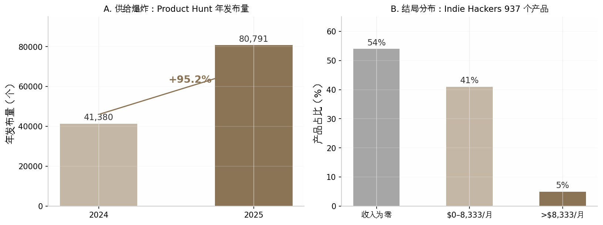

*图 0-1：一人公司黄金时代的两面。A：Product Hunt 年发布量 2024→2025 增长 95.2%（Antonio Sánchez 对 26.3 万条发布记录的独立分析，2026-02）[^14^]；B：Indie Hackers 937 个 Stripe 验证收入产品的分布（ScrapingFish，2022 年数据，至今仍是被引最广的基准）[^2^]。两个面板必须放在一起读：门槛降低让更多产品得以发布，但需求侧的注意力没有同步扩容，竞争烈度与失败率同步上升。*

这组数据的趋势含义是：到 2026 年，"能不能做出来"已不再是独立开发的筛选变量——AI 解决了供给侧；"能不能被看见、被付费"成为唯一的筛选变量。本报告的全部模式划分正是围绕这个变量展开的。

### 报告方法与阅读指南

#### 八种模式的划分逻辑：按分发引擎而非产品形态

市面上多数同类文章按产品形态分类（SaaS、App、插件、游戏），本报告刻意改用另一个轴：**分发引擎**，即"用户从哪里持续地来"。理由来自对 8 组案例的横向比对：它们的技术栈从 vanilla PHP 到 Next.js 到 LÖVE/Lua 各不相同，没有一种模式的壁垒是代码；但每个成功案例背后都有一台明确且可命名的获客机器——Pieter Levels 的 93 万 X 粉丝、Danny Postma 的搜索排名、WideBundle 的 Shopify 商店流量、阴明的 Reddit 私信。产品形态决定你做什么，分发引擎决定你活不活得下来。据此，第 2–9 章依次拆解八种模式：公开建造型（受众）、SEO 驱动型（搜索排名）、平台寄生型（平台商店）、垂直 SaaS 型（行业关系与口碑）、开源变现型（社区采用率）、内容/知识变现型（认知资产）、套利型（速度本身）、游戏型（热爱驱动的彩票）。表 0-1 是全书导航。

**表 0-1：八种模式速览（峰值收入均为特定时点口径，详见对应章节）**

| 章 | 模式（分发引擎） | 代表案例 | 峰值收入 | 收入曲线类型 |
|---|---|---|---|---|
| 2 | 公开建造型（社媒受众） | Pieter Levels / Photo AI | $132–138K/月（2025-11，本人披露；2026-08 回落 $89K）[^16^][^17^] | 复利叠加脉冲 |
| 3 | SEO 驱动型（搜索排名） | Danny Postma / HeadshotPro | 约 $300K/月（2024 年内，媒体口径，一次性付费业务）[^18^] | 脉冲+长尾 |
| 4 | 平台寄生型（应用商店） | Mat De Sousa / WideBundle | $50K MRR（约 2023，本人披露）[^19^] | 复利，但被平台封顶 |
| 5 | 垂直 SaaS 型（行业深井） | Ilia Pirozhenko / Perfect Wiki | 约 $25K/月（2025-04，本人披露）[^20^] | 慢复利 |
| 6 | 开源变现型（社区信任） | Simon Hamp / NativePHP | 约 $60K/月（2026-06，本人披露）[^21^] | 慢复利 |
| 7 | 内容/知识变现型（认知资产） | 哥飞出海社群 | 年化约 ¥520 万（2024-10，第三方推算）[^22^] | 订阅复利 |
| 8 | 套利/阶段性收割型（速度） | 阴明 / SeeU.Food | 生命周期总收入近 $9 万（2025，本人披露）[^23^] | 脉冲（约 3 个月） |
| 9 | 游戏型（热爱） | LocalThunk / Balatro；Eric Barone / 星露谷 | 500 万份（2025-01 官方）[^24^]；5,000 万份（2026-02 官方）[^25^] | 彩票 |

解读：这张表最值得注意的不是峰值收入的高低排序，而是**峰值与曲线类型的组合**。绝对值最高的 HeadshotPro（约 $300K/月）恰是一次性付费业务，其"月收入"本质是脉冲销售的长尾堆积，与 SaaS 的 MRR 不可直接比较；而收入最低的 SeeU.Food（总收入近 $9 万）却是八种模式中唯一"按计划离场"的——它的评估指标不是峰值而是周转效率。曲线类型一栏预告了第 10 章的核心分析框架：复利型用时间换资产、脉冲型用速度换现金流、彩票型用超长投入换尾部概率，三者没有优劣，只有与个人资源禀赋的匹配度。读者可按"见效时间"和"失败后沉没成本"两个维度先在表中定位自己，再决定精读哪几章。

#### 数据口径声明：三层置信度与阅读纪律

本报告的数字分三层置信度，正文逐一标注：**官方披露**（公司公告、官网计数器、平台财报，如 Balatro 的 500 万份）；**本人自述**（创始人博客、推文、播客中的收入披露，如 Levels 的月收入截图，正文标注"本人披露/自述"）；**第三方估算**（媒体拆解与数据分析机构的推算，如哥飞社群的年化收入，标注"第三方估算"或"推算口径"）。所有收入数字带"来源+时间点"双标注——独立开发的收入波动以月计，脱离时点的 MRR 没有意义。媒体猜测类数字（如创始人净资产）一律不作为事实引用。

最后一条阅读纪律回到本章标题：这 8 组案例是从幂律分布尾部选出的教材，它们的价值在于揭示**机制**（分发引擎如何运转、成本结构如何设计、危机如何处理），而非许诺结果。Levels 做过 70 多个项目、仅约 5% 赚钱[^10^]——连本报告最成功的案例，其本人命中率也接近行业基线。预计未来几年 AI 将继续压低开发成本、抬高分发成本，这意味着表 0-1 中"分发引擎"一栏的权重只会更高：选对获客机器，比选对产品创意更接近这个行业的真实胜负手。

---

## 2. 公开建造型（Build in Public）——Pieter Levels

上一章给出的行业基线是残酷的：Indie Hackers 上 937 个接入 Stripe 验证收入的产品中，54% 收入为零，仅约 5% 月入超过 $8,333。本章要拆解的 Pieter Levels 恰恰站在该分布的最右尾——2025 年 5 月其产品组合月收入约 $259K（本人 X 面板快照口径），2025 年 7 月 Stripe 播客中 John Collison 口述其生意"年收入 310 万美元"并得到本人确认[^26^][^27^]。理解这个尾部样本如何形成，是理解后续七种模式的起点。

### 2.1 模式定义与核心逻辑

#### 2.1.1 一句话定义

公开建造型（Build in Public，简称 BIP）指开发者把产品构思、开发过程、收入数据乃至失败记录实时发布在公开社交媒体上，让"建造过程本身"成为获客内容。其商业实质是：透明即营销，受众即渠道。Levels 本人的实践被 36 氪概括为"产品是内容，做的过程是传播"——他十一年间发布的所有内容都是其正在做的事情本身[^28^]。

#### 2.1.2 底层逻辑：受众积累的复利效应

该模式的护城河不是代码而是时间。Levels 2013 年 7 月注册 X（原 Twitter），2023 年 Photo AI 发布时已有约 35 万粉丝，2026 年 8 月实测约 92.7–93 万，日均净增约 700 人[^29^][^30^][^17^]。这个受众资产直接兑换为冷启动优势：Photo AI 首周即获约 200 个付费用户、$5.4K MRR，而无受众的同类产品首月收入通常只有 $500–2,000，差距约 3–10 倍[^16^][^31^][^32^]。受众积累符合复利曲线——前五年几乎看不到回报，第十年每个新产品都自带首发流量。第三方测算认为，复制这条路径需要 5–10 年日更，"如果你没有 10 年可等，需要别的打法"[^33^]。

#### 2.1.3 本模式的参照系地位

本报告将公开建造型设为其余七种模式的对比基准，原因有三。第一，它的数据透明度最高——Levels 持续公开收入、成本、粉丝数，是少数能还原完整收入曲线的案例；第二，它定义了"受众资产"这个变量，后续章节中 SEO 型（流量资产）、平台寄生型（租用流量）、内容变现型（认知资产）都可以表述为对该变量的不同解法；第三，它暴露了 BIP 的两个结构性约束——以年计的见效周期和对单一平台（X）的流量依赖，这两个约束正是其他模式试图绕开的目标。阅读后续章节时，可用三组数字校准：粉丝 93 万（2026-08）、组合月收入峰值约 $259K（2025-05）、从首次发推到年入百万美元用了约 6 年[^17^][^26^][^34^]。

### 2.2 代表案例深度拆解

#### 2.2.1 背景：从音乐人到"永不上班"

Pieter Levels（1987 年生，荷兰人）的第一桶金与编程无关。大学期间他是 drum & bass 电子音乐制作人和 DJ，YouTube 刚推出创作者分成计划时他是最早上传音乐的人之一，AdSense 收入从 $1,000/月涨到 $2,000/月，高峰时约 $8,000/月（本人自述）——这笔钱供养他读完大学，也给了他"不上班"的底气[^35^][^27^]。学历方面需要纠正一个流传甚广的误传：他并非"MBA 退学"，而是在 4 所大学读过商科后，于 2012 年从鹿特丹管理学院（RSM）正常获得 MScBA 硕士学位；其间 2009 年在韩国高丽大学商学院交换三个月，这是他第一次离开欧洲，直接埋下了日后出走亚洲的种子[^36^]。

毕业后的真实处境远非光鲜。他靠 YouTube 收入生活，拒绝求职——"my goal was to never have a boss"（我的目标是永远不有老板）[^37^]。约 2013 年（27 岁），YouTube 收入缩水到约 $500/月，他独自在亚洲的酒店房间里"盯着天花板"，自认"loser"，陷入抑郁（本人自述）。转折来自父亲的一句话："抑郁了就去拿铲子铲沙，动起来。"他于是把这句话数字化：2014 年 3 月公开宣布"12 Startups in 12 Months"挑战，每月发布一个产品[^35^][^38^]。这个以心理健康自救为初衷的挑战最终只完成约 8 个产品，绝大多数失败，但跑出了 Nomad List 和 Remote OK 两台持续十余年的现金机器[^39^][^40^]。

#### 2.2.2 时间线：四次关键发布

Nomad List 的起点是一张公开的 Google 表格。2014 年 Levels 在东南亚旅行时做了一张对比各城市网速、生活成本、安全的表格并开放编辑权限，次日醒来已有近百个陌生人协作填写数据；2014 年 7 月 29 日他把它做成网站上线（MVP 成本约 $100），首日同时登顶 Hacker News 与 Product Hunt，分别带来 50,000 和 12,000 访客，首日收入约 $600（$25 会员费）；上线第一周，WordPress 母公司 Automattic 创始人 Matt Mullenweg 主动发邮件要求赞助，每月数千美元[^41^][^42^][^43^]。2015 年 2 月，因用户反复追问"去哪找远程工作"，他把 Nomad List 站内职位页拆分为独立产品 Remote OK，企业付费 $199/条发布职位；2021 年 11 月他花 $100,000 买下 remoteok.com 域名[^44^]。

第三次跃迁来自 AI。2022 年 8 月 Stable Diffusion 开源后，他连续实验："不存在的房子"演示站、Interior AI（房间照片 AI 重设计，首周 $10K）、Avatar AI（2022 年 10 月底上线，首日 $10K、首周约 $150K，是他当时单周收入纪录）。但 Avatar AI 随即被有 VC 支持、有 iOS 团队的 Lensa AI 碾压（对方单月流水 $30M 以上），他判断卡通头像是一阵风，转向更难被抄袭的"真实感照片"，用 3–4 周做出 Photo AI 的 MVP，2023 年 2 月 10 日发布[^16^][^45^][^35^]。第四次跃迁是 fly.pieter.com：2025 年 2 月 22 日（Karpathy 提出"vibe coding"概念后约两周），从未做过游戏的他用 Cursor 约 3 小时做出浏览器多人飞行模拟器并全程在 X 直播建造，当天开始出售游戏内广告位（$5,000/月起），第 3 天 Elon Musk 转发，第 17 天宣布达到 $1M ARR、$87K MRR、累计 32 万玩家（本人披露）[^46^][^47^]。

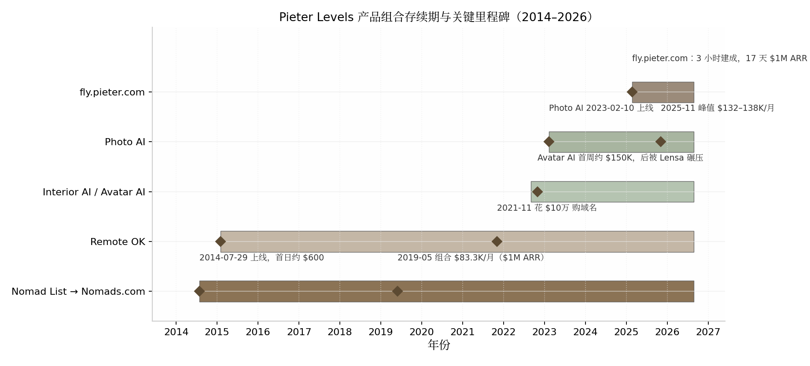

*图 2-1：Pieter Levels 产品组合存续期与关键里程碑（2014–2026）。横条表示产品上线至 2026-08 仍在运营的存续期，菱形为关键收入/流量事件。数据来源：levels.io 项目清单、本人推文存档、Lex Fridman #440 转录、IH 案例汇总[^48^][^16^][^46^][^42^]。*

表 2-1 将上述时间线压缩为数字口径，便于与后续章节案例对照。

**表 2-1：Pieter Levels 关键节点与收入数据（2014–2026）**

| 时间 | 事件 | 关键数据 | 数据性质 |
|---|---|---|---|
| 2014-07-29 | Nomad List 上线 | 首日 62,000 访客、收入约 $600 | 本人多次转述 [^42^][^40^] |
| 2014 年底 | 会员+赞助 | 约 $3,000/月 | 本人访谈 [^43^] |
| 2015-02 | Remote OK 上线 | 招聘位 $199/条 | 多源一致 [^44^] |
| 2018 年 | 组合年收入破 $600K | Nomad List $15–25K/月，Remote OK 约 $10K/月 | 本人演讲+二手汇总 [^38^][^40^] |
| 2019-05-30 | 组合 $83,333/月 = $1M ARR | 11,996 客户、208 个 cron、1 台 VPS、$0 广告 $0 融资 | 本人推文存档 [^34^] |
| 2020-12 | 年收入 >$1M | 年请求量 14 亿、月活 100 万+ | 本人博客 [^49^] |
| 2022-10 末 | Avatar AI 上线 | 首日 $10K、首周约 $150K | 本人自述 [^45^][^35^] |
| 2023-02-10 | Photo AI 上线 | 首周 $5.4K MRR | 本人推文 [^16^] |
| 2025-02-22 | fly.pieter.com 上线 | 3 小时建成、17 天 $1M ARR、32 万玩家 | 本人推文+博客日志 [^46^][^47^] |
| 2025-05 | 组合约 $259K/月 | Photo AI $125K + Remote OK $41K + Interior AI $40K 等 | 本人 X 面板快照 [^26^] |
| 2026-08 | Photo AI 回落至 $89K/月 | 组合 bio 口径约 $180K/月 | 本人 X bio 实时披露 [^17^][^50^] |

解读：这张表最刺眼的特征不是增长速度，而是**密度与断档并存**。2014–2019 年五年间，收入从 $600/日爬到 $1M/年，年化增速并不惊人；真正的台阶出现在 2022 年之后——Avatar AI 首周收入就超过了 Nomad List 前五年的任何一个月。这说明 BIP 模式的前期积累（受众、发布肌肉、口碑）在 AI 技术拐点出现时兑现为数量级的杠杆：同样的发布动作，2023 年的转化效率是 2014 年的数百倍。另一个异常值是 fly.pieter.com 的 17 天 $1M ARR——它证明到 2025 年，Levels 的受众资产已庞大到可以把"3 小时的实验"直接变现为百万美元年化，但这种速度依赖 Musk 转发这类不可复制的运气成分，不应作为基准预期。

#### 2.2.3 收入数据：Photo AI 的完整弧线

Photo AI 是本报告追踪到的数据链最完整的单人产品收入曲线：2023 年 2 月 10 日上线为 $0；第 1 周约 $5.4K MRR（约 200 付费用户）；第 2 月 $28.7K（约 600 订阅）；第 5 月（2023-07-03）$61.8K、1,872 名付费客户——当天他那条"14,000 行原生 PHP"的技术栈推文获得 480 万浏览；第 12 月约 $77K；第 19 月（2024-09）突破 $100K MRR（ARR $1.2M，约 1,600 订阅）；2025 年 11 月（第 33 月）达峰值 $132–138K（约 2,000 订阅，ARPU $60–70）；2026 年 8 月回落至 $89K/月（本人 X bio 实时披露）[^16^][^51^][^52^][^17^][^50^]。

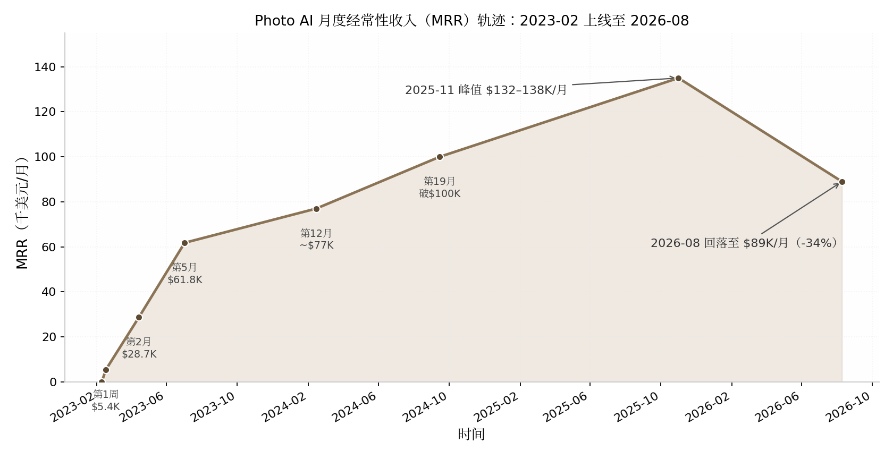

*图 2-2：Photo AI MRR 轨迹（2023-02 至 2026-08）。峰值取 $132–138K 区间中值 $135K 绘制。数据来源：本人历次推文披露、IH Deep Dive 汇总、2026-08 X bio 实测[^16^][^51^][^17^]。*

这条曲线有两个分析价值。其一，增长前快后缓：前 5 个月完成 $0→$61.8K，但从 $77K 到峰值 $135K 用了 21 个月——AI 消费品的早期增长靠新奇性与受众首发，后期增长靠口碑与 SEO 类慢变量。其二，峰值后约 9 个月回落 34%（$135K→$89K），验证了"脉冲型衰减不只属于套利型产品"的判断——AI 消费品收入呈正态分布式生命周期。Levels 本人 2026 年 6 月给出的解释是：Remote OK 第 6 年见顶、Nomads 第 8 年见顶，"而 AI 产品生命周期更快，可能 4 年左右见顶（就像 Photo AI）"[^53^]。

#### 2.2.4 现状（2026 年 8 月）

全部产品在线运营：Nomad List 已于 2024 年 11 月更名 Nomads.com，remoteok.com、photoai.com、interiorai.com、fly.pieter.com 均标记为活跃[^54^][^48^]。按 2026 年 8 月其 X bio 实时披露：Photo AI $89K/月、Vibej.am $44K/月、Interior AI $27K/月、Nomads $16K/月、MAKE（电子书）$6K/月，合计约 $180K/月——Photo AI 仍占约一半但处于回落通道[^17^][^50^]。一个反直觉的动作是，他正主动压低收入换社区活性：把 Nomads 会员费降至 $1（第三方测评显示 2025-11 正常定价 $299.98，按原价本可有 $40–50K/月），并考虑转向赞助模式[^55^][^53^]。此外，X 创作者分成已成为一条意外的第二曲线：2026 年 7 月单月 $21,547，平台累计 payout 超 $218K（本人截图口径）——受众本身开始直接产生现金流[^56^]。

### 2.3 日常作息与开发节奏

#### 2.3.1 一个"反效率博主"的工作日

Levels 的作息与主流生产力叙事几乎处处相反。他凌晨 2 点睡、上午约 10 点起，V60 手冲咖啡后打开电脑先看 bug、再开始写代码；几小时后自己做饭，第二杯咖啡，继续工作[^35^]。他不用任何重型生产力系统：待办事项是一张巨大的 A3 纸手写清单，每天挑约 3 件事做，"看到纸上被划掉的历史任务就是动力"；他曾试过 iPad 手写日历，一周后放弃——"我直接给自己发条消息就够了"[^57^]。真实工作时段每次 4–12 小时不等，工作与生活不分割："我不喜欢工作在某个时间点停止。"[^57^] 他不开会、不做电话沟通、不回私信，设备常年 00:00–23:59 勿扰模式；谈到为什么坚持单人，他给出了被广泛引用的原话："You have a meeting with three people and then you get these compromise results… I think it breeds averageness."（三个人的会议只会得到妥协的结果，这滋生平庸——你要么需要一个领导者，要么就单干。）[^35^] 其 2021 年名篇《Why I'm unreachable》给出一天的时间账：健身 1.5 小时、散步 1 小时、亲友联系 1.5 小时、做饭吃饭 1.5 小时、深度工作 4 小时、亲密关系 1 小时，"全部排满"[^37^]。

#### 2.3.2 冲刺与维护的双模节奏

他的节奏不是匀速的"每天 4 小时"，而是两种模式的切换：维护性工作可以忍受碎片打断，但创造新东西需要不被打扰的整块时间——"I'm better maintaining stuff when there's a lot of disruptions than creating new stuff."女友去巴黎的一周"像天堂"，他就熬夜吃巧克力写代码、下午一两点才起床不停写；进入 AI 创作期时甚至熬到早上 6 点，"I cannot sleep because it's too important."[^35^] 发布侧的强度同样惊人：十年累计发推约 12.5 万条（日均 40 条，本人 2025-07 口径）；2026 年 8 月第三方实测日均 7.8 帖，其中 78% 是转发/回复，回复中位数仅 39 字符——高频但低单条成本，互动本身即是内容生产[^27^][^56^]。对后续章节的参照意义在于：BIP 模式的"工作量"有相当部分不是写代码而是维持公开存在感，这是隐性成本。

### 2.4 技术栈与工具链

#### 2.4.1 极简栈：vanilla PHP 的意外胜利

Levels 的全部生意跑在"背包里的一台笔记本"加单台低价 VPS（$40/月量级）上：vanilla PHP（无框架）+ HTML/CSS + jQuery + SQLite 单文件数据库，支付用 Stripe；2026 年 Photo AI 的主文件仍是一个 40,870 行的 index.php[^58^][^51^][^59^][^35^]。他对这套栈的解释毫无技术浪漫："I think it's accidental… when my startups started taking off, I didn't have time to [learn Node.js]… 'One day I'll start coding properly,' and I never got to it."（纯属意外……项目起飞后没时间学新技术，"总有一天我会好好写代码"，但一直没等到。）[^35^] 自动化靠数百至上千个 cron 定时脚本（他称之为"robots"）驱动：2019 年 5 月披露 208 个，其著作 MAKE 中称"视服务器负载约 700–2,000 个"；配合自建 healthcheck.php、UptimeRobot 关键词监控和 Telegram 报警，故障 1 分钟内知晓，曾单周做到"100.000% uptime"[^34^][^60^][^35^]。这套架构的启示不在技术选型本身，而在维护成本：单人公司的技术栈首要标准是"十年后我一个人还维护得动"，而非社区时髦度。

#### 2.4.2 AI 工具链与成本结构

2025 年起他的工具链全面 AI 化：主力 IDE 为 Cursor（fly.pieter.com 100% 由其生成），Grok 辅助服务器端代码、Claude 做对话辅助；2026 年 6 月宣布"VPS-only"工作流——全部生产环境跑在 VPS + Claude Code 上，该长帖获 120 万浏览[^52^][^61^]。运营环节同样用 AI 替代人力：用 GPT API 审核 Nomads 四万人社群（mute 代替 ban），用 ChatGPT 分析 Stripe 数据并优化催付 webhook，把支付失败挽回率从 20% 提到约 40%[^27^][^51^]。成本侧的数字必须标注时间口径：广为流传的"Photo AI 月成本约 $13K（Replicate GPU $12K + VPS $40 + 杂项）、净利率 87%+"是 2025 年口径；2026 年 3 月他披露 GPU 账单一度涨到 $47K/月，切换 Nano Banana 2 模型后降至 $22K/月、"恢复了 80% 利润率"[^16^][^51^][^62^]。到 2026 年 6 月，他称组合业务利润率达 95%，且"大部分收入已存下并再投资，投资回报现在超过业务带来的约 $200K/月"[^53^]。GPU 账单的三级跳（$12K→$47K→$22K）说明：AI 产品的成本结构受上游模型定价支配，单人开发者对此毫无议价权，这是该模式在 AI 时代新增的脆弱点。

### 2.5 获客与增长

#### 2.5.1 冷启动：产品自带传播性

Nomad List 的冷启动常被误读为"运气好上了 HN 首页"。完整的因果链有三环：其一，2014 年前他已在 Twitter 和 Hacker News 社区活跃多年，有基础受众；其二，产品形态自带传播——一张开放编辑的 Google 城市评分表让近百个陌生人主动成为协作者和传播者；其三，上线即收费（$25 会员）把流量直接兑换成收入与口碑话题[^41^][^42^][^63^]。到 Photo AI 时代，冷启动已简化为"Built it → Shipped it → Tweeted it"：没有 Product Hunt、没有 HN、没有新闻稿，35 万粉丝就是全部渠道[^16^]。

#### 2.5.2 长期引擎：收入里程碑即营销事件

BIP 的复利在于每一次披露都在为下一次发布蓄能。他的增长引擎是一个自增强回路：发布产品→公开收入截图→收入数字本身成为病毒内容（那条 $61,808/月的技术栈推文获 480 万浏览）→涨粉→下个产品首发流量更大[^16^][^33^]。付费广告预算原则性为零——2019 年 $1M ARR 里程碑推文明确写"0 ad budget"；仅有的例外是增长黑客式玩法：新年花 $3,000 送 MacBook Pro 做转发抽奖，获 146 万曝光，CPM $2.05 约为当时 Twitter 广告 CPM 的三分之一[^34^][^64^]。2026 年出现新的渠道变量：ChatGPT 引荐流量在一个月内从 Google 流量的 4% 涨到 20%，他的判断是"我作为一个人做不了 SEO，这对我有利"——AI 搜索偏好引用真实个人内容，反而绕过 SEO 工业体系[^27^]。

### 2.6 变现路径与商业模式

#### 2.6.1 从 Day 1 收费原则

Levels 的定价哲学可以用两句原话概括："I think it's best to start and just start asking people for money in the beginning… you need to make at least $30 or more on a user to make it worth it for you."（一开始就收钱……单人开发者单用户至少要赚到 $30 才值得做。）以及"Free users generally don't convert."（免费用户通常不会转化。）[^35^] Nomad List 的 $5 入群费最初只是为挡垃圾账号，随需求验证逐步提到 $10、$25、$100 以上；Photo AI 从第一天收费、永不设免费档[^63^][^65^][^16^]。他甚至愿意为重资产定价信号付费：2021 年 11 月花 $10 万买下 remoteok.com 域名[^44^]。

#### 2.6.2 混合定价与收入构成

与单一订阅制 SaaS 不同，他的组合是四种变现形态并存：一次性会员、按条付费、订阅、广告/内购。这种组合天然对冲了单一模式的生命周期风险——Photo AI 回落时，Vibej.am 与 Interior AI 补位。

**表 2-2：Levels 产品组合的变现结构（定价为各时点口径，月收入为 2026-08 X bio 口径）**

| 产品 | 变现模式 | 定价演变 | 月收入（2026-08） | 成本/利润特征 |
|---|---|---|---|---|
| Photo AI | 订阅四档 | $19/$49/$99/$199 每月，年付最多送 6 个月 [^51^] | $89K [^17^] | GPU 月成本 $12K→$47K→$22K，利润率 80–87% [^16^][^62^] |
| Vibej.am | 订阅/社区 | 未公开细分 | $44K [^17^] | — |
| Interior AI | 订阅 | — | $27K [^17^] | 托管 $300/月，毛利 >99% [^66^] |
| Nomads.com | 一次性会员 | $5→$99→$299.98→主动降至 $1/Lite $9.99/Lifetime $19.99 [^65^][^55^][^67^] | $16K（压价后） [^17^] | 近乎零边际成本 |
| Remote OK | 按条付费 | $199/条（2015）→$599–$4,143/条（2026） [^44^][^68^] | 2025-05 口径 $41K [^26^] | 利润率报道高达 94% [^69^] |
| MAKE / levels.io | 电子书/内容 | 预售即售 $50K | $6K [^17^] | 近 100% 毛利 |
| fly.pieter.com | 广告位+内购 | 广告位 $5,000/月起、F-16 皮肤 $29.99 [^46^] | 2025-05 口径 $15K [^26^] | 服务器成本极低 |

解读：这张表揭示了 BIP 模式变现的一个反直觉特征——**定价权来自受众而非产品复杂度**。Remote OK 本质上是一个 CRUD 招聘板，却能把单条职位发布从 $199 卖到最高 $4,143，因为它面对的是"远程岗位"这个有明确付费意愿的 B 端场景，且十年积累的品牌让雇主愿意为曝光付费。另一个信号是收入结构的再平衡：2025-05 快照中 Photo AI 占比约 48%（$125K/$259K），到 2026-08 升至约 49% 但绝对值下滑 29%，而 Vibej.am 的 $44K 全部来自 2025 年后的新实验——组合内部永远有"下一代产品"在接棒，这是他用高频发布对冲单品生命周期的直接证据。对模仿者的硬约束是：这套组合的前提是 87–99% 的毛利率，一旦产品成本结构依赖第三方 API 定价（如 GPU），利润表就不再完全由自己控制。

### 2.7 决策思路与关键转折点

#### 2.7.1 不上班、不融资、用数量对冲不确定性

Levels 从未有过任何正式工作，也从未融资。VC 多次进入他的私信，他的拒绝理由很具体："I don't want the stress of having to grow my revenue to a $100M/y company or go to $0."（我不想承受"要么做到年入 1 亿美元、要么归零"的压力。）[^29^] 选题逻辑分两阶段：没钱时是"统计思维"——"I need to build all these things and one of these will work out probably"，70 多个项目仅约 4 个赚钱（约 5% 命中率，本人 2021-11 推文）；有钱后转为"技术好奇驱动"——先玩 Stable Diffusion，机会在玩耍中浮现[^35^][^46^]。他的验证纪律是两周内上线、让用户掏钱、用市场而非自我判断做筛选："they need to take out their credit cards, pay me money, and then I can see if the idea is validated. And most ideas don't work."[^35^] 需要向读者强调：5% 的命中率意味着 BIP 模式的"快速发布"不是成功捷径，而是用大量可承受的失败换取尾部命中——这与第 1 章的幂律分布基线完全一致。

#### 2.7.2 危机应对：用速度对抗抄袭

最大的一次危机是 Avatar AI 被 Lensa AI 用资本和 iOS 渠道碾压（对方单月 $30M+）。他的反应出人意料地平静："I was a little bit sad because… I never had real fierce competition… but it's good."随后放弃"cheesy"的头像路线，转向更难被抄的真实感照片[^35^]。Photo AI 2023 年中起面临数十家有融资的克隆产品围攻，他的应对始终是更快的发布速度——竞对抄走的是功能快照，抄不走的是持续迭代的节奏与背后的受众信任[^16^][^70^]。第二类危机来自 AI 业务本身的精神压力："this AI stuff is so stressful because you always need to stay ahead of the game… it fucks with your sleep."（2023-10，Arvid Kahl 播客）[^29^] 到 2026 年，他的对冲策略已经成型：95% 利润率下把利润存下再投资，使"投资回报超过业务带来的约 $200K/月"——当产品收入注定按 4 年周期衰减时，资本收益成为第三增长曲线[^53^]。

### 2.8 效率密码

#### 2.8.1 自动化栈：让"robots"替代运营团队

Levels 单人运营六个产品的核心不是时间管理技巧，而是把重复劳动脚本化。其 MAKE 书中的原话是这套哲学的纲领："Hiring is increasing the complexity of your product, business and life… Robots can be simple. They're also very fast."（招聘是在增加产品、生意和生活的复杂度……机器人可以很简单，而且快得多。）他披露同时运行的定时脚本"视服务器负载约 700–2,000 个"（2019 年为 208 个）[^60^][^34^]。监控同样自助：每个 JavaScript/PHP 错误实时推送到 Telegram，"开始时被错误淹没，现在几乎为零"；没有测试环境，直接部署生产——"在任何大公司这都是愚蠢的，但对我有效"[^35^]。人力只保留三个微型外包位：客服专员（2020 年 12 月才雇第一名）、服务器应急运维、社群管理员，其余全自己做；AI 时代连社群审核都交给 GPT API："I can either hire people or I can just use the GPT API… I like to create things."[^49^][^27^]

#### 2.8.2 组织极简主义：砍掉一切同步沟通

效率的另一半是做减法：不开会、不做 call、不回 DM，理由是"Talk is cheap and ineffective while creating something is much more challenging and effective."[^37^] 对工具与装备同样警惕："I'm suspicious of more. Do you really need all the stuff? It might slow me down actually."[^35^] 这套组合（极简栈降低维护成本 + cron 消灭运营 + 零会议保住深度工作 + 公开建造让每个产品互为营销 + 快速发布让市场做筛选）才是"一个人做很多"的完整解释——其中任何一条单独模仿都不产生复利。

### 2.9 当下可行性评估（2026 年）

#### 2.9.1 门槛降低与赛道拥挤并存

AI 编程工具把"做出产品"的成本压到历史低位：Cursor 年化收入从 2025 年 6 月的 $5 亿冲到 2026 年 2 月的 $20 亿，Claude Code 上线 6 个月即达 $10 亿年化[^11^][^12^][^13^]。供给侧随之塌方：Product Hunt 年发布量从 2024 年的 41,380 个暴涨至 2025 年的 80,791 个（+95.2%），其中 AI 类占 39.1%[^14^]。对 BIP 模式这意味着双向挤压：一方面，Levels 本人证明 AI 工具能把 3 小时的实验变成 $1M ARR，"能不能做出来"不再是问题；另一方面，"发布"与"被看见"成为新瓶颈，而他花十年积累的 93 万粉丝无法速成——复制其分发资产需要 5–10 年日更[^33^]。中文社区 2025–2026 年的共识与此一致：BIP 仍是冷启动最优解，但已非蓝海，"不要只宣传产品，要分享真实的思考和困惑"才有壁垒[^71^][^72^]。行业基线同样适用：典型创始人到 $1K MRR 需 12–18 个月，82% 永远到不了 $5K MRR[^7^]。预计 BIP 模式 2026 年后将进一步分化：头部少数账号拿走绝大多数注意力，腰部以下"晒收入截图"的内容边际价值持续递减。

#### 2.9.2 风险与给新手的第一步

该模式最大的单点故障是对 X 平台的流量依赖：93 万粉丝、每月 $21.5K 创作者分成、新品首发渠道全部系于一个自己不拥有的平台，算法或账号政策变动即可同时打击获客与现金流[^17^][^56^]。Levels 本人 2026 年 8 月还观察到两个行业级逆风："SaaS 工具正被逆向工程并开源""独立开发者收入全行业在下降"（两条热帖分获 120 万/230 万浏览）[^56^][^73^]。给新手的第一步不是开账号日更，而是先有一个值得公开的真实项目：用 2 周做出可收费的最小产品并公开验证过程，把"建造日志"而非"成功宣言"作为内容主线；同时从第一天把邮件列表/独立站作为自有渠道备份，降低对单一平台的暴露。如果连 12 个月的零反馈期都无法承受，本章模式不适合作为首选。

### 2.10 模式适配画像

公开建造型的适配画像可以量化描述。适合性格：外向、表达欲强、能承受公开失败——70 多个项目约 95% 失败且过程全程直播，心理门槛远高于技术门槛[^35^][^46^]。启动资金：近乎零（Nomad List MVP 成本约 $100，单台 VPS $40/月量级）[^40^][^35^]。见效周期：以年计——Levels 从首次发推到年入百万美元用了约 6 年，到 Photo AI 的第 33 个月才见峰值[^34^][^16^]。收入天花板：组合口径约 $3.1M/年（2025-05 峰值约 $259K/月），且已证明单品会按 4 年周期衰减，天花板依赖持续推出下一代产品来维持[^26^][^53^]。对照后续章节，这个画像的三个稀缺项——十年耐心、公开表达欲、对单一平台风险的承受力——正是其他七种模式各自要绕开或替代的东西；预计 AI 工具会继续压缩"建造"环节的时间占比，但"被信任"环节的时间成本不会同步下降，这将使 BIP 模式的竞争从"敢不敢晒"转向"晒的是否值得看"。

---

## 3. SEO驱动型（闷声发财）——Danny Postma / HeadshotPro

### 3.1 模式定义与核心逻辑

#### 3.1.1 一句话定义：不建受众建排名，让搜索意图直接变现

SEO驱动型模式的核心动作只有一个：找到已经有稳定搜索量、但竞争极弱的关键词，围绕它做一个极窄的产品，把 Google 排名做到第一名，让带着明确付费意图的搜索流量直接转化为收入。Danny Postma 在 The Bootstrapped Founder 播客中把这套逻辑说得毫无修饰："I only build products where there's SEO… I only pick product ideas that have a lot of search and low keyword difficulty. Why? I hate marketing… You never have to do marketing because you're going to rank number one on Google."（我只做有 SEO 需求的产品……我只挑搜索量大、关键词难度低的点子。为什么？因为我讨厌营销……你永远不需要做营销，因为你会排上 Google 第一名。）[^74^]

这个定义里有三个可操作的筛选条件，全部来自他本人的披露：其一，关键词必须已有搜索量——产品不是创造需求，而是拦截需求；其二，关键词难度（Keyword Difficulty，Ahrefs 等工具对排名难度的 0–100 评分）要低于 10–20，此时"一两个外链就能上前排"[^74^]；其三，需求最好是交易型的——搜索者要的是"马上得到结果"，而不是"读一篇文章"。HeadshotPro 就是这套筛选器的标准产物：AI 职业头像，搜索者带着信用卡来，付 $29–$59，两小时后拿到照片，交易闭环结束。

#### 3.1.2 底层逻辑：搜索流量是"有保证的获客渠道"，与受众资产的本质区别

Danny 把 SEO 称为"有保证的营销渠道"（guaranteed marketing channel），这个词是本模式与第 2 章 Pieter Levels 模式的分水岭。他的原话是："I've seen so many indie hackers starting out who think building in public is going to bring them the customers. It could but it's gonna be such a smaller chance… So better just focus on guaranteed marketing channel like [SEO]."（我见过太多刚起步的独立开发者以为公开建造能带来客户。也许能，但概率小得多……不如专注于像 SEO 这样有保证的渠道。）[^74^]

两种模式的资产性质完全不同。Levels 积累的是**受众资产**：约 93 万 X 粉丝（2026-08），依附于人格、观点和持续曝光，优点是所有权在自己手里、可跨产品复用，代价是必须常年高密度输出个人观点——这是外向者的游戏。Danny 积累的是**流量资产**：一组关键词的排名位置，依附于域名权威与内容结构，不需要任何人认识" Danny Postma"这个人。他本人对此有清醒的自我认知——他的 X 粉丝从 200 涨到 87K（2023-08），但他承认"most of my followers came through Pieter because he kept retweeting me"（我的大部分粉丝来自 Pieter 的转发）[^74^]，即他的受众是借来的，而排名才是自有的。对内向者而言，这条路线的吸引力在于：获客系统可以在不发一条推文的情况下运转。

流量资产的可计算性是第二个本质差异。Danny 的方法论允许在写第一行代码之前算出收入上限："you can basically calculate what your monthly revenue could be if you're listed on number one"（如果你排到第一名，基本可以预先算出月收入）[^74^]——搜索量 × 点击率 × 转化率 × 客单价，四个变量都有工具可查。受众驱动的收入则几乎无法事先建模。

但必须指出这枚硬币的反面：流量资产的所有权不属于你。排名是 Google 授予的，Google 可以随时收回——算法更新、AI Overviews 截流、竞争对手堆外链，都是房东行为而非市场行为。3.9 节将用量化的数据说明，这位"房东"在 2024–2026 年间做了什么。受众资产需要养人，流量资产需要交租，这是两种模式各自的天花板来源。

### 3.2 代表案例深度拆解

#### 3.2.1 背景：从 $19 电子书到百万美元退出

Danny Postma，荷兰格罗宁根人，约 1994 年生。2015 年，21 岁的他还是一名自由职业转化率优化（CRO）顾问，因为给客户找落地页参考困难，在不会编程的情况下用 WordPress 搭了一个落地页设计画廊 Landingfolio——"I didn't know how to program at the time, so I built it using WordPress."[^75^] 这个网站至今仍在运行、日访数千，但始终难以变现，这段经历给他留下了两个终身信念：流量本身不值钱，能变现的流量才值钱；以及，不会写代码不是不做产品的理由。此后他背包旅行亚洲、自学编程，受巴厘岛联合办公空间的独立开发文化影响定居当地，约 2019 年成立产品组合壳公司 Postcrafts。[^76^][^77^]

第一个真正意义上的产品是 Headlime。前身是他与朋友合写的一本《200 个标题公式》电子书，定价 $19；2020 年 4 月疫情封锁期间，他在巴厘岛把它做成了"填空式标题生成器"，首周收入约 $48,000（Product Hunt 访谈口径；其 Starter Story 自述页另有"$60,000 in one week"的说法，两个数字均出自本人，口径或时点不同，并列标注）。[^78^][^79^] 2020 年 6 月，他直接写信给 OpenAI CTO Greg Brockman 要到 GPT-3 首批访问权限——"I decided to reach out directly to Greg Brockman, the CTO of OpenAI, to request access. Fortunately, I was able to get access as part of the first batch of users."[^75^]——随后 all-in AI，2020 年 12 月上线 AI 文案版 Headlime，一个月内 MRR 从 $1K 涨到 $6K，2021 年 2 月达 $20K。[^78^][^76^] 2021 年 3 月 17 日 TechCrunch 报道后环比增长约 100%，3 月 30 日他发推官宣将 Headlime 出售给 Conversion.ai（即后来的 Jasper），本人确认价格"over one million dollars"；Pieter Levels 当时按 $20K MRR × 12 个月 × 4 倍估算约 $1M，两个口径互相吻合。[^76^][^80^] 从 AI 版上线到七位数退出，只用了约 3–4 个月，尽调仅 1 周。

#### 3.2.2 时间线：ProfilePicture.AI 的 30 小时与 HeadshotPro 的 30 天

卖掉 Headlime 后 Danny 休息了近一年（结婚、买房、自称"越来越无聊"），直到 2022 年 8 月 Stable Diffusion 开源。他先做 AI 图库 StockAI，因生成质量和 Getty Images 法务风险放弃；2022 年 11 月与 Pieter Levels 上演了一次著名的"撞车竞赛"——对方周五晚发布同类产品，他周六早上线 ProfilePicture.AI。**这里必须修正一个在中文圈广泛流传的张冠李戴："30 小时建成"指的是 ProfilePicture.AI，不是 HeadshotPro**；前者确实 30 小时冲刺完成、上线一周做到六位数美元销售额，而 HeadshotPro 的建设周期约为 30 天（Starter Story 口径）。[^74^][^81^][^18^] 2022 年 12 月 Lensa 爆红，ProfilePicture.AI 的收入先被提振、随后持续下滑——这个"先升后崩"的曲线让他确认虚荣型需求（vanity demand）不可靠，转向刚需型的职业头像。

HeadshotPro 于 2023 年 3 月 16 日发推官宣、同天开启付费，上线两周收入突破 $100K（本人自述，累计收入口径而非 MRR）。[^82^][^79^][^83^] 2023 年 5 月 5 日，Indie Hackers 播客第 278 期以"组合产品收入过 $300K"为题播出他的访谈；2023 年 8 月他宣布首次招聘（机器学习工程师）并同时停止公开收入数字。[^84^][^74^] 关于其月收入峰值，多个二手来源称"上线一年内"（即 2024 年 3 月前后）达到 $300K/月，Starter Story 的拆解口径则为 2024 年 12 月约 $300K/月（≈$3.6M 年化）；由于 Danny 自 2023 年 8 月起不再披露收入，两个时点均无本人逐月数据支撑，本报告统一写作"**2024 年内达到约 $300K/月**"，并强调这是第三方单一源头的广泛转引，且 HeadshotPro 是一次性付费业务，媒体惯用的"MRR"实为当月收款额的类比口径。[^18^][^85^][^86^]

*图 3-1：Danny Postma 产品演进时间线（2015–2026）。从 Landingfolio 到 Headlime、ProfilePicture.AI 再到 HeadshotPro，每个产品都建在上一个的技术底座与流量资产之上。资料来源：本人访谈与播客转录、They Got Acquired、Starter Story[^75^][^76^][^18^]。*

从时间线可以读出一个模式化的节奏：**每个产品都是在上一个产品的技术底座和流量资产上长出来的**。Headlime 练出了 GPT 工程能力和"卖给 Conversion.ai"的退出经验；ProfilePicture.AI 练出了图像生成管线并验证了 C 端付费意愿；HeadshotPro 则是把这两者对准一个搜索量更大、付费意图更硬的关键词。三个产品之间没有一次是从零开始——这也是他能把建设周期从数月压缩到 30 天乃至 30 小时的真正原因：不是写得快，而是可复用的模块越来越多。

#### 3.2.3 收入数据：累计 $10M+ 的口径拆解

**表 3-1：HeadshotPro 收入数据与口径拆解（2023–2026）**

| 指标 | 数值 | 时间点 | 口径与来源 |
|---|---|---|---|
| 上线首两周收入 | $100K+ | 2023-03 | 本人自述，累计收款 [^79^] |
| 月收入峰值 | 约 $300K/月（≈$3.6M 年化） [^18^] | 2024 年内 | Starter Story 2024-12 口径，单一源头广泛转引；一次性付费业务的"月收入"，非订阅 MRR |
| 累计收入 | $10M+ [^87^] | 2026-08 | 官网披露，2023 年上线起累计 |
| 累计购买次数 | 217,879 次 [^88^] | 2023–2026 | 官网披露 |
| 累计交付 | 1,700 万+ 张头像 / 20 万+ 次拍摄 [^87^] | 2026-08 | 官网披露 |
| 定价 | $29 / $39 / $59 一次性；团队人均最低约 $15 [^88^] | 2025–2026 | 官网 |
| 退款率 | 3.3% [^88^] | 2023–2026 | 官网披露 |
| 联盟营销收入 | $50K+/月，占总收入 15%+ [^89^] | 2024–2025 | Rewardful 客户案例 |
| 月流量 / 每访客收入 | 222K 访问 / $1.35 [^18^] | 2024 末 | Starter Story，单一来源 |
| Trustpilot 评分 | 4.7 / 5，约 3,500 条评价 [^90^] | 2026 年中 | 第三方平台 |

这张表里最值得推敲的是交叉验证关系：联盟渠道 $50K+/月、占比 15%+，反推总收入约 $333K/月，与 Starter Story 的 $300K/月口径在误差范围内互相印证——这是全部收入数据中最硬的一组，因为它来自两条独立的信息链。[^89^][^18^] 其次是口径分层：$100K 与 $10M 都是"累计收款"，$300K 是"当月收款"，三者不可直接比较增长率；尤其"累计 $10M+"是官网营销口径，未经审计，但 217,879 次购买 × 约 $39 的中位客单价 ≈ $8.5M，与 $10M+ 的宣称在量级上自洽（团队单均价更高，可补足差额）。退款率 3.3% 则是被低估的质量信号：在一个"照片不像你就全额退款"的行业里，这个数字意味着自动质检流水线确实把废品拦截在了交付之前（详见 3.4 节）。

*图 3-2：HeadshotPro 收入里程碑（2023–2026）。柱为月收入（一次性收款口径），线为累计收入。数据来源：本人自述、Starter Story（2024-12 口径）、官网（2026-08）[^79^][^18^][^87^]。*

把上图的两个口径叠在一起看，可以读出一次性付费业务的独特形态：柱（月收入）与线（累计收入）之间没有订阅制那种"MRR 复利爬坡"，而是"高毛利脉冲 + 长尾累积"——上线两周的 $100K 是 Product Hunt 式发布与搜索需求积压释放的脉冲，2024 年内达到的约 $300K/月是 SEO 排名与联盟网络就位后的稳态，而 $10M+ 的累计线则是三年间 217,879 次一次性购买的加总。[^79^][^18^][^87^] 对读者最有用的推论是：这条曲线没有"MRR 复利"的保护，一旦搜索流量或品类需求逆转，月收入可以没有预警地回落——ProfilePicture.AI 被 Lensa 冲击后的轨迹就是预演。[^74^]

#### 3.2.4 现状 2026：从一人公司到微型企业

截至 2026 年 8 月，HeadshotPro 官网正常运营，产品形态已从"个人一次性头像工具"升级为企业级服务：SOC 2 Type II 合规、SAML 单点登录、数据保护协议（DPA）、AES-256 加密、输入照片 30 天自动删除、承诺不用客户照片训练模型，团队版采用 credits 制、5 人以上阶梯折扣，客户包括财富 500 强团队（官网点名 HubSpot 销售团队）。[^88^][^87^] 团队规模上，2023 年 9 月之前是 Danny 加妻子（每天兼职 2–3 小时客服）的纯家庭作坊，2024 年起以承包商和兼职起步建小团队，2026 年第三方盘点列为"约 3 人"规模（具体人数为单一来源）。[^74^][^75^][^91^] 2026 年 5 月，Danny 入选 Stripe Sessions 2026 的"35 位一人创业家"展示名单——平台级背书说明，即使团队扩到 3 人，这个案例仍被归入"一人公司"范式。[^92^]

### 3.3 日常作息与开发节奏

#### 3.3.1 巴厘岛生活与"每天多出 4 小时"的外包哲学

Danny 的作息设计围绕一个非显性资产展开：时区。巴厘岛的上午到下午 3 点，北美客户正在睡觉——"I get to work until 3pm without anyone messaging me… Social media is super quiet."（我可以工作到下午 3 点，没有任何人给我发消息……社交媒体超级安静。）[^74^] 与北美市场 12 小时的时差本身就是护城河：深度工作时段无人打扰，客服消息则可以心安理得地"晾 16 小时"——他的妻子每天早上处理 2–3 小时客服，其余时间无人值守。[^74^]

生活事务的外包是第二个杠杆。他把做饭、清洁、园艺全部外包（在印尼这只需每月几百美元），原话是："I wake up, I order my food, gets delivered to my house, house gets cleaned… I get to save four hours a day… so I can focus more on my company."（我起床、订餐送到家、房子有人打扫……我每天省下约 4 小时……这样就能更专注于公司。）[^74^] 按每月 22 个工作日折算，这相当于每月凭空多出约 88 个小时——接近一个全职员工半个月的工时。HeadshotPro 约 30 天建成的速度，正是建立在这种"个人时间密度"之上；但早期并不轻松——上线第一周服务器半夜反复宕机，他"凌晨 3 点被潜意识叫醒检查服务器"，全自动化的状态是事后建成的，不是第一天就有的。[^74^]

#### 3.3.2 自动化就位后每周约 10 小时："I just love to make robots"

2026 年的媒体转述称，自动化系统就位后 Danny 每周在 HeadshotPro 上只花约 10 小时——"He estimates spending about 10 hours per week on HeadshotPro now that the automated systems are in place."（需注意这是媒体转述其本人估算，未见一手推文。）[^83^] 他对自动化的态度近乎执念："I just love to make robots like I want to completely automate anything."（我就是喜欢造机器人，我想把一切都彻底自动化。）[^74^] 他只建"我离开一周也不会出事"的产品："I don't build tools and software that really rely on me always been there… I want to make tools where I could be gone for a week."[^74^]

这里有一个常被忽略的心理动因：Danny 自称疑似有注意力缺陷倾向——"I'm pretty sure I've add. So it's six months into HeadshotPro now and I'm like mentally unable to build any more features… I haven't built anything for three weeks."（我很确定我有 ADD。HeadshotPro 做到第六个月，我已经在精神上无法再加功能了……我三周没写代码了。）[^74^] 对产品维护期快速失去兴趣，既是他把公司做成机器人的原因，也是他后来决定招人、做产品组合的原因。这意味着"每周 10 小时"不是效率炫耀，而是一种与自身注意力结构相匹配的组织设计——对同样特质的人可复制，对享受长期打磨单一产品的人则未必适用。

### 3.4 技术栈与工具链

#### 3.4.1 Next.js 系栈 + AI 质检流水线

HeadshotPro 的工程栈是 2023–2026 年 AI 独立开发的主流配置：Python 后端与图像管线、Stable Diffusion/DreamBooth 微调起步（后期迁移至 SDXL/Flux 一代模型）、Next.js 前端、Stripe 收款、PostgreSQL 数据库，GPU 推理走 Replicate 类按秒计费的 API。[^79^][^66^] 真正构成差异的不是栈本身，而是模型管线。他在 Unite.ai 访谈中披露："Most competitors just use Stable Diffusion… We're different, we deploy dozens of additional open-source and custom developed models to improve output quality by 10x."（多数竞争对手只用 Stable Diffusion……我们不同，我们叠加数十个额外的开源和自研模型，把输出质量提升 10 倍。）[^75^] 其中两个关键组件：用多模态模型 LLaVA 自动过滤不合格的用户上传照片和"不适合职场"的生成结果；用 Codeformer 修复面部 AI 伪影。[^75^] 这套质检流水线是自研模型迭代一整年的成果，也是 3.8 节"一人服务 20 万客户"的技术前提。

#### 3.4.2 GPU 推理成本结构与一次性付费的现金流设计

Danny 从未披露 GPU 成本占比，第三方估算单次生成为"次美元"量级（sub-dollar），在 $29–$59 售价下毛利率估算 85–95%，上线初期总基础设施低于 $100/月——以上均为第三方估算口径，可作量级参考但不应视为披露数据；旁证是 2026 年 Replicate 上 A100 约 $0.0014/秒、FLUX 约 $0.025/张的公开价格。[^86^][^93^] 与订阅制 SaaS 相比，这个成本结构配合一次性付费产生了一个现金流上的不对称优势：客户先全额付款，GPU 成本随后按秒发生，不存在应收账款、不存在续费流失、不存在为留存而持续加功能的义务。即使按最保守的估算，一次 $29 的订单中推理成本不足 $1，退款成本占收入约 2–3%（二手转述），现金流从第一天起就是正的。这也解释了为什么该模式不融资也能滚动：它根本不需要营运资金。

### 3.5 获客与增长

#### 3.5.1 SEO 原教旨主义与程序化落地页结构

首先需要修正一个流传的标签：Danny 并非"anti-build-in-public"。他本人就是公开建造运动的深度实践者——2020–2023 年公开收入数据、粉丝从 200 涨到 87K，IMDb 简介称其为 Build In Public 运动的"prolific member"（高产成员）。[^74^][^94^] 准确的标签是**SEO 原教旨主义者**：他公开主张对没有受众的新人，公开建造带来客户的概率很小，SEO 才是可计算、可复制的首选渠道；2023 年 8 月起他自己也停止公开收入，只留下一句"I don't share revenue anymore. Sorry."[^74^] 换言之，他把公开建造当冷启动放大器用过，用完即弃。

执行层面是双轨制。第一条轨是程序化 SEO（programmatic SEO，即用模板批量生成结构化落地页）：围绕主词"professional headshots"（月搜索量 21K、关键词难度 23），上线 3 个月内做进 Google 前 10；同时批量生成 200+ 个城市/地区落地页（"professional headshots in San Francisco / Boston"……）吃长尾流量；Domain Rating（Ahrefs 的域名权威评分）从 35 升至 44，外链 21,000+。[^95^][^96^] 第二条轨是精确匹配域名策略：他花 $3,000 购入 headshotpro.com，逻辑是"HeadshotPro basically tells Google that you should rank number one for headshot… because it's in your domain name."（HeadshotPro 这个名字基本就是在告诉 Google 你应该在 headshot 这个词排第一，因为关键词就在域名里。）[^74^] 他自己也踩过坑：后续做"headshots near me"类型的薄内容程序化页面失败，被他当作反面教材写进了自己的 SEO 课程——这预示了 3.9 节将要展开的行业级打击。[^97^]

#### 3.5.2 联盟营销网络："I hate marketing"，但建了一台分销机器

Danny 说"I hate marketing"，但他建了占收入 15%+ 的联盟营销（affiliate marketing）网络：通过 Rewardful 平台给测评博主 20% 佣金，该渠道每月带来 $50K+ 收入。[^89^] 他的原话揭示了这不是自相矛盾而是同一件事的两面："I think without the affiliate program, fewer people would write about us… we're now working on becoming the #1 affiliate program in the industry."（我觉得没有联盟计划的话，写我们的人会少得多……我们现在正努力成为行业里第一的联盟计划。）[^89^] 他讨厌的是"做营销"这个动作（写内容、搞活动、维护关系），而不是营销的结果——联盟计划把动作外包给了有写作动力的博主，自己只维护分佣规则。同一逻辑延伸到外链建设：Product Hunt 发布的主要目的不是曝光而是外链——"Even coming in last is a win"（哪怕排最后一名也是赢），因为一次发布通常能收获 10–50 个转载外链。[^85^]

最精妙的是"竞品红利"机制。2023 年 Remini 在 iOS 爆红那一周，HeadshotPro 销量涨了三倍，因为他占据着"AI headshots"关键词第一名："I love it when I get a highly popular competitor because then they do marketing for me… everyone's googling for AI headshots and I'm ranking number one."（我特别喜欢出现爆红的竞争对手，因为他们替我做营销……所有人都在搜 AI headshots，而我排第一。）[^74^] 排名位置把对手的营销预算变成了自己的流量——这是流量资产相对受众资产独有的杠杆。

### 3.6 变现路径与商业模式

#### 3.6.1 一次性付费 vs 订阅：决策逻辑与 3.3% 退款率的品控含义

从 SaaS（Headlime）转向 B2C 一次性付费，Danny 给出过三条理由，全部来自本人披露：其一，他擅长转化优化，"You only have to get them once to buy"（你只需要让他们买一次）；其二，没有续费就没有持续加功能和维护客户关系的义务——"You don't have to add features because they don't pay monthly"，售后负担小，可以纯靠 SEO 和广告放量；其三，也是最具前瞻性的一条："a lot of people say you have to build a sustainable business… I'm more of like, get as much revenue upfront because your company, especially with AI, could be obsolete next year."（很多人说要建可持续的生意……但我更倾向于尽量前置收钱，因为你的公司——尤其是 AI 公司——明年可能就过时了。）[^74^]

定价锚定被替代物而非成本：个人档 $29/$39/$59，对标的是实体影楼——其官网调研 751 位摄影师得出的美国职业照中位价为 $232，常见报价 $200–$500。"Currently, you have to pay $300 if you want to get a photo shoot. If you can get that done for $39 and it almost looks the same…"[^74^][^88^][^98^] 退款政策是 100% 无条件保证（现行版无期限；旧版曾为 14 天且要求未下载才可退，政策演变见第三方测评），官网披露 2023–2026 年 217,879 次购买的退款率仅 3.3%。[^88^][^98^] 这个数字要反着读：在一个生成质量天然不稳定的 AI 品类里，敢承诺全额退款且实际退款率只有 3.3%，说明 LLaVA 质检流水线把绝大多数"一眼假"的废品拦截在了交付之前——退款率在这里不是财务指标，而是品控系统有效性的外部审计。

#### 3.6.2 SEO 课程：$106K/24 小时的知识变现第二曲线

2024 年 8 月，Danny 把自己的方法论产品化为 SEO 课程，采用预售阶梯定价：$49 起售、每 100 单涨 $10、稳定于 $69，24 小时内售出 2,149 份、收入 $106,000，落地页 10,531 访客、转化率 16%。[^99^] 这个事件的含义有三层。第一，他本人用真金白银验证了"SEO 选题法"在 2024 年仍是市场愿意付费的知识。第二，16% 的转化率来自他十余年 CRO 顾问的老本行——知识变现看似第二曲线，实际仍是同一套能力（流量×转化）在新 SKU 上的复用。第三，这也是一个信号：当从业者开始把方法卖给同行，往往意味着方法本身的套利空间正在收窄——这与 3.9 节的行业数据在时间线上吻合。

### 3.7 决策思路与关键转折点

#### 3.7.1 卖 Headlime 的三选一与"3x 不卖、等 8-10x"的算术

2021 年卖掉 Headlime 时，Danny 面对的是标准的三选一："I could get VC funding into hyper scaling… I could have bootstrapped it and build a team or I could have sold it because I had two people interested in buying it. And I was like, I don't want a team. I'm scared."（我可以拿 VC 的钱超速扩张……也可以自己招人带团队，或者卖掉——当时有两家买家。但我想，我不想要团队，我害怕。）[^74^] 他当时还与 Sequoia 接触过；2023 年他补充了更底层的动机："I just knew like it wouldn't be my life to work 80 hours managing people."（我就是知道，每周工作 80 小时去管人不是我想要的人生。）[^100^]

到 2023 年面对 HeadshotPro 时，同一套算术得出了相反结论，因为参数变了："HeadshotPro doesn't have any strategic acquirers, which means you're gonna get like a 3x multiple for it instead of like an 8 to 10x. It's not worth it, man. You can automate it away for three years. Get your money out."（HeadshotPro 没有战略买家，意味着你只能拿到 3 倍左右的倍数，而不是 8–10 倍。不划算，兄弟。把它自动化跑三年，把钱取出来。）[^74^] 这组对比是本案例最有迁移价值的决策框架：**卖不卖不取决于情绪，取决于收购倍数与自持有现金流的比较**。Headlime 有战略买家（Conversion.ai 急需 GPT-3 产品线），能卖出 4 倍以上；HeadshotPro 没有战略买家，3 倍财务倍数对应约 10 个月利润，而自动化持有的机会成本几乎为零。结论：资产定价对你不利时，把公司变成提款机比卖给别人更优。

#### 3.7.2 危机面：正面竞争、免费替代与价格战

这个模式的失败风险同样具体。其一，同期 A/B 实验揭示的需求陷阱：2022 年底他与朋友分头上线 Deep Agency（AI 虚拟模特）和 HeadshotPro，前者媒体爆红、甚至招来死亡威胁，但转化率仅 0.3%；HeadshotPro 的转化率是其 10 倍——"Deep Agency had a conversion rate of 0.3%. And HeadshotPro had a conversion rate of 10 times that." 他的总结是"press and clicks doesn't pay the bills"（媒体报道和点击量付不了账单）。[^74^] 其二， ProfilePicture.AI 被 Lensa 打回原形的经历证明， vanity 型需求可以被一个大厂 App 在数周内清零。[^74^] 其三，竞争格局持续恶化：2025–2026 年赛道已有 Aragon、BetterPic、Secta、InstaHeadshots 等 20+ 玩家，价格带被压到 $19–$79；Pieter Levels 的 Photo AI 以品牌与微调质量守住头部；更结构性的是免费替代的崛起——Google Gemini 的 Nano Banana 免费档已能生成"足够好"的单张头像，Canva 提供每日 1 张免费额度。[^101^][^102^][^103^] 第三方测评的概括是："Free gives you a headshot. Paid gives you a headshot system."（免费的给你一张头像，付费的给你一套头像系统。）[^101^] HeadshotPro 的应对是把价值锚点从"单张质量"迁移到免费替代品做不了的事：批量一致性、团队工作流、SOC 2 合规——这是被免费浪潮逼出来的企业化转型，而非主动升级。

### 3.8 效率密码

#### 3.8.1 全自动退款客服与"拉黑竞品"的时间管理

Danny 的一人运营术可以压缩成一句话：把公司做成机器人。上传→训练→生成→LLaVA 质检→交付→Stripe 收款→自动退款，全链路无人值守；最极端的演示是他与妻子回荷兰度假两周时直接开启自动退款——不满意就退，不需要任何人在场判断。[^74^][^104^] 这套管线让一个人（后为约 3 人小团队）支撑了 20 万+ 客户与 1,700 万张图片的交付。[^87^]

第二个效率杠杆是注意力卫生。面对 1:1 复制其落地页并公开挑衅（rage bait）的抄袭者，他的反制是 DMCA 投诉加社交媒体全量拉黑："This is why I'm blocking everyone. Everyone that's competing with me, I blocked them on Twitter. I just don't want to see what they're doing… Keeps you sane."（所以我把所有人都拉黑了。所有和我竞争的人，我都在 Twitter 上拉黑了。我就是不想看到他们在做什么……这让你保持心智健康。）[^74^] 第三个杠杆是他称为"engineering as marketing"（用工程手段做营销）的资产复用：收购同行 HairstyleAI 后，把 HeadshotPro 引擎直接套到对方域名上，"I just copied HeadshotPro, put it on his domain name. I think conversion rate is up six times now. So I earn it back in nine months."（转化率提升 6 倍，9 个月收回收购成本）；另购入有 12 年历史的老域名 profilepicturemaker.com 挂横幅为主站导流。[^74^] 三个杠杆的共同点是：都不增加工作时间，只增加系统的自动化密度和资产复用率。

### 3.9 当下可行性评估（2026 年）

#### 3.9.1 最大逆风：SEO 流量池萎缩的量化证据

2024–2026 年，Google 搜索生态发生了对该模式构成结构性冲击的两个变化：AI Overviews（AI 概览，Google 在结果页顶部直接生成答案）截流，以及 Helpful Content Update 对程序化内容的清洗。量化证据如表 3-2：

**表 3-2：2024–2026 年 Google 搜索生态变化对 SEO 流量的量化冲击**

| 证据 | 数字 | 时点/来源 |
|---|---|---|
| 首个随机对照实验（1,065 名美国用户）：AI Overviews 出现时站外自然点击 | -39.8%，零点击行为 +34.5% [^105^] | 2026-04，SSRN 论文（PPC Land 报道） |
| Ahrefs 30 万关键词观测：首位结果 CTR | -34.5%（2025-04）→ 恶化至 -58%（2026-02 随访） [^106^] | Ahrefs 官方研究 |
| Seer Interactive：出现 AIO 的信息型查询，自然 CTR / 付费 CTR | -61% / -68% [^107^] | 2025-11 |
| Pew 研究中心：AIO 场景下点击传统结果的用户比例 | 仅 8%（无 AIO 时为 15%） [^107^] | 2025-07 |
| 零点击搜索占比 | 56%（2024）→ 69%（2025-05，Similarweb 口径） [^108^] | 第三方估算，口径不一 |
| HubSpot 自然流量 | 2024–2025 年 -70~80%（月访问约 1,350 万 → 约 600 万） [^109^] | 媒体综合 |
| Helpful Content Update（2023-09）后大量站点 SEO 可见度 | 年内 -50%+ [^110^] | Amsive / Lily Ray 团队方法 |

但这张表必须分两层读，否则会得出过度悲观的结论。第一层，冲击是真实且因果级的：随机对照实验排除了"相关性幻觉"，且降幅在随访中继续扩大（-34.5% → -58%），说明这不是一次性调整而是持续趋势；HubSpot、Chegg（非订阅流量 -49%，2025 年 2 月起诉 Google）等大站的崩塌案例证明连头部玩家都无法豁免。[^105^][^106^][^111^] 第二层，冲击的分布高度不均：交易型/电商查询的 AIO 覆盖率仅约 1–4%，品牌词触发 AIO 反而使 CTR +18.7%，被 AIO 引用的品牌还能多获得约 35% 的自然点击。[^107^][^112^] HeadshotPro 的主词"professional headshots"属于高购买意图的交易型关键词，正好落在受冲击最小的区间；真正被重创的是它自己的第二增长曲线——信息型长尾（"how to take a professional headshot at home"类博客内容与薄程序化页面），也就是 Danny 自己承认失败的那部分。由此可得本章最重要的结构性判断：**AI Overviews 打击的不是 SEO 本身，而是"信息型 SEO"；交易型关键词+品牌词的组合反而是流量池萎缩中的幸存者**。预计 2026–2028 年，纯靠信息型内容站与薄程序化 SEO 的独立开发路线可行性将持续下调，而"交易型窄关键词+一次性付费"的组合仍留有窗口，但窗口宽度取决于 Google 把 AIO 扩展到交易型查询的速度——这是本报告后续章节复用的基准数据。

#### 3.9.2 给新手的第一步：选 AI 概览无法直接回答的交易型关键词

若要在 2026 年复刻这条路线，Danny 方法论中仍然有效的部分是选题流程，失效的部分是放量手段。仍然有效：用 Ahrefs 筛"月搜索量可观 + 关键词难度 <10–20"的词，按"排名第一 × 转化率"预先算出月收入上限，先算后做。[^74^] 需要新增的筛选维度是"AI 可替代性测试"：把目标关键词逐个丢进 Google，看 AI Overviews 是否已经直接给出答案——能直接被回答的是信息型词，流量将持续被截流；需要用户完成一次交易、上传一次照片、生成一份文件才能得到结果的，才是 AI 概览难以替代的交易型词。已经失效或高危的：批量生成薄内容落地页（2023-09 HCU 后全站级降权风险，Danny 自己的"headshots near me"即失败案例）、依赖信息型博客建权威。[^86^][^97^] 此外必须承认窗口期事实：通用 AI 头像的窗口（2022-08 至 2023-03）已经关闭，2026 年的机会在垂直行业、本地化与合规型企业服务，而非再做一个通用工具——这一判断综合了赛道内卷数据与 Danny 本人的课程产品化行为。[^101^][^99^]

### 3.10 模式适配画像

#### 3.10.1 适合谁：内向者的可计算路线及其天花板

SEO 驱动型最适合的画像：性格内向、不喜社交与公开表达、数据导向、能接受"先算后做"的延迟满足。Danny 本人是标本——公开承认害怕带团队、讨厌营销、拉黑所有竞品以保心智，却通过排名系统建起了累计 $10M+ 的生意。[^74^][^87^] 见效周期为数周到数月（HeadshotPro 主词 3 个月进前 10、两周收入 $100K+），显著快于受众建设（Levels 的 93 万粉丝是十年积累），但慢于平台寄生型的"上架即有流量"。收入天花板以本案例的峰值口径衡量约为 $3.6M/年（$300K/月，2024 年内，第三方口径）；需注意这是幂律分布的尾部样本，同一时期赛道头部玩家的月收入区间约为 $5 万–$20 万。[^18^][^113^]

该画像的失败面同样清晰：第一，单一渠道依赖——流量资产的地主是 Google，3.9.1 节的 -39.8% 因果证据说明地租正在上涨；第二，需求时效性——Danny 自己"AI 公司明年可能就过时"的判断已经部分兑现，免费模型把单张头像的质量地板抬到了付费线附近；第三，模式对"关键词嗅觉"的要求被低估——StockAI 放弃、Deep Agency 0.3% 转化率、ProfilePicture.AI 收入归零式下滑，都是同一个人在不远的时点上犯过的选题错误，区别只在于他用组合化和快速 pivot 把单次错误的成本压到了 30 天以内。[^74^] 对不具备这种组合化能力的模仿者，同样的错误就是终局。

---

## 4. 平台寄生型（搭便车）——WideBundle（Shopify App）与 Closet Tools→Resellbot（Chrome 扩展）

### 4.1 模式定义与核心逻辑

#### 4.1.1 一句话定义：把产品建在别人的流量池里，用租金换流量

平台寄生型模式的定义可以压缩成一句话：**把产品建在别人的流量池里，用租金（抽成＋政策风险）换取现成的需求流量。** 这里的"平台"有两层：一层是分发渠道（Shopify App Store、Chrome Web Store 等应用商店），一层是宿主业务本身（Shopify 商家、Poshmark 卖家这些有付费意愿的用户群）。寄生型开发者自己不蓄水，直接在平台的流量池里打鱼。

本章选取两个收入轨迹最完整的公开案例：法国开发者 Mat De Sousa 的 WideBundle（Shopify 捆绑销售应用，峰值 $50K MRR，本人披露[^19^]）与美国开发者 Jordan O'Connor 的 Closet Tools（Poshmark 卖家自动化 Chrome 扩展，峰值 $41K MRR[^114^]；其中 2020 年 12 月的 $38K/月为 Stripe 验证 + 播客自述[^115^]）。两个案例一升一衰，恰好构成这个模式的完整两面。

#### 4.1.2 底层逻辑：获客成本趋近于零，但流量是租来的

平台商店天然聚集着"带着钱包来的"需求流量。Shopify 平台上 80% 以上的商家使用至少一个第三方应用，平均每家店铺安装 6 个，全平台安装量超过 2,500 万次[^116^]；在 App Store 内，搜索贡献了约 60% 的安装量[^117^]。对寄生型开发者而言，获客预算可以趋近于零——WideBundle 从未投过一分钱付费广告，Closet Tools 的获客成本同样是零[^118^][^115^]。

这是它与第 2 章 Levels 模式的本质区别。Levels 的 93 万粉丝（2026-08 口径）是十年公开建造攒下的**自有资产**，平台封不掉、算法拿不走；而寄生型开发者的流量是**租来的**——Shopify 可以改排名算法、可以把你的核心功能做成免费原生功能、可以一纸 ToS（服务条款）更新把你锁死，Poshmark 可以在社区准则里明文禁止你的产品类别。租金便宜（Shopify 前 $1M 终身毛收入抽成 0%[^119^]），但租约随时可能被单方面收回。本章是全书中"平台风险"实锤最硬的一章：它是全部八个模式中唯一贡献了"收入被平台行为直接打掉"的完整曲线的模式。

### 4.2 代表案例深度拆解

#### 4.2.1 案例A——Mat De Sousa / WideBundle：把"客服做成第一功能"的商店排名套利

Mat De Sousa 1995 年前后生于法国，中学时给网游 Dofus 写机器人程序赚到最早的自动化经验；2017 年在达索航空（Dassault Aviation）实习两个月，"感觉他们随时能换掉我，我的工作是'没用的'"，自此确立创业目标（本人自述）[^118^]。2017 年起自学 Shopify 开发，连做三个 App 全部失败；2020 年毕业前，他说服工程师学校用"创办公司"替代六个月实习，WideBundle 由此诞生[^120^][^121^]。

他的冷启动是教科书级的需求验证：MVP（最小可行产品）只用 14 天，只做一个商家最关心的捆绑销售组件；上架前先把一张效果图发到 Facebook 的 Shopify 卖家群，引来 100 多条评论、锁定 3 个明确表示需要的商家——"前 20 个用户就是提出需求的人"，纯靠口碑长到 100+ 用户后才上架 App Store，再请老用户集中留评，快速冲上关键词首页，随后被 Shopify 推荐到商店首页（本人自述）[^118^]。收入轨迹：第 21 天首个付费客户，第 3 个月 $1K MRR，第 6 个月约 $10K MRR，上线 12 个月（2021-05）达 $25,134 MRR、2,000+ 用户、1,650+ 付费——这个数字由创始人在 Indie Hackers AMA 与 Medium 长文两个渠道自报，并有 Mixpanel 数据佐证[^122^][^123^]。2022 年 Starter Story 报道时超 $40K/月、5 名全职员工[^120^]；约三年时达峰值 $50K MRR、团队 7 人（本人披露）[^19^]；2025 年第三方复盘给出 $55K MRR 的口径，未获创始人确认，仅供参考（第三方估算）[^124^]。

截至 2026 年，WideBundle 仍在运营且为品类头部：App Store 评分 4.8/5（约 300 条评论、91% 五星），定价三档 $14.99/$19.99/$24.99 每月；发行主体 The Wide Company 已扩展出第二款 App WideReview，并办起巴黎年度 Shopify 开发者大会 The Wide Event（200+ 与会者）。2024 年，其应用为用户商家创造了超过 6,000 万欧元销售额（本人披露）[^125^][^19^][^121^]。

#### 4.2.2 案例B——Jordan O'Connor / Closet Tools：需求来自自家餐桌

Jordan O'Connor 是美国电气工程师，做机器人和激光相关的 C 语言开发，夫妻合计背着约 20 万美元学生贷款，"两人的债务吞掉了一半以上的收入"（本人自述）[^115^]。在赚到第一分钱之前，他用约三年（2015–2018）每天清晨 5 点到 7 点自学 web 开发、SEO 和文案，还刷爆信用卡花 $2,500 买了一门 SEO 课[^115^][^126^]。产品创意的来源毫无戏剧性：妻子在 Poshmark（美国二手服饰交易平台）卖二手衣，每天要花数小时手动"分享"商品以维持曝光，他写了约 30 行 JavaScript 做成浏览器书签脚本送给她和闺蜜。"我妻子一年内攒了 2 万粉丝、成了 Poshmark Ambassador，然后我开始收到陌生人的邮件，问这个'分享按钮'的更多信息"[^126^]。

2018 年 2 月，他在 Reddit 的 r/Poshmark 版块发帖送免费脚本，一两天内收到 200 个邮箱注册；3 月，他自学 Stripe 集成、一个月内做出正式产品，上线即有 10 个付费客户，当月收入 $140[^115^][^126^]。之后两年缓慢增长——他还因"自我推广"被 r/Poshmark 版主踢出社群，被迫转向 SEO 和口碑[^115^]。2020 年 5 月达 $18K MRR；2020 年 12 月录制 Indie Hackers 播客 #187 时达 **$38K/月（约 $45 万/年）、1,500 名客户、零员工**，在 Indie Hackers 产品库按"Stripe 验证收入 + 单人 + 无员工"排序位列第一[^115^]。峰值出现在 2021 年前后的 $41K MRR[^114^]。

#### 4.2.3 案例B的衰落与自救：平台亲自下场的完整弧线

衰落来得直接且可量化。2021–2022 年，Poshmark 官方亲自上线了面向卖家的自动化功能，同时大量山寨竞品涌入，Closet Tools 的 MRR 从 $41K 跌至 2022 年 4 月的 $28K，跌幅约 32%。Jordan 本人在推文中写道："Poshmark 过去一年为用户建了一些自动化功能，影响了我的底线。现在竞争也多了！"[^114^]更致命的是商业模式上的天花板：Poshmark 社区准则明文禁止自动化（账号可被终止），他判断"平台不会真打，因为自动化帮平台多赚钱"——赌对了生存，却输掉了退出通道。"好几个收购方来谈过，一听平台风险就撤了……所以它几乎是不可出售的"（本人自述）[^115^]。

自救动作是"去寄生化"。2025 年 7 月 30 日，Closet Tools 正式更名 Resellbot，从浏览器扩展迁移为云端平台：7×24 云端执行、支持多店铺、移动端查看，官方公告直言"这不只是更名，而是工具工作方式的根本转变——从浏览器扩展到云端平台"，旧形态下"Chrome 更新有时会弄坏功能；你必须开着电脑和浏览器"[^127^]。截至 2026 年产品仍在运营（$30/月或 $300/年），但面临 CAPTCHA 验证循环、Poshmark"share jail"（反自动化封号/限流）和 PalmFlow 等"卖家操作系统"型竞品的升维竞争[^128^]。这条"起—盛—衰—自救"的完整弧线，使 Closet Tools 成为本模式独有的教材：WideBundle 展示的是平台寄生能跑多快，Closet Tools 展示的是租约被收回时会发生什么。

**表 4-1　双案例收入时间线对比**

| 时间 | WideBundle（Shopify App） | Closet Tools（Chrome 扩展） |
|---|---|---|
| 上线 | 2020-05，14 天 MVP [^118^] | 2018-03，一个月建成 [^115^] |
| 首月收入 | 第 21 天首个付费客户 [^123^] | $140（10 个付费客户）[^126^] |
| 6 个月 | ~$10K MRR [^19^] | 缓慢增长期（两年） |
| 12 个月 | $25,134 MRR、1,650+ 付费（本人披露）[^122^][^123^] | — |
| 2020-05 | — | $18K MRR（播客自述）[^115^] |
| 2020-12 | — | $38K/月、1,500 客户、零员工（Stripe 验证）[^115^] |
| 2021 峰值 | — | $41K MRR [^114^] |
| 2022 | $40K+/月、5 名全职 [^120^] | 2022-04 跌至 $28K MRR（-32%）[^114^] |
| 峰值 | $50K MRR（约 2023，本人披露）[^19^] | $41K MRR |
| 2025–2026 | 运营中，4.8 分，三档定价 [^125^] | 2025-07 更名 Resellbot 云端化 [^127^] |

两条曲线的形态差异本身就是论点（见图 4-1）。WideBundle 是一条单调上升、峰值更高的曲线，因为它寄生的 Shopify 有一个"规则化"的应用商店生态——排名、评论、抽成、徽章全部明码标价，可经营、可优化；Closet Tools 的曲线在 2021–2022 年出现了全报告唯一一处"被平台行为直接打断"的拐点，因为它寄生的 Poshmark 根本没有开放平台、没有 API，自动化甚至被社区准则明文禁止——它寄生的不是平台的分发机制，而是平台的"用户痛点"，宿主随时可以把这个痛点自己解决掉。值得注意的异常点是 2020 年夏天：Jordan 休陪产假三个月几乎不写代码，收入反而翻倍（$18K→$38K 区间），说明订阅制自动化产品的存量收入与当期投入完全脱钩——这既是该模式最美的部分，也是它脆弱性的来源：增长不依赖你，衰退也不由你控制。

*图 4-1：WideBundle 与 Closet Tools 收入轨迹对比。数据口径：WideBundle 各节点为本人披露（2020–2023）[^118^][^123^][^19^]；Closet Tools 为播客自述与 Stripe 验证（2018–2022）[^115^][^126^][^114^]。*

### 4.3 日常作息与开发节奏

#### 4.3.1 运维日常化：评论、排名、政策跟踪是每天的功课

平台型产品的日常与独立站产品截然不同：大量时间花在评论运营、排名维护和政策跟踪上，而非新功能开发。WideBundle 侧，Mat De Sousa 公开的作息细节很少，但其管理节奏清晰：早期 14 天出 MVP 的单人极限速度，之后通过雇佣 5–7 名全职员工完成委托化，本人重心转向增长、内容与社区（X 上约 3 万粉丝，持续 build in public）。他本人的复盘具有普适价值："如果重来，我会等 WideBundle 完全委托出去之后再做第二个 App。我没有完全委托，管两个 App 很难。"[^19^][^118^]评论运营则日常化到什么程度？Shopify 评论页上有一条 2024 年 9 月的 1 星差评，一位大商家声称应用故障导致其单日损失 3 万英镑，Mat 本人逐条公开回复——头部应用的评论区就是公关前线[^125^]。

Closet Tools 侧提供了更极端的样本。Jordan 全职后的工作块固定在早 6 点到中午 12 点，实际工作 3–4 小时，中午之后全部留给三个孩子的家庭；每天客服邮件约半小时。2020 年 6–8 月他休陪产假加搬家，整个夏天没写代码，"业务自己翻倍了"[^115^]。这是平台寄生型自动化产品的理想日常：增长引擎（SEO 文章、商店排名、口碑）在后台运转，创始人每天的核心动作是盯客服和政策动向，而不是写代码。

### 4.4 技术栈与工具链

#### 4.4.1 基础设施便宜，合规成本才是大头

WideBundle 的公开工具链是 Shopify API/App 平台 + Mixpanel（全漏斗数据追踪，用于把试用转付费从 9% 优化到 40%）+ 自研的商家店铺远程诊断工具（"客服支持是第一功能"的基础设施）；具体服务器栈与基础设施成本未公开[^118^][^123^]。Closet Tools 早期是纯客户端 Chrome 扩展（"按顺序点击页面元素"）+ Firebase 后端 + Stripe 支付 + Buttondown 邮件列表；代码曾被竞品直接偷窃，之后做了混淆处理；2025 年迁移为云端自动化平台，基础设施成本同样未公开[^115^][^127^]。两个案例的共同点是：人力即全部主要成本——Closet Tools 零员工，WideBundle 峰值 7 人团队，基础设施在成本结构中几乎可以忽略。

真正昂贵的是合规成本。Chrome 侧，Manifest V3（扩展平台第三代技术规范）以 service worker 取代后台常驻页面、限制网络拦截规则数、禁止远程加载代码，2026 年入场只能 MV3 原生开发——对存量开发者是一次强制重写，对新入场者反而抬高了克隆和作恶门槛，构成意外的护城河[^129^][^130^]。Shopify 侧，2025 年 4 月起新公开应用必须只用 GraphQL Admin API，REST 接口已列为遗产；绕过 Shopify Billing 用 Stripe 私下收款违反条款，有被下架风险[^131^][^132^]。换言之，平台型产品的技术债有相当一部分是"平台强加的折旧"——这笔账在自建流量模式里不存在。

### 4.5 获客与增长策略

#### 4.5.1 ASO 与评论运营：把平台算法当渠道经营

应用商店优化（ASO, App Store Optimization）是寄生型开发者的核心手艺。Shopify App Store 的排名机制（2026 年可操作口径）大致为：关键词匹配优先，其次看安装速率、近 90 天评论新鲜度、留存/卸载率；"Built for Shopify"徽章（约 1,500 个 App 持有，占比 7%）平均能在 14 天内带来 49% 的安装量提升[^117^][^133^][^134^]。WideBundle 把这套机制吃到了极致。其增长飞轮为：Facebook 社群验证需求 → 前 100 个老用户集中留评 → 冲上关键词首页（核心关键词最高排到第 4 位）→ 被 Shopify 推荐到商店首页 → 法国 KOL 合作放大 → 口碑[^118^][^123^]。其中最关键的一招是把客服做成排名杠杆："支持是我们的第一功能……Shopify 想要提供极致支持的开发者，你支持做得好，他们就乐意把你推到更多人面前。所以我们甚至引导用户在评论里谈论我们的支持。"[^118^]

获客之外，激活优化贡献了主要收入增长。借助 Mixpanel 全漏斗追踪，WideBundle 把免费试用转付费的转化率从 9% 优化到 40%——同样的商店流量，收入翻了三倍多（本人自述）[^118^][^123^]。这是平台寄生型的一个隐性优势：流量入口是平台控制的、你优化不了，但漏斗后端完全归你，转化优化的边际收益极高。

#### 4.5.2 冷启动对比：商店内流量 vs 社区私信

两个案例的冷启动路径截然不同。WideBundle 走的是商店内流量路线：先在站外社群（Facebook 卖家群）验证需求，再回商店内用评论冲榜，此后的增量几乎全部由商店搜索和推荐位供给。Closet Tools 则根本不是典型的"Chrome Web Store 排名获客"案例——Poshmark 没有开放平台，它的分发起点是 Reddit 冷启动（r/Poshmark 发免费脚本帖，一两天收 200 个邮箱），被版主踢出后全靠 SEO 加口碑[^115^][^126^]。SEO 对这个品类是天然渠道，因为用自动化在 Poshmark 社群里是禁忌话题："人们不谈论它，但会隐身模式搜索它。"他的博客只有 13 篇文章，却精准霸榜"Poshmark automation"等关键词[^115^][^114^]。两条路径的共性是零广告预算；差异在于，WideBundle 的流量开关握在 Shopify 手里，Closet Tools 的流量开关一半握在 Google 手里——后者多了一层分发上的分散，但业务根基（Poshmark 不禁止你存在）反而更脆弱。

### 4.6 变现路径与商业模式

#### 4.6.1 平台抽成经济学：Shopify 全球最慷慨，Chrome 干脆不管钱

**表 4-2　主要平台商店抽成与支付政策对比（2026 年口径）**

| 平台 | 抽成政策 | 支付体系 | 注册/上架成本 | 备注 |
|---|---|---|---|---|
| Shopify App Store | 前 $1M 终身毛收入 0%，超出部分 15% [^119^] | 强制 Shopify Billing，另收 2.9% 处理费 [^119^][^132^] | Partner 一次性 $19 [^119^] | 2025-01-01 起由"年度重置"改为"终身累计"；私接 Stripe 违规 [^119^][^132^] |
| Chrome Web Store | 0%（2021-02-01 起彻底关停内置支付，此前 Google 抽 5%）[^135^][^136^] | 无，须自建（Stripe / ExtensionPay）[^136^] | 开发者账号一次性 $5 [^130^] | 无抽成的代价是支付、许可、续费全部自建 |
| Apple App Store / Google Play | 15%–30%（参照系）[^119^] | 内置 IAP | — | 作为对比基准列入 |

抽成经济学直接塑造了两种产品的财务形态。Shopify 的 0%/15% 阶梯意味着年收入低于百万美元的开发者实际保留约 97 美分/美元，是全球主流应用商店中最慷慨的分成——这正是"寄生"一词在 Shopify 语境下并不含贬义的原因：平台让利换生态繁荣，WideBundle 这类头部第三方反过来帮平台留住商家（2024 年为其用户创造 €60M+ GMV）[^119^][^19^]。Chrome 生态则走向另一个极端：平台既不给支付也不抽成，开发者获得完整定价权和零抽成，但收款、退款、许可验证、税务全部自建——Closet Tools 当年花一个月自学 Stripe webhook 集成，就是这笔"隐性租金"的一部分[^115^]。对开发者选型的含义是：Shopify 适合想要"流量＋收钱一站式"的人，Chrome 扩展适合想把定价权和客户关系全部握在自己手里、且愿意自建支付管道的人。

#### 4.6.2 定价失误史：两个案例都承认"收少了"

定价是两位创始人共同公开认错的地方。WideBundle 上线后长期只有单一价格档，仅从 $12.99 调到 $14.99，Mat 本人承认单档定价是最大失误之一；直到 2026 年才演进为 $14.99/$19.99/$24.99 三档[^118^][^125^]。Closet Tools 的失误更彻底：$30/月从 2018 年上线起八年未涨。Jordan 的原话直白到刺耳："有个客户靠我的工具月销 5 万美元的高端包，也只付我 30 美元一个月……有人要是收购了我的产品，第一周就能把价格翻三倍。"[^115^]他的定价锚是"一天一美元，帮你每天省几小时"——转化因此极高（1,500 名客户撑起 $38K MRR），但客单价天花板被永久焊死。两个案例共同的教训是：寄生型产品的定价上限不由成本决定，而由客户从宿主平台赚走的钱决定——按"客户 GMV 的一小截"定价（分层、按店铺规模加价）远比按"成本加一点"定价合理，而两个创始人都是在错过数百万美元量级收入之后才想明白这一点。

### 4.7 决策思路与关键转折点

#### 4.7.1 翻车案例集：平台何时亲自下场

平台寄生型的终局问题不是"能不能成"，而是"平台何时亲自下场"。以下三个翻车案例加一个反向案例，构成该模式的风险坐标系。

**表 4-3　平台寄生型翻车案例集**

| 案例 | 平台 | 规模峰值 | 平台行为 | 结局 |
|---|---|---|---|---|
| Checkout X（Ruslan Leteyski） | Shopify | €600K MRR（约 $8M ARR）、6,000 商家（本人披露）[^137^] | 2019 年 ToS 更新禁止替代结账，高管亲自电话锁死新安装，2020 年底堵死私有 App 漏洞 [^137^] | 2023 年团队解散；Shopify 随后自上线单页结账功能 [^137^][^138^] |
| The Great Suspender | Chrome | 200 万+ 用户 [^139^] | 原作者转售后新主推送恶意更新，Google 2021-02-04 下架并**远程禁用所有用户设备上的扩展** [^139^] | 用户大量丢失挂起标签页；同期 Chrome 推出内置 Memory Saver 蚕食品类 [^139^] |
| Closet Tools | Poshmark | $41K MRR（2021）[^114^] | 官方上线卖家自动化功能＋社区准则禁止自动化 [^114^][^115^] | 收入 -32% 至 $28K；产品"几乎不可出售"；2025 年云端化自救 [^114^][^127^] |
| Shopify 原生 Bundles / Inbox / Collabs | Shopify | — | 免费原生产品切入第三方品类：Inbox 一年成 Plus 商家第四大客服应用，Collabs 上线即占 8% 份额 [^138^][^140^] | WideBundle 靠深度功能存活；低端市场被吃掉 [^140^] |
| Shopify Product Reviews（反向案例） | Shopify | 官方应用 | 2023-09 下架官方评论应用、2024-05-06 彻底停用并删除数据 [^141^][^142^] | 平台"退场"，评论类目让给 Judge.me/Loox 等付费第三方 [^142^] |

三个正面翻车案例揭示出三种不同的死法。Checkout X 死于"功能替代"——它做的事情（替代结账页）恰好是 Shopify 想自己做或想完全控制的，创始人事后写下该模式最冷峻的注脚："A Shopify app is always a single-click away from being deleted from someone that works there"（一个 Shopify 应用永远距离被某个员工一键删除只有一次点击）；多年工作"因为别人改变了主意"而蒸发[^137^]。The Great Suspender 死于"信任链断裂"——开发者把 200 万用户的扩展卖给不明买家，新维护者推送含远程代码执行的恶意更新，Google 被迫远程强制卸载，而 Chrome 内置 Memory Saver 功能同时宣判了该品类的死刑[^139^]。Closet Tools 死于"宿主垂直整合"——平台把第三方验证过的需求变成官方功能，这是三个案例中对普通独立开发者威胁最大的一种，因为它不需要平台针对你，只需要平台注意到这个品类。

反向案例同样重要。Shopify 在 2023 年下线官方 Product Reviews 应用并于 2024 年 5 月彻底删除数据，把评论类目让给付费第三方——说明平台也会主动退出不擅长的品类[^141^][^142^]。而 WideBundle 在 Shopify 2023 年推出免费原生 Bundles 后仍然存活并增长，原因是原生功能只覆盖简单固定捆绑，缺少量级折扣等深度玩法："平台内置功能吃掉的是低端，留下的是深度。"[^140^]由此可提炼一条可操作的生存法则：**寄生深度要超过平台愿意免费提供的深度**。做"平台功能的简化版"必死，做"平台不愿为小众客户维护的复杂工作流"可活。Checkout X 的 Leteyski 转型后于 2024 年联合创立 Zipchat、2026 年接近 $2M ARR，也证明平台寄生者的能力和认知可以迁移，被锁死的是产品不是人[^143^]。

### 4.8 效率密码

#### 4.8.1 范围收窄红利与客服模板化

单一平台专注带来可观的范围收窄红利。WideBundle 只服务 Shopify 商家、只解捆绑销售一个问题，MVP 因此能压到 14 天；Jordan 只做 Poshmark 自动化一个场景，整个博客只有 13 篇文章却足以霸榜品类关键词[^118^][^114^]。范围越窄，每一个工时的杠杆越大。客服侧的自动化哲学在 Jordan 身上体现得最完整——他称之为"懒惰驱动的自动化"：凡是被重复问两次的问题，就做成文档、功能或内容，让客服邮件从源头消失；密码找回功能上线后，相关客服邮件归零，他每天只需约半小时处理客服[^115^]。WideBundle 则把客服从成本中心改造成获客资产（"支持即第一功能"），用自研诊断工具远程复现商家店铺问题，把单工单处理时间压到最低[^118^]。两个案例共同指向一个结论：寄生型产品的效率不在写代码的速度，而在把"人"从客服和运维循环中系统性移除。

### 4.9 当下可行性评估（2026 年）

#### 4.9.1 政策风险处于历史高位

2026 年入场者面对的是两侧同时收紧的政策环境。Chrome 侧：Manifest V2 扩展自 Chrome 138（2025-07-24）起被全面禁用，Chrome 150/151（2026 年 6–7 月）删除残余绕过方案，2026 年 8 月 31 日起 Chrome 网上应用店将删除所有残余 MV2 扩展；商店活跃扩展数已从 2020 年的约 13.7 万降至约 11.2 万，5,000 多个扩展被禁用或下架，连 uBlock Origin 这类头部产品都被迫重做 Lite 版[^144^][^145^]。Shopify 侧：Built for Shopify 自 2025 年 7 月起引入年度复审制、不达标即摘徽章，并对广告、联盟、分析等七个品类设定专属标准；新公开应用强制使用 GraphQL Admin API[^146^][^131^]。硬币的另一面是：MV3 禁止远程代码加载，大幅抬高了克隆和恶意竞争的门槛，对合规独立开发者是护城河而非纯利空[^129^]；Shopify 的 0% 抽成区间和 BFS 徽章 +49% 安装量的机制，仍是明码标价的入场打法[^117^][^119^]。

#### 4.9.2 生态规模与残酷基线

Shopify App Store 公开应用约 21,500–24,000 个（2026 年中，第三方爬虫口径不一），每月新增 500–800 个；新上架应用中 23.8% 提及 AI[^147^][^132^]。收入分布呈极端幂律：Top 1% 的应用年入超 $1M，Top 10% 超 $10 万 ARR，而**中位数应用月入不足 $1,000**[^132^]。Chrome Web Store 现有约 30.3 万个扩展、覆盖约 30 亿用户，独立开发者收入的现实区间是：副业档 $500–2,000 MRR，全职档 $5K–15K MRR，头部如 GMass 约 $130K MRR 属极少数[^148^][^130^][^149^]。给新手的第一步建议：不要先写代码，先去宿主平台的用户社群（Facebook 卖家群、垂直 subreddit）里发一张产品效果图，收评论和邮箱——WideBundle 的 3 个意向商家和 Closet Tools 的 200 个邮箱，都是还没写产品就完成的付费意愿验证；同时，选品时先问自己一个问题：**"平台自己做这个功能需要几步？"** 答案在三步以内的品类，直接放弃。

### 4.10 模式适配画像

#### 4.10.1 适合谁、何时见效、天花板在哪

适合人群画像：产品嗅觉强于品牌表达欲、擅长数据驱动优化（ASO、转化率、评论运营）的工程师型开发者；不需要外向人设，但需要长期跟踪平台政策的耐心。前置条件近乎零——Shopify Partner 注册 $19、Chrome 开发者账号 $5，启动资金可以忽略[^119^][^130^]。见效速度在所有模式中仅次于套利型：WideBundle 第 21 天首个付费客户、6 个月 $10K MRR；Closet Tools 上线当月 $140、两年半到 $38K MRR[^123^][^126^]。天花板在 $50K/月级别（WideBundle 峰值，本人披露[^19^]），且被平台结构性封顶：做得越大，越进入平台的雷达区，被原生功能替代的诱因越强。风险面必须如实写明：单点故障风险为八种模式最高——Checkout X 的 €600K MRR、Closet Tools 的 -32%、The Great Suspender 的 200 万用户，都是被平台一个决策打掉的真实数字[^137^][^114^][^139^]。理性的使用方式是把平台寄生当作现金流引擎和验证场，把攒下的利润与认知逐步转移到自有资产（邮件列表、第二产品、云端独立 SaaS）上——Resellbot 的云端化和 WideBundle 的社区与大会，本质上都是"减租"动作。预计 2026 年之后，随着两侧平台政策持续收紧，纯寄生、零自有资产的打法生存空间将进一步收窄，"寄生起步、逐步上岸"会成为该模式的主流路径。

---

## 5. 垂直SaaS型（解决行业痛点）——Perfect Wiki 与 goHeather

> 案例说明：本章原定的"AI 法律合同审查工具（匿名）"案例经系统检索无完全吻合的公开报道，本章以 goHeather（创始人 Jeff Dutton，多伦多执业律师出身、零融资的 AI 合同审查 SaaS）作为公开资料最完整的替代案例，所有数据均可溯源；Perfect Wiki（Ilia Pirozhenko）则提供了一篇文章级别的创始人一手复盘（2025-04-30 发表于 Habr），两个案例一"平台生态位"一"行业深井"，恰好覆盖垂直 SaaS 的两种典型入口。

### 5.1 模式定义与核心逻辑

#### 5.1.1 一句话定义：选一个窄行业深扎，用行业知识壁垒对抗大厂

垂直 SaaS（Vertical SaaS）指只为某一个行业或某一类岗位解决特定工作流问题的订阅制软件，与面向所有行业的横向 SaaS（Horizontal SaaS，如通用文档、通用 CRM）相对。对独立开发者而言，这个模式的一句话定义是：**选一个窄到巨头不屑做、又痛到客户愿意付费的行业缝隙，用行业知识的理解深度而非技术先进性建立壁垒**。它的收入体量在本书八种模式里并不耀眼——Perfect Wiki 做到五年也只有约 $25 万美元年收入（本人披露，2025-04）[^20^]——但它的失败成本低、需求验证路径清晰、客户付费意愿由行业痛点而非创始人流量决定，是"没有受众、不懂营销、但有行业经验"的开发者的默认选项。

#### 5.1.2 底层逻辑：垂直SaaS占SaaS支出35%、增速18-32% vs 横向12-15%；与Levels模式的本质区别：不做大众流量做行业深井

垂直 SaaS 的底层逻辑可以用三组数字概括。第一组是存量：垂直 SaaS 市场规模约 $1,570 亿，占全部 SaaS 支出的 35%（SaaStr/Windsor Drake 口径，2025）[^150^]。第二组是增速：垂直 SaaS 年增速 18-32%，横向 SaaS 为 12-15%（SaaStr 口径）；Bain 的口径是 CAGR 28% 对 14%，约两倍差[^151^]；Gartner 口径下垂直 SaaS 年增 31%、横向 28%，差距收窄但方向一致[^152^]。第三组是资本定价：垂直 SaaS 的并购倍数为 3.3 倍收入，高于横向的 3.0 倍，且占 2025 年第三季度全部 SaaS 并购交易的 54%（上年同期为 43%）[^153^]。三组数字合在一起的含义是：资本市场和企业客户都在为"行业深度"支付溢价，而这个溢价恰好是大厂规模经济的反面——对微软、Salesforce 而言，为 500 家企业的细分需求定制工作流不划算，对一个人来说却是一门年入数十万美元的生意。

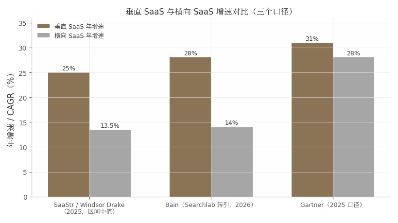

*图 5-1：垂直 SaaS 与横向 SaaS 增速对比。数据口径：SaaStr/Windsor Drake（2025，垂直 18-32% 取中值 25%，横向 12-15% 取中值 13.5%）[^150^]；Bain 经 Searchlab 转引（2026-03）[^151^]；Gartner 口径经 MSTHGN 转引（2025）[^152^]。三家机构绝对值差异较大，但"垂直快于横向"的方向性结论一致。*

与第 2 章 Levels 模式的本质区别在于流量哲学相反。Levels 做大众流量：产品（找城市、找工作、生成照片）面向所有人，增长引擎是 93 万粉丝的受众资产，单客户年价值低但池子无限大。垂直 SaaS 做行业深井：Perfect Wiki 只对用 Microsoft Teams 的公司有意义，goHeather 只对需要审合同的中小企业有意义，潜在客户池有明确上限，但池内转化率、留存与定价权都远高于大众产品——goHeather 的客单价从 $39.99/月一路提到 $200/月（2026 年官网定价）[^154^]，这种提价幅度在大众消费品里几乎不可想象。简言之，Levels 模式赌"被更多人看见"，垂直 SaaS 模式赌"被更少的人离不开"。

### 5.2 代表案例深度拆解：Perfect Wiki（Teams生态知识库）与 goHeather（AI合同审查）

#### 5.2.1 案例A——Ilia Pirozhenko背景：2020-05失业后全职创业

Ilia Pirozhenko 是有 10 年以上经验的企业软件工程师，职业生涯前半段在银行、保险与再保险等大型企业的软件部门度过——这段经历让他对"大厂软件难用到反人类"有一手体感（本人自述）[^20^]。需要修正一个流传较广的说法：他并非副业起步，而是 2020 年 5 月在疫情中失业后**直接全职创业**，最初的收入目标仅为年薪 $70-80K 糊口，"I just wanted to earn a stable $70–80K a year"（本人自述）[^20^]。他的入行逻辑是"淘金热里卖铲子"：2020 年远程办公爆发，他没有去做视频会议（淘金），而是为协作平台做配套应用（卖铲子）。第一个产品是 Zoom Marketplace 上的翻译器，因商店无流量而失败；转投 Microsoft Teams Marketplace 后"just a few days after publishing, someone bought a paid subscription"——几天内售出付费订阅，由此确认 Teams 生态存在现成的客户池[^20^]。选题方法则朴素到近乎原始：泡论坛、读评论，发现 Teams 内置 Wiki"又慢又难用、没有全文搜索"的抱怨高度集中，于是决定做一个内嵌 Teams 的轻快知识库，目标用户是"不懂技术的普通 PC 用户"[^20^]。

#### 5.2.2 案例A时间线与收入：3周MVP→上线数天首个付费客户→2025-04达500+付费企业客户、约$25K/月、年收入$250K；月成本仅$1,750-2,350，毛利率>90%

Perfect Wiki 首版只用了约 3 周（页面创建/编辑加全文搜索），发布到 Teams Marketplace 后数天内获得第一个付费客户——用户在商店里搜"wiki"，当时没有竞争对手，它排名第一（本人自述）[^20^]。此后五年有机增长，官网称"organically grew from 0 to 2000 companies"（含免费用户口径）[^155^]；2024 年微软在 Build 大会上把 Perfect Wiki 作为 Teams 高评分应用范例展示[^20^]。到 2025 年 4 月公开复盘时：年收入约 $250,000、创始人月收入约 $25,000、500+ 付费企业客户，主要市场为美国、加拿大、英国、德国（本人披露）[^20^][^156^]。注意口径：$25K/月×12=$300K 与 $250K/年略有出入，应理解为"当前 run-rate 月收入"与"过去 12 个月实际收入"的差异。

成本结构是这个案例最锋利的部分：Google Cloud $500-1,000、Algolia 搜索 $400-500、其他 SaaS 工具 <$350、外包承包商 <$500，合计约 $1,750-2,350/月，"Everything else is my profit"（其余全是利润，本人自述）[^20^]——隐含毛利率超过 90%。这与社区统计的"典型 bootstrapped micro SaaS 净利率 70-90%"相互印证[^157^]，也是垂直 SaaS 模式对独立开发者最现实的吸引力：不需要做到 Levels 的量级，就能拿到可替代工资的净现金流。

#### 5.2.3 案例A的结构性红利：微软Teams内置Wiki退役

Perfect Wiki 的故事里有一段必须写透的插曲，因为它是"垂直 SaaS 生态位"最好的注脚。2023 年 1 月，微软通过官方消息中心宣布退役 Teams 内置 Wiki（MC496248），2024 年 2 月起 Wiki 标签页与应用在 Teams 中彻底不可访问，官方迁移路径是导出到 OneNote[^158^][^159^]。问题在于，OneNote 和 SharePoint 都不提供 wiki 式的层级结构、页间链接与局部范围搜索——微软亲手关停了一个体验糟糕的功能，却留下了一个没有任何官方替代品的结构性空缺[^160^]。数以百万计用 Teams 的企业里，凡是依赖内置 Wiki 的团队都必须找第三方替代品，而 Perfect Wiki 恰好在商店搜索"wiki"时排名第一。这是"平台撤退创造独立开发者机会"的教科书案例：巨头砍掉的是一个不值得投入的边缘功能，对缝隙里的独立开发者而言却是送到门口的迁移需求红利。到 2026 年，Perfect Wiki 已从"Teams 内嵌 wiki"升级为跨 Slack、ChatGPT、网站机器人的 AI Knowledge Agent，并上线官方 MCP Server 对接 Claude、Cursor 等 AI 客户端[^161^][^162^]——它在主动摆脱对单一平台的依赖，这是后文 5.9 节风险评估的伏笔。

#### 5.2.4 案例B——Jeff Dutton / goHeather：律师创始人的AI合同审查

Jeff Dutton 的路径是另一种典型：行业人转行做行业软件。他是多伦多资深律师——西安大略大学 BA（2009）、渥太华大学 JD（2012），做过检察官、全国性精品律所商业律师、安大略省总检察厅任职，2016 年自办律所 Dutton Law（2019 年并入更大律所），还合著过一本主流雇佣法教科书[^163^][^164^]。创业动因来自执业中的一手观察：中小企业"最需要法律指导却最买不起"，一份 $10,000/年的销售合同不值得花 $1,500 请律师审查——这是传统法律服务的经济性死角[^165^]。2021 年他创立 goHeather，首个产品 AI Draft 把律师模板变成交互式合同生成器，并加入全球首个法律科技孵化器 Legal Innovation Zone；2023 年转向更大的市场——AI Review（AI 合同审查），自称"市场上第一个 purpose-built AI 合同审查平台"[^165^][^163^]。

截至 2025 年 9 月，goHeather 有 500+ 付费企业客户和 14,000 累计免费用户（创始人专访口径）[^165^]；2025 年 7 月联盟计划公告披露 ARPU $75/月、平均 LTV $350[^166^]。据此可**推算**约 $37.5K MRR、$45 万 ARR 量级（ARPU×客户数推算，非公司披露）；其中 LTV÷ARPU 隐含平均客户生命周期仅约 4.7 个月，暴露了 SMB（中小企业）自助客群低客单、高流失的经济模型——这也解释了 2026 年提价至 Starter $200/月并上探团队/企业版的动作[^154^]。团队规模各来源口径冲突（2-10 至 11-50 人），稳妥表述为"10 人内微型团队"[^167^][^168^]。产品侧的关键壁垒是合规信任：SOC 2 认证、不保留合同全文、不用客户数据训练模型——在 AI 幻觉制裁案频发的法律行业，这些直接转化为采购理由[^169^]。

下表（表 5-1）对两个案例做结构化对比：

**表 5-1　Perfect Wiki 与 goHeather 双案例结构化对比**

| 维度 | Perfect Wiki（Ilia Pirozhenko） | goHeather（Jeff Dutton） |
|---|---|---|
| 垂直缝隙 | Teams 生态知识库（内置 Wiki 又慢又无全文搜索）[^20^] | 中小企业 AI 合同审查（企业级 CLM 太贵、ChatGPT 不合规）[^165^] |
| 创始人背景 | 10+ 年企业软件工程师；2020-05 失业后全职创业[^20^] | 10+ 年执业律师；2021 创立、2023 转向 AI 审查[^163^] |
| 冷启动渠道 | Teams Marketplace 自然搜索，早期零竞争排名第一[^20^] | SEO 对比文 + Word Add-In 生态 + 33% 佣金联盟[^170^][^168^] |
| 客户规模 | 500+ 付费企业客户（2025-04，本人披露）[^20^] | 500+ 付费企业客户 + 14,000 免费用户（2025-09）[^165^] |
| 收入 | 约 $25K/月、年 $250K（2025-04，本人披露）[^20^] | 约 $37.5K MRR（ARPU $75×500 推算口径）[^166^] |
| 成本结构 | 月成本 $1,750-2,350，毛利率 >90%[^20^] | 未披露；AI SaaS 行业基准毛利率 50-65%[^171^] |
| 定价演进 | $79/月（2024）→ $12/编辑者/月（2026，读者免费）[^161^] | $39.99/月 → Starter $200/月（2026）[^154^] |
| 核心护城河 | 商店排名第一 + 4.9 评分 + 体验细节[^172^] | 律师训练的 Playbook + SOC 2 + 零数据保留[^169^] |
| 团队 | 2 人 + 外包营销内容[^20^] | 10 人内微型团队（口径冲突取保守值）[^167^] |

两个案例的并置揭示了一个反直觉事实：垂直 SaaS 的护城河几乎不出现在技术栏。Perfect Wiki 的技术栈（Node.js+React+Algolia）和 goHeather 的技术栈（Vercel+Supabase+GPT-4 系 API）都是标准件，任何中级工程师都能复刻；真正不可复制的是 Ilia 五年积累的商店排名与客户关系，以及 Jeff 十年执业经验编码成的审查 Playbook。两个案例获客成本都趋近于零，但机制不同——一个寄生平台商店搜索，一个靠内容与联盟网络——说明垂直 SaaS 的分发引擎可以多样，前提是"嵌入客户已有的工作场景"（Teams 里、Word 里）。收入体量上两者同处 $25-40K/月区间，恰落在社区统计中"10% 突破 $20K+ MRR"的头部位置[^157^]，这不是巧合而是筛选：能被公开研究的案例本身就是幸存者。

### 5.3 日常作息与开发节奏

#### 5.3.1 两人团队的节奏：客服最先外包、工程最后外包

垂直 SaaS 的日常没有 Levels 式的戏剧化作息，其节奏特征是"运维化"：Perfect Wiki 两人分工为 Ilia 管开发与产品、一名同事管用户支持，营销与内容外包（月支出 <$500），每季度向活跃忠诚用户做需求调查、用 demo call 和应用内聊天收集反馈[^20^]。goHeather 则是"律师转工程师"的微型团队，博客近乎每周更新 SEO 内容、月度级功能发布（2025 年 6/7/8 月连续发布 Playbooks、Word 插件、57 语言支持），创始人亲自给新客户做 1 对 1 Zoom onboarding——用创始人时间换转化率与一手反馈[^165^][^170^]。这两个案例印证了一条跨模式的外包规律：**客服与支持是最先外包的环节（重复、打断心流），工程与产品设计是最后外包的环节（核心竞争力所在）**。成本上，菲律宾远程客服 2026 年"体面薪酬"共识约 $1,000-1,500/月（$5-7/小时为甜点区），对比美国同岗年薪 $34,384 起，这是微型团队服务 500+ 企业客户在人力经济学上成立的前提[^173^][^174^]。

### 5.4 技术栈与工具链

#### 5.4.1 垂直SaaS的技术平庸化：壁垒在行业工作流理解而非技术

两个案例的技术栈呈现出刻意的平庸。Perfect Wiki 用 Node.js+Express+React——Ilia 的原话是"我用了已经非常熟悉的技术"，唯一的战略性技术投资是 Algolia：全文搜索恰好是微软内置 Wiki 最大的短板，基础设施支出直接等于差异化[^20^]。goHeather 全部租用现代云服务：Vercel 托管、Supabase 数据库、Auth0 认证、Stripe 收款，AI 层混用 OpenAI/Google/Anthropic 模型、核心基于 GPT-4.0 并由律师团队定制 prompt 与工作流[^169^]。固定成本压到近零的代价是变量成本——AI 推理是结构性负担，行业基准显示 AI SaaS 毛利率仅 50-65%，显著低于传统 SaaS 的 70-90%（a16z/Bessemer 口径）[^171^]，这也是 goHeather 从 $39.99 提价到 $200/月的隐含动因。对独立开发者的含义很直接：在垂直 SaaS 里，选栈的标准是"你最熟的那个"，省下的学习时间全部投入行业工作流理解；反之，用时髦但不熟的栈是把稀缺资源投错了地方。

### 5.5 获客与增长策略

#### 5.5.1 垂直获客三板斧：行业内容营销、生态市场、口碑转介；达$10K MRR中位14-18个月

垂直 SaaS 的获客与大众产品根本不同：不需要病毒传播，需要的是"出现在客户寻找解决方案的那几个固定路口"。两个案例各示范了一种路口。Perfect Wiki 示范的是**生态市场搜索**：用户在 Teams Marketplace 搜"wiki"，它长期排名第一、评分 4.9，早期零竞争，获客成本为零，商店评分与口碑形成复利；辅助渠道是外包生产的 SEO 对比文（vs Confluence、vs Notion）[^20^][^175^]。goHeather 示范的是**行业内容营销+生态插件**：官网博客高频产出"vs Ironclad/vs LegalOn/最佳 AI 合同审查工具"类对比文，第三方评测称其"SEO 驱动、最近几个季度新增客户 logo +40%"[^170^][^168^]；Word Add-In 寄生 Office 生态（与 Perfect Wiki 寄生 Teams 同构）；33% 佣金、12 个月有效期的联盟计划用 Rewardful 追踪[^166^]。两案共同的第三个引擎是 PLG（产品驱动增长）自助漏斗：免信用卡试用（Perfect Wiki 14 天+30 分钟 onboarding call；goHeather"no demo required"直接对标企业级厂商强制 demo 的销售模式）[^20^][^154^]。

时间上要有耐心预算：社区基准显示，单人开发者达到 $10K MRR 的中位时间为 14-18 个月，$1K-10K MRR 区间月增速中位数 8-12%、月流失中位 3-5%[^176^][^177^]。对照之下 Perfect Wiki 五年到 $25K/月、goHeather 四年到推算的 $37.5K/月，都落在这个基准区间内——垂直 SaaS 没有爆发神话，只有复利爬坡。

### 5.6 变现路径与商业模式

#### 5.6.1 B2B定价的权力：提价空间与企业客户低流失

B2B 垂直 SaaS 的定价逻辑与消费级产品相反：客户为"问题消失"付费而非为"功能"付费，价格锚点是替代方案的成本。goHeather 的价值主张锚点极其具体——审查提速至多 10 倍、平均每单相比外部律师节省 $1,419（供应商口径）[^168^]；在这个锚点下，$39.99/月是"便宜到不用审批"，提到 $200/月（2026 年 Starter 单席位）仍然只是外部律师费的零头[^154^]。其卡位精准落在两层夹缝中：企业级 CLM/法律 AI（Ironclad 约 $500+/用户/月、LegalOn/LinkSquares 约 $20-60K/年、Harvey 类 $30-200K+/年）向下太贵，通用聊天机器人（ChatGPT $20/月）向上不合规，中间"自助式 first-pass 审查"的空档就是它的全部生意[^178^][^179^]。Perfect Wiki 则演示了定价模型的演进：从 2024 年 $79/月（3 用户）到 2026 年按编辑者计费 $12/编辑者/月（年付）、读者免费不限量、最低 5 编辑者——把收费对象从"公司"收窄到"内容生产者"，同时用免费读者扩大组织内渗透[^161^]。以 500+ 付费公司、$250K/年推算，其 ARPA（每客户平均收入）约 $500/年，是低客单走量模型；2026 年改为按席位计费后客单价明显上移。

### 5.7 决策思路与关键转折点

#### 5.7.1 Ilia的决策依据：生态位空缺；单人micro-SaaS 40%到不了$1K MRR的对照

Ilia 的三个关键决策值得逐一拆解。其一，放弃翻译器：它能快速盈利，但他判断"天花板低、且易被微软复制"，主动放弃短期收入转向知识库——拒绝唾手可得的小钱，是这个案例最反本能的一步[^20^]。其二，选题依据是"巨头做不好、也不屑做好"的缝隙：内置 Wiki 对微软是边缘功能，对依赖它的企业是日常工具，投入产出比在两端完全不对称。其三，危机认知：他自述"有几个月零增长、一切停滞，需要改计划、改产品"，微软先后推出 Viva、Loop 试图补位但"太臃肿难用"，最终微软干脆退役内置 Wiki，把威胁变成了红利[^20^][^158^]。

这些决策必须放在幸存者基线上读：社区估计单人 micro SaaS 中 40% 永远到不了 $1K MRR，30% 停在 $1-5K（副业型），20% 达 $5-20K（可替代工资），仅 10% 突破 $20K+；首笔收入中位时间 3-4 个月，而"先验证再开发"比"先开发再验证"快约 40%[^157^]。Ilia 的"泡论坛读评论再动手"和 Jeff 的"十年执业知道痛在哪"，本质都是把验证环节前置——这是他们与那 40% 的分水岭，而不是天赋或运气。

### 5.8 效率密码

#### 5.8.1 窄定位带来的功能克制；2人团队管理500+企业客户的自动化分层

垂直 SaaS 的效率密码首先是**定位窄带来的功能克制**。Ilia 的原则是只做用户真实请求的功能，"不为'看起来有用'的功能开工"；他把简洁当作生存策略而非审美偏好——"simplicity wins…小团队玩不起功能膨胀和技术债"（本人自述）[^20^]。其次是全公司 dogfood：内部文档、公开 Help Center 全部跑在自家产品上，客服即产品测试[^20^]。goHeather 的版本是**领域专长即杠杆**：律师创始人直接把执业经验编码为 Playbook 与 prompt，免去了雇佣领域专家的成本——这在其他模式里通常是一笔每年六位数的支出[^165^][^169^]。两案共同的第三层是"外包一切非核心职能"与"用合规换信任"：Perfect Wiki 外包营销内容（<$500/月），goHeather 把 SOC 2、零数据保留从成本项变成营销资产[^20^][^169^]。2 人服务 500+ 企业客户在算术上成立的前提，是企业级客户的工单密度被自助文档、应用内引导和分层支持压到了极低——垂直产品的用户是"同一类人"，问题高度同质，一套 FAQ 能覆盖绝大多数工单，这是大众产品享受不到的规模红利。

### 5.9 当下可行性评估（2026年）

#### 5.9.1 风险：SaaSpocalypse与95%无ROI；但垂直SaaS并购倍数3.3x仍高于横向3.0x

2026 年评估这个模式必须同时吞下两组方向相反的数据。风险侧：2026 年 1-2 月，Anthropic Cowork 插件与 OpenAI Frontier 模型发布引发软件股抛售（市场称"SaaSpocalypse"），约 $2,850 亿市值蒸发，横向工具最受伤（LegalZoom -20%、Thomson Reuters -16%），分析师共识是有数据壁垒、合规深度与关键工作流的垂直 SaaS 防御性最强[^180^]。MIT NANDA 2025 年研究显示 95% 的企业生成式 AI 试点未产生 ROI，行业观察者预测 90% 的"AI 套壳"产品将在 2026 年底前失败；AI 包裹型 SaaS 毛利率仅 50-60%，低于传统 SaaS 的 70-90%[^181^][^171^]。机会侧：垂直 SaaS 并购倍数 3.3 倍收入仍高于横向的 3.0 倍，占 2025 年 Q3 全部 SaaS 并购交易的 54%[^153^]；法律垂直里，合同起草与审查是法律 AI 软件中增速最快的子板块（CAGR 31.8%，MarketsandMarkets 2025-02），44% 组织已在合同流程使用 AI[^182^][^183^]。上述两侧的关键数据与口径汇总于表 5-2。

**表 5-2　垂直 SaaS 2026 年可行性关键数据一览**

| 指标 | 数值 | 口径与时间点 | 来源 |
|---|---|---|---|
| 垂直 SaaS 市场规模 | 约 $157B，占 SaaS 支出 35% | SaaStr/Windsor Drake，2025 | [^150^] |
| 垂直 vs 横向增速 | 18-32% vs 12-15%（SaaStr）；28% vs 14%（Bain） | 2025-2026，机构口径不一 | [^150^][^151^] |
| 垂直 vs 横向并购倍数 | 3.3x vs 3.0x 收入 | 2025-10；占 2025Q3 SaaS M&A 的 54% | [^153^] |
| 单人 micro SaaS 收入分布 | 40% 到不了 $1K MRR；仅 10% 突破 $20K+ | 社区估计，2026-01 | [^157^] |
| 达 $10K MRR 中位时间 | 14-18 个月 | Baremetrics/IH 队列汇总，2026 | [^176^][^177^] |
| AI SaaS 毛利率 | 50-65%（传统 SaaS 70-90%） | a16z/Bessemer 行业基准 | [^171^] |
| 企业 GenAI 试点 ROI | 95% 无 ROI | MIT NANDA，2025 | [^181^] |
| 法律 AI 合同审查子板块增速 | CAGR 31.8%，全市场最快 | MarketsandMarkets，2025-02 | [^182^] |

表 5-2 的两半合起来才是完整图景：市场结构与资本定价（上半部分）说明垂直 SaaS 是 2026 年少数仍被机构资金加价追逐的 SaaS 形态；失败率与毛利结构（下半部分）则说明红利只属于"有工作流深度"的那一层——单纯给大模型套个行业皮肤的"AI 包裹"恰好落在 95% 无 ROI 与 50-60% 毛利率的死亡区间。VC 文献的共识框架可作参考（属观点而非事实）："Rule of 40" 正被 "Rule of Data"（专有、高保真、可迭代数据）取代，垂直 SaaS 的护城河四要素是工作流嵌入深度、专有数据飞轮、合规耦合与物理世界集成[^184^][^185^]。goHeather 式的"律师训练+用户 Playbook 沉淀+不保留全文"说明数据壁垒正在从"持有数据"转向"持有工作流与评估体系"——这对没有数据积累的独立开发者反而是好消息：工作流理解不需要融资，只需要行业工龄。

#### 5.9.2 给新手的第一步：选一个你干过3年以上的行业，列出该行业最贵的10个重复劳动

两个案例的入行路径给出同一条可执行的第一步：**选一个你亲自干过 3 年以上的行业，列出该行业里"最贵的外包/人力重复劳动"清单，取前 10 项逐一评估软件化的经济性**。Ilia 的清单来自十年企业软件工龄加论坛抱怨，Jeff 的清单来自十年执业——"$10K/年的合同不值得花 $1,500 律师费审"这类"经济性死角"只有行内人看得见[^20^][^165^]。验证顺序比选题更重要：先在生态市场或行业社区确认"有人正在找替代品"（Ilia 的翻译器在 Teams 商店几天内卖出即是验证信号），再动手做 3 周级别的 MVP。没有行业工龄的新手不应硬闯此模式——参考副业转全职的安全线（$5K+ MRR 且连续增长 3 个月以上、6-12 个月生活费积蓄）[^186^]，先去目标行业打工攒"领域资本"，是这条赛道的隐性入场券。

### 5.10 模式适配画像

#### 5.10.1 适合性格：有行业经验者最优；启动资金数千元级；见效14-18个月；天花板$250K-500K/年

综合两个案例与行业基准，垂直 SaaS 型的适配画像可以量化如下。**性格与前置条件**：最适合有 3 年以上行业经验、能忍受 14-18 个月无显著收入的开发者；不需要表达欲与受众运营能力（与第 2 章 Levels 模式相反），但需要忍受"产品无聊"——知识库和合同审查都不是能发朋友圈的生意。**启动资金**：数千元级——Perfect Wiki 上线后月成本 $1,750-2,350 且迅速被收入覆盖[^20^]，全租用栈（Vercel/Supabase/Stripe）把前期固定投入压到近零[^169^]。**见效时间**：首笔收入中位 3-4 个月，$10K MRR 中位 14-18 个月[^157^][^176^]。**收入天花板**：单点垂直约 $250K-500K/年（Perfect Wiki 五年 $250K、goHeather 推算约 $450K ARR）——这是窄定位的固有代价，破顶路径只有两条：像 Perfect Wiki 2026 年那样横向扩展为"AI 知识层"，或像 goHeather 那样提价并上探中市场。**下行风险**：沉没成本低（几个月时间+数千元），但需警惕平台规则变更（微软一次公告即可制造或消灭一个生态位）与通用 AI 的免费替代——防御手段在 2026 年已被两个案例写得很清楚：把工作流嵌得比大厂深，把合规做得比通用工具重。

---

## 6. 开源变现型（先免费后收费）——Vuetify 与 NativePHP

### 6.1 模式定义与核心逻辑

#### 6.1.1 一句话定义：用开源换社区信任与采用率，再向受益者收费

开源变现型指把核心代码以 MIT/Apache 等宽松协议免费放出，先换取开发者的采用、信任与生态位，再通过赞助、付费内容、商业授权或服务向受益者收费的模式。它与本书其他七种模式的最大区别在于**收入滞后于价值创造**：产品先免费运行数年，商业化是事后追加的动作。Vuetify 从 2016 年 12 月发布第一个公开 alpha 到 2021 年才做到约 $300K/年收入，中间隔了近五年（本人披露）[^187^][^188^]；NativePHP 从 2023 年 4 月 POC 推文到 2025 年 5 月移动版正式收费，也走了两年免费积累期[^189^][^190^]。这个模式的产品不是软件本身，而是"生态位"——Vuetify 卡住的是"Vue 生态最早的 Material Design 组件库"，NativePHP 卡住的是"用 PHP 写原生应用的唯一选项"，两者都是靠免费代码把位置占死，再考虑收钱。

#### 6.1.2 底层逻辑：采用率是前置资产；残酷基线：60%维护者无报酬

必须先给出这个模式的基线数据，否则后文的案例会制造幻觉。Tidelift 2024 年《State of the Open Source Maintainer》报告（437 名维护者样本）显示：**60% 的开源维护者是无偿业余者**，其中 44% 希望获得报酬；只有 12% 是靠维护项目获得全部或大部分收入的"职业维护者"，24% 为半职业；48% 感觉不被赏识，60% 曾退出或考虑过退出维护工作[^191^]。平台侧的规模数据同样说明问题：GitHub Sponsors 自 2019 年上线到 2026 年 7 月累计支付刚突破 $1 亿，覆盖 70,000+ 维护者与 280,000+ 赞助者[^192^]——摊到每个维护者头上，七年人均不足 $1,500。第三方分析进一步显示，GitHub Sponsors 上 76% 的赞助档位月收入不足 $100，活跃 Open Collective 项目的年度筹资中位数不足 $3,000（第三方估算口径）[^193^][^194^]。即使是塔尖也不例外：Vue 创始人 Evan You 2026 年 6 月受访时直言，Vue 每周下载近 1,000 万次，但赞助"可持续，但相对于影响规模绝对算不上丰厚"，大约只够供养 2 名全职（本人自述）[^195^]。

这个残酷基线决定了开源变现的底层逻辑：**采用率只是前置资产，不是收入本身**。下载量、stars、文档流量构成"谁离不开你"的清单，而变现动作是把清单里的受益者转化为付费方——赞助依赖情感，商店依赖需求，授权依赖分发权，服务依赖时间。四条路径的转化率差异极大（详见 6.6 节），选错路径的项目即使采用率极高也会饿死，这正是 Vuetify 2024 年财务危机（6.2.2 节）的教训。

与第 2 章 Levels 模式对比，两者的资产形态正好相反。Levels 的受众资产（93 万 X 粉丝）归个人所有、迁移成本低、变现即时——发一条推文就能给新产品导流；开源维护者的采用率资产则沉淀在项目里、迁移成本极高——John Leider 离开 Vuetify 就带不走 41K stars，Simon Hamp 的信誉也只对 Laravel 社区有效。换言之，Levels 模式是"人带货"，开源模式是"货带人"；前者的风险是平台封号，后者的风险是商业化动作慢于社区期待值的衰减。见效时间也完全不同：Levels 的 Nomad List 首日就有 $600 收入，而开源变现以年计——这是八种模式中现金流最慢的一种。

### 6.2 代表案例深度拆解：Vuetify（Vue UI框架）与 NativePHP（PHP桌面/移动框架）

#### 6.2.1 案例A——John Leider / Vuetify时间线：十年三个大版本的重写长征

John Leider 的起点与硅谷叙事毫无关系：他 2013 年 1 月从美国陆军退役（有 2010 年伊拉克 FOB Falcon 服役照为证），靠自学考取 A+/Security+/Network+ 认证进入 IT 行业，早期是 PHP + jQuery + MySQL 的服务端开发者。2014 年底他在 Laracasts 的 Laravel 教学视频里第一次看到 Vue.js 早期版本，"立刻爱上"（本人自述）[^187^]。Vuetify 的诞生没有商业计划书——他只是想练习 Vue 2 beta 的新特性，先做了基于 Materialize CSS 的组件库，随后决定从零实现整套 Material Design 规范[^187^][^196^]。

此后是一条以年为单位的时间线：2016 年 9 月发布第一个 pre-alpha，2016 年 12 月 14 日以 MIT 协议在 GitHub 放出第一个公开 alpha，社区反响"overwhelming"（本人自述）；2017 年 10 月他宣布辞职成为全职开源开发者；2018 年 2 月 v1.0 发布；2019 年 2 月 v1.5（LTS）、7 月 v2.0 核心完全重写（JavaScript 转 TypeScript、Stylus 转 Sass、升级 Material Design 2）；2022 年 11 月 v3.0（Titan）基于 Vue 3 再次重写；2026 年 2 月 23 日 v4.0 正式版发布，同年 7 月 headless 逻辑层 Vuetify0 发布 1.0，v3 进入 LTS 至 2027 年 7 月[^187^][^188^][^197^]。十年三次大版本重写，官方承认的最大挑战之一是"developer churn"——组件由不同开发者接力完成，维护连续性始终紧张[^198^]。这条时间线的含义是：开源框架是本书所有案例中最"重"的资产，它的复利真实存在，但利息要用持续的、没有直接回报的工程劳动去换。

#### 6.2.2 案例A收入结构：商店才是主力，赞助只是零头；2024年财务枯竭危机

Vuetify 的收入数据是本章最重要的反鸡汤素材，因为它戳破了两个流行想象。第一个想象是"开源明星=靠赞助财务自由"。2021 年高峰期，Vuetify 年收入约 $300K（Starter Story 标题口径，本人受访），但结构拆解后完全是另一回事：Patreon + GitHub Sponsors 合计约 $6,500/月，Open Collective 约 $2,000+/月（用于供养核心团队），真正的"main revenue generator"是 Vuetify Store 付费主题与周边——从最初每月不足 $100 增长到 $15,000–$20,000/月，另有 Carbon 文档广告与咨询/直接支持收入（本人披露）[^187^][^199^]。也就是说，**赞助只贡献了总盘子的约四分之一，商业产品销售贡献了六成以上**。John 的原话直白得近乎残酷："most companies—in regards to open source—have little to no interest in receiving services in return… a business model based primarily around sponsorship was simply ineffective; at least for me"（大多数公司对开源没有兴趣用付费换取任何服务回报；以赞助为主的商业模式根本无效，至少对我是这样）[^187^]。需要注明口径：部分媒体页面把"$6,500/月"写成 Vuetify 的总收入，那只是 2021 年的赞助单项；$300K/年（约合 $25K/月）才是全渠道合计，2025 年 4 月 Starter Story 邮件摘要的"$25K/月"口径与此吻合[^199^][^200^]。

第二个想象是"头部项目不会缺钱"。2024 年 6 月，John 公开发帖承认 Vuetify 陷入财务"枯竭期"（financial drought），他被迫外出求职，入职了一家全栈使用 Vue/Vuetify 的公司 Optikka 任高级开发，同时把框架的创意与工程主导权移交给创始期成员 Kael Watts-Deuchar。直到 2024 年 9 月的官方《State of the Union》，Open Collective + GitHub Sponsors 两平台合计才恢复到 $8,000+/月，靠的是 Abacus、Route4Me、Teamwork 等企业的大额赞助[^198^]。一个周下载 70 万次以上的头部框架，创始人一度要靠打工维生——这个事实是理解开源变现的钥匙：**采用率不会自动变成现金流，中间隔着一整套需要主动设计的商业层**。John 在危机后写下的总结是本章的题眼："if you want to do Open Source full-time, you need to build something that can generate revenue"（想全职做开源，必须造一个能产生收入的东西）[^198^]。

#### 6.2.3 案例A现状2026：41K+ stars与Vuetify One订阅体系

危机之后，Vuetify 的商业化明显提速。截至 2026 年初，项目有 41,000+ GitHub stars、约 70–85 万次/周 npm 下载（Snyk 2025 年 12 月快照为 857K 周下载、440 名贡献者、4 名维护者），官方 Store 页宣称累计下载超 600 万次[^201^][^202^][^203^]。产品矩阵从单一框架扩展为生态：Vuetify One（2024 年 1 月上线的统一账号/订阅体系）、Snips（2024 年 4 月上线的首个独立付费产品，代码片段订阅 $14–36/用户/月，官方声明"All sales from Snips go directly back into Vuetify development"）、Bin、Playground、Issues、Link，以及面向 AI 工具链的 MCP server（2025 年 10 月起支持 HTTP transport）[^198^][^197^][^204^]。团队 2025 年 12 月单月提交 522 个 commits、横跨 16 个仓库，为当年最高产月份；John 退居高层事务，仍亲自撰写每月更新博客[^197^]。资金分配机制也已制度化：GitHub Sponsors/Patreon 归 John 与妻子 Heather 的全职生活开销，Open Collective 透明基金支付核心团队，两条资金线互不混用[^205^]。这个现状说明 Vuetify 已从"赞助驱动"转型为"产品矩阵驱动"，但转型代价是创始人让渡了工程主导权——这是商业化与个人控制之间的真实交换。

#### 6.2.4 案例B——Simon Hamp / NativePHP：免费攒生态，新能力从第一天收费

NativePHP 提供了与 Vuetify 互为镜像的第二条路径。Simon Hamp 是有 20 余年经验的 PHP/Laravel 全栈开发者，英国人，现居西班牙加那利群岛；他在女性健康创业公司 Elvie 投入近 6 年，2022 年底接受"自愿被裁"，从稳定薪水变为零收入、只有几个月存款跑道。他没有去接自由职业，而是赌上酝酿多年的想法：用 PHP 构建可分发的桌面与移动应用（本人自述）[^206^][^189^][^207^]。

时间线密集且每个节点都有舞台事件：2023 年 4 月 1 日他在 Twitter 发布 POC（静态编译 PHP + Tauri 壳，让完整 Laravel 应用跑在桌面）——当时他的粉丝只有约 1,000 人；Laravel 社区知名开发者 Marcel Pociot 主动联系合作，并在 2023 年 7 月的 Laracon US 上把原定 AI 主题的演讲临时换成 NativePHP，向约千名开发者首次公开，"blew people's minds"[^189^][^21^][^208^]。2024 年 Marcel 淡出，Simon 独自攻坚 iOS，并故意向 Laracon EU 投递演讲提案逼自己上线——接受提案后只剩两个月，他每天"从早上 6 点工作到凌晨两三点"（本人自述）[^209^][^210^]。2025 年 1 月，全球首个完全用 PHP/Laravel 构建的 iPhone 应用提交 App Store，3 天过审；同期通过 GitHub Sponsors 开售 $200 早鸟通行证，几天内 20+ 人付费，"started making money from Day 1"[^21^]。2025 年 2 月 Laracon EU 台上正式发布 iOS 版，3 月 Shane Rosenthal 搞定 Android 端、两人联合创立 Bifrost Technology，5 月 2 日移动版 v1 正式发售[^21^][^211^][^190^]。

收入爬坡陡峭：移动版发售后的前 3 个月收入突破 $100,000（本人披露）；到 2026 年 6 月，仅授权销售就接近 $60K/月的稳定收入（本人披露），折合年化约 $720K[^189^][^21^]。注意三个数字分属不同时点：早鸟预售约 $4K+（2025 年 1 月）、前 3 个月累计 $100K+（月均约 $33K）、2026 年中稳定 $60K/月，媒体摘要中的"$50K/月"是中间口径，引用时必须带时间点[^189^][^21^]。授权模式设计精巧：Mini/Pro/Max 三档对应 1/10/不限个生产应用的分发权，授权终身有效、含 1 年更新，不续费仍可继续用旧版构建上架——用"断更新不断使用权"化解订阅抵触；EAP 定价 $50/$150/$250，原计划涨价至 $100/$750/$2,500，2025 年 10 月反而大幅降价重构（Pro $200/年、Max $350/年、Mini 并入 $19/月 Bifrost 订阅免费送），理由是客户破 2,500 后"降价扩大盘子"的信号已经足够明确[^212^][^213^][^211^]。桌面版则保持 MIT 完全免费，靠 GitHub Sponsors 与企业赞助（BeyondCode、Sevalla 等）输血——免费层与收费层的分工被刻意安排在不同产品线上[^214^]。

下表（表 6-1）对两个案例做结构化对比：

**表 6-1　Vuetify 与 NativePHP 双案例结构化对比**

| 维度 | Vuetify（John Leider） | NativePHP（Simon Hamp） |
|---|---|---|
| 生态位 | Vue 生态最早的 Material Design 组件库[^187^] | 用 PHP/Laravel 构建桌面与移动应用的唯一框架[^190^] |
| 创始人背景 | 退伍军人自学转行，PHP/jQuery 出身[^187^] | 20+ 年 PHP/Laravel 老兵，2022 底自愿被裁[^189^] |
| 开源→收费间隔 | 约 5 年（2016 alpha → 2021 才达 $300K/年）[^187^] | 约 2 年（2023-04 POC → 2025-05 移动版发售）[^189^][^190^] |
| 收费时点 | 事后追加（先做框架，多年后才做商店） | 新能力 Day 1 收费（$200 早鸟票，几天售 20+ 张）[^21^] |
| 主力收入 | 付费主题商店 $15–20K/月（2021，本人披露）[^187^] | 移动端闭源授权 ~$60K/月（2026-06，本人披露）[^21^] |
| 赞助占比 | 约 $6.5K/月，仅约四分之一（2021）[^187^] | 仅覆盖桌面版，移动端不靠赞助[^214^] |
| 峰值年化 | 约 $300K（2021）[^187^] | 约 $720K（2026，按 $60K/月年化折算）[^21^] |
| 重大危机 | 2024-06 财务枯竭，创始人入职 Optikka 打工[^198^] | 尚未经历；合伙人 2024 年淡出为最大人力风险[^21^] |
| 团队形态 | 夫妻店 + 合同制核心团队 + 440 名贡献者[^215^][^202^] | 两人跨国合伙（iOS/Android 分治）[^21^] |
| 对 AI 的暴露 | 文档流量漏斗受 AI 答案引擎威胁；已上线 MCP server 应对[^197^] | AI 为提效工具（"we use AI every single day"），授权收入不依赖文档流量[^21^] |

两个案例的并置给出本模式最锋利的一组对照。Vuetify 是"先做大再收费"的旧路径：采用率做到了极致（周下载 70 万次以上），但商业化动作迟缓，收入天花板停在 $300K/年，且在 2024 年被赞助断粮击穿；NativePHP 是"边攒生态边收费"的新路径：采用率绝对值远小（桌面版 GitHub 约 3.8K stars，2025 年中口径），但收费设计从第一天嵌入产品路线图，年化收入反而达到 Vuetify 峰值的两倍以上[^21^][^208^]。差异的根源不是技术也不是社区规模，而是**变现动作与采用率积累是串行还是并行**。Vuetify 用了五年才承认赞助撑不住，NativePHP 在第一周就用 $200 早鸟票验证了付费意愿。对后来者的启示是：开源变现的胜负手不在"免费期多长"，而在"收费实验多早开始"。

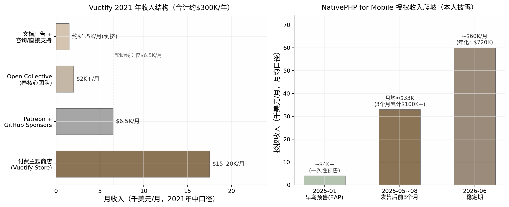

*图 6-1：左图为 Vuetify 2021 年中月度收入结构（本人披露，Starter Story 专访口径[^187^]）——付费主题商店取 $15–20K/月中值作图，"文档广告+咨询"为按 $300K/年总额倒挤的余项估计；虚线标出赞助项仅 $6.5K/月。右图为 NativePHP for Mobile 授权收入爬坡（本人披露，不同时点口径）[^189^][^21^]：2025-01 早鸟预售为一次性收入（约 20+ 张 × $200），发售后前 3 个月累计 $100K+ 折算月均约 $33K，2026-06 为稳定月收入约 $60K。*

### 6.3 日常作息与开发节奏

#### 6.3.1 开源维护者的日常：issue处理与社区管理占比；burnout高发

开源维护者的日常与产品型独立开发者完全不同——它不是"写功能-发布-看数据"的闭环，而是"修 bug-审 PR-回 issue-答社区提问"的无限队列。John Leider 把自己的时间分配概括为四件事并行："developing new features, fixing bugs, finding other open source developers, and providing direct support to business and enterprise users"（开发新功能、修 bug、招募开源开发者、为企业和商业用户提供直接支持）[^187^]。注意其中只有第一项是传统意义的"开发"，其余三项都是维护性劳动；2024 年后他进一步退居"higher-level tasks"，一线工程交给 Kael 与核心团队，团队以 Open Collective 发票报销制结算——把社区劳动变成了可计费的发票[^198^]。Vuetify 官方月度更新博客显示了这种节奏的真实强度：2026 年 5 月单月 89 个 commits、4 次 release，是按月滚动的高强度职业维护，而非业余副业[^197^]。

Simon Hamp 的日常则呈现"冲刺-演讲"双峰形态。冲刺期极端作息——Laracon EU 死线前两个月每天早 6 点干到凌晨两三点，用他的话说 NativePHP"consumed the last three months of my life"；他的聚焦方法论原始但有效："writing things down with a real pen and paper helped me to crystalize my thoughts… scratch through things that I just didn't need to do"（用纸笔写下来能让想法清晰，然后划掉那些根本不需要做的事）[^210^]。全职之后，两人把大量时间投入社区演讲——2025 年做了"几十场"线上线下分享[^211^]，这对开源项目不是副业而是核心获客动作（见 6.5 节）。

这种劳动结构的心理代价有行业级数据支撑。Tidelift 2024 报告显示 60% 维护者曾退出或考虑退出维护工作，48% 感觉不被赏识；且付费维护者实施安全与维护最佳实践的概率比无偿者高 55%——无报酬不仅是公平问题，还直接转化为整个软件供应链的质量与安全风险[^191^]。换言之，开源维护者的 burnout 不是个人意志力问题，而是商业模式缺位的症状：没有商业层的项目，维护劳动只能靠热情补贴，而热情是消耗品。

### 6.4 技术栈与工具链

#### 6.4.1 生态位卡位逻辑：Vue/PHP生态的"第二名红利"

两个案例的技术选择共享同一逻辑：**不发明新生态，在成熟生态里做最好的配套**。Vuetify 栈是 Vue 3 + TypeScript + Sass，MIT 协议，全部技术决策服务于"Vue 开发者最顺手的 Material Design 实现"这一定位——v2 时代完成 JS→TS 迁移，v4 默认启用 CSS layers 以便与 Tailwind 共存，Vuetify0 更把十年积累的逻辑层抽成 headless 组件库（40 组件、71 个 composables、24 个工具函数，5,700+ 单元测试、98.7% 覆盖率）[^188^][^197^]。NativePHP 同理：桌面版用静态编译 PHP 二进制 + Electron/Tauri 壳，移动端因 iOS 不允许多后台进程被迫全静态编译，反而换来单可执行文件、免安装、小幅性能提升的架构优势，桥接层用 Swift/Java（本人披露）[^190^][^216^]。它的全部技术理由只有一句营销话术："No Swift. No Kotlin. No Flutter. No React Native. Just Laravel."——目标是让数百万 Laravel 开发者零学习成本做出原生应用[^190^]。

这就是"第二名红利"：Vue 之于 React、PHP/Laravel 之于 JavaScript 全栈，都是"第二大生态"，社区规模足够大（有付费能力），但大厂看不上（没有官方竞品碾压）。Vuetify 的基础设施成本低到"开源项目通常没有实质运营成本"，文档站挂 Carbon 广告反而盈利[^187^]；NativePHP 的技术护城河则在于静态编译 PHP 到 iOS 这个"被所有人认为不可能"的工程动作——2025 年 1 月全球首个纯 PHP iPhone 应用过审本身就是壁垒的证明[^21^]。对独立开发者的选栈含义是：开源变现的壁垒不在代码（MIT 协议下代码谁都能抄），而在生态位的先到先占与社区信任的不可移植性。

### 6.5 获客与增长策略

#### 6.5.1 开源增长引擎：GitHub stars运营、会议演讲、生态发布节奏

开源项目的获客引擎与本书其他模式几乎零重叠：不投广告、不做 SEO 落地页矩阵，靠的是"被开发者需要"。Vuetify 的增长三板斧是生态位卡位（Vue 最早的 Material Design 组件库）、文档站内容漏斗（2021 年文档站月均约 100 万用户、3,550 万页面浏览，John 的原话是"the overwhelming majority of our traffic comes from developers using our documentation as a resource"，文档读者随后进入商店购买、赞助或咨询的漏斗）以及 Twitter/Discord 社区与 VueJobs、Vue Mastery 等生态伙伴互推（本人披露）[^187^]。GitHub 官方 2025 年的开源资助趋势文章把 Vuetify 列为样板，总结其赞助运营要素是产品化设计：$1–$1,500/月的分层档位、赞助者获得 logo 位与优先支持、资金池按月支付维护者与合同贡献者[^217^]。GitHub 开源资助负责人 Kevin Crosby 的总结点破了关键："It's not necessarily always the tech, but finding the people who care enough and want to fund the project itself"（关键不一定是技术，而是找到足够在乎、愿意为项目本身出钱的人）——赞助运营本质上是产品经理工作[^217^]。

NativePHP 的增长引擎更集中：**会议舞台即发布会**。2023 年 Laracon US 由 Marcel 临时换题引爆、2025 年 Laracon EU 由 Simon 自己台上发售，"在大会上宣布"成为其核心打法；辅以 build in public 连载（提前向粉丝剧透苹果审批结果）与利润反哺社区（真金白银赞助其他开发者、开源项目与 meetup，并送出 1,000 个免费授权）[^209^][^21^][^211^]。Simon 的总结值得直接引用："play to your strengths… tap into networks where you've already built up personal trust"（发挥你的长处，在你已建立个人信任的网络里做增长）[^21^]——他 1,000 粉丝的 Twitter 账号能冷启动，靠的不是受众规模而是 Laracon 舞台上的社区信誉。两种引擎的共同点是把"信任"当作获客货币；差异在于 Vuetify 的信任沉淀在文档流量里（可量化但正被 AI 侵蚀，见 6.9 节），NativePHP 的信任沉淀在人与人的社区关系里（难量化但更抗 AI）。

### 6.6 变现路径与商业模式

#### 6.6.1 四种变现路径对比：赞助/open core/付费授权/服务

开源变现的路径选择决定生死。下表（表 6-2）以两个案例为锚，对比四条主流路径的经济学特征：

**表 6-2　开源变现四条路径的经济学对比**

| 变现路径 | 机制 | 转化率/天花板 | 代表实践 | 主要风险 |
|---|---|---|---|---|
| 赞助/捐赠 | 用户与企业自愿付费，换 logo 位、优先支持 | 极低：76% 档位 <$100/月（第三方估算）[^193^]；Vue 周下载近千万仅够养 2 名全职[^195^] | Vuetify 赞助 $6.5K/月（2021）[^187^]；NativePHP 桌面版[^214^] | 断粮周期性爆发（Vuetify 2024-06 危机）[^198^] |
| Open core 功能收费 | 核心免费，高级功能闭源收费 | 中：取决于付费功能与免费功能的边界设计 | Vuetify 明确拒绝——"Locking extra features behind a paywall just feels bad"[^187^] | 社区反感；被 fork 风险 |
| 付费内容/商店 | 框架免费，主题、模板、代码片段收费 | 中高：Vuetify Store $15–20K/月，占总收入六成以上（2021，本人披露）[^187^] | Vuetify Store + Snips $14–36/用户/月[^204^] | 内容需持续产出；依赖文档流量漏斗 |
| 付费授权/双许可 | 新能力闭源，按分发权或席位收费 | 高：NativePHP 授权 ~$60K/月（2026-06，本人披露）[^21^] | NativePHP 移动端 Mini/Pro/Max 分发授权[^212^][^213^] | 免费层与收费层的边界争议；"何时开源"的承诺压力 |
| 服务/咨询 | 按时间卖专家支持 | 低天花板：不可规模化，本质是打工 | Vuetify "Book time with the Team"[^187^]；NativePHP consulting 页[^218^] | 挤占维护时间，与开源义务冲突 |

表 6-2 里最刺眼的对比是第一行与其余各行：赞助路径的天花板被数据反复钉死——GitHub Sponsors 累计 $1 亿摊到 7 万名维护者头上人均不足 $1,500（2026-07 官方口径）[^192^]，Open Collective 活跃项目年筹资中位数不足 $3,000（第三方估算）[^194^]，而 Vuetify 用五年时间验证了其上限约为每月几千美元量级[^187^][^198^]。真正的分水岭在"是否有一个独立于善意的付费理由"：商店卖的是省时（现成主题），授权卖的是权利（分发许可），服务卖的是时间（专家工时）——三者都是交易，只有赞助是馈赠。John 的反思（"以赞助为主的商业模式根本无效"）与 NativePHP 的设计（移动端闭源授权"needs care, funding, and momentum"）在这个维度上完全同构[^187^][^21^]。值得注意的是两个案例都保留了服务/咨询作为补充收入，但都未让其成为主力——因为对一人团队而言，卖时间与"维护开源项目"争夺的是同一份时间。

### 6.7 决策思路与关键转折点

#### 6.7.1 何时收费的判断：NativePHP在Laracon引爆后果断开EAP；Vuetify的教训是赞助永远不够

两个案例的决策史提供了"何时收费"的两种答案。Vuetify 的答案是"先做大再说"，代价是三次关键转折中有两次是危机驱动：2017 年 10 月辞职全职靠的是 alpha 反响超预期；2019–2022 年两次大版本重写伴随严重的开发者接力断层（官方承认的最大挑战）；2024 年 6 月财务枯竭后才被迫加速商业化，John 公开求职、入职 Optikka、9 月移交创意与工程控制权，自己转向"确保不再发生资金危机"的角色（官方博客披露）[^198^]。这条路径的决策逻辑是"相信规模终会带来收入"，但 2021 年收入结构证明规模带来的主要是赞助，而赞助撑不起全职团队——转折发生在亏钱之后，而非战略预判之前。

NativePHP 的答案是"在注意力峰值收费"。Simon 的四个关键决策每个都有原话佐证：其一，2022 年底放弃"正确的事"（接自由职业单子），赌多年想法——"instead of doing the 'right' thing I decided to finally try this idea I'd had for years"[^189^]；其二，在 Laracon US 引爆后的注意力窗口内立即用 GitHub Sponsors 开 $200 早鸟票，把赞助平台改造成预售+需求验证的二合一工具，几天 20+ 人付费证明"this completely impossible thing started making money from Day 1"[^21^]；其三，2025 年 1 月决定移动端闭源收费而非沿袭桌面版开源路线——"I decided to offer this as a premium package, rather than open source"[^21^]；其四，拉 Shane 做联合创始人而非雇员，把 iOS-only 提前一年变成双平台；其五，2025 年 10 月在 2,500+ 客户后主动大幅降价扩大盘子——"you don't need to tell me twice that this is the signal to go all-in"[^213^][^211^]。这条路径的决策逻辑是"信誉攒到哪里，收费就跟到哪里"，免费版与付费版各管一段。

两种答案的对比给出一个可操作的判断框架：**收费时点不取决于采用率绝对值，而取决于"新能力发布"制造的注意力事件**。NativePHP 在每个事件节点（POC 引爆、iOS 过审、大会发布）都挂上了收费钩子；Vuetify 在十年间的所有里程碑（v1.0、v2.0、v3.0）都只发布了代码，没有发布任何收费动作——直到 2024 年危机后才密集推出 One/Snips 产品矩阵[^198^][^197^]。对开源维护者而言，这是比"选哪条变现路径"更优先的决策：先决定"下一个大版本/新能力发布时收什么钱"，再回头决定免费层留多少。

### 6.8 效率密码

#### 6.8.1 社区贡献者杠杆与商业-开源边界管理

开源变现型团队的人效杠杆是独有的：免费的社区劳动力。Vuetify 有 440 名累计贡献者、4 名维护者（Snyk 2025 年 12 月快照），核心成员早期有最高 $1,000/月津贴、2021 年每月向团队回馈 >$2,500，用 Open Collective 透明基金把"分钱"制度化、去人格化——贡献者提交发票领钱，创始人不做中间人（官方披露）[^187^][^205^][^202^]。这意味着 Vuetify 的实际工程产能远超"夫妻店"名义规模，但杠杆的代价是协调成本与 developer churn（大版本由不同开发者接力完成是官方承认的最大挑战）[^198^]。

第二条效率密码是**商业产品与开源义务的彻底隔离**。Vuetify 的 MIT 主框架永远免费，收费物是主题、片段、订阅与咨询——"免费的是框架，收费的是内容与服务"[^187^][^204^]；NativePHP 把免费与收费切在不同产品线：桌面版 MIT 攒生态位，移动端闭源收费，官方多次声明移动端"长期目标是开源"以管理社区预期[^213^][^214^]。两种切法共同的纪律是：绝不动已免费放出的东西。一旦对存量功能收费或改协议，触发的就是 6.9.2 节将讨论的 fork 风险。第三条密码是 AI 提效的全面渗透：NativePHP 两人团队"we use AI every single day to keep on making both the business and the product better"（本人披露）[^21^]，Vuetify 则把 MCP server 做成生态产品，让自己的文档能被 AI 工具链直接消费[^197^]——这既是提效，也是对 6.9 节 AI 冲击的防御性布局。

### 6.9 当下可行性评估（2026年）

#### 6.9.1 AI冲击实锤：Tailwind文档流量-40%、收入-80%、裁员75%

2026 年评估开源变现的可行性，绕不开 Tailwind CSS 这份"尸检报告"。2026 年 1 月 6–7 日，Tailwind 创始人 Adam Wathan 在 GitHub PR #2388 评论及后续播客中披露：文档站流量自 2023 年初下降约 40%——因为 AI 编程助手直接回答 Tailwind 问题，用户不再访问文档站，而文档站正是付费产品 Tailwind UI 的获客漏斗；收入随之暴跌约 80%；Tailwind Labs 裁掉 75% 的工程师（4 人中裁 3 人）；Wathan 称之为"the brutal impact AI has had on our business"，并透露公司资金只剩约 6 个月。最讽刺的是框架本身月下载 7,500 万次、比以往任何时候都流行[^219^][^220^]。

这个事件对"先免费后收费"模式的冲击是结构性的：**当免费层（文档/教程）同时承担付费产品的获客漏斗职能时，AI 答案引擎会把这个漏斗拦腰截断**——采用率不降反升，收入却崩了，"采用率→收入"的传导链条第一次失灵。回看本章两个案例：Vuetify 2021 年的"文档即漏斗"打法正是 Tailwind 同款模型，其应对是把 MCP server 做成生态产品、让 AI 工具直接消费 Vuetify 知识（2025 年 10 月起）——相当于承认漏斗已被截断，转而把付费触点搬进 AI 工具内部[^197^]；NativePHP 则天然免疫，因为它的收费物是授权（分发权）而非内容，AI 无法替代"向 App Store 上架"这个动作所需的许可证[^212^][^216^]。AI 还在加重维护成本：curl 项目 2025 年对 AI 编造的虚假安全报告实行零容忍封禁并公开列出 17 份样本，Django 随后跟进——维护者的审核负担不降反升[^221^]。预计 2026–2027 年，"文档流量型"开源商业化将全面让位于"授权/工具型"，这不是趋势判断而是已发生事实的外推。

#### 6.9.2 License变更潮的启示与给新手的第一步

第二条可行性线索是 license 变更潮。2023 年 8 月 HashiCorp 将 Terraform 等全线产品从 MPL 2.0 改为 BSL 1.1，一个月内社区 fork 出 OpenTofu（2026 年初月下载破 170 万）；2024 年 3 月 Redis 从 BSD 改为 SSPL/RSALv2，数天内 AWS/Google/Oracle 等 fork 出 Valkey 捐给 Linux 基金会[^222^][^223^]。这波"relicensing rebellion"对个人维护者的启示是双向的：一方面，纯 MIT/Apache 项目的商业价值确实可能被大公司零成本攫取，NativePHP 移动端选择闭源授权正是这一逻辑的小型对应物；另一方面，个人开发者没有大公司的议价能力，事后改协议几乎必然触发社区 fork 与信誉破产——**因此"一开始就把新能力做成付费授权"（NativePHP 路线）远比"先免费做大、事后改 license"（Redis 路线）适合独立开发者**（分析性推断）[^222^][^223^]。

制度侧的补丁也在出现，但都还不是救命稻草：Open Source Pledge（2024 年 10 月由 Sentry 牵头 20+ 组织发起）要求企业按每全职开发者 $2,000/年直接付费给维护者，启动时成员合计承诺约 $1.3M[^224^][^225^]；Open Source Collective 2024 年收到约 $12.5M 捐款、向维护者支付 $9.7M（同比 +20%）[^226^]；Open Source Endowment（2026 年 2 月上线）尝试用"大学捐赠基金"模式资助维护者，初始资金仅 $752K[^193^]。这些数字加总仍远小于一个中型 SaaS 公司的年收入——制度化资助是补充，不是商业模式。给新手的第一步建议是：选你已在用的技术栈生态（信誉只在那里有效），以 MIT 发布一个解决自己痛点的工具，同时在路线图里写下"第一个收费物是什么、挂在哪个发布事件上"——如果写不出答案，就先不要辞职全职做开源。

### 6.10 模式适配画像

#### 6.10.1 适合性格、资金、见效周期与天花板

开源变现型适合的人群画像：热爱社区互动、能从 issue 与会议演讲中获得能量、且能忍受以年计的收入爬坡期——NativePHP 从 POC 到 $60K/月用了三年，Vuetify 从 alpha 到 $300K/年用了五年，期间前者只有几个月存款跑道、后者一度要靠打工维生（均为本人披露）[^187^][^198^][^189^][^21^]。启动资金近乎零（基础设施成本极低，Vuetify 文档站甚至靠广告盈利[^187^]），但机会成本极高：这五年如果去做垂直 SaaS（第 5 章），同等能力大概率更快到达同等收入。收入天花板方面，两个案例给出的年化区间为 $300K（Vuetify 2021 峰值口径）至 $720K（NativePHP 2026 按 $60K/月年化折算，$60K/月为本人披露）——高于垂直 SaaS 的单点垂直口径，但到达时间是后者的两到三倍，且中途要穿越至少一次赞助断粮危机[^187^][^21^]。

不适合的人群同样明确：无法忍受长期低收入者（60% 维护者无报酬是行业基线而非例外[^191^]）、把"开源明星"等同于财务自由者（Vuetify 2024 年危机是最直接的反例[^198^]）、以及指望文档流量 funnel 长期有效者（Tailwind 已经证明该漏斗正被 AI 截断[^219^]）。这个模式的真正奖励不完全是金钱——Simon Hamp 在 Laracon 台上发布"不可能之物"的社区地位、John Leider 十年维护一个 41K stars 项目的行业声誉，是无法用 MRR 计价的资产；但如果你的目标函数是"最快替代工资收入"，本章两个案例的数据共同指向同一个结论：开源是很好的杠杆，很慢的生意。

---

## 7. 内容/知识变现型（卖经验不卖软件）——Luca Palmieri、哥飞、Marc Lou

### 7.1 模式定义与核心逻辑

#### 7.1.1 一句话定义：把"我做成过"本身产品化

内容/知识变现型指开发者不把技能封装成软件，而是把"做成某件事的完整经验"封装成可无限复制的知识产品——电子书、视频课程或付费社群——向想复制这条路径的后来者收费。本章三个案例恰好覆盖三种主流形态：Luca Palmieri 的技术电子书《Zero To Production In Rust》累计售出 18,000+ 册（官网现行口径，2026-08 核实）[^227^]；哥飞的出海 SEO 付费社群 2024-10 达 2,000+ 付费成员、年费 ¥2,600（人数为掘金专访本人确认）[^228^][^229^]；Marc Lou 的编程课 CodeFast 上线 48 小时收入 $92,000、累计 $793K+（收入经其自建 TrustMRR 的 Stripe 只读数据验证，属英文圈可信度最高档）[^230^][^231^][^232^]。三者的共同前提是受众先行（audience-first）：先通过免费内容积累信任资产，再向其中一小部分人收费——没有受众就没有发射，这是该模式与本书其他七种模式共享的底层，也是它唯一的前置门槛。

#### 7.1.2 底层逻辑：接近 100% 毛利与零边际成本；与 Levels 模式的本质区别

知识产品的经济学结构在八种模式中最极端：电子书除平台抽成外几乎没有成本，Gumroad 抽成 10% 加每笔 $0.50，叠加支付通道费后作者到手约 84–87%[^233^]；无库存、无物流、无客服工单，毛利率普遍超过 90%（Marc Lou 全盘口径为 92%，月运营成本仅约 $4,000）[^231^]。与第 2 章 Levels 的"卖软件"对比，差异不在利润率数字（Levels 总盘利润率 95%，同样极高），而在收入函数的自变量：软件收入是"使用量 × 订阅费"，需要持续运维、承担每月 $13K–47K 的 AI 算力与运维账单并直面功能型竞品；知识产品收入是"受众规模 × 转化率 × 客单价"，交付后边际成本为零，其被替代风险不来自竞品功能，而来自 AI 直接回答用户问题——这决定了两种模式在 2026 年面对 AI 浪潮时一顺一逆的不同处境（详见 7.9）。更根本的区别是壁垒位置：软件的壁垒可以建在代码与工作流里，知识产品的内容本身可以被瞬间复制，壁垒只能建在"作者是谁"上——这使得该模式的全部战略都围绕个人 IP 展开。

### 7.2 代表案例深度拆解

#### 7.2.1 案例 A——Luca Palmieri《Zero To Production In Rust》：22 个月的慢产品，6 年的长尾

Luca Palmieri 是数学家出身的意大利工程师，先后任 TrueLayer 首席工程师与 AWS 高级工程师，2018 年起进入 Rust 社区，是 cargo-chef、wiremock 等开源项目的作者[^234^][^235^]。写书动机不是商业算计，而是回答社区里被反复追问的问题——"Rust 能不能高效写生产级 API？"他自述"有野心写一本能作为这波（Rust 采用）浪潮入场券的书"[^236^]。2020-05-10 他在博客官宣开写，采用"边写边卖"的连载预售模式，保持"每两周一篇、雷打不动"的节奏；2021 年单年售出 3,000+ 册，他在年度复盘中写道："The book revenues are now comparable to my yearly salary - wild."（书的收入已可比肩我的年薪——太疯狂了）（本人披露）[^237^]。2022-03-14 全书完结，共 11 章约 600 页[^236^]。收入方面，他从未公开精确总收入，最硬的一手数字是官网的"18,000+ 册"[^227^]；按 $30–40 的混合单价推算，终身销售额约 $55–72 万量级（推算口径，置信低，仅供量级参考）。2026 年的现状更具启发性：书仍在售且承诺终身免费更新，但本人重心已转向 Mainmatter 的 Rust 企业培训与 EuroRust 大会，2026-06 Mainmatter 成为 Rust 基金会"可信培训"首批认证机构[^238^]——书完成了从"现金牛"到"权威凭证+培训业务获客入口"的角色转换，这是技术书作者最优雅的价值延续方式。

#### 7.2.2 案例 A 佐证：三档收入基准

同为技术电子书赛道，三位作者的公开账本提供了从天花板到常态的完整参照系。天花板是 Adam Wathan 的《Refactoring UI》（2018-12 发布）：静默上线 3–4 小时即 $40,000、首日近 $400,000、首月 $1M，截至 2022-09 累计 $2.5M+（本人 AMA 与播客口径）[^239^][^240^]。中间档是 Daniel Vassallo 的《The Good Parts of AWS》：173 页 PDF、约 160 小时写成，发布头 14 天收入 $45,000，2019-10 至 2020-09 两产品（书+视频课）合计销售额 $237,207、利润 $210,822，月均 $24,802（作者逐笔公开账本，多源交叉一致）[^241^][^242^]。常态基准是 Arvid Kahl 的《Zero to Sold》：首日 350 册、首月 1,571 册 / $12,871，成本约 $4,000[^243^]——即"没有爆款时，自出版技术/商业书的首月利润约 $1 万级"。三档数据合在一起说明：该模式的收入方差极大，且方差几乎全部由发射前的受众规模解释，而非内容质量差异。

#### 7.2.3 案例 B——哥飞：中文圈"卖经验"最实的样本

哥飞是 15 年站长老兵，手里有可验证的硬实绩：2016 年把某站 AdSense 月收入从 6 月的 $874 优化到 11 月的 $2,100，另有小游戏站靠 AdSense 日入 $300–400（本人公开、多方引用）[^22^][^244^]。2023 年 AI 爆发让建站门槛骤降，他把方法论打包成"养网站防老"的出海 SEO 教学，2023-07-02 开出付费社群"哥飞的朋友们"[^245^]。增长曲线陡峭：2024-03 超 1,000 人（¥999/年），2024-08-01 涨价至 ¥2,600/年，2024-10 达 2,000+ 付费成员（掘金《开发者说》第 21 期专访本人确认）[^228^][^245^][^229^]；2025-05 网易报道其续费率近八成——在互联网知识付费行业属极罕见水平[^22^]。按 2,000 人 × ¥2,600 估算，社群年化收入约 ¥520 万（推算口径，含早期 ¥999 价格成员，置信中低）。需要声明的是，社群流传的"单人月入 10 万+ 美金"战报为社群自述口径、未获独立核实，本报告不予采信为事实；可采信的成员案例是经媒体采访核实的三例：前字节产品经理 9 个月到月入 $1 万、前腾讯后端业余做到日入 $200 后辞职、夫妻档小游戏站月收约 $1,835[^22^]。对照组是前腾讯工程师艾逗笔（idoubi）：2024 年上线 11 款 AI 产品、年底其中 4 款合计仅 $1,000 MRR，而其 ¥1,024/年的"1024 全栈开发社群"（200+ 人）反而超过所有产品收入成为其主要收入[^246^][^247^]——"做产品不赚钱、教做产品先赚钱"在中文圈有直接证据。

#### 7.2.4 案例 C——Marc Lou 的 CodeFast：受众成熟后的现金收割

Marc Lou 的信誉资本来自软件而非课程：2023-09 靠 ShipFast 样板（首月 $40K）爆发后，他才拥有"教别人做 SaaS"的资格[^231^]。CodeFast（12 小时视频、215 节课）制作耗时 9 个月，是他做过的最慢的产品；2024-11-28 借黑五上线，48 小时收入 $92,000、7 天 $200K+（1,022 名学员、4.5 万访客），标价 $299、黑五五折实收约 $169[^230^][^248^]。截至 2026 年累计 $793K+，但已回落至 $3–23K/月；2025 全年其全部产品组合收入 $1,032,000（0 员工，TrustMRR 经 Stripe 验证）[^231^][^232^][^249^]。最具分析价值的是他本人的事后总结：做了 9 个月的 CodeFast 被做了约 1 天的 TrustMRR 在月收入上超越（2026-01：TrustMRR $31.4K > CodeFast $23.5K）[^231^][^250^]——课程是现金流放大器，不是护城河；护城河是受众与发射系统。

**表 7-1：三个代表案例关键数据对比**

| 维度 | Luca Palmieri | 哥飞 | Marc Lou（CodeFast） |
|---|---|---|---|
| 产品形态 | 技术电子书（11 章约 600 页）[^236^] | 年费制实战社群（出海 SEO）[^228^] | 视频课程（12 小时、215 节）[^248^] |
| 启动时间 | 2020-05 开写、2022-03 完结 [^251^][^236^] | 2023-07-02 开群 [^245^] | 2024-11-28 上线（制作 9 个月）[^230^] |
| 核心规模数据 | 售出 18,000+ 册（官网，2026-08）[^227^] | 2,000+ 付费成员（2024-10，本人确认）[^228^] | 累计 $793K+；2025 全年组合 $1,032,000（Stripe 验证）[^231^][^232^] |
| 定价 | 约 $39.99/册 + 团队/公司许可证 [^252^] | ¥999/年 → ¥2,600/年（2024-08）[^229^] | $299，黑五实收约 $169 [^248^] |
| 获客引擎 | 技术博客 + 播客巡访 + 免费练习册（GitHub 9.3K star）[^253^] | 公众号 500+ 篇免费教程 + 学员成果转介绍 [^244^][^22^] | X 粉丝 4 万+（发射时）→32.3 万（2026）+ 4.2 万 newsletter 订阅 [^231^][^254^] |
| 收入曲线类型 | 长尾型（6 年仍在售）[^227^] | 年费复利型（续费率近八成）[^22^] | 脉冲衰减型（$200K/周 → $3–23K/月）[^231^][^250^] |
| 2026 现状 | 书转为培训业务获客入口 [^238^] | 社群 + 自营网站双轮 [^228^] | 退居组合第二梯队，被 TrustMRR 超越 [^250^] |

三案例放在一起，呈现的是同一模式下的三种现金流形态：电子书是"慢产品长尾"，Luca 用 22 个月写完的书在第六年仍在产生收入与行业地位；年费社群是"复利现金流"，收入上限由成员数 × 年费决定，续费率近八成意味着交付质量真实有效，但每年都要重新交付一次；课程则是"发射脉冲+长尾衰减"，CodeFast 首周 $200K+ 与 18 个月后 $3–23K/月之间是数量级落差。形态选择本质上是时间偏好的选择：要长尾选书，要可预测现金流选社群，要快速变现已有受众选课程。三者的共同约束是受众规模——哥飞从 0 到年化数百万用了约 14 个月，前提是他已有 15 年可公开验证的站长实绩，而 Marc Lou 的 $92K/48h 全部可以由发射前的 4 万粉丝与 4.2 万邮件订阅解释。

**图 7-1：知识变现案例收入规模对比**

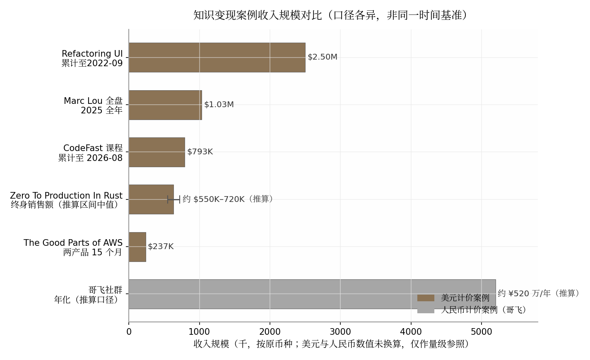

图注：各柱口径与时间点不同（累计/年度/年化混杂），仅作量级参照；Zero To Production In Rust 终身销售额为按 18,000+ 册 × $30–40 单价的推算区间（$550K–720K，误差条所示），其官网一手口径仅为"18,000+ 册"（2026-08）[^227^]；哥飞社群年化为 2,000 人 × ¥2,600 的推算口径[^228^][^229^]；Refactoring UI 为截至 2022-09 本人披露口径[^239^]；Marc Lou 2025 全年与 CodeFast 累计为 TrustMRR Stripe 验证口径[^231^][^232^]；Vassallo 两产品为作者公开账本（2019-10 至 2020-09）[^242^]。美元与人民币数值未做汇率换算，图中以色块区分币种。

### 7.3 日常作息与开发节奏

#### 7.3.1 写作者的一天与社群运营的时间黑洞

三种形态对应三种截然不同的时间结构。写作者是"兼职马拉松"：Luca 在 TrueLayer/AWS 全职任职期间完成全书，节奏为两周一章，他的方法论原话是"冻结时间预算，不冻结功能集"——不为单章范围死磕，死守发布节拍，这正击中技术写作烂尾率高的根因[^255^]。社群运营则是"时间黑洞"：哥飞公众号输出 500+ 篇免费教程，社群每月布置实战任务、办"新词新站比赛"，深圳办公室甚至开放给本地成员下班后泡到深夜[^245^][^22^]——年费制的现金流入账一次，交付义务却是 365 天滚动存在的，这是它相对电子书形态被低估的成本。课程制介于两者之间：制作期重投入（CodeFast 9 个月），上线后回归轻运营，Marc Lou 的日常是"早上冲浪 2 小时、中午开工、晚 6 点收工、周末不工作"[^231^]。他的情绪管理法值得原文引用（经 The Almanack of Marc Lou 二手转载其 2024-04 博客原文，建议回溯 marclou.com）："My monkey brain wants quick results. So I never spend more than a few weeks building a new product."以及"I'd rather quit too early and miss an opportunity than quit too late and burn out."[^256^]——课程这种重投入产品恰恰是他产品组合里的例外，说明他对知识产品的成本结构有清醒认知：只有受众足够大时，9 个月的制作才值得。

### 7.4 技术栈与工具链

#### 7.4.1 出版分发栈：成本近乎零，但中英文平台的"税差"显著

知识变现的技术栈轻到近乎不存在：Luca 的组合是 Gumroad（电子书三格式）+ Amazon KDP（纸质版）+ 自建官网 + GitHub 公开源码仓库 + 读者 Discord，审校靠社区志愿者（每章 4–6 人署名致谢），现金成本仅有平台抽成[^227^][^255^]；哥飞的组合是公众号（免费漏斗）+ 付费社群（交付）+ 播客与媒体专访（获客），无任何自研系统[^228^][^245^]；Marc Lou 则完全自建——自有落地页 + Stripe/Lemon Squeezy 收款 + Discord 私域，不依赖 Gumroad 类平台[^231^]。真正的差异在平台抽成这层"税收"上：

**表 7-2：中英文知识付费平台抽成对比（2025–2026 年口径）**

| 平台 | 抽成结构 | 创作者实际到手（估算） | 备注 |
|---|---|---|---|
| Gumroad（美） | 10% + $0.50/笔；Discover 渠道 30% [^233^] | 约 84–87%（叠加 Stripe 约 2.9%+$0.30 后）[^233^] | 2025-01 起为全量 Merchant of Record，代扣全球 VAT/GST；退款不退平台费 [^233^] |
| Lemon Squeezy（美） | 5% + $0.50/笔 [^257^] | 约 90%+ | 同为 MoR 模式 |
| 小报童（中） | 抽成 15%；提现经云账户另约 6% + 个税代扣 [^258^][^259^] | 约 79% | 分销佣金作者自设、最高 60%，平台不抽分销费 [^259^] |
| 知识星球（中） | 个人星球抽 20%；企业版 5–10% 阶梯 [^258^] | 约 80%（个人） | 年费社群主流载体 |
| 小鹅通（中） | 年费 ¥6,800–25,800 SaaS 模式，额度内 0 抽成 [^259^] | 视收入规模摊薄 | 适合已验证收入后切换 |

这张表揭示两个结构性事实。其一，中文平台对个人创作者的抽成普遍高于英文圈（15–20% 对 5–10%），且叠加提现环节的约 6% 费用与个税代扣，实际到手率低于 Gumroad 直销约 5–10 个百分点——这构成中文知识创作者的一道隐形税。其二，中文圈的收入大头不在低价买断专栏而在高价年费实战社群：小报童导航站公开订阅数据显示，出海/独立开发类专栏订阅多为数百至数千级、单价 ¥10–150 买断为主（头部如"小林写作"¥19 买断、4,600+ 订阅，合计不足 ¥9 万）[^260^][^261^]，与哥飞 ¥2,600/年 × 2,000 人的社群年化规模相差两个数量级。英文圈以电子书/课程一次性售卖为主（Gumroad 生态），中文圈以高价年费社群为主，这不是偶然的形态偏好：年费制把"信任"摊到 365 天持续交付中检验，恰好对冲了中文知识付费市场信任赤字更高的环境。

### 7.5 获客与增长策略

#### 7.5.1 受众先行机制：发射成绩在发射前已注定

该模式的获客公式高度一致：免费内容蓄水 → 预售/发射收割 → 买家成果成为下一轮蓄水素材。Vassallo 提供了罕见的完整归因：2019-02 辞职时他只有 150 个 Twitter 粉丝，发射时积累到 12,000 个；发布头 14 天的 $45,000 中，宣布推文是第一渠道，/r/aws 的 Reddit 付费广告（$0.50/点击）贡献 $13,734 为第三渠道，他的原话是"我在这门生意里赚的每一美元都可归因于最初的受众"（本人披露）[^262^][^241^]。Wathan 在《Refactoring UI》上线前用两年时间免费发布 Twitter 设计技巧与病毒式 screencast 蓄水，才有了首日近 $400,000[^239^]。Luca 的漏斗是三级火箭：免费练习册《100 Exercises To Learn Rust》（GitHub 9.3K+ star，2025-07 被 JetBrains 内置进 RustRover）做顶层流量入口，付费书居中，企业培训收尾[^253^][^263^]。哥飞的中文版路径同构：公众号 500+ 篇免费教程攒精准读者，学员"月入千刀/万刀"的截图成为最强转介绍物料，支撑起近八成续费率[^22^][^244^]。预售是这一机制的放大器——Vassallo 在书写完前 12 周就以 $24 开预售，既验证了需求又回笼了现金流[^241^]。

### 7.6 变现路径与商业模式

#### 7.6.1 定价阶梯：从 $39.99 电子书到 ¥2,600 年费，定价权来自"已免费创造的价值"

**表 7-3：知识产品定价阶梯与定位差异**

| 产品 | 定价 | 收费模式 | 定价逻辑 |
|---|---|---|---|
| Arvid Kahl《Zero to Sold》 | 首月约 $8/册实收（$12,871/1,571 册）[^243^] | 买断 | 无强势受众时的市场底价 |
| Luca《Zero To Production In Rust》 | 约 $39.99 + 团队/公司许可证 [^252^][^227^] | 买断 + B2B 许可证 | 生态新人持续流入的长尾书 |
| Vassallo《The Good Parts of AWS》 | $24 预售 → $28 发布 → $38 → 降至 $15 [^241^] | 买断 | 实验结论：低价换销量与 momentum |
| Wathan《Refactoring UI》 | $79 / $99 / $149 三档 [^240^] | 买断 + 分档 | 刻意逃离 $20 电子书价格带 |
| Marc Lou CodeFast | $299 标价，黑五实收约 $169 [^248^] | 买断 + 终身更新 | 受众盘支撑的高客单课程 |
| idoubi 1024 社群 | ¥1,024/年（18% 推荐返佣）[^264^] | 年费 | 开发者社群中档定价 |
| 哥飞社群 | ¥999/年 → ¥2,600/年 [^229^] | 年费（365 天滚动） | 涨价过滤 + 提升 LTV |
| Vassallo Small Bets 社群 | $185–450 区间浮动，终身制 [^265^][^266^] | 一次性终身会员 | 免续费压力的社群变体 |

定价阶梯的分析价值在于定价权的来源。Wathan 的合作方营销测算显示：把书从 $10 提到 $79（提价 8 倍）只损失一半销量，收入翻 4 倍，他的总结是"你能定的价格等于你已经免费创造过的价值"[^240^]——价格上限不由内容成本决定，而由受众蓄水期的免费价值沉淀决定。Vassallo 的定价实验则提供反例：他事后反思最高的初始定价（$99 档）是错误的，"很难先收最铁粉丝 $100，几周后又以 $50 推广同一产品"[^241^]。收费模式的选择比分档更重要：买断制（书、课程）把收入集中在前端、后续零交付义务，适合一人公司；年费制（哥飞、idoubi）把收入摊平为可预测现金流，但续费率成为生死指标——哥飞近八成的续费率意味着每年重新赢得一次客户，这在中文知识付费行业是稀缺资产；Small Bets 的终身会员制是第三条路，用一次性高价买断免除续费压力，代价是失去复利（该社群 2021-11 至 2023-10 收入 $824,409、毛利约 75%，2025-04 被 Gumroad 以 $360 万收购）[^265^][^267^]。

### 7.7 决策思路与关键转折点

#### 7.7.1 为何不做软件改卖知识；危机：盗版与 AI 生成内容

三个案例的转向逻辑惊人一致：知识变现都是软件路径受挫或见顶后的理性再配置。Vassallo 的直接触发是 SaaS 失败——他的 Userbase 拿到 Product Hunt 第一、Hacker News 首页，年收入却只有约 $10K，还倒贴 $10 万积蓄，这次失败直接催生"卖知识"转向[^268^][^242^]。Luca 连续三年（2020–2022）把"发布一个小 SaaS"列为年度目标、连续三年未完成，知识产品反而先跑通[^269^][^237^]。idoubi 的对照最锋利：11 款 AI 产品中，年底 4 款合计仅 $1,000 MRR、ThinkAny 付费率仅 0.03%，而卖给开发者的模板 ShipAny 4 小时预售 $10,000、一周收入超过其他产品一年[^246^]——"淘金不如卖水"在 2024 年的中文 AI 圈被反复验证。风险端有三层：一是盗版，电子书 PDF 的可复制性使盗版无法根除，案例们的共同应对是用"终身更新+社群+作者可及性"卖盗版给不了的东西；二是"割韭菜"质疑，哥飞的应对是晒成员可核实成绩+涨价过滤[^229^]；三是 AI 生成内容的系统性冲击，这已超出个案危机范畴，详见 7.9。

### 7.8 效率密码

#### 7.8.1 内容复用与一人出版流程：一次生产，五次变现

该模式效率的本质是素材复利。Luca 把同一批内容用了五次：博客文章=书的章节=会议演讲素材=企业 workshop 教材=免费练习册[^255^][^253^]；公开写作（build in public 写作法）还让社区志愿审校替代了付费编辑，每章 4–6 名 reviewer 署名致谢[^255^]。哥飞的复用结构是"一套方法论三处变现身"：自营网站直接赚钱、社群卖经验、公众号做获客，连"拆大站需求→做小站承接"的选题 SOP 都同时是教学内容和可批量复制的操作手册[^244^]。Marc Lou 的 CodeFast 素材直接来自 ShipFast 的真实开发过程，发射邮件、推文、YouTube 视频一次制作多渠道分发，收入公开本身就是零成本营销[^231^]。一人出版流程的完整清单因此可以压缩为：写作（时间盒管理）→ 社区志愿审校 → Gumroad/自建落地页上架 → 邮件列表发射 → 内容回收为演讲与免费漏斗——全流程无需雇员，编辑、设计、客服三个传统出版岗位分别被社区、模板与退款政策（Luca 的 15 天无理由退款、CodeFast 的 7 天观看不足 10% 可退）所替代[^227^][^248^]。

### 7.9 当下可行性评估（2026 年）

#### 7.9.1 AI 冲击实证：纯信息搬运型内容正被直接替代

2026 年评估该模式，必须先直视两组实证数据。图书端：Tim Ferriss 2026-06-12 在本人博客公开 BookScan 数据，其 5 本 how-to 畅销书印刷销量 2023 年 -5%、2024 年 -13%、2025 年 -46%、2026 年年化 -57%；若趋势保持，2026 年销量将比 2022 年低约 80%，他将主因归于 ChatGPT/Claude 类大模型爆发[^270^]。课程端：Udemy 2025 年约 12% 新课程被检测为低质 AIGC 课程（AI 生成大纲+逐字稿+TTS 朗读的流水线产品），平台 Q3 起用 AI 检测下架超 4 万门课，讲师满意度从 2023 年 78% 降至 2025 年 62%[^271^]。两组数据指向同一结论：当 AI 能实时回答任何知识问题，"信息搬运"本身已没有定价权——知识产品中被替代的是"信息层"，幸存的是 AI 无法提供的那几层。

#### 7.9.2 幸存者模式 = 作者 IP + 互动练习 + 社群陪伴

从本章案例中可提炼出五条已被验证的对冲策略：卖作者 IP 与信任而非信息（Wathan 的"价格=你免费创造过的价值"）[^240^]；卖互动与练习而非文字（Luca 的 100 Exercises 与 Mainmatter 企业培训，后者单价达数千欧元/天级，2026-06 又叠加 Rust 基金会首批培训认证的行业生态位）[^253^][^238^]；卖社群陪伴与实战任务（哥飞年费社群、每月任务制、近八成续费率）[^22^][^245^]；用 AI 降本生产但保留真人背书（CodeFast 已加入 AI-assisted workflows 章节）[^231^]；以及形态迁移——Gumroad 2025 年 AI 类产品（prompt 包等）已成平台第一大品类，知识产品本身正在向"AI 资产"演变[^272^]。宏观层面，中国知识付费市场预计 2025 年达 2,808.8 亿元、用户 6.4 亿（艾媒咨询口径），但人民日报《人民论坛》2024-09 同时指出行业"拉新不足、复购下滑"的困境[^273^][^274^]；CSDN 2025-06 对千名中国独立开发者的调研显示，内容变现仅占收入来源约 15%（月均 2,000–10,000 元）、课程培训占 5%，是"第三大收入支柱"但天花板低于 SaaS 与外包[^275^]。给 2026 年新手的第一步：不要从"写什么/教什么"开始，而先从"在哪个社区持续免费输出 6 个月"开始——三个案例的发射成绩全部可由发射前受众规模解释，受众是唯一无法速成的生产资料；若 6 个月后没有攒出可转化的受众，说明选题或个人 IP 不具备该模式的前置条件，此时沉没成本仅为一台电脑和业余时间，这正是知识变现相对其他模式下行风险最低的原因。

### 7.10 模式适配画像

#### 7.10.1 适合谁、不适合谁

适合者画像：表达欲强、有可公开验证的实绩（"我做成过"是全部销售叙事的根基）、能承受长期免费输出期的零回报。启动资金近乎零（平台抽成后置、工具链免费）；见效时间数月至数年，完全取决于既有受众存量——Vassallo 从 150 粉丝起步到 $24.8K/月均用了约 20 个月，哥飞从开群到年化数百万用了约 14 个月但前置了 15 年站长履历[^268^][^228^]。收入天花板的参照坐标：累计口径 $2.5M+（Refactoring UI，截至 2022-09）[^239^]，年化口径约 ¥520 万（哥飞社群，推算口径）、$1,032,000（Marc Lou 2025 全年组合，Stripe 验证，其中课程仅为组合一部分）[^232^]。不适合者同样清晰：没有真本事可教者（AI 时代信息搬运已无定价权）、无法承受公开输出与被质疑者（"割韭菜"指控是中文圈的标配舆情）、以及追求被动收入幻觉者——年费社群的交付义务与课程的持续迭代（CodeFast 仍在加入 AI 章节）意味着这一模式"被动"的程度远低于其名声。预计 2026 年后，该模式将进一步向"IP+互动+陪伴"的高服务浓度形态收敛，纯电子书/录播课的价格带将持续承压，入场窗口属于那些已经在某个细分领域积累了可信实绩的人。

---

## 8. 套利/阶段性收割型（赚一波就跑）——阴明与SeeU.Food

### 8.1 模式定义与核心逻辑

#### 8.1.1 一句话定义

**套利/阶段性收割型**：识别一次技术代差造成的短暂定价错位，用最快的速度完成"验证—变现—退出"全流程，在产品壁垒消失之前主动离场。本报告全部八种模式中，这是唯一一种把"退出"写进模式定义的打法——其他七种模式默认产品活得越久越好，而套利型的前提是产品注定短命。阴明本人在复盘自己的 AI App SeeU.Food 时，直接把这个模式定性为"阶段性套利"：第 1 个月红利期快速赚钱，第 2 个月同类 App 激增 20~30 个，第 3 个月"卷死"[^276^]。三个月，是这个模式在本案例中测得的完整生命周期。

这一定义里有两个容易被忽视的限定词。其一是"技术代差窗口"——套利的利润不来自产品本身多优秀，而来自"大模型能力已经出现、但大众化产品还没跟上"的时间差；其二是"主动退出"——失败者和套利者的区别在于，前者是被窗口关闭拍死的，后者是带着现金在窗口关闭前走的。

#### 8.1.2 底层逻辑：AI API 成本三年降 99%+，利润窗口以月计

套利型模式在 2025 年前后集中出现，有一个可量化的成本基础：GPT-4 级智能的 API 价格从 2023 年 3 月的约 $60/百万输出 token 降至 2026 年中的约 $0.40，三年下降超过 99%，约合每年 10 倍速[^277^]。SeeU.Food 的单次图片识别成本约 $0.0001，而订阅定价约 $9.99–$15/月[^276^]——收入端与成本端相差四到五个数量级，这个剪刀差就是套利利润的来源。

但同一条成本曲线也是壁垒消失的原因：调用大模型的能力彻底商品化之后，"调用 API"这一层不再是任何壁垒，任何人都可以在同样的成本曲线上做出几乎一样的产品。SeeU.Food 上线第 2 个月涌入的 20~30 个同类产品（相当部分来自中国团队）就是证明[^276^]。因此本模式的底层逻辑可以写成一句话：**成本下降的红利是公共的，谁先到场谁收割，收割期以月计**。

与第 2 章 Levels 模式的本质区别正在于此：Levels 建的是资产——93 万粉丝（2026-08）、十年累积的透明运营记录，这些是别人拿不走的复利结构；阴明建的是现金流——90 天内最大化回收，不追求任何可累积的东西。从收入曲线形态看，这是复利曲线与脉冲曲线的分野：复利型产品慢热但持续，脉冲型产品快起快落，而套利型是唯一一种**主动选择脉冲**、并把脉冲本身制度化为方法论的模式。

### 8.2 代表案例深度拆解：阴明（稀土掘金创始人）/ SeeU.Food

#### 8.2.1 背景：两次卖公司的连续退出者

阴明（1990 年生，网名 kalasoo）是中文互联网少见的"两次卖公司"型创业者。本科就读于香港中文大学信息工程/通信专业，硕士毕业于剑桥大学计算机系[^278^]。他的第一次创业是剑桥期间启动的留学选校工具"GradChef 毕老师"——面见徐小平时只得到两个字"没用"，随后他兼职运营 8 个月，把产品卖给了新通教育[^278^][^279^]。这次"快速做—被点醒—快速卖掉"的经历，是其后所有退出决策的原型。2017 年他复盘稀土时期时说过一句话，十年后看几乎是 SeeU.Food 的剧本预告：「如果公司只做三年，那就安心做好产品，然后卖掉；如果要做十年，就一定要明确商业价值。」[^278^]

2014 年 11 月他创立技术人才推荐社区"稀土"，两周完成开发，上线两周内拿到明势资本、极客帮创投、天使汇 150 万元人民币天使轮[^278^]；2015 年 8 月掘金（juejin.im）上线内测，第一批 15 个用户来自稀土[^279^][^280^]；2016 年 1 月 Pre-A 轮 1,000 万元，2017 年 A 轮 2,000 万元、投后估值约 1.3 亿元人民币[^281^][^282^]。冷启动期他和合伙人"前 5000 个用户几乎都聊过"，为签作者"乘坐高铁去对方家里吃饭聊天"[^281^]——这种把不可规模化的事做到极致的获客纪律，十年后原样出现在 SeeU.Food 的 Reddit 私信打法里。2018–2019 年掘金融资断档、团队流失，他自学全栈维护网站，甚至做过女装直播带货自救，第三方观察者记述其"感觉随时有倒闭的风险"[^283^]。2020 年上半年字节跳动谈妥收购（2020-11-04 由财经涂鸦曝光），**收购金额未披露**，亦无任何公开来源[^284^][^285^]；他在收购曝光前的 2020 年 7-8 月已卸任掘金站长，由前 360 前端架构师月影接管运营[^285^][^286^]。其离开字节跳动的具体时间同样未见公开来源，可确认的是清华 MBA 官网报道所称"他自 2025 年起践行 AI 一人公司"[^287^]。

#### 8.2.2 时间线：从立项到"卷死"的九十天

2025 年初（相对 2025-12 播客录制时点的"今年年初"），阴明一个人用 Vibe Coding 开发 iOS 健康饮食 App **SeeU.Food**（官网 seeu.food），约一个月完成从开发到上线[^276^][^23^]。产品功能为拍照识别食物算卡路里、拍冰箱推荐菜谱、拍菜单按饮食偏好选菜，面向美国市场[^276^]。上线第 1 个月是红利期；第 2 个月美区出现 20~30 个"几乎一模一样"的拍照算卡路里 App，红利消失；第 3 个月被"卷死"[^276^]。2025-09-03 产品出现在 Peerlist（账号 kalasoo 名下）[^288^]；2025 年 10 月他在清华 MBA"AI 创变营"以 seeu.food 为案例讲授"找需求—做出来—卖出去"[^287^]；2025-12-21 津津乐道播客上线完整复盘[^23^]；2025-12-29 独立开发者欧维Ove 发布长文拆解，当时官网仍可访问，且已演进出"SeeU.Food Agent"字样[^276^]。2026-08-26 本报告实测：seeu.food 域名 DNS 解析失败，美区 App Store 检索不到该 App[^289^]。

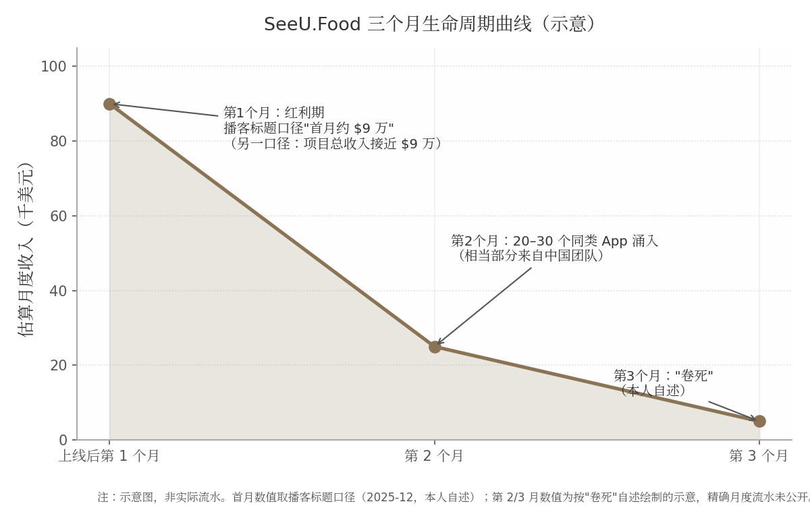

*图 8-1 SeeU.Food 三个月生命周期曲线（示意）。数据口径：首月数值取播客标题口径"一个月 9 万美金收入"（2025-12-21，本人自述）[^23^]；第 2/3 月数值为按"卷死"自述绘制的示意，精确月度流水未公开。*

上图刻意画成"示意"而非精确曲线，原因是阴明本人从未披露过逐月流水——这正是本模式的一个结构性特征：套利者没有动力经营透明度（详见 8.7.1 他对 Build in Public 的否定），因此这类项目的外部可见数据天然稀薄。可确认的只有三个时点锚点：从开发到上线约一个月、第 1 个月红利期的高收入、第 3 个月的"卷死"自述[^276^]。从脉冲形态看，SeeU.Food 的曲线比 Photo AI（峰值后约 9 个月回落 34%）陡峭一个数量级——连本报告中最成功的 AI 消费品都呈现脉冲回落，说明"快起快落"不是套利型的专利，而是 AI 消费品的普遍形态；套利型的独特性仅在于**提前接受了这个形态并据此设计打法**。

#### 8.2.3 收入与成本：一个"漂亮的套利模型"的数字结构

| 数据项 | 数值 | 口径与时间点 | 来源 |
|---|---|---|---|
| 项目总收入 | 接近 $90,000 | 本人播客自述（2025-12）；播客标题口径为"一个月 9 万美金收入"，拆解稿口径为"总收入接近 9 万美金"，两种口径并列存疑 | [^276^][^23^] |
| 订阅定价 | 约 $9.99–$15/月 | 转述本人自述（2025-12），原文排版有损 | [^276^] |
| 单次识图 AI 成本 | 约 $0.0001 | 模型为 GPT-4.1 / Gemini Flash 档 | [^276^] |
| 获客成本 | $0（零广告投放） | Reddit 逐条私信冷启动 | [^276^] |
| 平台抽成 | 30%（Small Business Program 可降至 15%） | 苹果通行规则，非阴明本人披露 | 行业通行规则 |
| 生命周期总收益估算 | 约 $10 万量级 | 按"总收入近 $9 万+第 3 个月卷死"推断 | [^276^]（本报告估算） |
| 净利润/退款率/续订率 | 未披露 | 无公开来源 | — |
| 产品现状 | 域名失效、美区下架 | 2026-08-26 实测，无官方关停公告 | [^289^] |

*表 8-1 SeeU.Food 关键数据表（除标注外均源自本人播客自述的转述）*

这张表最值得分析的是成本结构的倒挂。收入端，订阅单价约 $9.99–$15/月；成本端，单次识图推理约 $0.0001——即便一个用户每天识别 10 次、连续使用一个月，AI 成本也只有约 $0.03，占订阅收入的千分之三以下。拆解稿因此称其为"早期非常漂亮的套利模型"[^276^]。但这种倒挂同时解释了它为何注定短命：任何看得懂这两个数字的人都会立刻进场，第 2 个月 20~30 个竞品[^276^]只是这条算术题的必然结果。第二个要点是获客成本为 $0——这意味着项目几乎没有需要回收的固定投入，退出时不会产生沉没成本，这是"赚一波就跑"在财务上成立的前提。反过来看，该项目生命周期总收益大概率停留在 $10 万量级[^276^]：单项目天花板低，是这个模式用"快"换来的代价。

#### 8.2.4 现状 2026：产品实质关停，人还在场

截至 2026-08-26 实测，seeu.food 域名 DNS 无法解析（同一网络环境下其他域名正常），美区 App Store 以"SeeU Food""seeu"检索均无该 App[^289^]。对比 2025-12-29 拆解文中官网仍可访问、且已演进"Agent"形态[^276^]，8 个月内域名与 App 双双消失。结合本人"第 3 个月卷死"的自述[^276^]，本报告据上述实测推断产品**已实质关停（无官方公告）**——不能 100% 排除换域名/换区上架，但无任何指向该情形的证据。

需要强调的是"产品死了、人没走"。VibeCafé（vibe coding 开发者社区）公开数据显示，@kalasoo 从 2025-08-27 至 2026-08-26 持续高频使用 AI 编程，2026 年多个工作日单日 token 消耗 100M–800M+，2026-08-26 当天达 8.39 亿 tokens[^290^]；他还运营一个一人创业者社群，"每周四"固定线下交流[^287^]。这印证了套利型模式的正确定义：**退出的是产品，不是开发者**。对照之下，掘金仍在字节体系内运营，2024 年还在办稀土开发者大会[^291^]——两次退出，两次都留在场内。

### 8.3 日常作息与开发节奏

#### 8.3.1 冲刺式开发的极端形态：窗口期全速、窗口关闭即离场

本报告其他章节的作息讨论围绕"可持续节奏"展开，套利型则是反题：它要求开发者在窗口确认后把节奏推到极限，在窗口关闭后彻底停手。阴明的公开数字足迹呈现的就是这种形态——一人全职，把全栈开发外包给 AI，自己做需求判断与获客，工作日 token 消耗稳定在数百万至数亿级别[^290^]。开发节奏以"约一个月上线"为计量单位[^276^]，而非以季度 roadmap 计。其每日作息时间表、是否雇佣助手等细节无公开来源，本报告不作推断。

这种模式对"节奏"的要求是双相的：窗口内比所有竞品快，窗口外比所有恋战者果断。它的反面教材是那些在第 2 个月竞品涌入后选择加大投放、延长战线的团队——对一个获客成本 $0、无固定资产的项目来说，"离场"的决策成本几乎为零，而追加投入的决策成本是正数。

### 8.4 技术栈与工具链

#### 8.4.1 AI 套壳栈的技术极简主义与成本倒挂

SeeU.Food 的技术栈一句话可以说完：iOS 原生 App + 多模态大模型 API（GPT-4.1 / Gemini Flash 档），单次识图推理成本约 $0.0001，基础设施极轻，一人即可维护[^276^]。这代表了套利型产品的技术哲学——栈的选型标准不是先进性，而是"从立项到上架的最短路径"。壁垒完全不在代码里：大模型能力租自 OpenAI/Google，分发租自 App Store 与 Reddit，支付租自苹果内购。阴明对外的工具链建议也按"最短路径"分层：有编程基础用 Codex / Claude Code 完整开发，有互联网基础用 Cursor、Trae、Kiro 等 IDE，纯小白用 Lovable、v0[^287^]。

成本结构倒挂（AI 成本占比极低，收入端高单价）的财务含义在 8.2.3 已分析；技术层面的含义是：**当产品的全部"智能"来自 API，产品的技术护城河就等于 API 供应商的准入门槛，而这个门槛对所有人相同**。这决定了套利型产品不可能靠"做得更好"防守，只能靠"走得更早"获利。

### 8.5 获客与增长

#### 8.5.1 冷启动：Reddit 逐条私信的人工笨办法

SeeU.Food 的获客是$0 投放的单渠道打法：主战场 Reddit，方式是"一个一个私信"[^276^]。拆解稿转述其判断：发帖容易被版规删除、评论引流效率低，逐条私信是"唯一可控且稳定"的获客方式；前提条件是高 karma 账号，且文案与流程先用 AI 跑通[^276^]。这套打法的用户画像是 80%–90% 美国白人女性——"不是必须减肥的人，而是习惯记录的人"，需求偏生活方式而非刚需[^276^]。

逐条私信当然不可规模化，但这恰恰是模式匹配：套利窗口以月计，根本不需要可规模化的获客引擎，只需要在 60 天内触达足够多的高意向用户。这一纪律与阴明 2015 年做掘金时"前 5000 个用户挨个聊、坐高铁去作者家里签人"[^281^]一脉相承——同一个人，同一套"把不可规模化的事做到极致"的肌肉记忆，只是这次的对象从中文开发者变成了美国女性用户。他对外总结的方法论链条是：看 Reddit 垂类社群 Top 帖找需求 → 发 Demo 试水 → 前 100 个用户沉淀进 100–200 人群 → 用简单直接的付费逻辑转化[^287^]。值得注意的是，他在清华的分享里仍把 Build in Public 列为"找前 100 个用户"的可用手段[^287^]，但在播客里明确反对对"对的点子"使用它[^276^]——两口径并存的合理解读是：Build in Public 适用于验证期，不适用于红利期。

### 8.6 变现路径与商业模式

#### 8.6.1 订阅制+苹果抽成：生命周期内最大化回收的定价逻辑

SeeU.Food 的变现是 iOS 内购订阅，约 $9.99–$15/月档，美国市场单点变现[^276^]。按苹果通行规则，App Store 抽成 30%（独立开发者加入 Small Business Program 后可降至 15%）——此抽成细节未见阴明本人披露，为行业通行规则。退款率、续订率、LTV 均无公开来源。

为什么一个明知三个月会死的产品选择订阅而非买断？答案藏在窗口长度里：买断制把收入压缩在下载时点，订阅制让红利期内的每一个用户持续贡献月费，在"第 1 个月红利、第 2 个月稀释"的结构下，订阅能最大限度榨取首月获取用户的价值。阴明在清华分享中的原话道出了定价哲学的内核：「世界变化很快，因此需要有一个简单直接的付费逻辑，获取收入及正反馈。」[^287^]"简单直接"意味着不做免费增值的漏斗运营、不做价格实验、不做年度优惠锁定——所有拉长回收周期的设计都被砍掉，因为回收周期本身就是稀缺资源。

### 8.7 决策思路与关键转折点

#### 8.7.1 退出逻辑原话集：一套完整的套利纪律

阴明在 2025-12 播客（经欧维Ove 文字整理）中留下的判断，构成本模式迄今最完整的一套"退出哲学"，值得逐条展开[^276^]：

第一，关于竞争的必然性：「如果你的点子是对的，你一定会很快遇到竞争对手。」[^276^]这句话把"被抄袭"从事故重新定义为验证信号——没有竞品反而说明点子不对。第二，关于保密：「如果你在出海做的是一个'对的点子'，千万别 Building in Public。」[^276^]——公开建造会把验证信号同时广播给所有潜在抄袭者，与第 2 章 Levels 模式的信条完全相反，两种模式在这一点上的对立是本书最清晰的分界线。第三，关于渠道风险：「如果你是个人或独立开发者，尽量不要做 App。」[^276^]——iOS 审核极耗精力、健康类合规敏感、下架整改不可控，平台风险对个人不成比例地高。第四，关于市场定性：「AI 是一个'会持续制造泡沫的未来'。」[^276^]他把泡沫分三类：纯泡沫；当下无价值、长期有价值（基建类）；当下有价值但被高估——"最常见也最危险"，SeeU.Food 即属第三类：有真实需求、有真实付费，但必然被快速复制。第五，关于软件的形态演化：「未来会有大量'只存在 7 天的软件'。」[^276^]——从"服务上亿人的长生命周期大软件"转向"极小人群、临时需求、3 天/7 天生命周期、个人即公司"。第六，关于能力的确认：「一个人，完整做出产品→获客→收钱，这件事已经被证明是可行的。」[^276^]

这套逻辑的自洽之处在收尾的判断：生命周期短不是问题，「问题不是"能不能做 10 年"，而是"你能不能持续发现新需求"。」[^276^]——把"产品生命周期"这个变量从能力问题降级为认知问题。配合他 2017 年的旧话"公司只做三年就安心做好产品然后卖掉"[^278^]，可以看到一条贯穿十年的决策主线：先给项目预设寿命，再决定投入方式。

#### 8.7.2 同类佐证：三种不同的"退出"

| 案例 | 打法 | 关键数字（时间点） | 退出/轮动方式 | 来源 |
|---|---|---|---|---|
| 阴明 / SeeU.Food | 原创套壳+窗口收割 | 总收入近 $9 万（2025-12，本人自述） | 窗口关闭后实质关停产品，转下一个 | [^276^][^289^] |
| Damon Chen / PDF.ai | $2 万收购 looseleaf.ai 借 GPT 风口改造 | 5 个月 MRR 破 $3 万（2023）；两产品合计 ARR 超 $100 万 | 不退出产品，用 AI 改造延长生命周期 | [^292^][^293^][^294^] |
| Wilbert Liu | 连续做—卖小工具 | 三次出售（Browserhub、Feedbackpaw、Mumu） | 产品做成即卖，"先确认市场已有 10 个以上竞品再进场" | [^292^] |
| Marc Lou | 快速发布矩阵、不行就换 | 3 年 25 个项目 12 个盈利；2025 年收入 $1,032,000（Stripe 验证） | 出售部分项目回血，矩阵内轮动 | [^295^] |

*表 8-2 "快速验证—收割—退出"谱系对比表*

四个案例拼出了套利型模式的光谱。Wilbert Liu 退出的是"产品所有权"——做成熟即出售，选品原则"先确认已有 10 个以上竞品"[^292^]恰好是阴明"点子对了就一定有竞品"[^276^]的镜像：一个用竞品验证需求再进场，一个用竞品出现确认收割开始。Damon Chen 证明了另一种可能——套利窗口不一定以退出收尾，他 $2 万美元收购 looseleaf.ai 改造为 PDF.ai，5 个月做到 $3 万 MRR、超过其运营 3 年的 Testimonial.to[^292^][^293^]，靠的是把 AI 窗口嫁接到真实业务工作流上以延长生命周期；他曾与妻子约定"一年内做不到 $10 万 ARR 就回去上班"[^293^]，说明即便是光谱中"偏长期"的一端，退出纪律仍然存在。Marc Lou 则把"快速试错"制度化为项目矩阵，用出售项目回收现金流[^295^]。光谱的共同点是：所有人都把"发现下一个需求"的能力置于"守住现有产品"之上；分野只在退出的对象——产品、所有权，还是单纯的时间窗口。

### 8.8 效率密码

#### 8.8.1 速度即一切：从立项到上线的极限压缩

套利型的效率密码可以归纳为四条，全部围绕"速度"展开。其一，**全栈单兵能力的预先储备**：2019 年掘金末期"没有开发人员，自己学全栈维护网站"的经历[^283^]，使阴明成为罕见的"懂产品+懂增长+能写代码"单兵——窗口出现时不需要组队。其二，**AI 杠杆的极限使用**：一个人+Vibe Coding 约一个月把 iOS App 从开发推至上架，获客文案与流程也先用 AI 跑通[^276^]；其公开 token 流水显示这不是修辞而是日常[^290^]。其三，**获客的单点极致**：不铺渠道、不投广告，只做"唯一可控"的 Reddit 私信[^276^]——渠道数量与窗口长度成反比，90 天的项目养不起第二个渠道。其四，也是最容易被忽视的一条，**认知框架先行**：动手之前先用"三种泡沫"分类法给项目定性（第三类：当下有价值但被高估），提前写好"被高估—被复制—被卷死"的剧本，赚的就是窗口期的钱[^276^]。这条密码的本质是把"退出决策"从事后反应变成事前设计，因此不存在"要不要止损"的心理挣扎——止损线在产品上线前就已划好。不做任何不带来现金流的事，是这四条密码共同的过滤网。

### 8.9 当下可行性评估（2026 年）

#### 8.9.1 窗口收窄：更短的窗口、更高的门槛、更狠的吞噬

先看需求侧，大盘仍在涨：2025 年全球生成式 AI 应用下载量同比翻倍达 38 亿次，内购收入近 50 亿美元、约为上年的 3 倍[^296^]；但 2026 年中 ChatGPT 市场份额首次跌破 50%（46.4%），同质竞争白热化[^296^]。再看死亡率：CB Insights/Gartner 口径预测 80% 的 AI 套壳创业公司将在 2026 年底前失败（预测性数据，非统计事实）；仅 2024 年一年，OpenAI 官方功能更新即"吞噬"200+ 家获投资的 GPT 套壳产品；AI 套壳产品 90 天流失率约 65%，而 SaaS 均值约 35%[^297^]。平台侧门槛同步抬高：Apple 审核指南 4.3(a)(b) 明确拒绝"与现有 App 大同小异的 App"与"投机性仿制热门 App"，重复提交可导致开发者账号被除名[^298^]；2025–2026 年中文开发者社区大量"4.3a 拒审/申诉攻略"的流行，正是批量复制打法成本陡增的侧证[^299^]。Google Play 则要求 2023-11 后注册的个人开发者账号先完成"12 名测试者连续 14 天"封闭测试方可正式发布[^300^][^301^]——这一条款单就把"7 天软件"的极限形态挡在了门外。

综合判断：窗口没有关闭，但已从"季度"压缩到"月"、并继续向"周"演进。阴明本人的判断可作本章结语性的注脚：「这个时代，对个体更友好了；但窗口期，短得可怕。」[^276^]他指出的下一个方向是"极度下沉的真实需求"——例如小餐馆用手写菜单 OCR+大模型做库存量化，"以前只有 7-11 能用的能力，现在小饭馆也用得起"[^276^]——即逃离通用套壳，钻进竞品懒得跟进的窄场景。

#### 8.9.2 给新手的第一步：不 all-in，用周末验证，设好退出线

基于本章证据，对想尝试套利型的新手，操作顺序是：先在 Reddit 垂类社群 Top 帖中确认真实需求（而非先写代码）[^287^]；用周末+AI 工具做出最小可用版本，以周为单位验证付费意愿；上线前预设退出线——例如"第 4 周竞品超过 5 个即停止追加投入"。三条纪律的共性是把沉没成本压到接近零：不辞职、不融资、不做任何需要 12 个月才能回收的投入。需要直说的对照数据是：Indie Hackers 937 个产品样本中 54% 收入为零[^2^]，套利型只是把这个基线从"慢慢亏钱"变成"快速验证"，它降低的是失败成本，不是失败概率。

### 8.10 模式适配画像

#### 8.10.1 适合谁：机会主义者与低情感附着者

套利型模式对性格的筛选比其他七种都严。它要求开发者对产品低情感附着——能亲手关停一个刚赚了 $9 万的产品而无转身留恋；要求机会主义的决策习惯——用竞品出现作为退出信号而非坚持理由；要求预先设定退出纪律并执行——SeeU.Food 的全部数字都表明，阴明在第 1 个月之前就想好了第 3 个月怎么办[^276^]。启动资金需求近乎为零（开发者账号年费+API 按量计费+获客 $0[^276^]）；见效速度全书最快，以数天到数周计；单项目天花板低（本案为 $10 万量级[^276^]），但周转快——理论上一个具备全栈能力的人一年可以收割 3~4 个窗口。它的根本风险不在执行而在重复性：连续多次识别并踩中窗口的能力，目前没有任何公开数据证明可以被稳定复制——阴明本人 2025 年至今也只有 SeeU.Food 一个公开完整复盘的案例。把"赚一波就跑"当成可循环的商业模式，是它最大的未经验证假设。

---

## 9. 游戏型（做自己想玩的）——LocalThunk 与 Eric Barone

### 9.1 模式定义与核心逻辑

#### 9.1.1 一句话定义：做自己想玩的游戏，用热爱对冲超长开发周期

游戏型独立开发的定义可以压缩为一句话：**开发者以自己为第一个用户，做一款"如果没有别人玩、自己也愿意做出来"的游戏，并用对作品本身的热爱来对冲以年计的开发周期和发售前零收入的真空期**。LocalThunk 在《The Balatro Timeline》里把这一点说得毫无修饰："做游戏是我的爱好，发售它们并从中赚钱不是（making games is my hobby, releasing them and making money from them is not）。"[^302^] 十年间他的作品只发给几个朋友，Balatro 是他八年开发经历里第一个认真考虑公开发售的游戏[^302^][^303^]。Eric Barone 的动机同样内生于体验而非市场：作为《牧场物语》（Harvest Moon）老玩家，他认为"没有一作把所有要素完美整合"，于是想做一个"有同样魔力但更有深度和自由度"的游戏——"我玩牧场物语的经历是无价的，深深影响了我，我想让自己的游戏也拥有那种力量。"[^304^][^305^]

这种"先取悦自己"的定位带来一个结构性后果：开发者对产品市场匹配（Product-Market Fit，PMF）的验证完全后置。SaaS 或工具型开发者可以边做边收钱、用月收入曲线校准方向，而游戏在发售日之前几乎不产生任何需求信号——愿望单数字是唯一的代理指标，且转化率极不稳定。

#### 9.1.2 底层逻辑：彩票模式——供给洪流中的极端幂律分布

游戏型模式的底层经济结构是彩票。Steam 平台 2025 年上新游戏约 2.1 万款（各统计口径在 19,000–21,344 款之间，差异来自对下架边缘游戏的处理），创历史新高[^306^][^307^][^308^]；其中近半数（约 9,300 款）评测数不足 10 条，约 2,200 款零评测，仅约 6.2% 的新游能拿到 500 条以上评测[^309^][^307^]。收入端同样是极端幂律：独立游戏 84.98% 的收入集中在头部 10% 的作品中，有发行商支持的游戏收入中位数为 $16,222，而自发游戏的中位数仅 $3,285[^8^]。

| 指标 | 数值 | 口径与来源 |
|---|---|---|
| Steam 年上新游戏（2023） | 14,030 款 [^306^] | SteamDB |
| Steam 年上新游戏（2024） | 18,474–18,825 款 [^306^] | SteamDB |
| Steam 年上新游戏（2025） | 约 19,000–21,344 款 [^306^][^307^][^308^] | 多口径（SteamDB/GameDiscoverCo/DemandSage 等） |
| 2025 年新游中评测 <10 条占比 | 近半数（约 9,300 款） [^309^] | 80.lv 引 SteamDB |
| 2025 年新游达 1,000 条评测比例 | 约 2.99%（20,282 款中 608 款） [^310^] | How To Market A Game 统计 |
| 独立游戏终身收入中位数 | $5,000–$15,000（另一独立测算口径约 $1,000） [^311^] | Steam Page Analyzer / Egmatic，"独立游戏"定义差异所致 |
| 约 50% 独立游戏终身收入 | 不足 $5,000 [^311^] | Steam Page Analyzer |
| 自发游戏收入中位数 | $3,285 [^8^] | GameDiscoverCo/Gamalytic 2024 数据 |
| 有发行商游戏收入中位数 | $16,222 [^8^] | 同上 |
| 头部集中度 | 84.98% 收入归于头部 10% 作品 [^8^] | 同上 |

这张表值得逐行读三遍，因为它是本章两个案例的完整背景板：Balatro 首日售出的 11.9 万份，按上表评测分布与销量—评测比的经验关系推算，已超过 2025 年 Steam 上约 99% 新游的终身销量量级；而"中位数 $3,285"意味着一个典型自发自研开发者押上数年时间后的期望回报，大概率抵不上同周期内任何一份初级编程工作的年薪。更棘手的是供给端仍在膨胀——2025 年上新量同比再增约 15%[^308^]，而玩家总时长并不同比增长，彩票的"中奖率"在统计意义上逐年摊薄。游戏型模式因此是全书八种模式中期望值最低、方差最高的一种：它不构成一条"路径"，只构成一张"彩票"，唯一能被设计和优化的部分是彩票的成本（开发预算趋近于零）与持有方式（是否押上全部生计）。

#### 9.1.3 与 Levels 模式的本质区别：无迭代验证闭环，发售即开奖

第 2 章拆解的 Pieter Levels 模式是"高频试错"：12 个月做 12 个项目、用真实收入在数周内验证需求，失败一个项目沉没成本以月计。游戏型模式恰好站在对立面——**没有迭代验证闭环，发售即开奖**。LocalThunk 从 2021 年 12 月开工到 2024 年 2 月发售的 26 个月里，唯一的公开需求测试是 2023 年 5 月末上线的首个 Beta，结果"毫无水花"，5 月底仅积累 48 个愿望单[^302^]；若按 Marc Lou"过万访客没起色就换下一个"的止损纪律（见 11.2.1），这个项目在那一刻就该被放弃。Barone 更极端：4.5 年里没有任何可售卖的最小可行产品（MVP），需求验证完全依赖牧场物语社区的口碑直觉[^312^]。

这一区别决定了两种模式失败时的损失结构完全不同：Levels 失败损失的是几周时间和服务器账单；游戏型失败损失的是数年黄金职业期——Barone 若失败，沉没成本是 24–28 岁这 4.5 年加上女友打两份工供养的机会成本[^313^][^314^]。但也正因验证后置，游戏型产品的成功一旦成立，其护城河反而更深：玩家为"体验本身"付费，竞争对手无法像克隆 SaaS 功能那样克隆一款游戏的"手感"与口碑积累。发售即开奖的另一面，是中奖后奖金复利滚存——星露谷发售十年后仍在以每年数百万份的速度增长（见 9.3.2）。

### 9.2 案例 A 深度拆解：LocalThunk / Balatro（小丑牌）

#### 9.2.1 背景：匿名 IT 从业者，在 Learning/Lua 文件夹里开工

LocalThunk（至今匿名，2026 年仍未公开身份）是加拿大萨斯喀彻温省的一名 IT 从业者。他在 2026 年 2 月的博客《Bad Grades》中自述：大学最后一年从工程专业退学，计算机课成绩很差，但多年来夜里写小项目自娱——正是这些项目构成了 Balatro 的技术底子[^315^][^316^]。"LocalThunk"这个名字本身是程序员冷笑话：Lua 语言的 `local` 关键字，加上他伴侣学 R 语言时爱用的变量名 "thunk"[^302^]。

2021 年 12 月 13 日，他用 IT 工作攒下的约三周假期开工，项目只是电脑里 `Learning/Lua/` 目录下一个名为 `template` 的文件夹；最初的想法并非商业产品，而是做一个在线多人版 "Big Cheat"——他和朋友自创、基于广东牌戏"大老二"（Big Two）与"Cheat"规则的牌类游戏[^302^]。设计灵感的三条来源都远离市场研究：童年牌戏、主播 Northernlion 玩《幸运房东》（Luck Be a Landlord）视频里的计分制 roguelike 概念、以及纸牌接龙"低风险、常青"的体验——他把 Balatro 称为 "jazz solitaire"[^302^][^317^][^318^]。扑克主题只是"引导工具、一层皮"：他本人不玩扑克，且因统计学背景厌恶真实赌博，"我做这游戏的全部原因就是为我自己做的。我知道它不是赌博游戏，我对此很坦然。"[^318^]

一个反常但事后被他本人视为成功因素的决策是**刻意不玩同类游戏**：直到 2023 年 5 月他才第一次玩《杀戮尖塔》（Slay the Spire），理由是"作为业余爱好，天真地探索设计本身就是乐趣所在……我想犯错，我想重新发明轮子"[^302^][^303^]。匿名则是一个"随便做的决定"，事后他越来越庆幸："谢天谢地我能保持低调。"发行商 Playstack 的公关总监证实这并非营销噱头："人们以为他在模仿 Banksy，其实不是，他只是想安静地做游戏、过自己的生活。"代价同样真实——他承认匿名"有点孤独"，难以融入开发者社群[^319^][^316^]。

#### 9.2.2 时间线：从业余项目到 500 万份

Balatro 的开发节奏是典型的"爱好先行"：2022 年全年度，白天做全职 IT 工作，晚上和周末开发（工作标题 "Joker Poker"），3 月因没动力完全停工两个月——他的创作习惯是没动力就停，以避免 burnout[^302^]。2023 年 1 月，因伴侣博士毕业可能搬省，他辞职并决定用积蓄全职开发 3–6 个月——注意，此时驱动决策的是搬家而非任何市场信号[^302^]。

转折点全部发生在 2023 年 5 月首个公开 Beta 惨败之后：6 月初 Playstack 的星探通过 Twitter 私信找上门，主播 Dan Gheesling 的直播带动愿望单从 6 月 10 日的 183 个飙到月底的 2,440 个；7 月正式签约 Playstack，同月 Northernlion 直播玩 Demo，愿望单 7 月底达 28,661；此后两轮 Demo、两次 Steam Next Fest 与 2024 年 1 月的主播邀请赛把愿望单一路推到发售日的 208,401[^302^][^320^]。

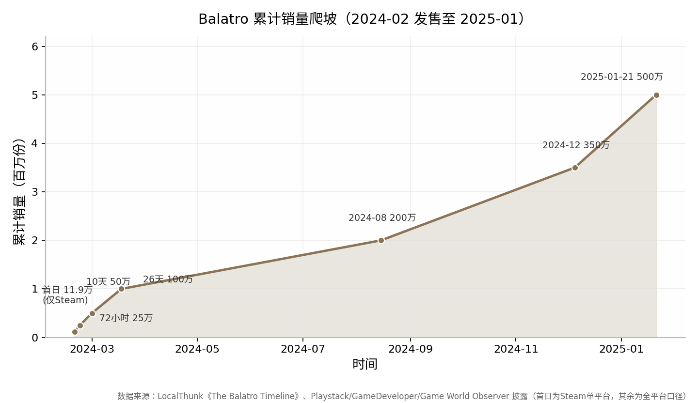

发售后的爬坡速度在独立游戏史上几乎没有先例：2024 年 2 月 20 日全平台发售（官方口径，提前 15 分钟解锁），发售后几小时仅 Steam 就售出 5 万份、收入超 60 万美元——他在 Timeline 里写道："页面上的收入刚过两小时就超过 60 万美元，比我一辈子赚过的钱都多。"[^302^] 首日 Steam 单平台售出 11.9 万份；72 小时全平台 25 万份；10 天 50 万份；3 月 18 日破 100 万份；2024 年 8 月达 200 万；9 月 26 日手游版登陆 iOS/Android；12 月初 350 万；2025 年 1 月 21 日，Playstack CEO 在 Pocket Gamer Connects London 宣布累计销量达 500 万份（不含 Apple Arcade 订阅内下载）[^321^][^322^][^24^][^323^]。奖项同步收割：2024 年 12 月 TGA 拿下最佳独立游戏、最佳首秀独立游戏、最佳手游三项，并获年度游戏（GOTY）提名——史上第一个获 GOTY 提名的单人开发游戏；2025 年 3 月 GDC Awards 横扫年度游戏等四项，4 月再获 BAFTA 最佳首秀[^324^][^325^][^326^]。颇具戏剧性的细节是：150 张 Joker 牌中的最后 30 张，源于他在与 Playstack 的会议上把 120 张口误说成 150 张，干脆补做了 30 张[^302^]。

#### 9.2.3 收入：一小时回本的极端样本

定价为 PC/主机 $14.99、手游 $9.99（另进入 Apple Arcade 订阅）[^327^]。Playstack CEO 披露，游戏在发售 **1 小时内即回本**（"reached game-profitability within an hour"），8 小时毛收入突破 100 万美元，是 Playstack 史上销售最快的游戏[^328^][^329^]。能一小时回本的直接原因是成本趋近于零：发售前的现金支出只有 Fiverr 上请 Luis Clemente 做配乐的一笔费用（他称之为"当时唯一花过、也打算花的钱"）和"可怕的 100 美元"Steam 上架费[^302^]。

总收入无官方单品口径，只能拼出量级：500 万份 × $14.99 的名义上限约 7,500 万美元（未扣折扣、平台 30% 抽成与发行分成，具体条款未公开）；手游侧第三方估算累计净收入至 2025 年 4 月约 1,497 万美元（AppMagic）、至 2025 年 10 月超 2,500 万美元（PocketGamer.biz 口径）——注意各家口径从数百万到数千万不等，均为第三方估算[^330^][^331^]。发行商侧财报可交叉印证量级：Playstack 2024 年收入同比 +455%，2025 全年毛收入 5,530 万英镑（+24%）、税前利润 1,220 万英镑（+59%），公司自称"hit ratio"超 85%、计入 Balatro 的投资回报率（ROIDC）超 500%[^332^][^333^]；2026 年 6 月，Playstack 母公司以约 1.69 亿美元整体估值被 IMC 子公司收购，估值主要锚定 Balatro 的商业表现[^334^]。

LocalThunk 本人对钱的态度与第 2 章的 Levels 形成有趣对照。他在 Bloomberg 专访中说，钱让他能全职做游戏、和伴侣买了房，但"我们本来在 IT 工作时就量入为出，生活方式没怎么变……我还在尽责，我还有工作要做"，并主动强调"我知道自己在这方面很幸运（I know I'm lucky in that regard）"[^335^]。

#### 9.2.4 现状 2026：匿名、慢速、无截止日

2026 年的 LocalThunk 维持三个"不变"：仍匿名；仍以"每天几小时的业余节奏"独自开发 1.1 大型免费更新（新 Joker、重做 Matador、调整 Blue Stake——为做平衡设计，他亲自把游戏打到最高难度 100% 完成度）；仍拒绝给出发售日期[^336^][^337^]。原定 2025 年交付的 1.1 更新在 2025 年 9 月 12 日的博客《I'm Slow》中宣布延期，改为"做完就发（it's done when it's done）"、全平台免费；他自述发售后连续赶工（平衡补丁→手机移植）导致 2024 年底"彻底 burnout"，休息数月后才复工，"我骨子里是个业余开发者，喜欢瞎折腾……我做得很慢，但我喜欢这样"[^338^][^339^]。2026 年 2 月 20 日的博客《Bad Grades》末尾仍以"P.S. Yes I'm still working on 1.1"确认项目存活[^315^]。渠道端继续扩张：2026 年 2 月 25 日上线 Switch 2 版（Switch 1 玩家享折扣），6 月 30 日登陆 Epic Games Store；发行商易主未影响开发节奏[^337^][^334^]。

### 9.3 案例 B 深度拆解：Eric Barone / 星露谷物语（Stardew Valley）

#### 9.3.1 背景：找不到工作的计算机毕业生，把游戏当作品集

Eric Barone（网名 ConcernedApe）1987 年生于洛杉矶、在华盛顿州 Auburn 长大，2011 年毕业于华盛顿大学塔科马分校计算机科学专业。毕业后求职屡屡碰壁——"面试了几家都没拿到 offer"——只能在西雅图派拉蒙剧院做晚间引座员兼职[^304^][^340^]。2012 年他开始做 Stardew Valley（原名 Sprout Valley），动机有二且都不算"创业"：一是把项目当作编程与游戏设计的练手作品集，以改善就业前景；二是以牧场物语老粉的身份，补做一款"把所有要素完美整合"的游戏[^341^][^305^]。

支撑这 4.5 年豪赌的不是储蓄而是人：部分时间与父母同住省钱，后与女友 Amber Hageman 搬到西雅图 Capitol Hill，由女友打两份工供养两人，他自己继续兼职引座员[^313^][^314^]。这一细节是评估游戏型模式可复制性时最容易被忽略的前置条件——超长开发周期的成本并未消失，只是被转移给了家庭成员。

#### 9.3.2 时间线：4.5 年暗室开发，十年长尾

开发从 2012 年前后持续到 2016 年，约 4.5 年（官网十周年文称"我在这游戏上投入了近 15 年"，口径含发售后十年运营）[^342^][^25^]。代码、美术、音乐、写作、动画全部一人完成；发行商 Chucklefish 在开发中途主动找上门签约，负责商务、营销、本地化与主机/移动移植的外包[^342^][^343^]。2016 年 2 月 26 日 PC 发售，前两周 Steam+GOG 售出约 42.5 万份，不到两个月破 100 万份（精确数 1,007,000，Chucklefish 向 Polygon/IBTimes 确认），当年即进入 Steam 收入前 24 名、首年 Steam 收入约 2,400 万美元（当年 Steam 第 16 畅销）[^344^][^342^][^345^]。

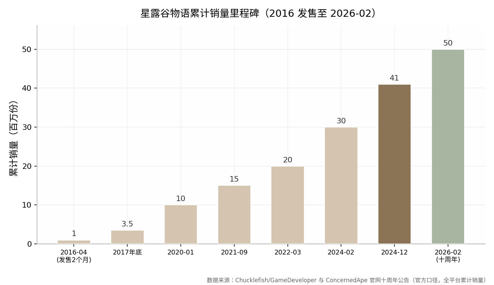

此后的十年是一条罕见的"长尾巴变主身"曲线：2017 年底全平台超 350 万份；2020 年 1 月 1,000 万；2021 年 9 月 1,500 万；2022 年 3 月 2,000 万（其中 PC 1,300 万）；2024 年 2 月 3,000 万；2024 年 12 月达 4,100 万（PC 2,600 万、Switch 790 万）；2026 年 2 月 26 日发售十周年当天，官网官宣累计销量超 5,000 万份，"且没有放缓迹象"[^342^][^346^][^347^][^25^]。从图中可以读出两个结构性特征：其一，发售第六年（2022）之后增速不降反升——2022-03 至 2024-02 两年卖 1,000 万份，2024-02 至 2026-02 两年卖 2,000 万份，免费大更新（1.5、1.6）与主机/移动端扩渠道是主要推手；其二，这是一款"十年期产品"而非"发售期产品"，其经济模型更接近长青 IP 而非游戏。与 Balatro 的"11 个月 500 万"对照，星露谷证明彩票中奖后的奖金可以复利滚存十年以上——但前提是开发者愿意在同一款产品上持续免费投入。

收入方面必须强调：**没有任何官方总收入数字**。可给的只有推算框架：4,100 万份（2024 年末口径）× $14.99 名义单价的上限约 6.15 亿美元，未扣常年折扣、区域定价、退款与平台抽成；第三方 Boxleiter 法对 Steam 单平台的毛收入估算约 5.8 亿美元、开发者净得估约 1.71 亿美元，另一计算器估 Steam 净得 4.41 亿美元（区间 3.08–7 亿）——两个第三方口径相差近 3 倍，仅供量级参考[^348^][^349^]。自发后 Barone 保留绝大部分收入（仅剩平台抽成）[^350^]。至于媒体流传的 4,500 万至 1 亿美元净资产说法，均为媒体猜测，无任何财务披露佐证，本章不予采信[^348^]。

#### 9.3.3 发行权收回史：从 Chucklefish 到全平台自发

Barone 的发行权回收是循序渐进的四年工程：2018 年 11 月底宣布、12 月 14 日起自行发行 PC/Mac/Linux/PS4/Xbox/PSVita（理由："准备好独立前行"，自发是独立开发者的"梦想"）；2019 年 10 月收回 Switch；2021 年 12 月收回 iOS；2022 年 3 月 17 日收回 Android——至此全平台 100% 自发[^351^][^352^][^353^]。2019 年 8 月 Chucklefish 因《Starbound》无偿用工指控陷入争议时，Barone 发布官方声明划清界限："4.5 年开发中我是唯一在 Stardew Valley 上工作的人……Chucklefish 仅担任发行商"（唯一例外：多人更新的网络代码由一名 Chucklefish 员工编写）[^343^]。

收回发行权的经济含义直接对照 9.1.2 的中位数数据：有发行商的游戏收入中位数 $16,222 高于自发的 $3,285，但那是对"普通游戏"而言；对一款已验证的爆款，发行商分成从"获客保费"变成"纯成本"，Barone 在销量 350 万份之后逐平台回收发行权，等于把剩余长尾的毛利率一次性抬高约一个发行分成量级。2025 年 7 月，星露谷超越《传送门 2》成为 Steam250 史上评分最高的游戏（8.87 vs 8.85，好评率约 98%、评论破百万）[^354^]。

#### 9.3.4 现状 2026：一人两线，"做完就发"

2026 年的 Barone 同时运营两条单人产品线。其一，Stardew Valley 1.7 更新：2025 年 8 月 30 日在西雅图"Symphony of the Seasons"音乐会上宣布（"没有日期，没有预估，但它会做"），已披露内容包括新农场类型、更多角色/社交内容、Clint 与 Sandy 成为可结婚对象、孩子系统"更有趣"[^355^][^356^][^357^]；Switch 2 版 2025 年 9 月公布，老玩家免费升级[^358^]。其二，新作《Haunted Chocolatier》：2020 年底立项、2021 年 10 月公布，完全单人开发，曾因 Stardew 1.6 暂停，2024 年 12 月复工；2025 年 9 月博客称本人重心已转向该作、"甚至可能早于 1.7 发售"，2026 年 1 月底再发博客辟谣"2030 年发售"传闻，重申"做完就发"[^359^][^360^][^357^]。他同时公开表示"愿意有一天做 Stardew Valley 2——全新角色、全新世界"[^357^]。2025 年 12 月 30 日，他向 MonoGame 基金会一次性捐赠 12.5 万美元并承诺每月持续捐助 $1,250，基金会称其为"非凡的支持"[^361^][^362^]。

下表将两个案例的关键参数并置，便于后文逐节引用：

| 维度 | LocalThunk / Balatro | Eric Barone / 星露谷物语 |
|---|---|---|
| 身份与起点 | 加拿大萨省匿名 IT 从业者，工程退学 [^316^][^315^] | UW Tacoma 计算机学士（2011），求职碰壁 [^304^] |
| 开工→发售 | 2021-12-13 → 2024-02-20（约 26 个月） [^302^] | 2012 → 2016-02-26（约 4.5 年） [^342^][^25^] |
| 开发期收入支撑 | IT 全职工资+积蓄，3–6 个月跑道 [^302^] | 剧院引座员兼职+女友两份工供养 [^313^][^314^] |
| 发售前现金成本 | 配乐外包+$100 Steam 上架费 [^302^] | 趋近于零（全免费工具链） [^363^] |
| 技术栈 | LÖVE(Love2D)+Lua [^302^][^364^] | C#+XNA（2021 迁 MonoGame），自写引擎 [^363^][^25^] |
| 首发表现 | 首日 Steam 11.9 万份，1 小时回本 [^302^][^328^] | 2 周 42.5 万份，2 个月 100.7 万份 [^344^] |
| 累计销量 | 500 万份（2025-01-21，官方） [^24^] | 超 5,000 万份（2026-02-26，官方） [^25^] |
| 定价/变现 | $14.99/$9.99 买断，无内购无付费 DLC [^327^][^365^] | $14.99 买断，誓言终身免费更新 [^366^] |
| 发行策略 | 签约 Playstack（本地化/移植/媒体） [^302^] | Chucklefish→2018–2022 全平台收回自发 [^351^][^352^] |
| 发售前开发强度 | 业余期晚上+周末；发售前 crunch 约 12 小时/天 [^302^] | 平均每天 10–12 小时 × 每周 7 天 × 4.5 年 [^314^][^313^] |
| 2026 节奏 | 每天几小时业余节奏做 1.1，无日期 [^338^][^336^] | 每周 5 天新作+2 天维护旧作 [^367^] |

并置后最刺眼的差异是**开发时长相差近一倍、首发起点相差一个数量级，但终点同为品类天花板**——这说明在彩票模式下，"投入时长"与"中奖概率"之间不存在可识别的兑换关系：Barone 用 4.5 年赌一个被验证过的经典品类空白（牧场物语系列多年无口碑级正统续作），LocalThunk 用 26 个月赌一个自创杂交品类（扑克×roguelike）。两者唯一共同的可控变量是成本侧：现金支出都被压到几百美元量级，失败的财务损失最小化，把最大风险压缩为纯时间风险。这一共性比任何"成功学"归纳都更接近模式的本质。

### 9.4 日常作息与开发节奏

#### 9.4.1 两种极端：自我强加的 crunch 与"crunch 从来不是答案"

两个案例在作息上恰好构成一组对照实验，且结局都指向同一个警示。

Barone 是教科书级的"自我强加的 crunch"——2016 年 Gamasutra 对他的专访标题就叫《The 4 years of self-imposed crunch that went into Stardew Valley》。他本人给出的数字是："开发期间我大概平均每天工作 10 小时、每周 7 天；现在游戏发售了，我大概每天花 15 小时在上面。"（GQ 2018 年的描述口径为每天 12 小时，此处以本人自述为准。）[^314^][^313^][^368^] 按本人口径折算，4.5 年开发期累计投入约 $10 \times 7 \times 4.5 \times 52 \approx 1.6$ 万小时。期间他多次想放弃、信心崩溃，靠与女友和朋友的谈话、以及 Twitch 主播的测试反馈撑过来[^368^]。发售后他对 bug 的极度个人责任感进一步延长了高压状态："如果有人崩溃或遇到 bug，我都觉得是我个人的责任，沉重地压在我身上。"[^369^]

LocalThunk 则先展示了一条"爱好节奏"路径（没动力就停工两个月），再亲手演示了这条路径如何在商业化压力下崩塌：2023 年 8 月起出现睡眠与心脏问题，10 月起"每隔几晚要坐在沙发上睡，躺下会被心脏问题打断"；2024 年 1 月看《深渊》时突发惊恐发作（panic attack），次日就医确诊焦虑症——"医生问我工作是不是压力很大，我都不知道怎么解释"[^302^][^302^][^370^]。他后来复盘压力源时写得很清楚："我的心脏真的很不对劲。我经常天亮才能睡着，心理健康真的很遭罪。我热爱做游戏，但如此公开地、以如此强度做这么久，真的在反噬我。"[^302^] 发售后他立刻投入平衡补丁与手机移植，"到 2024 年底移动版发布时，我彻底 burnout 了（I was well and truly burned out）"，停工数月，随后取消已公布的更新日期、回归 hobbyist 节奏，并在延期公告里留下结论："crunch 从来不是答案（crunch is never the answer）。"[^338^][^371^]

值得并列引用的是同一人相隔数月的另一种状态——2025 年 2 月他对 Bloomberg 说："压力很大但非常充实，能每天整天做我热爱的事，想做多久做多久。"[^335^] 这组张力说明 burnout 的根源不是工作量本身，而是"公开开发+deadline+外部期望"的组合；彩票中奖并不免疫 burnout，只是给了你停下来疗伤的财务自由。社区层面的数据可作背景：2025 年 UCSF/Sifted 调查口径下 72% 的创始人经历过焦虑、burnout 或抑郁（调查/自述口径，非临床统计）[^372^]。

#### 9.4.2 Barone 2026 年的新节奏：从全天候到分配式日程

十年后的 Barone 完成了自己的"去 crunch 化"。2026 年 5 月 Game Informer 采访中披露，他现在的节奏是每周 5 天做新作《Haunted Chocolatier》、2 天维护 Stardew Valley——从"全天候 crunch"转向"分配式日程"[^367^]。这个结构与 LocalThunk 的"每天几小时"殊途同归：两个中了头奖的人，最终都主动把开发强度降回爱好者水平。对后来者的含义是双向的——一方面，4.5 年×70 小时/周的投入不是中奖的必要条件（LocalThunk 大部分时间在业余节奏下完成了 Balatro 的核心设计）；另一方面，发售前后的短期 crunch 在两个案例中都没有被完全避免，区别只在于中奖者有机会在事后修复健康，而沉默的大多数带着同样的劳损和无收入的账单离场。

### 9.5 技术栈与工具链

#### 9.5.1 零授权费引擎与全栈一人

两人的技术栈选择高度趋同于一个原则：**授权成本归零、学习成本自担、全部环节一人贯通**。LocalThunk 用免费开源的 LÖVE（Love2D，zlib 协议）+ Lua，直接沿用他为上一个项目 Autohike 自建的引擎代码改造；移植工作外包给 Love2D 专家 Maarten De Meyer[^302^][^337^][^364^]。Barone 用 C# + 微软 XNA 框架在 Visual Studio 2010 里自写引擎，美术用免费的 Paint.NET，音乐用 Propellerhead Reason 制作；2021 年从已停更的 XNA 迁移到开源的 MonoGame，理由是"让游戏面向未来，并让 mod 能使用 4GB 以上内存"——2025 年底他对 MonoGame 基金会的 12.5 万美元捐赠，可视为对这条零成本技术栈的迟来付费[^363^][^25^][^361^]。

两个值得记录的"反最佳实践"细节：Barone 全程**没有使用版本控制**，只定期整包备份[^363^]；LocalThunk 的生产文件夹从 2021 年 12 月 20 日建目录起就叫 `CardGame`，发售两年、销量 500 万后仍未改名[^302^]。这些细节的意义不在于鼓励模仿，而在于说明在单人项目里，工程规范的优先级让位于个人认知习惯——工具的"正确性"远不如"开发者不需要为工具分心"重要。

### 9.6 获客与增长

#### 9.6.1 获客真相：Demo、主播与发行商的三角

独立游戏 2026 年的获客公式在两个案例中几乎一致：**免费 Demo 做体验转化、主播做流量引爆、发行商做渠道基建**。Balatro 侧：两版 Demo（先 50 回合限制、后内容限制）+ 两次 Steam Next Fest + Discord 社群 + 发售前主播邀请赛；引爆点是 2023 年 6 月 Dan Gheesling 的直播与 7 月 19 日 Northernlion 的直播（后者使 Steam 关注数单周暴涨近 400%）；Playstack 负责本地化多语言、首日全主机平台移植和媒体评测分发（2 月 19 日评分解禁即 90+ 造势）[^302^][^320^][^373^]。LocalThunk 自己的总结毫不浪漫："我没做任何该做的营销，至今没给任何人发过求玩邮件"——"就是运气好（lucked in）"[^302^][^374^]。星露谷侧：2012 年起在开发日志博客与官网持续更新，在牧场物语粉丝社区完成冷启动；Chucklefish 负责营销与媒体；发售后靠 Reddit/Twitter 口碑、Twitch/YouTube 主播与 Nexus mod 社区做十年长尾[^312^][^375^][^346^]。

#### 9.6.2 发行商的价值：中位数 $16,222 vs $3,285

对照数据给"要不要签发行商"提供了一个冷静的量级参考：GameDiscoverCo/Gamalytic 2024 年数据下，有发行商游戏的收入中位数 $16,222 约为自发游戏 $3,285 的 5 倍[^8^]。但两个案例示范了更精细的决策逻辑：LocalThunk 签 Playstack 是"用分成换确定性与外包"——雇律师谈判、咨询曾与 Playstack 合作的工作室后才签约，动机是"他们能替代我 IT 工作的薪水，所以这就是我的工作"，同时把"所有对外事务、营销、可能的移植"这些他不擅长也不想做的事整体外包[^302^]；Barone 则是在产品已被市场验证后逐平台收回发行权，把发行商从"保费"变"分成成本"的时点掐在销量 350 万份之后[^351^][^352^]。发行商决策的正确形式不是"签或不签"，而是"在产品验证的哪个阶段、用什么条款签"。

### 9.7 变现路径与商业模式

#### 9.7.1 买断制的道德立场与商业理性

两个案例都选择了纯买断制并公开宣誓拒绝内购，但表述方式暴露了不同的动机配比。LocalThunk 的表述是个人体验式的（2025 年 6 月原话）："老实说，我不在 Balatro 里放微交易/季票/广告/100 个 DLC，不只是因为伦理——而是当我玩的其他游戏有这些东西时，我想把电脑扔进洗碗机开强力洗档……如果玩家的第一印象被一堆不属于游戏的玩意儿轰炸，你就是在自毁 UX。"[^365^] 所有联动内容（巫师 3、Among Us、Dave the Diver、吸血鬼幸存者等）全部免费，1.1 大更新也全平台免费[^365^][^338^]。Barone 的表述是誓言式的（2024 年 7 月 22 日 X 帖原话）："我以家族姓氏的名誉起誓，有生之年绝不对 DLC 或更新收费。截图吧，如果我违背誓言就羞辱我。"——此前 1.5 更新的姜岛内容本可做成付费资料片或独立游戏，"但我还是把它用在了免费更新里"[^366^][^375^]。

商业理性的一面是长尾数据：星露谷发售第 8–10 年（2024-02 至 2026-02）卖出 2,000 万份，相当于前 8 年总和的 2/3，而驱动这一曲线的主要运营动作就是免费大更新（1.5/1.6）与 IP 外延（音乐会、食谱书）[^25^][^375^]。在中位收入 $3,285 的市场里，"免费更新养口碑"未必是普适策略；但对一款已经中奖的游戏，它是把一次性彩票变成十年复利资产的最优解。道德立场与商业理性在此处不冲突——冲突只存在于"尚未中奖时是否要预留付费 DLC 作为收入安全垫"的决策上，两人都选择不预留。

### 9.8 决策思路与关键转折点

#### 9.8.1 LocalThunk：匿名、签约与 PEGI 危机

LocalThunk 的三个关键决策都有可复盘的逻辑。其一，保持匿名：初始是"随便做的决定"，事后成为减压阀——销量、奖项、媒体围堵全部发生在"LocalThunk"这个符号上，本人生活不被打扰；代价是他自述的"有点孤独"[^319^][^316^]。其二，签约发行商：曾"强烈考虑单干"，最终用律师和同行背调把签约变成一笔"薪水替代+对外事务外包"的交易[^302^]。其三，PEGI 危机处理：游戏初评 3+，2024 年发售前后被 PEGI 无预警上调至 18+（理由："显著赌博意象""教授扑克技能"），导致部分欧洲数字商店临时下架；他选择公开抨击双重标准——含真实开箱机制的 EA Sports FC 评级仅 3+，"如果那些游戏被正确评级，我乐意接受这个奇怪的 18+"；Playstack 与 Sold Out 上诉后，2025 年 2 月 24 日 PEGI 改判 12+ 并承诺细化赌博主题分级标准[^376^][^377^][^378^]。这一危机还催生了一个极端的 IP 保护动作：他向 PC Gamer 透露已立遗嘱，Balatro 的 IP 在他死后也不得卖给赌博公司或赌场[^379^][^380^]。

#### 9.8.2 Barone：拒绝雇人与发行权回收

Barone 的关键决策围绕"控制权"展开。拒绝扩张团队的理由在 2019 年 USgamer 访谈中说得很直白：他偏好独自做事，可以"纠结小细节（fuss over the little details）"而不用顾忌别人；直到 2019 年初才仅为后续更新组建临时小团队（与 Arthur Lee、Alex Erlandson 合作 1.4），且"没有计划"扩大规模[^381^][^352^]。与 Chucklefish 的分手同样渐进且干净：先收回 PC/主机（2018），再收 Switch（2019）、iOS（2021）、Android（2022），在对方陷入《Starbound》无偿用工争议时以官方声明切割——"4.5 年只有我一个人做这个游戏"[^351^][^343^]。他给后来者的建议（2022 年 AMA）则回到了本章开头的一句话定义："做你热爱的游戏，让你兴奋到愿意跨越任何障碍去完成它的游戏。用什么软件、什么方法并不重要。有动力，你自会找到路。"[^382^]

### 9.9 效率密码

#### 9.9.1 全栈单人的零沟通成本与清晰的外包边界

两个案例的效率结构可以拆成"保留什么"与"外包什么"两栏。**保留**的是全部核心创作环节——代码、美术、音乐、写作、关卡/系统设计，一人贯通带来的零沟通成本、零风格折中与零等待依赖；Barone 多次推倒重写、LocalThunk 一次口误加做 30 张 Joker，这类决策在团队里需要会议，在单人项目里只是一个下午[^25^][^302^]。**外包**的是三类事务：音乐（LocalThunk 在 Fiverr 上的一笔费用）、移植（Balatro 交给 Love2D 专家 Maarten De Meyer；星露谷的主机/移动移植由 Chucklefish 外包体系承担）、商务（两家都一度把营销、本地化、媒体交给发行商）[^302^][^337^][^343^]。边界判据很清晰：凡是影响"游戏手感"的环节绝不外包，凡是"把游戏搬到别处/讲给外人听"的环节都可以外包。这一边界与第 2–8 章工具型开发者的"客服最先外包、核心工程最后外包"原则同构，只是游戏型把"核心"的定义扩展到了美术与音乐。

### 9.10 当下可行性评估（2026 年）

#### 9.10.1 彩票中奖率还在下降

供给侧数字不支持乐观：Steam 2025 年上新 21,344 款创历史纪录（较 2024 年 +15.5%），2026 年前 8 个月已上架 16,115 款[^308^]；How To Market A Game 口径下 2025 年 20,282 款新游中仅 608 款达到 1,000 条评测，"成功率"约 2.99%[^310^]。对照本章两个案例的结论应该是反励志的：Balatro 开发者在发售前预估游戏"只会卖 10 份"，事后自认"lucked in"[^374^][^302^]；星露谷是十年 5,000 万份的行业孤例，同期独立游戏自发收入中位数仍是 $3,285[^25^][^8^]。Vampire Survivors（失业期间开发、美术音乐资产包仅花约 1,100 英镑）、Lethal Company、Animal Well（单人 7 年含自研引擎）等并列案例同属极端尾部，不能构成概率证据[^383^]。预计随着 AI 辅助开发继续压低制作门槛，Steam 年上新量仍将上行，而玩家总时长基本盘不变——彩票的单张价格在下降，中奖率也在下降。

#### 9.10.2 给新手的第一步：先做小体量游戏验证完整发布流程

若仍要入场，两个案例与行业数据共同指向的操作纪律有四条。第一，**第一个项目必须是"小体量完整流程"**：用一个数月级项目走完"开发→上架→定价→商店页→发售→售后"全流程，把学习成本花在可复制的发射台上，而不是把第一个项目直接押成四年豪赌——LocalThunk 开工时电脑里已有十年积累的小项目与自研引擎底子，Balatro 是他的第 N 个游戏而非第一个[^302^][^315^]。第二，**把现金成本压到几百美元量级**：免费引擎（LÖVE/MonoGame/Godot 系）+免费美术音频工具+外包单点（配乐、移植），让失败的损失收敛为纯时间损失[^302^][^363^]。第三，**提前设计生计结构而非依赖游戏收入**：业余节奏+全职工作（LocalThunk 前 14 个月）或被供养（Barone 4.5 年）是仅有的两种被验证的融资方式，且前者的心理损耗显著更低[^302^][^313^]。第四，**把愿望单当作唯一发售前信号并按阈值决策**：Balatro 的愿望单曲线（48→20.8 万/9 个月）展示了 Demo+Next Fest+主播的组合如何可重复地拉动这一指标；若两轮 Next Fest 后愿望单仍停留在三位数，按本模式的经济结构，继续加码的期望值大概率为负[^302^][^320^]。

---

## 10. 八模式横向对比与选择指南

前八章逐一拆解了八种模式，本章把它们放到同一张桌子上。先给出三个最重要的横向结论，再用数据逐一支撑。第一，**选模式本质是选分发引擎，而不是选产品形态**——八个成功案例的技术栈从 vanilla PHP 到 LÖVE/Lua 到 Next.js 毫无共性，但每一个都有明确的获客引擎（社媒受众、搜索排名、平台商店、行业社区、主播生态或付费社群），没有一例靠"产品好所以有人买"存活。第二，**八种模式的收入轨迹只呈现三种曲线**——复利型、脉冲型、彩票型，曲线的类型比峰值的绝对值更能预测一个模式的可持续性。第三，**模式之间不存在可靠的成功率对比数据，存在的只有失败成本的差异**——从套利型的数周到游戏型的 4.5 年，相差约 50 倍。对读者而言，这意味着选择模式的正确问法不是"哪个模式最容易成功"（无人知道），而是"哪个模式的失败我承受得起"。

### 10.1 收入曲线类型学

#### 10.1.1 复利型、脉冲型与彩票型

把第 2–9 章的全部收入数据按时间轴展开，八种模式的曲线恰好收敛为三种形态。**复利型**慢热但持续：Nomad List 从 2014 年首日 $600 到 2019 年组合 $1M ARR 用了近 6 年[^34^]；Perfect Wiki 从 2020 年 3 周 MVP 到 2025-04 的 $25K/月用了 5 年[^20^]；Vuetify 从 2016 年首个 alpha 到 2021 年约 $300K/年用了 5 年[^187^]；星露谷物语发售后十年还在加速——2024-02 至 2026-02 两年卖出 2,000 万份，相当于前八年总和（3,000 万份）的三分之二[^25^]。**脉冲型**快起快落：SeeU.Food 第 1 个月红利期、第 2 个月 20–30 个同类涌入、第 3 个月"卷死"，项目总收入接近 $9 万（本人自述，2025-12）[^276^]；CodeFast 上线 48 小时 $92K，18 个月后回落至 $3–23K/月[^230^][^250^]。**彩票型**发售即开奖：Balatro 发售前唯一的公开测试只有 48 个愿望单，开发者预估"只会卖 10 份"，结果 1 小时回本、首日 11.9 万份[^302^][^328^]；而同期 Steam 自发游戏收入中位数仅 $3,285[^8^]。

**表 10-1：三种收入曲线类型学对比**

| 维度 | 复利型 | 脉冲型 | 彩票型 |
|---|---|---|---|
| 代表案例 | Nomad List/Remote OK、Perfect Wiki、Vuetify、哥飞社群、星露谷（发售后） [^34^][^20^] | SeeU.Food、Photo AI、CodeFast、fly.pieter.com [^276^][^16^] | Balatro、星露谷（发售前）、Steam 中位数游戏 [^302^][^8^] |
| 时间常数 | 以年计（3–10 年到峰值） | 以周/月计（数天到数月见顶） | 二值化：开奖日定生死 |
| 需求验证 | 持续迭代、边做边校准 | 窗口内一次性收割 | 发售前几乎无信号（仅愿望单代理指标） |
| 峰值后形态 | 平台期或缓慢衰减（Photo AI 之前的 Nomad List 第 8 年才见顶）[^53^] | 快速回落（Photo AI 峰值后约 9 个月 -34%）[^17^] | 中奖则长尾复利，不中则归零 |
| 对应退出哲学 | 持有收租或按利润倍数出售（3.9x TTM）[^384^] | 预设退出线、窗口关闭前离场 [^276^] | 不适用——只能压缩彩票成本（现金支出趋零） |
| 失败成本 | 数月–数年不等（开源/受众蓄水型最久，见表 10-3）+金钱近零至数千元 | 数周+近零现金 | 数年时间 |

这张表的关键发现是：**脉冲不只属于套利型**。本报告数据链最完整的 Photo AI 曲线证明，连最成功的 AI 消费品也呈现脉冲形态——2025-11 峰值 $132–138K，2026-08 回落至 $89K/月，9 个月回落约 34%（本人披露）[^16^][^17^]。Levels 本人 2026 年 6 月的总结可以作为类型学的经验法则：Remote OK 第 6 年见顶、Nomads 第 8 年见顶，"而 AI 产品生命周期更快，可能 4 年左右见顶"[^53^]。换言之，AI 浪潮正在把越来越多的产品从复利型推向脉冲型——这不是某个模式的缺陷，而是技术代差加速下的普遍形态。对模式选择的含义是：2026 年之后，"可持续性"是比"峰值"更重要的对比轴；评估任何案例的月收入截图时，先问这是曲线的哪一段。

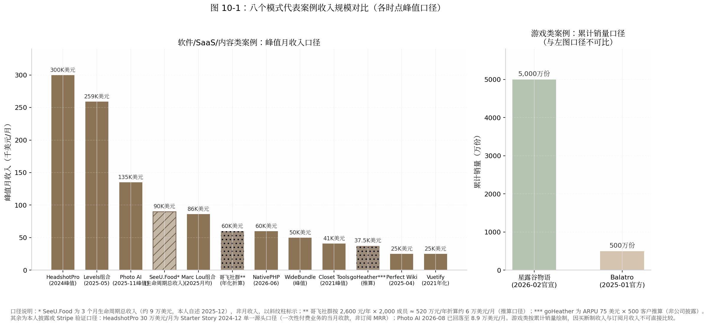

*图 10-1：八个模式代表案例的收入规模对比。左图为软件/SaaS/内容类峰值月收入口径（千美元/月），右图为游戏类累计销量口径（万份）——买断制收入与订阅月收入不可直接比较，故分图绘制。各柱时点与口径见脚注；SeeU.Food 为 3 个月生命周期总收入（斜纹柱），哥飞与 goHeather 为推算口径（点纹柱）。数据来源：第 2–9 章披露数据汇总。*

图 10-1 中有三个值得停留的读数。其一，头部两柱（HeadshotPro 约 $300K/月，2024 年内第三方媒体口径；Levels 组合约 $259K/月，2025-05 本人披露）都是**组合或生态口径**而非单一产品——HeadshotPro 叠加了联盟网络与多域名资产，Levels 是七个产品拼盘；纯单品口径的天花板（Photo AI $132–138K、CodeFast 发射周）要低一个台阶。其二，从 $300K 到 $25K 跨越 12 倍，但右侧一半的案例（NativePHP $60K/月、WideBundle $50K、Perfect Wiki $25K）恰恰覆盖"可替代工资到财务自由"的全部区间——天花板高低与"是否值得做"无关，只与你的目标函数有关。其三，两根点纹柱（哥飞、goHeather）是推算口径，精度天然低于 Stripe 验证数据，跨案例比较时应按量级读而非按个位数读。预计随着一次性付费 AI 消费品占比上升，"峰值月收入"这一指标的解释力将继续下降，生命周期总收入与峰值后留存率会成为更有区分度的口径。

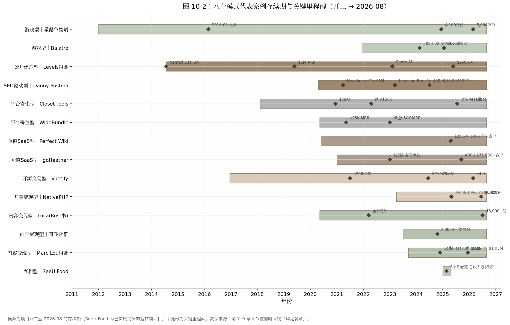

*图 10-2：十四个代表项目的存续期与关键里程碑（开工 → 2026-08）。横条为存续期，菱形为里程碑。数据来源：第 2–9 章各节时间线。*

甘特图揭示了比收入数字更冷酷的维度：**时间**。复利型案例的存续期普遍在 5–12 年量级（Vuetify 近 10 年、星露谷 14 年、Levels 组合 12 年），而 SeeU.Food 的整条横条只有约 3 个月——同样列入"成功案例"，时间投入相差近 50 倍。另一个容易被忽略的模式是"开工年份扎堆"：十四个项目里九个开工于 2020 年之后，对应远程办公爆发与 GPT-3/Stable Diffusion 两轮技术拐点——窗口选择（何时进场）与模式选择（怎么进场）至少是同等重要的变量。还要注意到 2026-08 的截面上，十四个项目中十三个仍在运营，唯一实质关停的是主动退出的套利项目——这本身就是幸存者筛选的结果，10.3 节将系统讨论。

### 10.2 对比矩阵

#### 10.2.1 八模式 × 七维度矩阵

下表是本书的核心交付物之一，第 11 章的一页纸速查表将由它浓缩而成。七个维度的选取逻辑：前四维（启动资金、见效时间、收入天花板、下行风险）是经济参数，第五维（AI 顺风/逆风）是 2026 年报告区别于以往同类文章的时代参数，后两维（技能、性格）是人的参数。

**表 10-2：八种模式 × 七维度对比矩阵**

| 模式 | 启动资金 | 见效时间 | 收入天花板 | 下行风险 | AI 顺风/逆风 | 技能要求 | 性格适配 |
|---|---|---|---|---|---|---|---|
| 公开建造型 | ≈$0（VPS $40/月量级） [^40^] | 以年计（首次发推到 $1M ARR 约 6 年） [^34^] | 约 $3.1M/年（组合口径，2025-05） [^26^] | 单次失败成本数周；但总机会成本以 5–10 年计 [^33^] | **顺风**：建造提速；AI 搜索偏好真实个人内容（ChatGPT 引荐流量占比一月内 4%→20%） [^27^] | 全栈开发+内容生产双技能 | 外向、表达欲强、能承受公开失败 |
| SEO 驱动型 | ≈$0–数千元（域名 $3K） [^74^] | 数周–数月（30 天建成、两周 $100K+） [^79^] | 约 $3.6M/年（2024 峰值，第三方口径） [^18^] | 中：流量地主是 Google，排名可被收回 | **逆风**：AI Overviews 致站外点击 -39.8%、零点击 69%；信息型 SEO 受创最重 [^105^][^108^] | SEO+转化优化+关键词嗅觉 | 内向、不喜社交、数据导向 |
| 平台寄生型 | ≈$0（注册费 $5–19） [^119^][^130^] | 数周–数月（第 21 天首单、6 个月 $10K MRR） [^123^][^19^] | $50K/月级（WideBundle 峰值），被平台结构性封顶 [^19^] | **最高**：单点故障（Checkout X €600K MRR 被锁死、Closet Tools -32%） [^137^][^114^] | 中性偏顺：MV3 等合规门槛抬高克隆成本 [^129^] | ASO/评论运营/转化漏斗优化 | 工程师型、产品嗅觉强于表达欲 |
| 垂直 SaaS 型 | 数千元级（月成本 $1,750–2,350 迅速被收入覆盖） [^20^] | 首笔收入中位 3–4 个月；$10K MRR 中位 14–18 个月 [^157^][^176^] | $250K–500K/年（单点垂直） [^20^][^166^] | 低：沉没数月+数千元 | 分化：套壳型落入 95% 无 ROI 区间；工作流深者防御性最强 [^181^] | 行业知识 > 技术 | 有 3 年以上行业经验、忍受"无聊"产品者 |
| 开源变现型 | ≈$0（基础设施近零成本） [^187^] | 以年计（POC 到稳定收费 2–5 年） [^189^][^21^] | $300K–720K/年（Vuetify 2021/NativePHP 2026 年化，本人披露） [^187^][^21^] | 中高：赞助断粮周期（Vuetify 2024 危机）；机会成本高 | **逆风**：Tailwind 文档流量 -40%、收入 -80%——"文档即漏斗"被 AI 截断 [^219^] | 生态位卡位+社区运营 | 热爱社区、能忍长期低收入期 |
| 内容/知识变现型 | ≈$0（平台抽成后置） [^233^] | 数月–数年，取决于既有受众存量（Vassallo 20 个月、哥飞前置 15 年实绩） [^268^][^228^] | $2.5M 累计（Refactoring UI）/约 ¥520 万年化（哥飞，推算口径） [^239^][^228^] | **最低**：失败仅损业余时间 | **逆风**：Tim Ferriss 书销量 2025 年 -46%；信息层被 AI 直接替代 [^270^] | 写作/教学+可验证实绩 | 表达欲强、有真本事可教 |
| 套利/收割型 | ≈$0（获客 $0、API 按量计费） [^276^] | 数天–数周（全书最快） | 单项目 $10 万量级；靠周转放大 [^276^] | 金钱最低、可复制性未经验证 | **顺风但窗口缩短**：API 三年降 99%+，预测 80% 套壳 2026 年底前失败 [^277^][^297^] | 全栈单兵+需求嗅觉+退出纪律 | 机会主义、低情感附着 |
| 游戏型 | 数百美元级（$100 上架费+单点外包） [^302^] | 以年计（26 个月–4.5 年） [^302^][^342^] | 名义上限数千万美元级；但中位数 $3,285 [^25^][^8^] | **时间成本最高**：4.5 年黄金职业期 | 中性：制作门槛下降与供给通胀相互抵消 [^308^] | 代码+美术+音乐全栈创作 | 热爱驱动、能忍受孤独与验证后置 |

矩阵的三条横向规律值得展开。第一，**见效时间与天花板呈倒挂**：见效最快的两个模式（套利、平台寄生）天花板最低或被封顶，天花板最高的两个模式（BIP、SEO）都需要以年计的资产积累期——不存在"又快又高"的格子，任何宣称兼得的叙事都应触发警惕。第二，**"AI 顺风/逆风"一列是 2026 年的核心增量**：同一波 AI 浪潮对 BIP 与套利是顺风（建造提速、成本下降），对 SEO 型与开源/内容型是逆风（AI Overviews 截走搜索点击 -39.8%[^105^]、AI 直接回答替代文档与教程使 Tailwind 收入 -80%[^219^]、Tim Ferriss 书销量 -46%[^270^]），对游戏型大体中性。这意味着 2023 年之前写的任何"独立开发模式指南"在渠道层面都已过期。第三，**技能栏里没有一格写"技术领先"**——八个模式要求的稀缺能力依次是表达、关键词嗅觉、平台规则理解、行业工龄、社区信誉、实绩、需求嗅觉与全栈创作，编码能力在每一格里都只是入场券而非护城河。

### 10.3 幸存者偏差的系统性讨论

#### 10.3.1 所有模式共享的基线

本章及前八章的全部案例都站在幂律分布的最右尾，这一点必须在比较任何"模式优劣"之前钉死。三组互洽的基线数据：Indie Hackers 937 个接入 Stripe 验证收入的产品中 54% 收入为零，仅约 5% 月入超过 $8,333[^2^]；千级 micro-SaaS 样本中约 70% 月入不足 $1,000，82% 永远到不了 $5K MRR[^6^][^7^]；Steam 2025 年上新 21,344 款创历史纪录，而当年达到 1,000 条评测的新游仅约 2.99%（How To Market A Game 口径，样本 20,282 款），自发游戏收入中位数 $3,285[^308^][^310^][^8^]。即便是塔尖人物也不例外：Levels 的 70 多个项目中只有约 4 个赚钱，命中率约 5%（本人 2021-11 推文）[^46^]。更进一步的元分析指出，上述统计本身已经过"做完产品→主动发布→愿意验证收入"的多重自选择过滤——"你看到的所有成功率统计都至少经过一轮使数字变好看的过滤"，54% 零收入因此只是乐观下限[^9^]。

这组基线对本章全部表格的含义是：矩阵中的"天花板"列描述的是条件分布的尾部，不是期望值。一个理性读者使用本报告的方式应该是——用天花板列校准"成了会怎样"，用基线数据校准"成的概率"，用下一小节的沉没成本表校准"败了亏多少"。三者缺一，就是在读成功学。

#### 10.3.2 模式间没有成功率数据，只有沉没成本差异

必须如实承认：八种模式之间不存在任何可靠的、可比较的成功率统计。没有随机分组、没有对照实验，连"同一开发者试不同模式"的样本都小到无法分析。但有一组数据是硬的——**各模式失败一次的典型代价**，而它恰恰是对选择最有指导意义的变量。

**表 10-3：各模式"失败一次"的典型沉没成本对比**

| 模式 | 典型时间代价 | 典型金钱代价 | 机会成本说明 |
|---|---|---|---|
| 套利/收割型 | 数周（约 1 个月开发+2 个月验证） [^276^] | <$500（开发者账号+API 按量） [^276^] | 几乎为零，可业余进行 |
| 平台寄生型 | 14 天 MVP–数月 [^118^] | $5–19 注册费+服务器 [^119^] | 低；但需计入平台强制迁移（如 MV3 重写）的或有成本 [^144^] |
| SEO 驱动型 | 30 天–数月 [^18^] | 域名/工具约 $100–3,000 [^74^] | 低-中；排名资产失败时可部分迁移到新词 |
| 公开建造型 | 单项目数周；但模式验证需 1–2 年持续输出 [^35^] | ≈$0 [^40^] | 中：失败的公开记录同时是受众素材，部分可回收 |
| 内容/知识变现型 | 数月（书）至数年（受众蓄水） [^251^][^268^] | ≈$0（平台抽成后置） [^233^] | 中：免费期产出沉淀为个人 IP，可跨模式复用 |
| 垂直 SaaS 型 | 数月 MVP+14–18 个月爬坡验证 [^157^][^176^] | 数千元级 [^20^] | 中：行业认知与首批客户关系可带入下一产品 |
| 开源变现型 | 2–5 年免费积累期 [^187^][^189^] | ≈$0 [^187^] | **高**：同等时间投入垂直 SaaS 大概率更快到同等收入 |
| 游戏型 | 26 个月–4.5 年 [^302^][^342^] | 数百美元 [^302^] | **最高**：Barone 若失败，损失 24–28 岁这 4.5 年职业期+被供养的家庭成本 [^313^] |

这张表给出了一条可直接执行的决策原则：**用"连续失败 N 次的总代价"而不是"单次成功收益"来选模式**。套利型连续失败 5 次的代价约为 5–10 个月业余时间和不到 $2,500；游戏型失败一次的代价就是一份年薪乘以年数。这也解释了 Levels"70 项目 5% 命中率"策略在财务上为何成立——他把单次失败成本压到两周以内，使 5% 的命中率在 20 次尝试内的期望命中次数大于 1[^46^]。游戏型在数学上同样成立，但成立条件苛刻得多：必须把现金成本压到几百美元（两个案例都做到了）、必须预先安排生计结构（工资或家庭供养）、且必须接受验证后置。预计随着 AI 工具继续压缩"建造"成本，各模式沉没成本表中的金钱列将进一步趋同于零，差异将几乎全部集中到时间列——届时"失败成本管理"将完全等同于"止损纪律"。

### 10.4 决策树

#### 10.4.1 五个问题定模式

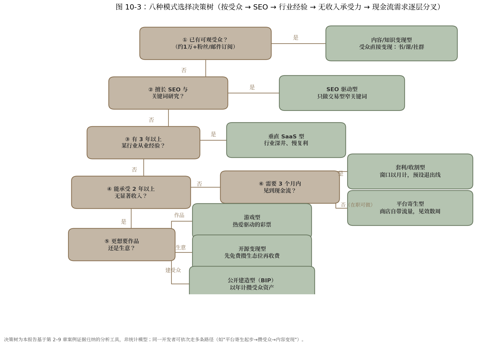

*图 10-3：八种模式的选择决策树。问题节点（圆角矩形，深色）按"受众→SEO→行业经验→无收入承受力→现金流需求"逐层分叉，叶子节点（浅色）为推荐模式。该树为基于第 2–9 章案例证据归纳的分析工具，非统计模型。*

决策树不是算命，下面用文字把每条分叉路径的推理走一遍。

**路径一：已有可观受众（约 1 万+粉丝或邮件订阅）→ 内容/知识变现型。**这是唯一一条"资产已经建成"的路径。证据链是：发射成绩几乎完全由发射前受众规模决定——Marc Lou 的 CodeFast 48 小时 $92K 可由 4 万+ X 粉丝与 4.2 万 newsletter 订阅解释[^230^][^254^]；Vassallo 自述"我在这门生意里赚的每一美元都可归因于最初的受众"[^262^]。已有受众却不先变现知识，等于把复利资产闲置；软件可以随后再做，受众先行者的最优顺序是"先卖认知、再卖工具"。

**路径二：无受众但擅长 SEO → SEO 驱动型（仅限交易型窄词）。**Danny Postma 的方法论核心是可计算性——"如果你排到第一名，基本可以预先算出月收入"[^74^]。但 2026 年必须加上 AI Overviews 过滤器：把目标关键词逐个丢进 Google，能被 AI 概览直接回答的是信息型词（站外点击 -39.8% 的重灾区[^105^]），需要用户完成交易/上传/生成才能满足的是交易型词，只做后者。这条路径对内向者友好：获客系统可以在不发一条推文的情况下运转。

**路径三：无受众、不懂 SEO、但有 3 年以上行业经验 → 垂直 SaaS 型。**行业工龄是这条路径的隐性入场券：Ilia 的选题来自十年企业软件工龄加论坛抱怨，Jeff Dutton 的来自十年执业——"经济性死角"只有行内人看得见[^20^][^165^]。这是八种模式里需求验证路径最清晰、失败成本最可控的一条，代价是慢（$10K MRR 中位 14–18 个月[^176^]）与天花板有限（单点垂直 $250K–500K/年）。

**路径四：三无（无受众、无 SEO、无行业积累）但能承受 2 年以上无显著收入 → 三分叉。**想要"作品"选游戏型——但请重读 10.3 的基线数据与表 10-3 的沉没成本列，并用小体量项目先走完一次完整发布流程[^302^]；想要"生意"且热爱社区选开源变现型——但路线图第一天就要写明"第一个收费物挂在哪个发布事件上"，否则就是 Vuetify 式的五年赞助断粮预演[^198^][^21^]；想从零建受众选公开建造型——它是唯一能把"无资产"状态本身转化为内容资产的路径，但要接受以年计的零反馈期。

**路径五：不能承受长期无收入、需要 3 个月内现金流 → 套利型。**窗口以月计、获客 $0、失败成本近零，但请同时吞下两个事实：预测 80% 的 AI 套壳产品将在 2026 年底前失败（预测性口径）[^297^]，且"连续踩中窗口"的能力目前没有任何公开数据证明可以稳定复制——阴明本人 2025 年至今也只有一个完整复盘的案例[^276^]。套利型是验证场和现金流补丁，不是已证明的终身职业。

**路径六：不能承受长期无收入、但不要求 3 个月内见效（在职可做）→ 平台寄生型。**见效速度仅次于套利（WideBundle 第 21 天首单、6 个月 $10K MRR[^123^][^19^]），商店自带流量适合副业起步。理性用法是"寄生起步、逐步上岸"：把利润与认知逐步转移到自有资产（邮件列表、第二产品、独立站），Resellbot 云端化与 WideBundle 办开发者大会都是减租动作[^127^][^19^]。选品时先回答一个问题：平台自己做这个功能需要几步？三步以内，放弃。

决策树之外还有一条贯穿性的修正：**路径不是单选题，而是串联题**。八个案例中至少一半的实际轨迹是跨模式的——Danny 用 BIP 冷启动再转 SEO 深挖，Vassallo 先做 SaaS 失败再卖知识，阴明做套利但把认知沉淀进社群，Marc Lou 用软件成绩发射课程再回流软件。对大多数人，现实的最优序列是"低沉没成本模式起步（套利/寄生/内容）→ 攒下受众或行业认知 → 迁移到高天花板模式（垂直 SaaS/BIP 组合）"。

### 10.5 中国开发者特别注意事项

#### 10.5.1 支付、合规与平台差异

中国开发者走上述任何一条路径，都要多付一层"出海摩擦成本"，且这层成本是结构性的而非操作性的。支付侧：Stripe 不支持中国大陆主体（仅支持 46 个国家/地区），主流解法是注册美国怀俄明州 LLC（注册费 $100、年维护约 $260）+ EIN + Mercury 银行 + Stripe，全链路 3–5 周、首年成本 $300–500；备选为香港公司（年合规成本超 $1,000）或 Paddle/Lemon Squeezy 的 MoR 代扣模式；换汇回国另有每人每年 5 万美元额度约束[^385^][^386^][^387^]。风险侧必须写明：Stripe 自动化风控对交易量激增敏感，误封后资金可冻结长达 180 天且申诉渠道有限，使用非正规渠道账户触发 KYC 即"秒封"[^388^]——对现金流为生命线的一人公司，支付通道的稳健性优先级应高于费率优化。

变现形态的中外差异同样结构性。英文圈知识变现以电子书/课程一次性售卖为主（Gumroad 生态，抽成 10%+$0.50/笔[^233^]），中文圈的收入大头在高价年费实战社群——哥飞 ¥2,600/年×2,000 成员的年化规模约 ¥520 万（推算口径），与小报童上多数出海类买断专栏（合计不足 ¥9 万级）相差两个数量级[^228^][^260^]。中文平台对个人创作者的抽成也更高（小报童 15%+提现约 6%、知识星球 20%，对比 Gumroad/Lemon Squeezy 的 5–10%），叠加个税代扣后实际到手率再低 5–10 个百分点[^258^][^259^]。对决策的直接含义：做英文市场优先软件与一次性内容（通道成熟、税低），做中文市场优先年费社群形态（信任赤字更高，年费制把信任摊到 365 天检验）；两条腿走路的开发者需要两套定价与交付体系，不存在简单的翻译复用。

#### 10.5.2 退出通道

独立开发不是只能"一直做下去"，退出市场 2026 年的定价是透明的：Acquire.com 官方口径下，2024–2025 年成交 SaaS 的中位倍数为 3.9 倍 TTM 利润（两年持平），平均在售周期 81 天，交易多集中在 $1,000 万企业价值以下[^384^]；分层看，月流失率每降低 1 个百分点可提升估值 15–25%，不满 12 个月收入记录的产品被大幅折价[^389^][^390^]。对照 Danny Postma 的决策算术（"3 倍不卖，自动化跑三年把钱取出来"[^74^]），3.9x 中位倍数意味着多数情况下"持有收租"优于"贱卖"——出售只在有战略买家（Danny 的口径是战略买家场景才有 8–10 倍区间，如 Headlime 之于 Conversion.ai）或创始人注意力需要清算时才划算。

标杆层面，Base44 把上限抬到了新高度：以色列单人创始人 Maor Shlomo 副业 6 个月、零融资，2025 年 6 月被 Wix 以约 $8,000 万现金收购，收购后一年内 ARR 从 $300 万增至约 $1.5 亿[^1^][^391^]。对中国开发者的含义是双重的：一方面，"一个人+AI 工具+6 个月"的退出路径已被主流买家定价，Wyoming LLC 的干净主体与英文市场收入记录直接决定可售性；另一方面，Base44 是幂律尾部中的尾部，合理的预期锚仍是 3.9x 利润的中位交易——一个 $5K MRR、净利率 80% 的产品按中位倍数约值 $18–19 万，这才是大多数复利型产品真实的退出价格带。大环境上，中国一人有限公司已突破 1,600 万家、2025 上半年新注册同比 +47%[^3^][^4^]，供给端拥挤度只会上升；在这种市场里，能从第一天就按"可出售资产"标准（干净主体、稳定 12 个月以上收入记录、低 owner 依赖、低流失）经营的人，将在退出时拿走比别人多一倍的倍数——这不是退出技巧，而是从立项起的设计选择。

---

## 11. 模式选择速查表与2026行动清单

第 10 章给出了八模式的对比矩阵、沉没成本表与决策树，本章把分析压缩成两件可以直接使用的东西：一张可一页打印的模式选择速查表，和一份本周末就能开工的 2026 年行动清单。全章不引入新的模式数据，所有模式数字均为第 2–10 章已出现口径的浓缩；唯一首次引入的是 11.2 节辞职触发线的五个案例（均为本人披露或权威媒体报道口径，逐格标注）。

### 11.1 速查表

#### 11.1.1 性格 × 资金 × 技能 × 时间 → 模式匹配总表（一页打印版）

**表 11-1：八种模式选择速查表**

| 模式 | 适合性格 | 启动资金 | 技能要求 | 可承受无收入期 | 见效时间 | 收入天花板 | 最大风险 | 2026 年第一步 |
|---|---|---|---|---|---|---|---|---|
| 公开建造型 | 外向、表达欲强、承受公开失败 | ≈$0（VPS $40/月级） [^40^] | 全栈开发+内容生产 | 1–2 年持续输出 [^35^] | 以年计（到 $1M ARR 约 6 年） [^34^] | 约 $3.1M/年（组合口径，2025-05） [^26^] | 单平台依赖+机会成本以 5–10 年计 [^33^] | 发出第一条建造日志，公开收入目标 |
| SEO 驱动型 | 内向、不喜社交、数据导向 | ≈$0–数千元（域名约 $3K） [^74^] | SEO+转化优化+关键词嗅觉 | 数月 | 数周–数月（30 天建成、两周 $100K+） [^79^] | 约 $3.6M/年（2024 峰值，第三方口径） [^18^] | 流量地主是 Google（AI Overviews 致点击 -39.8%） [^105^] | 把候选词逐个丢进 Google，只留 AI 概览答不了的交易型词 |
| 平台寄生型 | 工程师型、产品嗅觉强于表达欲 | ≈$0（注册费 $5–19） [^119^][^130^] | ASO+评论运营+漏斗优化 | 数周–数月 | 数周–数月（第 21 天首单、6 个月 $10K MRR） [^123^][^19^] | $50K/月级，被平台结构性封顶 [^19^] | **单点故障最高**（Checkout X €600K MRR 被锁死） [^137^] | 回答"平台自己做这功能要几步"，三步以内直接放弃 |
| 垂直 SaaS 型 | 有 3 年以上行业经验、忍受"无聊"产品 | 数千元级（月成本 $1,750–2,350 迅速被覆盖） [^20^] | 行业知识 > 技术 | 14–18 个月 [^176^] | 首笔收入中位 3–4 个月；$10K MRR 中位 14–18 个月 [^157^][^176^] | $250K–500K/年（单点垂直） [^20^][^166^] | 低（数月+数千元），但生态规则可变 [^181^] | 列出你所在行业最贵的 10 个重复劳动 |
| 开源变现型 | 热爱社区、忍长期低收入期 | ≈$0 [^187^] | 生态位卡位+社区运营 | 2–5 年免费积累期 [^189^][^21^] | 以年计（POC 到稳定收费 2–5 年） [^189^][^21^] | $300K–720K/年（本人披露） [^187^][^21^] | 赞助断粮周期+AI 截断文档漏斗（Tailwind 收入 -80%） [^219^] | 路线图第一天写明"第一个收费物挂在哪个发布事件上" |
| 内容/知识变现型 | 表达欲强、有可验证实绩 | ≈$0（平台抽成后置） [^233^] | 写作/教学+实绩背书 | 数月–数年，取决于受众存量 [^268^][^228^] | 数月–数年（Vassallo 20 个月、哥飞前置 15 年） [^268^][^228^] | $2.5M 累计（Refactoring UI）/约 ¥520 万年化（推算口径） [^239^][^228^] | **最低**（仅损业余时间），但信息层正被 AI 替代 [^270^] | 把既有实绩写成一页预售页，先收款再制作 |
| 套利/收割型 | 机会主义、低情感附着、有退出纪律 | ≈$0（获客 $0、API 按量计费） [^276^] | 全栈单兵+需求嗅觉+退出纪律 | 不适用（以周计） | 数天–数周（全书最快） | 单项目 $10 万量级，靠周转放大 [^276^] | 金钱最低；但可复制性未经验证（预测 80% 套壳 2026 年底前失败） [^297^] | 用周末做一个验证，预设退出线再开工 |
| 游戏型 | 热爱驱动、忍受孤独与验证后置 | 数百美元（$100 上架费+单点外包） [^302^] | 代码+美术+音乐全栈创作 | 26 个月–4.5 年 [^302^][^342^] | 以年计 | 名义数千万美元级；中位数仅 $3,285 [^25^][^8^] | **时间成本最高**（4.5 年黄金职业期） [^313^] | 用数月级小体量游戏先走一遍完整发布流程 |

**使用说明。**定位方法不是从第一列读起，而是先圈定两个硬约束：在"可承受无收入期"列划掉你撑不住的行（撑不住一年，BIP、开源、游戏三行即出局），再用"适合性格"与"技能要求"两列在剩余行里找交集——性格列是八行中唯一无法靠努力补齐的维度。**"最大风险"列比"收入天花板"列更值得先看**：天花板描述的是条件分布尾部（Indie Hackers 样本 54% 零收入、仅 5% 月入超 $8,333 的基线意味着多数人永远摸不到它[^2^]），而风险列描述的是大概率会发生的部分——Google 改算法、平台亲自下场、赞助断粮，每一格都有具名案例背书。最后用"2026 年第一步"列把选择落地：八行的第一步没有一格是"开始写代码"，共同动作都是**先验证分发通道是否存在**。

### 11.2 2026 年行动清单

#### 11.2.1 通用第一步与副业转全职决策框架

**通用第一步：本周末就能做的三件事，全部发生在写代码之前。**第一件，按第 10 章决策树的五问（有无受众→会不会 SEO→有无三年以上行业积累→能承受多久无收入→要不要 3 个月内见到现金流）把自己定位到一条路径，并把表 11-1 中该行的"第一步"格子抄进日历。第二件，做一次零成本需求验证：阴明做 SeeU.Food 的获客成本是 $0，方法是 Reddit 逐条私信[^276^]；这套"人工笨办法"对任何模式都成立——找到 20 个目标用户聚集的帖子或社群，逐个触达，记录有多少人追问"哪里能买"。第三件，写下退出线再开工：Marc Lou 的纪律是"过 10,000 访客没起色就换下一个"，他的原话是"宁愿放弃太早错过机会，也不愿放弃太晚而 burnout"[^256^]。三件事合计不超过一个周末，但它们把"做产品"的不确定性前移成了"要不要做"的可判断性。

**副业转全职：用"跑道月数 × 收入覆盖率"做算术，而不是用勇气做决定。**定义两个变量：收入覆盖率 = 副业月收入 ÷ 家庭月支出；跑道月数 = 可动用积蓄 ÷（家庭月支出 − 副业月收入）。决策流程按阶梯走：当覆盖率 < 30% 且跑道 < 12 个月，留在副业状态；当覆盖率 ≥ 50% 或跑道 ≥ 24 个月，进入"可考虑区"；两个条件同时满足，才到辞职线。真实案例的触发点散布在这条光谱上，恰好标定了各区间的风险含义：

**表 11-2：辞职触发线光谱（五个案例，均为本人披露或权威媒体报道）**

| 触发线类型 | 案例 | 辞职时收入 | 缓冲结构 | 结果口径 |
|---|---|---|---|---|
| 纯赌型 | MonitUp 作者 | $308 MRR [^392^] | 积蓄硬撑 | 社区帖自述，前景未明 |
| 势头派 | Tony Dinh | $600 MRR [^393^] | 两年积蓄+8,000 粉丝 | 2025 年收入破 $1M（本人 Newsletter） [^394^] |
| 势头派 | Damon Chen | $1K–2K MRR [^395^][^396^] | 积蓄；辞职砍掉家庭收入 50% | 四年后 $1M ARR（IH 官方帖） [^395^] |
| 安全线 | 社区经验法则 | $5K+ MRR 连续 3 个月 [^186^] | 6–12 个月积蓄+churn < 8% | 方法论口径，非个案 |
| 保守派 | 9GAG Ray Chan | 收入平替各自工资 [^397^] | 副业 4 年后陆续全职 | CNBC 报道（2018） |

光谱的读法是：越靠左，赌的是"势头"——Damon Chen 的原话是"$2K MRR 在湾区真不算多，但这个牵引力值得我试一把"[^395^]；越靠右，赌的是"确定性"，代价是 4 年双线作战。$5K MRR 连续 3 个月之所以成为社区安全线[^186^]，是因为它对多数单身开发者同时满足覆盖率与跑道两个条件；有家庭者应按 9GAG 规则上浮至工资平替。预计随着 AI 工具继续压缩从副业到 $1K MRR 的时间（本书案例中该区间已从年级压缩到月级），"势头派"区间的风险在下降，但"连续 3 个月增长"这一条不应打折——Photo AI 式的脉冲曲线（峰值后约 9 个月 -34%，本人披露[^17^]）证明单月高点不能作为辞职依据。

#### 11.2.2 效率密码合集：自动化什么、外包什么、砍掉什么

八章案例的效率做法收敛为一张可复制的操作清单，共同原则只有一句：**把人从维护层撤出，把时间留给创造层。**

**自动化的对象是全部重复性运维。**标杆是 Levels 的极简栈：数百至上千个 cron 任务驱动所有网站、自建 healthcheck.php 健康检查页、UptimeRobot 监控、全站 JS/PHP 错误实时推送 Telegram——他的原话是"每个错误都发到我的 Telegram……开始时被错误淹没，现在几乎归零"[^35^][^398^]。Danny Postma 的版本是把退款与客服全自动化，与妻子度假两周直接开启自动退款，"I just love to make robots like I want to completely automate anything"[^74^]；配合 LLaVA 筛图+Codeformer 修瑕疵的 AI 质检流水线，一个人服务 20 万+ 客户[^104^]。可执行的起点：本周列出你每周重复 3 次以上的操作，前三名一周内脚本化或工具化。

**外包的顺序是客服最先、工程最后，价格锚点是菲律宾 $5–7/小时甜点区。**Levels 只有三个外包角色——客服、服务器运维、社区管理员，理由是"customer support person, because I can't do that"[^399^]；Damon Chen 直到用 LTD 收入才雇第一名全职工程师[^400^]。成本硬数据：菲律宾客服月薪 $320–1,280 按经验分级，多数雇主认可的甜点区为 $5–7/小时，对比美国同岗年薪 $34,384+[^173^][^174^]。Postma 把外包逻辑推到了生活侧——巴厘岛请人做饭、不通勤，他明确量化为"每天多出约 4 小时"专注公司[^74^]。判据与第 9 章游戏型的外包边界同构：重复、打断心流的环节先外包；构成核心竞争力的环节（工程、核心创作）最后外包或不外包。

**砍掉的对象是会议、重型生产力系统与超长项目周期。**Levels 在 Lex 播客中给出反会议的最有力表述："共识会议产生妥协结果，滋生平庸（it breeds averageness）——你需要一个领导者，或者干脆 solo"[^35^]。他同时砍掉了重型生产力系统：一张 A3 纸待办清单、每天约 3 件事，iPad 日历工具试用一周即弃，"我直接给自己发条消息就够了"[^57^]。Tony Dinh 走到另一极端同样成立：每天约 4 小时、无文档、无会议、无 deadline，每天只完成一件 3–4 小时可收尾的大事[^394^][^401^]。周期侧的纪律来自 Marc Lou："新产品绝不超过几周……没有独角兽宏图，只有一个功能"[^256^]。三条并置的结论是：砍掉什么因人而异，但"可砍掉项"的候选集合高度一致——凡是不直接产生现金流、不积累受众资产、不减少未来工作量的活动，都在候选之列。预计 2026 年之后，AI 代理会继续吞掉这张清单中的"自动化"层（客服、质检、监控已在案例中被 AI 接管），人的时间将进一步向"判断做什么"与"被用户信任"两个不可自动化的环节集中——这正是表 11-1 中"适合性格"一列权重持续上升的原因。

---

# 参考文献

[1] WebsitePlanet. Wix Acquires AI App Startup Base44 for $80M[EB/OL]. (2025-07-03). https://www.websiteplanet.com/news/wix-acquires-base44/
[2] ScrapingFish. How Much Money Do Indie Hackers Products Make?[EB/OL]. (2022-07-16). https://scrapingfish.com/blog/indie-hackers-revenue
[3] 人民日报（中国商报）. 城市怎样接好'一人公司'创业热潮[EB/OL]. (2026-03-30). http://paper.people.com.cn/zgcsb/pc/content/202603/30/content_30148175.html
[4] SmartCity. 人工智能 OPC 模式与全球新兴实践分析[EB/OL]. (2026-04-10). https://www.smartcity.team/reports/ai_opc_report04/
[5] PYMNTS. The One-Person Billion-Dollar Company Is Here[EB/OL]. (2026-04-03). https://www.pymnts.com/news/artificial-intelligence/2026/the-one-person-billion-dollar-company-is-here/
[6] RockingWeb. 1000 Micro SaaS Analysed: Real Revenue Data[EB/OL]. (2025-08-17). https://www.rockingweb.com.au/micro-saas-revenue-analysis-2025
[7] SaaSRanger. Micro-SaaS Revenue: What 1,000+ Founders Earn[EB/OL]. (2026-03-15). https://saasranger.com/blog/micro-saas-revenue-reality-what-1000-founders-actually-earn/
[8] QuestGameDev. Indie Game Revenue on Steam: Key Insights from 2024 Data Analysis[EB/OL]. (2025-02-21). https://www.questgamedev.com/post/indie-game-revenue-on-steam-key-insights-from-2024-data-analysis
[9] cubxxw. 超级个体的判断[EB/OL]. (2026-07-19). https://github.com/cubxxw/blog/blob/main/content/en/ai-agent/posts/super-individual-stack-judgment.md
[10] BuildMVPFast. SaaS Is the Only Way Out: Indie Hacker Dream vs Reality[EB/OL]. (2026-06-14). https://www.buildmvpfast.com/blog/saas-only-way-out-indie-hacker-dream-desperation-2026
[11] Panto AI. Cursor AI Statistics 2026[EB/OL]. (2026-08-07). https://www.getpanto.ai/blog/cursor-ai-statistics
[12] Panto AI. Anthropic AI Statistics 2026[EB/OL]. (2026-08-07). https://www.getpanto.ai/blog/anthropic-ai-statistics
[13] SerpSculpt. Claude Code Usage Statistics 2026[EB/OL]. (2026-05-21). https://serpsculpt.com/claude-code-usage-statistics/
[14] Antonio Sánchez. AI's Real Impact on Software Launches: Evidence from Product Hunt[EB/OL]. (2026-02-10). https://asanchez.dev/blog/ais-real-impact-on-software-launches-evidence-from-product-hunt/
[15] Mobile Marketing Reads. App Store added nearly 560,000 new apps in H1 2026[EB/OL]. (2026-07-21). https://www.mobilemarketingreads.com/app-store-added-nearly-560000-new-apps-in-h1-2026-approaching-all-of-2025s-total/
[16] Indie Hackers. Photo AI by Pieter Levels: Complete Deep Dive Case Study[EB/OL]. (2025-12-12). https://www.indiehackers.com/post/photo-ai-by-pieter-levels-complete-deep-dive-case-study-0-to-132k-mrr-in-18-months-3a9a2b1579
[17] Tracetify. How photoai.com got started[EB/OL]. (2026-08-03). https://tracetify.com/r/photoai-com
[18] Starter Story. How an Indie Hacker Built an AI Headshot Business to $300K/Month[EB/OL]. (2024-12). https://www.starterstory.com/stories/headshotpro-breakdown
[19] Mat De Sousa 付费蓝图落地页[EB/OL]. https://e-kontur.com/shopify-app-blueprint-landing.html
[20] Ilia Pirozhenko 个人站复盘长文. （原文 Habr，2025-04-30[EB/OL]. (2025-04-30). https://ipirozhenko.com/How-I-Created-Perfect-Wiki-and-Reached-dollar250K-in-Annual-Revenue-Without-Investors_PI7xTHDx2tqg6bGTfQnX
[21] Starter Story. I Created A $60K/Month Mobile App Builder[EB/OL]. (2026-06-05). https://www.starterstory.com/stories/nativephp-baking-delicious-native-appsnativephp
[22] 网易. 有人想要带着程序员出海赚钱，居然还真的让程序员赚到钱了[EB/OL]. (2025-05-15). https://www.163.com/dy/article/JVJBKAR305520ON9.html
[23] 津津乐道播客. 一个人一个月，9万美金收入，AI时代的"超级个体"实战样本[EB/OL]. (2025-12-21). https://www.xiaoyuzhoufm.com/episode/69487c3a143a18ec63c62722
[24] PCGamesInsider. Balatro has hit five million sales[EB/OL]. (2025-01-22). https://www.pcgamesinsider.biz/news/74922/balatro-has-hit-five-million-sales/
[25] ConcernedApe 官网. Stardew Valley 10-year Anniversary[EB/OL]. (2026-02-26). https://www.stardewvalley.net/stardew-valley-10-year-anniversary/
[26] Networthoor. Pieter Levels Net Worth: $3M/Year, Zero Employees[EB/OL]. (2026-06-26). https://networthoor.com/pieter-levels-net-worth/
[27] levels.io. Stripe Podcast: A Cheeky Pint with John Collison[EB/OL]. (2025-07-09). https://levels.io/stripe-cheeky-pint-john-collison
[28] 36氪. 做IP这三个字已经被严重误解了[EB/OL]. (2026-04-09). http://www.36kr.com/p/3758866746082049
[29] The Bootstrapped Founder（Arvid Kahl）播客转录[EB/OL]. (2023-10-25). https://thebootstrappedfounder.com/pieter-levels-the-indie-hackers-guide-to-ai-startups/
[30] levels.io. Stats[EB/OL]. https://levels.io/stats
[31] IndieAI Directory. Pieter Levels: Real Indie Developer Playbook for 2026[EB/OL]. (2026-02-28). https://indieai.directory/blog/pieter-levels-real-indie-developer-playbook-2026/
[32] SoftwareSeni. Ship Before Ready[EB/OL]. (2026-06-12). https://www.softwareseni.com/ship-before-ready-why-solo-founders-win-with-speed-over-perfection/
[33] SoftwareSeni. Building in Public: The 10-Year Distribution Strategy[EB/OL]. (2026-06-12). https://www.softwareseni.com/building-in-public-the-10-year-distribution-strategy-behind-solo-founder-revenue/
[34] levels.io. It took 4 years to reach $1m annual revenue[EB/OL]. (2019-05-30). https://levels.io/4-years-to-1m-revenue-nomad-list-remote-ok
[35] Lex Fridman Podcast #440 全文转录[EB/OL]. (2024-08-20). https://lexfridman.com/pieter-levels-transcript/
[36] levels.io. The TL;DR MBA[EB/OL]. (2017-07-21). https://levels.io/tldr-mba
[37] levels.io. Why I'm unreachable and maybe you should be too[EB/OL]. (2021-03-25). https://levels.io/contact-levelsio
[38] levels.io. Turning side projects into profitable startups[EB/OL]. (2018-01-24). https://levels.io/startups
[39] levels.io. Nomad List Founder[EB/OL]. (2017-01-07). https://levels.io/nomad-list-founder
[40] Offline Conference 邮件刊[EB/OL]. (2024-07-06). https://www.mail.offlineconference.com/p/pieter-levels
[41] The Distribution Market. How Nomad List Hit $1M ARR[EB/OL]. (2026-05-03). https://www.thedistributionmarket.com/blog/apps/consumer/nomad-list
[42] RealHow Playbook[EB/OL]. (2026-03-19). https://www.realhow.net/playbooks/pieter-levels-nomad-list-solo-founder-google-spreadsheet
[43] Indie Hackers Podcast #043[EB/OL]. (2018-01-17). https://www.indiehackers.com/podcast/043-pieter-levels-of-nomad-list
[44] Indie Hackers 帖[EB/OL]. (2024-10-12). https://www.indiehackers.com/post/he-built-70-failed-apps-before-making-300k-month-levelsios-story-eb21cb3b79
[45] Indie Hackers 帖. made $10,000 in the first day[EB/OL]. (2022-10-30). https://www.indiehackers.com/post/pieter-levels-launched-a-new-project-and-made-10-000-in-the-first-day-2e4676a2f5
[46] Remarkable Magazine. …Flight Simulator in Three Hours…$1M ARR in 17 Days[EB/OL]. (2026-07-25). https://remarkablemag.com/pieter-levels-fly-pieter-com-one-million-arr-17-days/
[47] levels.io. February 2025[EB/OL]. https://levels.io/2025/february
[48] levels.io. List of all my projects ever[EB/OL]. https://levels.io/projects
[49] levels.io. Normalization of non-deviance[EB/OL]. (2020-12-10). https://levels.io/deviance
[50] Streakr. How Pieter Levels Turned Public Shipping Into a Feedback System[EB/OL]. (2026-08-10). https://streakr.co/playbook/pieter-levels
[51] AI for Automation. 0 Employees, $138K/Month Solo — The PhotoAI Story[EB/OL]. (2026-03-19). https://aiforautomation.io/cases/photoai-pieter-levels
[52] Lorejump. Pieter Levels: The $3M+/Year One-Person Company Textbook[EB/OL]. (2026-05-09). https://lorejump.com/en/cases/pieter-levels
[53] Skillselion updates 收录 @levelsio 2026-06-30 推文[EB/OL]. (2026-06-30). https://skillselion.com/updates
[54] SmartBranding. Nomad List Rebrands to Nomads.com[EB/OL]. (2024-11-11). https://smartbranding.com/nomad-list-rebrands-to-nomads-com-representing-millions-of-digital-nomads-worldwide/
[55] Pilot Plans Nomad List 测评[EB/OL]. (2025-11-18). https://www.pilotplans.com/blog/nomad-list-review
[56] Ghosti. How to Make Money on X in 2026: The levelsio Breakdown[EB/OL]. (2026-08-05). https://ghostiapp.com/blog/posts/how-to-make-money-on-x.html
[57] Daniel Tay. Work Daily: How Nomad List maker Pieter Levels works[EB/OL]. (2023-10-24). https://danieltay.me/nomadlist-pieter-levels/
[58] FastSaaS. How Pieter Levels Built a $3M/Year Business with Zero Employees[EB/OL]. (2025-10-29). https://www.fast-saas.com/blog/pieter-levels-success-story/
[59] OpenAIToolsHub Photo AI Teardown[EB/OL]. (2026-05-15). https://www.openaitoolshub.org/ai-product-research/photo-ai
[60] SoftwareGrowth. How Pieter Levels grew Nomad List[EB/OL]. (2023-04-25). https://www.softwaregrowth.io/blog/how-pieter-levels-grew-nomad-list
[61] ExplainX. Claude Code on VPS Only: levelsio's Year-Long Production Workflow[EB/OL]. (2026-07-16). https://explainx.ai/blog/claude-code-vps-production-workflow-levelsio-june-2026
[62] The Neuron 日报[EB/OL]. (2026-03-06). https://www.theneuron.ai/ai-news-digests/around-the-horn-digest-everything-that-happened-in-ai-this-week-mar-1-7-2026/
[63] The Wizdom Project 播客笔记[EB/OL]. (2021-08-06). https://thewizdomproject.com/pieter-levels-podcast-notes
[64] The Growth List. Hacking Twitter Giveaways[EB/OL]. (2024-11-29). https://thegrowthlist.co/tactics/hacking-twitter-giveaways
[65] Indie Hackers. nomadlist pricing analysis[EB/OL]. (2020-02-20). https://www.indiehackers.com/post/nomadlist-pricing-analysis-7760191976
[66] Onepc.org. The AI Stack of Successful Solo Founders in 2026[EB/OL]. (2026-05-10). https://onepc.org/stats/ai-stack-solo-founders-2026
[67] nomads.com 官网/FAQ[EB/OL]. https://nomads.com/
[68] Jobbers.io vs RemoteOK 综述[EB/OL]. (2026-03-29). https://www.jobbers.io/jobbers-io-vs-remoteok-where-remote-workers-get-better-deals/
[69] Supabird. From Spreadsheet to $3.6M/Year[EB/OL]. (2025-07-31). https://supabird.io/articles/from-spreadsheet-to-3-6m-year-the-story-of-pieter-levels
[70] Tycoon.us. Pieter Levels 案例研究（含 Photo AI 案例）[EB/OL]. (2026-04-17). https://tycoon.us/case-studies/pieter-levels
[71] CSDN OPC. 独立开发者：Build In Public，解决产品冷启动难题[EB/OL]. (2026-01-05). https://opc.csdn.net/69845fb67bbde9200b984374.html
[72] 小宇宙. EP12 独立开发赚钱难？你需要正确的build策略[EB/OL]. (2023-05-29). https://www.xiaoyuzhoufm.com/episode/647456af6752b5f9de6bd99c
[73] Prometheus Root 人物页[EB/OL]. https://prometheusroot.com/people/pieter-levels/
[74] The Bootstrapped Founder(Arvid Kahl). Danny Postma — An Indie Hacker's Business Evolution[EB/OL]. (2023-08-09). https://thebootstrappedfounder.com/danny-postma-an-indie-hackers-business-evolution/
[75] Unite.ai. Danny Postma, Founder of HeadshotPro – Interview Series[EB/OL]. (2024-02-20). https://www.unite.ai/danny-postma-founder-of-headshotpro-interview-series/
[76] They Got Acquired. AI copywriting platform Headlime acquired by Conversion.ai[EB/OL]. (2022-04-21). https://theygotacquired.com/saas/headlime-acquired-by-conversion-ai/
[77] Learn AI wiki. HeadshotPro[EB/OL]. (2026-07-28). https://ai.miraheze.org/wiki/HeadshotPro
[78] Product Hunt. Sitting on a project? This Maker Grant recipient's motto: just f*cking ship it[EB/OL]. (2021-03-03). https://www.producthunt.com/stories/sitting-on-a-project-this-maker-grant-recipient-s-motto-just-f-cking-ship-it
[79] Startup Founder Stories. Danny Postma 自述：HeadshotPro 两周 $100K[EB/OL]. (2024-02-05). https://startupfounderstories.com/fr/stories/danny-postma-headshotpro-100k-2-weeks
[80] Levels P. 关于 Headlime 收购估值的推文（经 They Got Acquired 转引）[EB/OL]. (2021-03-31).
[81] Bootstrappers.com. How Danny Postma Became a Viral SaaS Sensation – Twice[EB/OL]. (2024-02-09). https://bootstrappers.com/how-danny-postma-became-a-viral-saas-sensation-twice/
[82] Postma D. HeadshotPro 上线推文（经 DCFever/PetaPixel 转引）[EB/OL]. (2023-03-16). https://www.dcfever.com/news/readnews.php?id=34955
[83] Grey Journal. How Danny Postma Built a Million Dollar AI Startup Alone[EB/OL]. (2026-03-09). https://greyjournal.net/hustle/inspire/how-danny-postma-built-million-dollar-ai-startup-alone/
[84] Indie Hackers Podcast #278. Growing a Portfolio of AI Products Past $300k After a 7-Figure Exit with Danny Postma[EB/OL]. (2023-05-05). https://www.indiehackers.com/podcasts
[85] SupaBird. How Danny Postma Built $300K/Month AI Empire Solo[EB/OL]. (2025-08-03). https://supabird.io/articles/danny-postma-how-a-solo-hacker-built-an-ai-empire-from-bali
[86] waytoclawearn. How Danny Postma Built HeadshotPro to $300K/Month Solo[EB/OL]. (2026-06-22). https://waytoclawearn.com/en/cases/danny-postma-headshotpro-300k-solo-ai
[87] HeadshotPro About 页[EB/OL]. https://www.headshotpro.com/about
[88] HeadshotPro 首页[EB/OL]. https://www.headshotpro.com/
[89] Rewardful 案例. HeadshotPro Earns $50k+ Monthly Through Affiliate Marketing[EB/OL]. https://www.rewardful.com/case-studies/headshotpro
[90] HeadshotPro. Reviews 页（Trustpilot 4.7，3,538 条，2026-08-03 快照）[EB/OL]. https://www.headshotpro.com/reviews
[91] Taskade. One-Person Company Software: The Solo AI Tool Stack (2026)[EB/OL]. (2026-03-30). https://www.taskade.com/blog/one-person-companies
[92] 至顶网/腾讯新闻. Stripe Sessions 2026 一页PPT提到了35个'一人创业家'[EB/OL]. (2026-05-10). https://www.zhiding.cn/zd-ai-lab/2026/0510/3186405.shtml
[93] UsagePricing. Replicate 2026 价格,2026-05-30[EB/OL]. (2026-05-30). https://www.usagepricing.com/blueprint/replicate
[94] IMDb. Danny Postma 简介[EB/OL]. https://www.imdb.com/name/nm15964655/
[95] Indie Hackers. Breaking down Danny Postma's SEO strategy[EB/OL]. (2023-06-01). https://www.indiehackers.com/post/whats-new-breaking-down-danny-postma-s-seo-strategy-58b44283bb
[96] SupaBird. Danny Postma's SEO Strategy Behind HeadshotPro[EB/OL]. (2026-03-27). https://supabird.io/articles/the-headshotpro-seo-strategy-how-danny-postma-ranks-1-for-professional-headshots
[97] dannypostma.com 及 SEO 课程页[EB/OL]. https://www.dannypostma.com/
[98] Capturely. HeadshotPro vs Real Photography: 2026 Comparison[EB/OL]. (2026-04-12). https://capturely.com/headshotpro-vs-real-photography/
[99] StartupSpells #122. Danny Postma SEO Course: $106,000 revenue in 24 hours[EB/OL]. (2024-08-06). https://startupspells.com/p/danny-postma-seo-course-106000-revenue-24-hours
[100] The Startup Ideas Podcast(Greg Isenberg)ep.64. AI App Ideas that make Millions with Danny Postma[EB/OL]. (2023-02-09). https://podcasts.apple.com/us/podcast/ai-app-ideas-that-make-millions-with-danny-postma/id1593424985?i=1000598883670
[101] VibeDex. Best Free AI Headshot Generator 2026[EB/OL]. (2026-07-12). https://vibedex.ai/blog/best-free-ai-headshot-generator-2026
[102] fritz.ai. HeadshotPro vs Secta AI[EB/OL]. (2026-07-10). https://fritz.ai/headshotpro-vs-secta-ai/
[103] Aragon 官方博客. HeadshotPro vs Aragon [2026][EB/OL]. (2026-01-26). https://www.aragon.ai/blog/headshotpro-vs-aragon-which-ai-headshot-generator-has-better-results
[104] small-start. $100K ARR in 14 Days, Then Up to $300K MRR[EB/OL]. (2026-05-10). https://small-start.com/en/cases/global-headshotpro/
[105] PPC Land. Researchers find Google AI Overviews cut publisher clicks 39.8%[EB/OL]. (2026-07-01). https://ppc.land/researchers-find-google-ai-overviews-cut-publisher-clicks-39-8/
[106] Ahrefs. Update: AI Overviews Reduce Clicks by 58%[EB/OL]. (2026-05-28). https://ahrefs.com/blog/ai-overviews-reduce-clicks-update/
[107] Omnibound. AI SEO Statistics (2026)[EB/OL]. (2026-05-29). https://www.omnibound.ai/blog/ai-seo-statistics
[108] TheDigitalBloom. 2025 Organic Traffic Crisis Report[EB/OL]. (2026-07-26). https://thedigitalbloom.com/learn/2025-organic-traffic-crisis-analysis-report/
[109] TheSeoSpot. Google AI Overviews Traffic Impact: 2025 Data[EB/OL]. (2026-01-26). https://theseospot.com/blog/google-ai-overviews-traffic-impact-the-2025-data-every-website-owner-needs-to-see/
[110] Amsive. Google's Helpful Content Update & Ranking System[EB/OL]. (2024-03-26). https://www.amsive.com/insights/seo/googles-helpful-content-update-ranking-system-what-happened-and-what-changed-in-2024/
[111] EdTech Innovation Hub. Chegg Sues Google[EB/OL]. (2025-02-27). https://www.edtechinnovationhub.com/news/chegg-reports-24-revenue-drop-sues-google-over-ai-impact-on-online-learning
[112] Search Engine Land. Google AI Overviews cut search clicks 42%: Report[EB/OL]. (2026-03-12). https://searchengineland.com/google-ai-overviews-cut-search-clicks-report-471497
[113] 小liblog. PhotoAI 案例,2026-05-19[EB/OL]. (2026-05-19). https://www.xiaoliblog.com/build-in-public/pieter-levels-photoai-60k-review/
[114] Listen Up IH. Key Lessons from the success of Closet Tools[EB/OL]. (2022-04-05). https://www.listenupih.com/closet-tools-key-lessons/
[115] Indie Hackers Podcast #187. Building a $38k/Month SaaS Business as a Solo Founder with Jordan O'Connor of Closet Tools[EB/OL]. (2020-12). https://www.indiehackers.com/podcast/187-jordan-oconnor-of-closet-tools
[116] BacktoFrontShow. Shopify Statistics 2026[EB/OL]. (2026-05-12). https://backtofrontshow.com/shopify-statistics/
[117] AppJubilee. Shopify App Store Visibility Guide[EB/OL]. (2026-06-16). https://blog.appjubilee.io/ultimate-guide-shopify-app-store-visibility/
[118] Indie Hackers. How We Validated & Grew a Shopify App to $25k/mo in Less Than a Year[EB/OL]. (2021-12-10). https://www.indiehackers.com/post/how-we-validated-grew-a-shopify-app-to-25k-mo-in-less-than-a-year-159f82699c
[119] MetricHQ. Shopify app revenue share and fees in 2026[EB/OL]. (2026-08-17). https://metrichq.app/blog/shopify-app-revenue-share-fees-explained
[120] Starter Story. Failing Thrice, Then Building A $40K/Month Shopify App By The Age Of 25[EB/OL]. https://www.starterstory.com/stories/widebundle
[121] EcomPreneurs 播客 Ép.27. Mat De Sousa[EB/OL]. (2025-01). https://creators.spotify.com/pod/profile/ecompreneurs
[122] Indie Hackers — Mat De Sousa AMA. I bootstrapped a Shopify app to $25K MRR in less than a year![EB/OL]. (2021-12-02). https://www.indiehackers.com/post/i-bootstrapped-a-shopify-app-to-25k-mrr-in-less-than-a-year-ama-89f3d4c471
[123] StartupFounderStories. Mat De Sousa / WideBundle 案例档案[EB/OL]. (2026-06-26). https://startupfounderstories.com/stories/mat-de-sousa-widebundle-25k-mrr
[124] GrowthPartners. How WideBundle Went from $0 to $55K MRR in Just 3 Years[EB/OL]. (2025-11-14). https://growthpartners.online/stories/how-widebundle-went-from-0-to-55k-mrr-in-just-3-years
[125] speed-ecom. Bundle Shopify : les 10 meilleures apps en 2026[EB/OL]. (2026-05-06). https://speed-ecom.eu/blog/10-meilleures-applications-bundles-shopify/
[126] Jordan O'Connor 博客. From Nothing to $140/Month in 2 Months[EB/OL]. (2018-03-16). https://jdnoc.com/something-from-nothing/
[127] Resellbot 官方. Closet Tools is Now Resellbot[EB/OL]. (2025-07-30). https://resellbot.com/closet-tools-is-now-resellbot/
[128] PalmFlow. PalmFlow vs Closet Tools / Resellbot[EB/OL]. (2026-04-19). https://palmflow.app/compare/closet-tools
[129] PCWorld. The last lifeline for uBlock Origin in Chrome is almost gone[EB/OL]. (2026-06-09). https://www.pcworld.com/article/3160794/the-last-lifeline-for-ublock-origin-in-chrome-is-almost-gone-for-good.html
[130] CodeTalentHub. Top 10 Simple Coding Projects for Passive Income[EB/OL]. https://www.codetalenthub.io/simple-coding-projects-for-passive-income/
[131] shopify.dev. App Store requirements[EB/OL]. https://shopify.dev/docs/apps/launch/shopify-app-store/app-store-requirements
[132] WeekOneLabs. Shopify App Revenue Benchmarks 2026[EB/OL]. (2026-07-03). https://weekonelabs.com/blog/shopify-app-revenue-benchmarks-2026
[133] Gaintage. How to Rank in the Shopify App Store: 2026[EB/OL]. (2026-04-30). https://gaintage.com/blog/shopify-app-store-ranking
[134] Shopify 官方. Built for Shopify 文档[EB/OL]. https://shopify.dev/docs/apps/launch/built-for-shopify
[135] Google 官方. Chrome Web Store payments deprecation[EB/OL]. (2020-09-20). https://github.com/GoogleChrome/developer.chrome.com/blob/main/site/en/docs/webstore/cws-payments-deprecation/index.md
[136] ExtensionPay. ExtensionPay is the Chrome Web Store Payments Replacement[EB/OL]. (2025-01-27). https://extensionpay.com/articles/extensionpay-is-the-chrome-web-store-payments-replacement
[137] Ruslan Leteyski 博客. Bootstrapping to €600k MRR and getting killed by Shopify[EB/OL]. (2023-03-10). https://blog.leteyski.com/p/bootstrapping-to-600k-mrr-and-getting
[138] IcyTales. Inside Shopify's App Store Ranking System…[EB/OL]. (2026-04-03). https://icytales.com/inside-shopifys-app-store-ranking-system-first-party-advantages-and-the-independent-developers-caught-in-the-middle/
[139] The Hacker News. WARNING — Hugely Popular 'The Great Suspender' Chrome Extension Contains Malware[EB/OL]. (2021-02-06). https://thehackernews.com/2021/02/warning-hugely-popular-great-suspender.html
[140] FuturMedia. Bundle Products in Shopify: Complete Guide (2026)[EB/OL]. (2026-04-02). https://futurmedia.co.uk/blog/bundle-products-in-shopify
[141] Shopify Community. Product Reviews 下架官方答复[EB/OL]. (2023-09). https://community.shopify.com/t/whats-going-on-with-the-product-reviews-app-its-no-longer-available/249489
[142] Ilana Davis. Shopify Product Reviews app unavailable May 2024[EB/OL]. (2024-02-06). https://www.ilanadavis.com/blogs/articles/shopify-product-reviews-app-unavailable-may-2024
[143] Indie Hackers — Ruslan Leteyski. Building a $2M ARR product after his $8M ARR product failed overnight[EB/OL]. (2026-08-13). https://www.indiehackers.com/post/tech/building-a-2m-arr-product-after-his-8m-arr-product-failed-overnight-UZm68xNgjDZBHH7Mvc54
[144] IT之家. 谷歌宣布 8 月 31 日起从 Chrome 商店中移除所有 MV2 扩展[EB/OL]. (2026-07-09). https://www.ithome.com/0/974/468.htm
[145] AboutChromebooks. Banned Chrome Extensions 2026[EB/OL]. (2026-02-13). https://www.aboutchromebooks.com/banned-chrome-extensions/
[146] Shopify Partners Blog. New perks and criteria for Built for Shopify (2025)[EB/OL]. (2025-10-30). https://www.shopify.com/partners/blog/built-for-shopify-updates
[147] Adsx. Shopify App Store Statistics 2026[EB/OL]. (2026-07-21). https://www.adsx.com/blog/shopify-app-store-statistics-2026
[148] chrome-stats. Chrome Web Store 统计[EB/OL]. (2026-08-21). https://chrome-stats.com/chrome/stats
[149] ChromeGoldmine. Profitable Chrome Extension Niches for Indie Makers (2026)[EB/OL]. (2026-03-27). https://chromegoldmine.com/blog/profitable-chrome-extension-niches/
[150] Modall. SaaS Trends 2026[EB/OL]. (2025-12-13). https://modall.ca/blog/saas-trends
[151] Searchlab. SaaS Statistics 2026[EB/OL]. (2026-03-17). https://searchlab.nl/en/statistics/saas-statistics-2026
[152] MSTHGN. The Micro SaaS Revolution[EB/OL]. (2025-09-06). https://www.msthgn.com/articles/the-micro-saas-revolution-from-giants-to-solopreneurs
[153] Clearly Acquired. SaaS EBITDA 倍数[EB/OL]. (2026-03-30). https://www.clearlyacquired.com/blog/ebitda-multiples-for-saas-and-software-companies-2025-2026
[154] goHeather Pricing[EB/OL]. https://www.goheather.io/pricing
[155] Perfect Wiki About Us[EB/OL]. (2025-12-20). https://perfectwikiforteams.com/about-us/
[156] CSDN. 中文转载报道（另见 36氪报道）[EB/OL]. (2025-05-02). https://blog.csdn.net/csdnnews/article/details/147753849
[157] Superframeworks. Micro SaaS Ideas 2026[EB/OL]. (2026-01-28). https://superframeworks.com/articles/best-micro-saas-ideas-solopreneurs
[158] Microsoft 官方：Export a wiki to OneNote / Wiki 退役时间线[EB/OL]. https://support.microsoft.com/en-us/onenote/export-a-wiki-to-a-onenote-notebook-in-microsoft-teams
[159] robdy.io. Retirement of Teams Wiki[EB/OL]. (2023-02-09). https://robdy.io/teams-wiki-retirement/
[160] Sprocket 365. Teams Wiki replacement[EB/OL]. (2026-08-02). https://sprocket365.com/compare/teams-wiki-replacement
[161] Perfect Wiki 官网首页/定价[EB/OL]. https://perfectwikiforteams.com/
[162] Perfect Wiki MCP Server 条目[EB/OL]. https://mcpservers.org/servers/perfectwiki-mcp
[163] goHeather About Us[EB/OL]. (2025-05-24). https://www.goheather.io/about-us
[164] AI Business Review 专访[EB/OL]. (2025-11-15). https://aibusinessreview.ca/transforming-legal-contracts-with-ai-innovation/
[165] Toronto Guardian 专访 Jeff Dutton[EB/OL]. (2025-09-29). https://torontoguardian.com/2025/09/toronto-business-goheather/
[166] goHeather 联盟计划公告[EB/OL]. (2025-07-21). https://www.goheather.io/post/earn-33-commission-with-goheathers-ai-legal-tech-saas-affiliate-program
[167] rlegaltech 目录 goHeather 条目[EB/OL]. (2026-05-31). https://www.rlegaltech.com/vendors/goheather/
[168] aiforlawfirms.org goHeather 评测[EB/OL]. (2026-06-28). https://aiforlawfirms.org/goheather-ai-review/
[169] goHeather 产品 FAQ（技术栈/隐私）[EB/OL]. https://www.goheather.io/en-ca/products/ai-contract-review-app
[170] goHeather 官方博客. SMB 战略、用户画像与博客归档[EB/OL]. (2026-06-04). https://www.goheather.io/post/goheather-is-for-enterprise-and-everyone-else
[171] resourcifi. AI SaaS 经济性[EB/OL]. (2026-02-01). https://www.resourcifi.com/insights/how-to-build-an-ai-saas-product/
[172] Perfect Wiki Reviews 页[EB/OL]. https://perfectwikiforteams.com/reviews/
[173] VirtualStaff.ph 客服成本[EB/OL]. (2024-10-25). https://www.virtualstaff.ph/blog/how-much-does-it-cost-hire-customer-service-repres
[174] HireTalent.ph 2026 薪酬指南[EB/OL]. (2026-01-09). https://hiretalent.ph/blog/filipino-customer-service-salary-guide
[175] Perfect Wiki vs Confluence 博文[EB/OL]. (2025-11-18). https://perfectwikiforteams.com/blog/perfect-wiki-vs-confluence/
[176] monolit.sh. $10K MRR Solo 经验[EB/OL]. (2026-04-01). https://monolit.sh/blog/lessons-indie-hackers-hit-10k-mrr-solo-2026
[177] saasdash.ai. Micro-SaaS 增长基准[EB/OL]. (2026-05-22). https://saasdash.ai/blog/micro-saas-growth
[178] lastverified AI 合同审查工具对比[EB/OL]. (2026-07-11). https://lastverified.com/ai-for/lawyers/contract-review/
[179] Relevance AI Marketplace FAQ[EB/OL]. (2026-05-05). https://marketplace.relevanceai.com/agents/best-ai-contract-review-software
[180] bestpmjobs. SaaSpocalypse[EB/OL]. (2026-02-09). https://www.bestpmjobs.com/resources/trending/saaspocalypse-pm-career-impact
[181] codetalenthub. 开发者被动收入 2026[EB/OL]. (2026-06-26). https://www.codetalenthub.io/7-passive-income-for-developers/
[182] MarketsandMarkets 法律 AI 软件[EB/OL]. (2025-02-27). https://www.marketsandmarkets.com/Market-Reports/legal-ai-software-market-88725278.html
[183] market.us 合同抽象 AI[EB/OL]. (2026-04-09). https://market.us/report/contract-abstraction-ai-market/
[184] Nelson Advisors. Rule of Data[EB/OL]. (2025-12-05). https://nelsonadvisors.co.uk/blog/the--rule-of-40--to-be-replaced-by-the--rule-of-data--in-2026
[185] Euclid Ventures. Dude, Where's My Moat?[EB/OL]. (2025-07-25). https://insights.euclid.vc/p/dude-wheres-my-moat
[186] finderlaunch 副业路线图[EB/OL]. (2025-12-18). https://finderlaunch.com/blog/side-project-to-10k-mrr-roadmap
[187] Starter Story. I Built A $300K/Year Vue.js Component Library[EB/OL]. (2021-08). https://www.starterstory.com/stories/i-built-a-300k-year-vue-js-component-library
[188] Vuetify 官方. Roadmap（另见 endoflife.date/vuetify）[EB/OL]. (2026-08-14). https://vuetifyjs.com/vuetify/roadmap
[189] Indie Hackers. Building the impossible and making $100k in the first three months[EB/OL]. (2025-05-22). https://www.indiehackers.com/post/tech/building-the-impossible-and-making-100k-in-the-first-three-months-n8qj3KIFVnXF1fUFuYaL
[190] Laravel News. NativePHP for Mobile v1 — Launching May 2[EB/OL]. (2025-04-23). https://laravel-news.com/nativephp-mobile-v1
[191] Tidelift 2024 State of the Open Source Maintainer[EB/OL]. (2024-09-17). https://www.businesswire.com/news/home/20240917030299/en/
[192] GitHub Blog. $100 million for open source[EB/OL]. (2026-07-21). https://github.blog/open-source/maintainers/100-million-for-open-source-a-milestone-built-by-the-community/
[193] Byteiota. Open Source Endowment[EB/OL]. (2026-03-15). https://byteiota.com/open-source-endowment-752k-fund-for-maintainer-burnout/
[194] ossalt.com. Open Source Funding Models & Sustainability 2026[EB/OL]. (2026-03-29). https://ossalt.com/guides/open-source-funding-models-sustainability-2026
[195] RedMonk. Inside the Acquisition: VoidZero Joins Cloudflare with Evan You[EB/OL]. (2026-06-17). https://redmonk.com/videos/evan-you/
[196] 硬地骇客. Vuetify 的开源变现方式[EB/OL]. (2023-07-29). https://hardhacker.com/posts/vuetify
[197] Vuetify 官方博客索引[EB/OL]. (2025-11). https://vuetifyjs.com/en/blog/
[198] Vuetify 官方博客. State of the Union 2024[EB/OL]. (2024-09-08). https://vuetifyjs.com/zh-Hans/blog/state-of-the-union-2024/
[199] Starter Story. Vue.js Component Library Success Stories[EB/OL]. https://www.starterstory.com/ideas/vue-js-component-library/success-stories
[200] Starter Story 邮件摘要[EB/OL]. (2025-04-14). https://www.starterstory.com/kid-launches-niche-newsletter
[201] Vuetify Store. About us[EB/OL]. https://store.vuetifyjs.com/pages/about-us
[202] Snyk. vuetify 包统计[EB/OL]. (2025-12-14). https://security.snyk.io/package/npm/vuetify
[203] vue-pdf-viewer.dev. Best Vue UI Libraries 2026[EB/OL]. (2026-01-20). https://www.vue-pdf-viewer.dev/blog/best-vuejs-ui-libraries-for-2026-top-5-picks-bonus/
[204] Vuetify Snips 定价页[EB/OL]. https://snips.vuetifyjs.com/marketing/page-sections/pricing-sections
[205] GitHub Sponsors. @johnleider[EB/OL]. https://github.com/sponsors/johnleider
[206] Laravel 官方博客. Artisan of the Day: Simon Hamp[EB/OL]. (2025-09-03). https://laravel.com/blog/old-school-craft-the-artisan-of-the-day-is-simon-hamp
[207] RocketReach. Simon Hamp 履历[EB/OL]. https://rocketreach.co/simon-hamp-email_51422489
[208] NashTech. How I Built a Health App Using PHPNative[EB/OL]. (2025-07-11). https://blog.nashtechglobal.com/how-i-built-a-health-app-using-phpnative-with-only-laravel-and-php/
[209] Indie Hustle. Making $100k In 3 Months By Building The Impossible[EB/OL]. (2025-06-16). https://www.indiehustle.co/p/making-100k-in-3-months-by-building
[210] StartupSeries. How Simon Hamp Built a Mobile App Builder & Made $100K in Three Months[EB/OL]. (2025-08-21). https://startupseries.io/mobile-app-builder-made-100k-in-three-months/
[211] NativePHP 官方博客. Mobile v2 is Here![EB/OL]. (2025-11-29). https://nativephp.com/blog/mobile-v2-is-here
[212] GitHub Discussions #528. NativePHP for mobile Pricing update[EB/OL]. (2025-04-21). https://github.com/orgs/NativePHP/discussions/528
[213] NativePHP 官方博客. An Update on Mobile License Prices[EB/OL]. (2025-10-17). https://nativephp.com/blog/an-update-on-mobile-license-prices
[214] GitHub. NativePHP/desktop[EB/OL]. https://github.com/nativephp/desktop
[215] Vuetify. Meet the team[EB/OL]. (2025-08-08). https://v2.vuetifyjs.com/en/about/meet-the-team/
[216] Vonage Developer. Weird Science: Building Android Apps with NativePHP[EB/OL]. (2026-03-31). https://developer.vonage.com/en/blog/weird-science-building-android-apps-with-nativephp
[217] GitHub Blog. 4 trends shaping open source funding[EB/OL]. (2025-06-03). https://github.blog/open-source/maintainers/4-trends-shaping-open-source-funding-and-what-they-mean-for-maintainers/
[218] NativePHP. Consulting 团队页[EB/OL]. https://nativephp.com/consulting
[219] AdQuick 引用清单[EB/OL]. (2026-07-08). https://www.adquick.com/blog/ai-agents-make-out-of-home-advertising-more-valuable/
[220] Techyverse. Tailwind CSS Lost 40% Traffic to AI[EB/OL]. (2026-06-06). https://www.techyverse.in/blog/saurabh-jadhav/tailwind-css-ai-impact-developer-documentation
[221] Socket.dev. Django Joins curl in Pushing Back on AI Slop Security Reports[EB/OL]. (2025-06-30). https://socket.dev/blog/django-joins-curl-in-pushing-back-on-ai-slop-security-reports
[222] OneUptime. Redis vs Valkey: The Fork Explained[EB/OL]. (2026-03-31). https://oneuptime.com/blog/post/2026-03-31-redis-vs-valkey-fork-explained/view
[223] youngju.dev. The 2026 Open Source License Shift[EB/OL]. (2026-05-16). https://www.youngju.dev/blog/culture/2026-05-16-open-source-license-shifts-2026-bsl-wave-elastic-redis-hashicorp-sentry-valkey-opentofu-deep-dive.en
[224] Open Source Pledge 仓库[EB/OL]. https://github.com/opensourcepledge/opensourcepledge.com
[225] Technical.ly. Open Source Pledge $1.3M[EB/OL]. (2024-10-08). https://technical.ly/software-development/open-source-pledge-developer-pay/
[226] Open Source Collective. 2024/25 Board Report[EB/OL]. (2025-05-30). https://opencollective.com/opensource/updates/2024-25-board-and-strategic
[227] Zero To Production In Rust 官网（销量 18,000+、退款政策、更新承诺、团队许可）[EB/OL]. https://zero2prod.com
[228] 稀土掘金. 哥飞：都 2024 年了，我为什么还要做网站？[EB/OL]. (2024-10-15). https://juejin.cn/post/7425653740106956815
[229] Web出海网. 哥飞的朋友们社群要涨价了[EB/OL]. (2024-08-01). https://www.outseaweb.com/article/8/
[230] Indie Hackers. Marc Lou launches coding course CodeFast, makes $92k in two days[EB/OL]. (2024-11-30). https://www.indiehackers.com/post/tech/marc-lou-launches-coding-course-codefast-makes-92k-in-two-days-0bmnoYSUCBPO5xjJpk88
[231] YesPress, Marc Lou 档案（2025 收入 $1,032,000、CodeFast 累计 $793K+、9 个月制作、作息、成本 $4K/月、毛利 92%）[EB/OL]. (2026-04-26). https://yespress.io/marc-lou
[232] Promptway/Dev.to, TrustMRR 验证月收入[EB/OL]. (2025-12). https://promptway.com/blog/marc-lou-24-hour-app
[233] Gumroad 费率分析（10%+$0.50、Discover 30%、2023 年改价、退款不退费、MoR）. 2026-06-08[EB/OL]. (2026-06-08). https://checkoutpage.com/blog/gumroad-fees
[234] Luca Palmieri GitHub 主页（履历自述）. 访问日期[EB/OL]. https://github.com/lukemathwalker
[235] Rustacean Station #036, Luca Palmieri 访谈[EB/OL]. (2021-09-10). https://rustacean-station.org/episode/036-luca-palmieri/
[236] Luca Palmieri. An In-Depth Introduction To Idempotency[EB/OL]. (2022-03-14). https://lpalmieri.com/posts/idempotency/
[237] Luca Palmieri. Looking back at 2021[EB/OL]. (2022-01-08). https://lpalmieri.com/posts/2021-year-in-review/
[238] Rust Foundation, RFTT 项目页. 访问日期[EB/OL]. (2026-06). https://rustfoundation.org/rust-foundation-trusted-training/
[239] Indie Hackers AMA, Adam Wathan（Refactoring UI $2.5M+、首书 $61,392、TDD 课 $1M+）[EB/OL]. (2022-09-13). https://www.indiehackers.com/post/im-adam-wathan-i-created-tailwind-css-and-built-a-multi-million-dollar-business-around-it-ama-3c0732f724
[240] Indie Hackers Podcast #098 Adam Wathan（首日近 $400K、首月 $1M、累计 $1.3M@2019）+ Marketing Examples 定价分析（$79 定价、$1.35M）. 2019-06-20[EB/OL]. (2019-06-20). https://www.indiehackers.com/podcast/098-adam-wathan-of-refactoring-ui
[241] Builtplain. How Daniel Vassallo Made $210,822 in Nine Months Selling One PDF and One Video[EB/OL]. (2026-07-30). https://builtplain.com/daniel-vassallo-pdf-video-sales/
[242] Community.inc. How Daniel Vassallo Grew a Group of Small-Time Entrepreneurs to $1M[EB/OL]. (2026-01-31). https://community.inc/article/small-bets
[243] Arvid Kahl. How I Self-Published Zero to Sold[EB/OL]. (2020-08-27). https://thebootstrappedfounder.com/how-i-self-published-zero-to-sold-a-bestselling-book-on-bootstrapping/
[244] 晶选研学/jxxy.net. 用 AI 写网站赚美金[EB/OL]. (2026-08-13). https://www.jxxy.net/ai/articles/huangyun_122-2076238651240161779/
[245] 掘金. 【哥飞评站】StickerBaker SEO 评测[EB/OL]. (2023-07-02). https://juejin.cn/post/7342140095787237413
[246] 智源社区. 独立开发者 idoubi：2024 年，我上线了 11 款 AI 产品[EB/OL]. (2025-01-08). https://hub.baai.ac.cn/view/42470
[247] 凤凰网/网易专访 idoubi（社群 200+ 人、为主要收入）[EB/OL]. (2024-10-30). https://i.ifeng.com/c/8e6YtEjCVhM
[248] Indie Hackers. CodeFast Honest Review 2026[EB/OL]. (2026-04-30). https://www.indiehackers.com/post/codefast-honest-review-2026-my-thoughts-on-marc-lous-169-coding-course-63ea4a4203
[249] Clownfish101 案例库（CodeFast $92K/48h、$200K+/7 天、1,022 学员、4.5 万访客）[EB/OL]. (2025-09-29). https://clownfish101.com/zh/cases
[250] Builtplain. The $299 Code Template Marc Lou Built in a Week[EB/OL]. (2026-07-27). https://builtplain.com/marc-lou-shipfast-boilerplate/
[251] Data Science at Home Podcast #108 引用[EB/OL]. (2020-05-10). https://datascienceathome.com/rust-and-machine-learning-2-with-luca-palmieri-ep-108/
[252] High Tech Mind Rust 课程清单（Zero To Production 定价 $39.99）. 访问日期[EB/OL]. https://hightechmind.io/learn/rust-curriculum
[253] Mainmatter/100-exercises-to-learn-rust GitHub README（CC BY-NC、免费课程）. 2024-05；HelloGitHub 收录页[EB/OL]. (2024-05). https://github.com/mainmatter/100-exercises-to-learn-rust
[254] Onepage Research（CodeFast 发射：newsletter 42K+ 订阅为核心渠道、1,022 学员、45K 访客）. 访问日期[EB/OL]. https://onepage-research.sliplane.app/lessons/launch/launch-p10
[255] Luca Palmieri. How To Bootstrap A Rust Web API From Scratch[EB/OL]. (2020-08-09). https://www.lpalmieri.com/posts/2020-08-09-zero-to-production-3-how-to-bootstrap-a-new-rust-web-api-from-scratch/
[256] The Almanack of Marc Lou（摘引 Marc Lou 博客原文）[EB/OL]. (2024-03-16). https://www.wahabshaikh.com/marclou
[257] Swell. Gumroad Pricing 2026[EB/OL]. (2026-04-16). https://www.swell.is/content/gumroad-pricing
[258] Meltflake CreatorCut 创作者分成数据库（小报童 15%+~6% 提现、知识星球个人 20%、Substack 10% 等）. 访问日期[EB/OL]. https://meltflake.com/creatorcut/
[259] BEGTUT 小报童教程（15% 服务费、60% 分销上限、小鹅通年费对比）. 访问日期[EB/OL]. https://www.begtut.com/ai/aitool-5653.html
[260] 小报童专栏导航站 xiaobt.net/xiaobaoto（各出海/独立开发专栏订阅数百至数千、买断 ¥10–150）. 2025-03-24[EB/OL]. (2025-03-24). https://xiaobt.net/zmedia
[261] 小报童排行榜（出海/自媒体类专栏订阅与定价实况）[EB/OL]. (2026-05-22). https://xiaobot.osguider.com/
[262] Diffmode 案例研究（/r/aws 广告 $13,734、12,000 粉丝、. every dollar[EB/OL]. (2026-05-23). https://diffmode.app/grow/proposal-software-saas/for-it-consultancies/
[263] JetBrains 博客. Build Rust Skills With 100 Practical Rust Exercises in RustRover[EB/OL]. (2025-07-28). https://blog.jetbrains.com/education/2025/07/28/rust-exercises-rustrover/
[264] 1024 全栈开发社群官网 FAQ（¥1,024/年、18% 推荐费、周三直播）. 访问日期[EB/OL]. https://1024.is/
[265] ToolBistro. 16 Solo Creators[EB/OL]. (2026-06-30). https://toolbistro.com/solo-info-product-businesses
[266] AiLearnGo 案例（2025 Gumroad 公告：29 期 cohort、6,775 成员、Small Bets Lifetime $180 标价 $450）[EB/OL]. (2026-05-24). https://ailearngo.com/case/daniel-vassallo-small-bets
[267] opc.how Daniel Vassallo 档案[EB/OL]. (2025-04-16). https://opc.how/en/builders/daniel-vassallo
[268] StartupFounderStories, Daniel Vassallo[EB/OL]. (2019-02). https://startupfounderstories.com/stories/daniel-vassallo-amazon-to-1m-small-bets
[269] Luca Palmieri. Looking back at 2020[EB/OL]. (2020-12-31). https://lpalmieri.com/posts/2020-12-31-year-in-review/
[270] Tim Ferriss. Has AI Already Killed How-To Nonfiction?[EB/OL]. (2026-06-12). https://tim.blog/2026/06/12/has-ai-already-killed-nonfiction/
[271] DigitalMarket.World, Udemy 课程百万学员分析（12% 低质 AIGC 新课、下架 4 万门、讲师满意度 78%→62%）. 访问日期[EB/OL]. https://digitalmarket.world/content/celebrity-cases/64_Udemy课程百万学员.html
[272] InsightRaider. Is Gumroad Worth It in 2026?[EB/OL]. (2026-06-10). https://insightraider.com/en/answers/is-gumroad-still-worth-it
[273] 人民日报. 人民论坛[EB/OL]. (2024-09-19). https://paper.people.com.cn/rmlt/pc/content/202409/19/content_30027905.html
[274] 央广网科技. 2025 年我国知识付费行业市场规模或将达 2808.8 亿元[EB/OL]. (2025-02-21). https://tech.cnr.cn/techyw/kan/20250221/t20250221_527077558.shtml
[275] CSDN. 中国独立开发者生存现状全解析[EB/OL]. (2025-06-22). https://blog.csdn.net/FansUnion/article/details/148829546
[276] 欧维Ove. 一个人，用 AI 做了一个 App，赚了 9 万美金，以及：为什么这既是机会，也是泡沫[EB/OL]. (2025-12-29). https://developer.volcengine.com/articles/7589192954821279770
[277] SentinelAlpha. The AI Bubble Can Burst Without AI Failing[EB/OL]. (2026-07-12). https://sentinelalpha.tech/blog/ai-bubble-china-europe-building-too-much
[278] 人民周刊. "掘金"解渴技术党[EB/OL]. (2017-09-30). https://paper.people.com.cn/rmzk/html/2017-09/30/content_1810139.htm
[279] 腾讯新闻/QQ. 从被投资人评价"没用"到技术社区之王，创业6年被字节跳动收购[EB/OL]. (2025-03-07). https://news.qq.com/rain/a/20250307A07LHD00
[280] 企名片. 稀土掘金-北京北比信息技术有限公司[EB/OL]. https://s.qimingpian.com/company?id=54cde987d3b65b7b9728a26a1b27246a
[281] 亿欧. 技术内容分发平台稀土掘金获2000万A轮融资[EB/OL]. (2017-06-27). https://www.iyiou.com/news/2017062748691
[282] 雷锋网. 稀土掘金90后创始人阴明：最新融资2000万、估值1.3亿背后的技术社区[EB/OL]. (2017-06-28). https://m.leiphone.com/category/industrynews/98SWCYnPiDNKXGjX.html
[283] polarisxu. 聊聊 Go 和创业[EB/OL]. (2020-11-18). https://polarisxu.studygolang.com/posts/talk/go-and-business/
[284] 投资界/财经涂鸦. 字节跳动收购技术分享社区"稀土掘金"[EB/OL]. (2020-11-04). https://m.pedaily.cn/news/461676
[285] 财经涂鸦. 字节跳动收购技术社区稀土掘金，前端大神月影暂负责运营[EB/OL]. (2020-11-04). https://www.thepaper.cn/newsDetail_forward_9844672
[286] 知乎问题. 如何看待掘金站长阴明离开掘金，并由前360前端负责人月影负责？[EB/OL]. (2020-08-04). https://www.zhihu.com/question/412010125
[287] 清华大学经济管理学院 MBA 官网. 【创业俱乐部】AI创变营：AI重塑一人"创业"新范式[EB/OL]. (2025-10-14). https://mba.sem.tsinghua.edu.cn/info/1116/5148.htm
[288] Peerlist 项目页 SeeU.Food（账号 kalasoo），2025-09-03[EB/OL]. (2025-09-03). https://peerlist.io/kalasoo/project/seeufood--snap-analyze-and-enjoy
[289] 本报告. iTunes Search API（美区）检索与 seeu.food 域名 DNS 解析实测[EB/OL]. (2026-08-26).
[290] VibeCafé 阴明(@kalasoo) 公开数据页[EB/OL]. https://vibecafe.ai/@kalasoo
[291] 百度百科. 掘金[EB/OL]. https://baike.baidu.com/item/%E6%8E%98%E9%87%91/24090316
[292] 至顶网. Stripe Sessions 2026 一页PPT提到了35个"一人创业家"/OPC 详细分析报告[EB/OL]. (2026-05-10). https://maker.zhiding.cn/2026/0510/3186405.shtml
[293] 跨境魔方. 5个月AAR从0做到30万刀！PDF.ai有何成功秘诀？[EB/OL]. (2023-11-13). https://upkuajing.com/blog/?p=3294
[294] AI出海区. Damon Chen：华人开发者，两个产品做到百万 ARR[EB/OL]. https://www.aichuhaiqu.com/docs/zh/maker-stories/damon-chen-testimonial-pdfai
[295] Mingnify. 从零到百万年收入：独立开发者Marc Lou的创业之路与启示[EB/OL]. (2025-07-09). https://mingnify.com/zh/blog/p/marc-lou-indie-hacker/
[296] 新浪财经. Sensor Tower：2025年全球移动市场应用内购收入达1670亿美元[EB/OL]. (2026-01-30). https://finance.sina.com.cn/stock/hkstock/hkstocknews/2026-01-30/doc-inhkacxr0654945.shtml
[297] ValueAdd VC. Why Most AI Startups Are Building Features, Not Companies[EB/OL]. (2026-07-21). https://valueaddvc.com/blog/why-most-ai-startups-are-building-features-not-companies
[298] Apple. App 审核指南[EB/OL]. https://developer.apple.com/cn/app-store/review/guidelines/
[299] DCloud 问答. 苹果审核4.3a,要如何申诉?亲测破解[EB/OL]. (2026-07-21). https://ask.dcloud.net.cn/article/42581
[300] onTest. Google Play's 12 Testers, 14 Days Requirement Explained[EB/OL]. (2026-07-04). https://ontest.app/blog/google-play-12-testers-14-days-requirement-explained
[301] PTKD. Google Play 12 Testers Requirement Exceptions[EB/OL]. (2026-06-21). https://ptkd.com/journal/google-play-20-testers-requirement-exceptions
[302] LocalThunk. The Balatro Timeline[EB/OL]. (2025-03-06). https://localthunk.com/blog/balatro-timeline-3aarh
[303] Rogueliker 采访 LocalThunk（中译，旅法师营地）, 2024-03-07[EB/OL]. (2024-03-07). https://www.iyingdi.com/tz/post/5358091
[304] Wikipedia. Eric Barone[EB/OL]. https://en.wikipedia.org/wiki/Eric_Barone
[305] ActivePlayer 引 Barone 原话（Harvest Moon 动机）, 2025-04-09[EB/OL]. (2025-04-09). https://activeplayer.io/stardew-valley/
[306] SteamDB. Steam Game Release Summary by Year[EB/OL]. https://steamdb.info/stats/releases/
[307] How To Market A Game (Simon Carless). How many games were released in 2025?[EB/OL]. (2026-01-08). https://howtomarketagame.com/2026/01/08/how-many-games-were-released-in-2025/
[308] DemandSage. Steam Statistics 2026[EB/OL]. (2026-08-20). https://www.demandsage.com/steam-statistics/
[309] 80 Level. Steam Earned $16B+ in 2025, But Nearly Half of 19,000 Games Got Under 10 Reviews[EB/OL]. (2025-12-15). https://80.lv/articles/steam-earned-usd16b-in-2025-but-nearly-half-of-19-000-games-got-under-10-reviews
[310] VoxBooster. Indie Game Statistics 2026[EB/OL]. (2026-07-06). https://voxbooster.com/blog/indie-game-statistics-2026/
[311] Steam Page Analyzer. Indie Game Sales Statistics 2026[EB/OL]. (2026-03-03). https://www.steampageanalyzer.com/blog/indie-game-sales-statistics
[312] 星露谷物语中文百科 ConcernedApe 词条（2012 年起采访/日志列表）, 2026-02-10[EB/OL]. (2026-02-10). https://wiki.biligame.com/stardewvalley/ConcernedApe
[313] GQ. Valley Forged: How One Man Made the Indie Video Game Sensation Stardew Valley[EB/OL]. (2018-03-20). https://www.resetera.com/threads/valley-forged-how-one-man-made-the-indie-video-game-sensation-stardew-valley.30951/
[314] Pop Cultural Precursors. The origin story of Stardew Valley[EB/OL]. (2026-04-19). https://www.popculturalprecursors.com/p/the-origin-story-of-stardew-valley
[315] ixbt.games 转述 LocalThunk 博客. Bad Grades[EB/OL]. (2026-02-24). https://ixbt.games/en/news/2026/02/24/sozdatel-balatro-podtverdil-rabotu-nad-versiei-11.html
[316] The Logic. How an IT worker from Saskatchewan made the best game of the year[EB/OL]. (2025-02-06). https://thelogic.co/news/balatro-developer-interview/
[317] 80 Level. LocalThunk Shares The Most Important Inspiration For Balatro[EB/OL]. (2025-02-28). https://80.lv/articles/localthunk-shares-the-most-important-inspiration-of-balatro
[318] GameDeveloper. LocalThunk knew Balatro needed to draw players in with poker[EB/OL]. (2024-05-02). https://www.gamedeveloper.com/business/localthunk-knew-balatro-needed-to-draw-players-in-with-poker
[319] GoNintendo 转 PC Gamer 对 Playstack 公关总监 Wout van Halderen 采访, 2025-03-20[EB/OL]. (2025-03-20). https://www.gonintendo.com/contents/46492-balatro-publisher-on-localthunk-s-decision-to-remain-anonymous
[320] GIGAZINE 转 brothers-in-gaming 营销分析, 2025-02-07[EB/OL]. (2025-02-07). https://gigazine.net/gsc_news/en/20250207-balatro-successful-launch-strategy/
[321] GameDeveloper. LocalThunk's Balatro sells 250,000 copies in first three days[EB/OL]. (2024-02-23). https://www.gamedeveloper.com/business/localthunk-s-balatro-sells-250-000-copies-in-first-three-days
[322] Game World Observer. Balatro sells over 1 million copies[EB/OL]. (2024-03-18). https://gameworldobserver.com/2024/03/18/balatro-sales-1-million-copies-first-month-localthunk
[323] GameSpot. Balatro Hits Big Sales Milestone After Being Showered With Awards[EB/OL]. (2025-01-21). https://www.gamespot.com/articles/balatro-hits-big-sales-milestone-after-being-showered-with-awards/1100-6528912/
[324] gaming.news. Balatro Wins Game of the Year at GDC Awards 2025[EB/OL]. (2025-03-21). https://gaming.news/news/2025-03-20/balatro-wins-game-of-the-year-at-gdc-awards-2025/
[325] IMDb, Balatro Awards 汇总[EB/OL]. https://www.imdb.com/title/tt31521616/awards/
[326] Wikiwand/Wikipedia. Balatro 条目[EB/OL]. https://www.wikiwand.com/en/articles/Balatro_(video_game)
[327] TouchArcade. 'Balatro' Is Coming to Apple Arcade and Also iOS…September 26th[EB/OL]. (2024-09-05). https://toucharcade.com/2024/09/05/balatro-mobile-release-date-price-download-apple-arcade/
[328] GameDeveloper. Balatro made $1 million within hours of release[EB/OL]. (2024-02-27). https://www.gamedeveloper.com/business/balatro-made-1-million-within-hours-of-release
[329] Game World Observer. Balatro reached profitability in just 1 hour[EB/OL]. (2024-02-28). https://gameworldobserver.com/2024/02/28/balatro-profitable-1-hour-gross-revenue-over-1-million
[330] PocketGamer.biz. The Top 50 Mobile Game Makers of 2025[EB/OL]. (2025-10-07). https://www.pocketgamer.biz/the-top-50-mobile-game-makers-of-2025/
[331] app2top 转 AppMagic 手游收入数据, 2025-04-09[EB/OL]. (2025-04-09). https://app2top.com/news/publisher-balatro-advised-other-publishers-to-invest-more-in-indie-teams-and-not-to-expect-huge-profits-from-them-279481.html
[332] PocketGamer.biz. Playstack revenue surged 52% in H1 2025 to £30.7m[EB/OL]. (2025-09-19). https://www.pocketgamer.biz/playstack-revenue-surged-52-in-h1-2025-to-307m/
[333] GameDeveloper. Balatro publisher Playstack has a 'hit ratio' of more than 85 percent[EB/OL]. (2026-03-19). http://www.gamasutra.com/business/balatro-publisher-playstack-has-a-hit-ratio-of-more-than-85-percent
[334] TechTimes. Balatro Publisher Playstack Acquired by GameSpot and Fandom Parent IMC for $169M[EB/OL]. (2026-05-31). https://www.techtimes.com/articles/317459/20260531/balatro-publisher-playstack-acquired-gamespot-fandom-parent-imc-169m.htm
[335] Bloomberg (Jason Schreier). Maker of Smash Indie Hit 'Balatro' Talks About What's Next[EB/OL]. (2025-02-07). https://icon-era.com/threads/bloomberg-interview-with-balatro-developer-localthunk.15875/
[336] The Verge. Balatro's developer is 'still working' on the game's big 1.1 update[EB/OL]. (2026-02-23). https://www.theverge.com/games/883290/balatros-developer-is-still-working-on-the-games-big-1-1-update
[337] Balatro HQ. Balatro Update 2026: What Changed and What We Know About 1.1[EB/OL]. (2026-07-15). https://balatrohq.com/news/patches/
[338] GoNintendo 全文转载 LocalThunk 博客. I'm Slow[EB/OL]. (2025-09-12). https://gonintendo.com/contents/52812-balatro-1-1-update-delayed-to-2026
[339] PocketGamer.biz. LocalThunk delays Balatro update to avoid crunch and burnout[EB/OL]. (2025-09-16). https://www.pocketgamer.biz/localthunk-delays-balatro-update-to-avoid-crunch-and-burnout/
[340] Cavacopedia 转 Wikipedia 开发段落（毕业求职失败、剧院引座员）, 2025-11-02[EB/OL]. (2025-11-02). https://cavac.at/cavacopedia/Stardew%20Valley
[341] GameDeveloper. Indie RPG hit Stardew Valley sells over a million[EB/OL]. (2016-03). https://www.gamedeveloper.com/business/indie-rpg-hit-i-stardew-valley-i-sells-over-a-million
[342] Wikipedia. Stardew Valley[EB/OL]. https://en.wikipedia.org/wiki/Stardew_Valley
[343] ConcernedApe 官网. Clarification on the relationship between Chucklefish and Stardew Valley[EB/OL]. (2019-08). https://www.stardewvalley.net/clarification-on-the-relationship-between-chucklefish-and-stardew-valley/
[344] IBTimes. PC hit Stardew Valley tops 1 million downloads less [than] two months[EB/OL]. (2016-04). https://www.ibtimes.co.uk/pc-hit-stardew-valley-tops-1-million-downloads-less-two-months-1554850
[345] hjr265 引 Hypernia（2016 年 Steam 收入 $24M）, 2023-10-10[EB/OL]. (2023-10-10). https://hjr265.me/blog/stardew-valley-and-eric-barone/
[346] GameDeveloper. Stardew Valley has topped 41 million lifetime sales[EB/OL]. (2024-12-30). https://www.gamedeveloper.com/business/stardew-valley-sales-grew-to-over-41-million-by-2024-s-end
[347] KitGuru. Stardew Valley has sold over 15 million copies[EB/OL]. (2021-09-09). https://www.kitguru.net/gaming/mustafa-mahmoud/stardew-valley-has-sold-over-15-million-copies/
[348] Steam Revenue Calculator（Boxleiter 估算）, 访问于 2026-08[EB/OL]. https://steam-revenue-calculator.com/app/413150/stardew-valley
[349] SteamPageAnalyzer 收入计算器（估 Steam 净得 $441M，区间 $308–699M）[EB/OL]. https://www.steampageanalyzer.com/tools/revenue-calculator/413150
[350] ncesc. Did Eric Barone Make Stardew Valley Alone[EB/OL]. https://www.ncesc.com/gaming-faq/did-eric-barone-make-stardew-valley-alone/
[351] PocketGamer.biz. Stardew Valley creator to self-publish on Android[EB/OL]. (2022-03-18). https://www.pocketgamer.biz/stardew-valley-creator-to-self-publish-on-android/
[352] Game World Observer. Eric Barone now finally self-publishing Stardew Valley on all platforms[EB/OL]. (2022-03-18). https://gameworldobserver.com/2022/03/18/eric-barone-now-finally-self-publishing-stardew-valley-on-all-platforms-including-mobile
[353] GameDeveloper. Chucklefish returns final Stardew Valley publishing duties to ConcernedApe[EB/OL]. (2022-03-17). https://www.gamedeveloper.com/business/chucklefish-returns-final-stardew-valley-publishing-duties-to-concernedape
[354] 80 Level / ResetEra. Stardew Valley Overtakes Portal 2 as Steam's Best-Rated Game[EB/OL]. (2025-07-09). https://80.lv/articles/stardew-valley-overtakes-portal-2-as-steam-s-top-rated-game
[355] Nintendo Life. Stardew Valley Creator Announces Version 1.7 Update[EB/OL]. (2025-09-01). https://www.nintendolife.com/news/2025/09/stardew-valley-creator-announces-version-1-7-update
[356] ComicBook. First Details for Stardew Valley 1.7 Confirmed[EB/OL]. (2025-12-18). https://comicbook.com/gaming/news/first-details-for-stardew-valley-1-7-update-confirmed/
[357] Inara.cz 汇总 PC Gamer/RPS 2026 年报道（1.7 结婚对象、Stardew 2 意向、HC 辟谣）, 2026-02[EB/OL]. (2026-02). https://inara.cz/morps/article/42954/
[358] Notebookcheck. Stardew Valley's Nintendo Switch 2 upgrade is free for existing owners[EB/OL]. (2025-09-14). https://www.notebookcheck.net/Stardew-Valley-s-Nintendo-Switch-2-upgrade-is-free-for-existing-owners.1114402.0.html
[359] GameSpot. Haunted Chocolatier Release Date, Trailers, Gameplay, And Everything Else We Know[EB/OL]. (2025-10-07). https://www.gamespot.com/articles/haunted-chocolatier-release-date-trailer-news/1100-6535251/
[360] Notebookcheck. After a long silence: Stardew Valley developer shares an update on his next game[EB/OL]. (2026-02-02). https://www.notebookcheck.net/After-a-long-silence-Stardew-Valley-developer-shares-an-update-on-his-next-game.1217866.0.html
[361] 80 Level. Stardew Valley Creator Donated $125,000 to MonoGame C# Framework[EB/OL]. (2026-01-05). https://80.lv/articles/stardew-valley-creator-donated-usd125-000-to-monogame-c-framework-which-holds-his-game-together
[362] GIGAZINE. Stardew Valley developer donates $125,000 to MonoGame[EB/OL]. (2026-01-08). https://gigazine.net/gsc_news/en/20260108-stardew-valley-donate-monogame/
[363] 德文 Stardew Wiki（C#/XNA/MonoGame/Paint.NET/Reason 技术栈）[EB/OL]. https://de.stardewvalleywiki.com/Stardew_Valley
[364] Generalist Programmer. LÖVE (Love2D) vs Godot[EB/OL]. (2026-07-30). https://generalistprogrammer.com/comparisons/love2d-vs-godot
[365] GoNintendo 转 LocalThunk 社交帖（无微交易原话）, 2025-06-04[EB/OL]. (2025-06-04). https://gonintendo.com/contents/49240-balatro-dev-explains-why-the-game-doesn-t-have-microtransactions
[366] NintendoDojo. Eric Barone Pledges That Stardew Valley Updates Will Always Be Free[EB/OL]. (2024-07-22). https://www.nintendojo.com/news/eric-barone-pledges-that-stardew-valley-updates-will-always-be-free
[367] Kotaku / Game Informer 2026-05 采访[EB/OL]. (2026-05). https://kotaku.com/haunted-chocolatier-is-set-to-be-way-bigger-than-stardew-valley-somehow-2000695369
[368] GameDeveloper.com：Stardew Valley 的 4 年自我 crunch[EB/OL]. (2016-03-08). https://www.gamedeveloper.com/business/the-4-years-of-self-imposed-crunch-that-went-into-i-stardew-valley-i-
[369] RPGWatch 转 2016-03 Eric Barone 访谈（对 bug 的个人责任感）, 2016-03-11[EB/OL]. (2016-03). https://rpgwatch.com/forum/threads/stardew-valley-interview-with-eric-barone.32837/
[370] 80.lv LocalThunk 报道[EB/OL]. (2025-03-10). https://80.lv/articles/localthunk-recalls-the-huge-pressure-mental-health-issues-while-working-on-balatro
[371] GameDeveloper.com：LocalThunk 谈 crunch[EB/OL]. (2025-09-15). https://www.gamedeveloper.com/production/-it-s-done-when-it-s-done-balatro-developer-localthunk-says-crunch-is-never-the-answer
[372] Indie Hackers burnout 帖[EB/OL]. (2024-11-19). https://www.indiehackers.com/post/bad-news-for-solo-indie-hackers-building-alone-is-killing-your-startup-2901fb8332
[373] Josh Hardy. From Hobby to Hit: The Incredible Journey of Balatro[EB/OL]. (2025-03-08). https://www.joshhardy.co.uk/post/from-hobby-to-hit-the-incredible-journey-of-balatro-and-what-indie-devs-can-learn
[374] ComicBook. 3 Massively Successful Games No One Saw Coming[EB/OL]. (2026-03-18). https://comicbook.com/gaming/list/3-massively-successful-games-no-one-saw-coming/
[375] TechRaptor. Spring of Year 5: Reflecting on Stardew Valley with Eric 'ConcernedApe' Barone[EB/OL]. (2021-02-26). https://techraptor.net/gaming/features/stardew-valley-5th-anniversary-concernedape-interview
[376] GameDeveloper. Balatro's contentious PEGI 18 rating has been amended[EB/OL]. (2025-02-24). https://www.gamedeveloper.com/business/balatro-s-contentious-pegi-18-rating-has-been-amended-thanks-to-mitigating-fantastical-elements-
[377] Kotaku. Balatro Is No Longer Rated 18+ In Europe[EB/OL]. (2025-07-31). https://kotaku.com/balatro-18-pegi-rating-wrong-changed-12-esrb-europe-1851766176
[378] AllKeyShop Pixel Sundays（PEGI 下架时间线汇总）, 2025-04-13[EB/OL]. (2025-04-13). https://www.allkeyshop.com/blog/pixel-sundays-balatro-news-k/
[379] PC Gamer (Taylor M). LocalThunk is making sure casinos can't get their hands on his game even after he dies（经 Wikipedia 引用）[EB/OL]. (2024-08-06). https://mlei.co/a/wiki.php/Balatro_(video_game)?lang=en
[380] IT之家. 《小丑牌》官宣 9 月 26 日登陆 iOS/安卓，售 9.99 美元（含遗嘱条款中文报道）[EB/OL]. (2024-09-05). https://www.ithome.com/0/793/805.htm
[381] Destructoid 转 USgamer 专访, 2019-10-09[EB/OL]. (2019-10-09). https://www.destructoid.com/stardew-valley-creator-calls-upcoming-version-1-4-the-everything-update-aims-to-add-massive-changes-throughout-the-game/
[382] GameByte. Chucklefish 归还 Stardew Valley 全部发行权（转 2022-03 AMA"做你热爱的游戏"建议）[EB/OL]. (2022-03-18). https://www.gamebyte.com/chucklefish-hands-all-stardew-valley-publishing-rights-back-to-concernedape/
[383] Overbaked Studio. How Do Tiny Teams Make Huge Games? The Micro-Studio Era[EB/OL]. (2026-08-03). https://overbaked.studio/blog/rise-of-micro-studio-games/
[384] Acquire.com. Biannual Acquisition Multiples Report (Jan 2026)[EB/OL]. (2026-02-11). https://blog.acquire.com/acquire-com-biannual-acquisition-multiples-report-jan-2026/
[385] 迅捷财税. 2026 独立开发者出海必看！美国公司注册+Stripe 收款[EB/OL]. (2026-07-06). https://www.szxjcs.com/news/33157.html
[386] 稀土掘金. 独立开发者如何注册美国公司并开通 Stripe[EB/OL]. (2025-06-30). https://juejin.cn/post/7521457519853879342
[387] zhuceus. 中国独立开发者出海收款完整指南[EB/OL]. (2026-03-27). https://www.zhuceus.com/indie-developer-stripe-us-llc-payment-guide/
[388] IngStart. 别再被 Stripe 封号了！[EB/OL]. (2026-03-01). https://www.ingstart.com/blog/43481.html
[389] Startupa.ge. How to Sell Your Micro-SaaS: Exit Guide (2026)[EB/OL]. (2026-03-18). https://startupa.ge/blog/how-to-sell-micro-saas
[390] Livmo. Acquisition Multiples: What the Data Shows[EB/OL]. (2026-02-23). https://livmo.com/blog/acquire-com-biannual-acquisition-multiples-report-feb-2023-livmo-summary/
[391] Intro.co. How Base44 Got Acquired in 500 Days[EB/OL]. (2025-08-08). https://intro.co/blog/how-base44-got-acquired-in-500-days
[392] Indie Hackers：MonitUp 作者辞职帖[EB/OL]. (2023-02-23). https://www.indiehackers.com/post/im-quit-my-full-time-job-and-i-m-a-full-time-solo-founder-now-75912c17b7
[393] small-start.com TypingMind/Tony Dinh 拆解[EB/OL]. (2026-04-02). https://small-start.com/en/cases/global-typingmind-tonydinh/
[394] Tony Dinh Newsletter. My first million![EB/OL]. (2024-11-21). https://news.tonydinh.com/p/nov-2024-my-first-million
[395] Indie Hackers：Damon Chen 案例[EB/OL]. (2024-10-01). https://www.indiehackers.com/post/in-just-four-years-this-video-testimonial-platform-reached-1m-in-annual-revenue-totally-bootstrapped-5e7135b643
[396] creatoreconomy.so Damon Chen 专访[EB/OL]. (2026-06-29). https://creatoreconomy.so/p/damon-chen-engineer-to-one-million
[397] Yahoo Finance / CNBC：9GAG Ray Chan[EB/OL]. (2018-07-17). https://finance.yahoo.com/news/knew-quit-day-job-run-035900771.html
[398] BestBlogs 中文编译：Levels 自动化工作流[EB/OL]. (2025-04-10). https://www.bestblogs.dev/article/d87824
[399] levels.io. Life Done Differently Podcast[EB/OL]. (2022-09-29). https://levels.io/thinking-and-doing-for-yourself
[400] saasstarterstack PDF.ai 访谈[EB/OL]. https://saasstarterstack.com/interviews/pdfai
[401] supabird.io Tony Dinh 案例[EB/OL]. (2025-08-15). https://supabird.io/articles/tony-dinh-from-a-105k-developer-to-a-1-million-indie-hacking-marvel